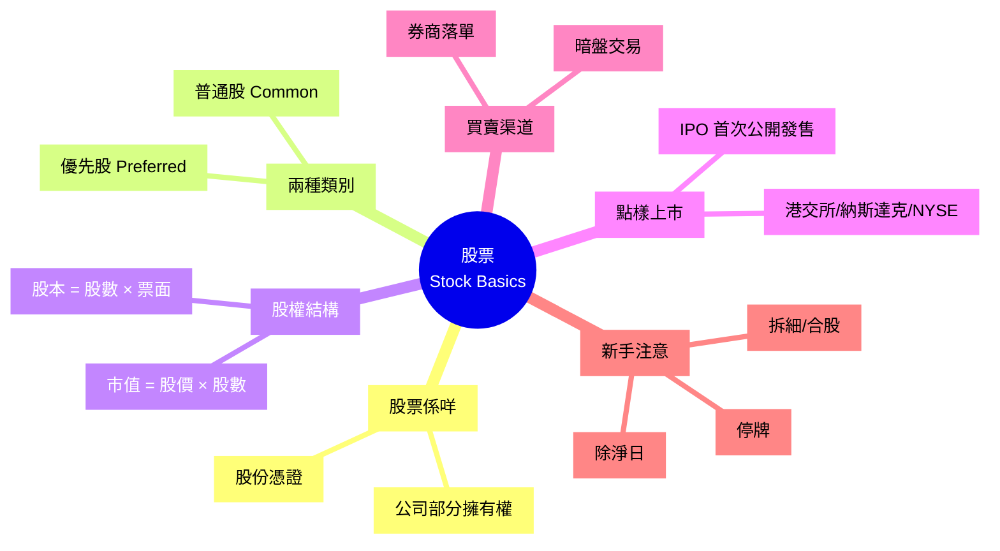

# Module 13: 股票(上): 定義同市場

Est. study time: 1h
Language: yue
Description: 股票嘅基本定義 (普通股 vs 優先股)、公司點樣透過 IPO 上市、市值、股數、流通股、買賣渠道

## Knowledge Map



---

## Learning Objectives
- 解釋股票係公司擁有權嘅一部分
- 分辨普通股同優先股嘅分別
- 計市值 (Market Cap) 同理解佢嘅意義
- 明白 IPO 過程, 同點解公司要上市
- 識揀買賣渠道 (券商 / 銀行 / 網上平台)
- 知道常見新手陷阱 (拆細/除淨/停牌)

---

## Real-World Example

你買咗 1 股騰訊 (00700.HK), 2024 年股價 ~$370。

你而家擁有騰訊公司嘅:
- 1 / 93 億股 = 0.0000000108% 股權
- 0.0000000108% 嘅公司資產
- 0.0000000108% 嘅盈利攤分
- 1 個投票權 (騰訊係同股同權, 1 股 = 1 票, 只係你持股太少, 開唔到股東會)

你呢股可以:
- 收息 (如果騰訊派息)
- 升值 / 貶值 (股價上落)
- 賣走 (T+2 到戶口)

呢個 module 解構呢 1 股背後嘅所有 concept。

---

## Core Content

### Section 1: 股票係咩

**股票 (Stock / Equity) = 公司嘅部分擁有權**。

**結構**: 公司發行 N 股股票 — 1 個股東揸 1 股 = 揸 1/N 公司, 股東 = 老闆 (之一)。

**你有咩權利**:
1. **經濟權**: 派息 (Dividend)、資本增值 (Capital Gain)
2. **治理權**: 投票 (揀董事)、提案、查帳 (細股通常無)
3. **清算權**: 公司執笠, 賣晒資產後, 你攞番你佔嘅部分 (但通常最後先攞)

**股票唔等於**:
- 現金 (要賣咗先變現金)
- 存款 (股價可升可跌, 唔保本)
- 期權 / 窩輪 (Module 唔覆蓋)

> **Cloze**: "股票代表 {公司部分擁有權}, 股東有 3 種權利: {經濟權}、{治理權} 同 {清算權}。"
>
> *Answer: 公司部分擁有權、經濟權、治理權、清算權*

### Section 2: 普通股 vs 優先股

兩種主要股票類別:

| 維度 | 普通股 (Common) | 優先股 (Preferred) |
|---|---|---|
| 投票權 | ✓ (一股一票) | ✗ 通常冇 |
| 派息 | 視乎董事會決定 | 固定派息率, 優先派 |
| 清算 | 最後 | 普通股之前 |
| 升值潛力 | 高 | 較低 |
| 風險 | 高 | 中 |
| 例子 | 騰訊、阿里 | 美國銀行 BAC.PRE |

**普通股**: 99% 上市公司嘅股票, 大部分人講「買股票」即指普通股。

**優先股**: 似「股 + 債」混合, 派息固定但升值有限, 風險比債高比股低, 適合想穩定派息嘅投資者。

> **Think**: 假設一隻優先股票面 5%, 即係每年收 $5 息。如果市面 10 年政府債回報 4.5%, 你會揀優先股定債?
>
> *Answer: 視乎你信唔信優先股發行公司嘅信用。如果發行公司同政府一樣穩 (e.g. 大銀行優先股), 優先股 5% 略高過政府債 4.5%, 值得買。但優先股冇投票權 + 升值有限, 唔似普通股咁有爆炸性回報。穩健派息用, 唔當投資增長。*

> **Predict**: 假設公司今年賺 $1 億, 派息 $0.5 億。如果公司有 1 億股普通股 + 1000 萬股優先股 (票面息 $0.50), 邊個先攞錢?
>
> *Answer: 優先股先, 攞 1000 萬股 × $0.50 = $500 萬派息。剩低 $5,000 萬 - $500 萬 = $4,500 萬 先輪到普通股分, 攤落 1 億股普通股, 即每股 $0.45。如果公司賺嘅錢連優先股息都唔夠派, 普通股可以一蚊都冇, 呢個就係「優先」嘅意思。*

### Section 3: 股本、市值、流通股

**三個關鍵數字**:

```
股本 (Capital)  = 已發行股數 × 票面值 (Par Value)
市值 (Market Cap) = 股價 × 已發行股數
流通市值 (Free Float) = 股價 × 流通股數
```

**例子** (騰訊簡化):
- 票面值: $0.0001 / 股
- 已發行股數: 93 億股
- 股本 (賬面): 93 億 × $0.0001 = $93 萬 (好細, 因為票面值低)
- 股價: $370
- 市值: 93 億 × $370 = $34,410 億 (約 $3.44 萬億)

**市值分類** (港股):
| 類別 | 市值 (HKD) |
|---|---|
| 大型股 (Large Cap) | > $200 億 |
| 中型股 (Mid Cap) | $40-200 億 |
| 小型股 (Small Cap) | $10-40 億 |
| 微型股 (Micro Cap) | < $10 億 |

**流通股 (Free Float) ≠ 已發行股數**:
- 創辦人/大股東/政府可能持 50% 以上
- 真正市場流通嘅可能只係 30-40%
- 流通少 = 容易俾人操控股價

> **Cloze**: "市值嘅公式係 {股價 × 已發行股數}, 流通市值係 {股價 × 流通股數}, 後者反映 {真正市場流通量}。"
>
> *Answer: 股價 × 已發行股數、股價 × 流通股數、真正市場流通量*

### Section 4: IPO 同上市流程

**IPO (Initial Public Offering) = 首次公開發售**, 公司由「私人」變「公眾」。

**為咩要上市**:
- 集資 (賣新股俾公眾, 公司攞錢發展)
- 聲譽 (上市公司有信譽)
- 創辦人套現 (e.g. 沽舊股)
- 員工股票期權變現

**過程** (香港):
1. 委任保薦人 (Sponsor, 通常投資銀行)
2. 盡職審查 + 草擬招股書 (Prospectus)
3. 聯交所審批 (上市委員會)
4. 路演 (Roadshow) 推介
5. 公開招股 (認購期 3-5 日)
6. 定價 (可能上限定價 / 折讓)
7. 掛牌買賣 (上市首日)

**風險**:
- 新股不一定升 (破發 = 上市首日跌破招股價)
- 2018-2024 期間, 港股 IPO 破發率 30-40%
- 散戶 (細戶) 認購通常只分到少量, 升都賺唔多

> **Spot the Mistake**: 「IPO 一定賺, 因為公司有前景先會上市。」
>
> 邊度錯?
>
> *Answer: 三個錯。(1) 上市 ≠ 公司好, 可能係股東想套現走; (2) 上市定價可能過高, 市場唔收貨就破發; (3) 上市後鎖定期 (Lock-up) 6-12 個月, 解禁後大股東沽貨會壓價。歷史上破發例子多: 2021 快手上市首日升 160% 但幾個月後跌 80%。IPO 唔係穩賺, 當投機看待。*

### Section 5: 買賣渠道

**香港主要渠道**:

| 渠道 | 例子 | 佣金 | 適合 |
|---|---|---|---|
| 傳統銀行 | 匯豐、中銀 | $50-100/單 | 綜合銀行服務 |
| 傳統券商 | 輝立、信誠 | $50-100/單 | 認購新股 |
| 網上券商 | 富途、耀才、華盛 | $0-15/單 | 低佣金, 適合頻密買賣 |
| 銀行孖展 | 證券保證金戶口 | 利息 | 槓桿買賣 (高風險) |

**買賣機制**:
- T 鍵落單 (Trade)
- T+2 交收 (Settlement, 即股票 + 錢 2 日後到)
- T 日可以取消 (但券商收費可能唔退)

**暗盤交易**:
- 上市前 1 日 (e.g. T-1 晚), 輝立/富途提供
- 散戶可以喺正式掛牌前買賣
- 對 IPO 認購嘅人好有用 (可以鎖定利潤)

> **Cloze**: "T+2 交收即 {落單日 + 2 個工作日} 股票同錢正式過戶。"
>
> *Answer: 落單日 + 2 個工作日*

### Section 6: 新手必知 3 件事

**1. 拆細 (Share Split) 同合股 (Reverse Split)**:
- 拆細: 1 股變 2 股, 價錢減半 (e.g. 騰訊 2022 拆 5 份)
- 合股: 5 股變 1 股, 價錢加 5 倍
- **你嘅總資產唔變**, 純粹改變「每股價格」同「股數」
- 拆細通常被視為利好 (股價變低, 散戶買得起)

**2. 除淨日 (Ex-Dividend Date)**:
- 派息時, 有一個「截止日」, 之前買入先有權收息
- 除淨日當日買入 = 冇得收今次息
- **股價會喺除淨日下跌約等於派息額**

**3. 停牌 (Suspension)**:
- 上市公司有重大消息 (e.g. 收購、被查) 時主動停牌
- 港交所亦可強制停牌 (e.g. 違反上市規則)
- 停牌期間你賣唔到, 復牌可能暴升或暴跌
- 例子: 漢能薄膜發電 2015 年喺半個鐘跌近 47% 之後停牌, 之後從未正常復牌, 2020 年經私有化 (換股) 退市, 小股東啲錢被鎖死成 5 年

> **Predict**: 騰訊宣布「1 拆 5」, 拆細前股價 $370。拆細後開市價大約幾多?
>
> *Answer: $370 / 5 = $74 (理論上)。實際開市價會由市場決定, 通常會有少許套利空間, 開市價 ~$73-75。如果開市 $80, 即係市場認為拆細創造咗 7-8% 短期升幅, 但呢個會好快套利消失。*

---

### Why This Matters

股票係最常見嘅投資工具, 但新手常見問題:
- 唔知自己揸緊乜 (以為買個名)
- 唔識睇公告 (除淨日突然股價跌, 唔知點解)
- 被暗盤 / IPO 假象吸引 (以為穩賺)

識得呢啲基礎, 你先可以:
- 讀得明年報 / 公告
- 識得避開停牌 / 合股陷阱
- 唔會被「拆細當利好」誤導

---

## Key Takeaways
- 股票 = 公司部分擁有權, 有經濟權 / 治理權 / 清算權
- 普通股有投票, 優先股派息穩定但升值有限
- 市值 = 股價 × 已發行股數, 流通市值反映真正流通量
- IPO 唔一定賺, 破發率高
- T+2 交收係香港標準
- 拆細 / 合股 / 除淨 / 停牌 4 件事要識

---

## Common Misconception

**「騰訊股價 $370 太貴, 我買唔起。拆細之後變 $74 我就可以買。」**

錯。拆細純粹改變「每股價格」同「股數」, 你嘅資產總值唔變。如果你有 1 股 $370, 拆細後有 5 股 $74, 總值 $370。拆細只係令「入場費」低啲, 對**公司價值**同**你嘅資產**完全冇影響。

真正問題: 你應唔應該買呢間公司, 而唔係股價幾多蚊。

---

## Spot the Mistake

「我喺除淨日前 1 日買入, 應該可以收下個月嘅派息。」

邊度錯?

*Answer: 計錯日子。除淨日 (Ex-Dividend Date) 之前買入先有權收息。除淨日當日或之後買入 = 冇得收。派息有 4 個重要日期: 宣派日 (Declaration) / 截止過戶日 (Record Date) / 除淨日 (Ex-Div) / 派發日 (Payment)。要睇除淨日, 唔係睇截止過戶日, 散戶實際操作以除淨日為準。*

---

## Feynman Explain

(用一個 10 歲都明嘅故事解釋「股票 = 開舖做生意分股份」: 從「你同朋友合資開間小食店, 你出 5 蚊佔 50%」講起, 講到「舖頭賺錢你分一半, 蝕錢你孭一半, 唔想玩可以將你嘅 50% 賣俾另一個人」。)

---

## Reframe

(試下諗: 你如果想買 1 股騰訊 (00700.HK), 入場費幾多? 你要揀邊間券商? 佣金點計? 寫低你嘅諗法, 再諗下係咪值得。)

---

## Drill
Take the quiz. MCQs test different angles — recall, application, scenario.

Run: `learn.sh quiz finance-basics-cantonese 13`
Run: `learn.sh cloze finance-basics-cantonese 13`
