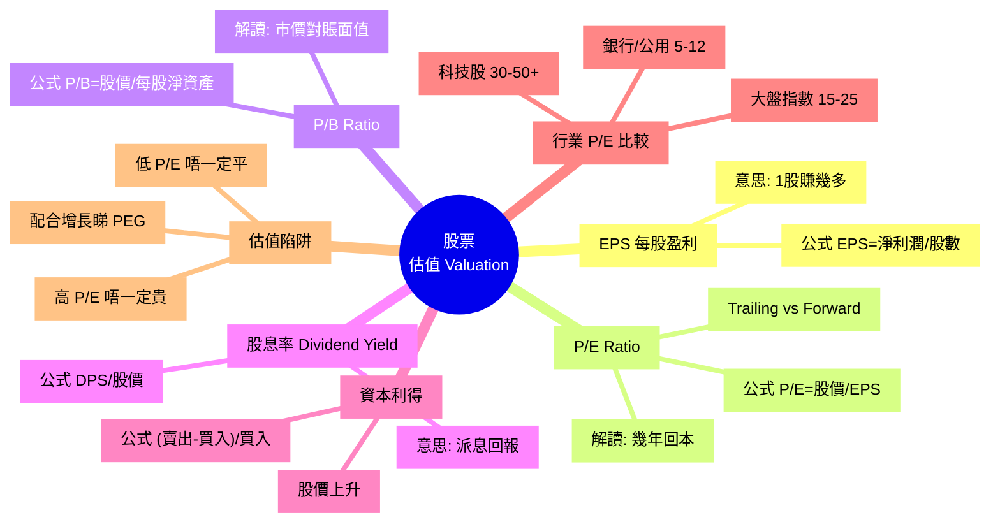

# Module 14: 股票(下): 估值 P/E 同股息

Est. study time: 1h
Language: yue
Description: 股票估值: EPS、P/E Ratio、P/B Ratio、股息率、Capital Gain。比較唔同行業嘅 P/E，識破估值陷阱。

## Knowledge Map



---

## Learning Objectives
- 用 EPS 計算公司每股賺幾多
- 用 P/E Ratio 評估股價平貴, 區分 Trailing vs Forward
- 理解 P/B Ratio 適用場景 (銀行、重資產)
- 計算股息率, 明白「高息股」嘅 trade-off
- 避開「低 P/E 必平」、「高 P/E 必貴」嘅誤解

---

## Real-World Example

你睇緊兩隻股票:
- A 銀行股: 股價 $30, EPS $5, P/E = 6
- B 科技股: 股價 $300, EPS $10, P/E = 30

**直覺**: A 平好多(6 < 30), 應該揀 A?

**現實**: 銀行 P/E 6-12 係正常, 科技股 P/E 30+ 反映高增長預期。

關鍵問題: **B 嘅盈利增長率係 A 嘅幾倍?** 如果 B 增長 30%/年, A 增長 3%/年, B 嘅高 P/E 合理, A 嘅低 P/E 可能係「價值陷阱」(市場預期盈利下跌)。

呢個 module 教你用 P/E + 增長率 (PEG) 判斷。

---

## Core Content

### Section 1: EPS — 每股賺幾多

EPS (Earnings Per Share) 係**最基本**嘅盈利能力指標。

```
公式: EPS = 淨利潤 / 流通股數

例如:
  公司全年淨利潤 = $100 億
  流通股數 = 10 億股
  EPS = 100 / 10 = $10/股
```

**意思**: 1 股代表 1/10 億公司, 你攞到 $10 盈利分配。

**注意**:
- 優先股股息要先扣 (Net Income - Preferred Dividend)
- 攤薄 EPS 考慮可轉換債券、認股權證 (更保守)

**例子**:
- 騰訊 2023: 淨利潤 ~$1600 億, 股數 ~96 億, EPS ≈ $16.7
- 滙豐 2023: 淨利潤 ~$1,750 億, 股數 ~190 億, EPS ≈ $9

> **Cloze**: "EPS 嘅公式係 {淨利潤/流通股數}, 反映 {1 股賺幾多}。"
>
> *Answer: 淨利潤/流通股數、1 股賺幾多*

### Section 2: P/E Ratio — 幾年回本

P/E (Price-to-Earnings) 係**最常用**嘅估值指標。

```
公式: P/E = 股價 / EPS

解讀: 以當前盈利計, 幾年回本
  P/E = 10 → 10 年回本 (假設盈利不變)
  P/E = 20 → 20 年回本
  P/E = 50 → 50 年回本 (預期高增長, 否則貴)
```

**例子** (延續):
- 騰訊 股價 $300, EPS $16.7 → P/E ≈ 18
- 滙豐 股價 $60, EPS $9 → P/E ≈ 6.7 (銀行股低 P/E 嘅典型)

**Trailing vs Forward**:
- **Trailing P/E** (過去): 用過去 12 個月 EPS, 真實但滯後
- **Forward P/E** (未來): 用預測下年 EPS, 反映期望但靠估算

**例**: 蘋果 Trailing P/E 30, Forward P/E 26 → 市場預期下年盈利升 ~15%

> **Think**: 一隻股票股價 $50, 過去 EPS $5, 預測下年 EPS $6.5。Trailing 同 Forward P/E 分別係幾多? 市場預期增長幾多?
>
> *Answer: Trailing = 50/5 = 10。Forward = 50/6.5 ≈ 7.7。市場預期盈利升 6.5/5 - 1 = 30%。如果 P/E 唔變, 股價應該升 30% 喺下年。*

### Section 3: P/B Ratio — 賬面值比較

P/B (Price-to-Book) 適合**重資產**行業 (銀行、保險、地產)。

```
公式: P/B = 股價 / 每股淨資產 (Book Value Per Share)

每股淨資產 = (總資產 - 總負債) / 流通股數
```

**解讀**:
- P/B = 1: 市價等於賬面值 (清算都唔蝕)
- P/B < 1: 市價低過賬面值 (理論上平, 但有原因)
- P/B > 3: 市場對未來盈利有好高期望

**適用**:
- ✓ 銀行、保險、券商、地產、重資產製造
- ✗ 科技、軟件、品牌 (主要價值係無形, P/B 會好高冇意義)

**例子**:
- 滙豐 P/B ~0.7 → 賬面值平過市價, 銀行業常見
- 騰訊 P/B ~4 → 大部分價值係品牌、平台、用戶, 唔喺賬面

### Section 4: 股息率 — 派息回報

股息率 (Dividend Yield) 反映**每年現金回報**。

```
公式: Dividend Yield = DPS / 股價

DPS = Dividend Per Share = 每股派息
```

**例子**:
- 中電 $80, DPS $3.0 → Yield = 3/80 = 3.75%
- 滙豐 $60, DPS $4.5 → Yield = 4.5/60 = 7.5% (高息)

**Yield 嘅 trade-off**:
- **高 Yield**: 派息慷慨, 但股價可能因為「增長慢」先要靠高息吸引
- **低 Yield / 零 Yield**: 騰訊、Meta 唔派息, 盈利再投資
- **Yield 過高 (>10%)**: 可能係「股息陷阱」, 公司派息超出可負擔範圍, 隨時削減

**除淨日 (Ex-Dividend Date)**: 過咗呢日買入就冇下期息, 重要日子。

> **Predict**: 一隻股票 Yield 12%, 同業平均 4%。你會點睇?
>
> *Answer: 高到不正常, 要警惕。可能 (1) 股價大跌導致 Yield 急升 (分母細咗), (2) 公司準備削減股息。應該 check 過往派息穩定性, 同盈利覆蓋率 (Payout Ratio)。*

### Section 5: 資本利得 (Capital Gain)

股票回報 = 股息 + 資本利得。

```
公式: Capital Gain % = (賣出價 - 買入價) / 買入價

Total Return = Capital Gain + Dividend Yield
```

**例子**:
- 1 年前買騰訊 $250, 而家 $300, 期間收息 $5
- Capital Gain = (300-250)/250 = 20%
- Dividend Yield = 5/250 = 2%
- **Total Return = 22%**

**重要**: 短炒 (<1 年) 資本利得稅率高, 長期持有 (>1 年) 多數地區有稅務優惠 (香港 0% 資本利得稅)。

### Section 6: 行業 P/E 比較 — 唔同行業唔同標準

P/E 唔可以跨行業直接比, 因為**增長率**同**商業模式**唔同。

| 行業 | 典型 P/E | 原因 |
|---|---|---|
| 銀行 | 5-12 | 成熟、低增長、槓桿高 |
| 公用事業 (電力、水務) | 10-18 | 穩定派息 |
| 大盤指數 (S&amp;P 500) | 15-25 | 整體平均 |
| 必需消費 (食品、日用品) | 20-30 | 穩定但低增長 |
| 科技 (FAANG) | 25-50+ | 高增長, 預期未來盈利大升 |
| 加密幣、生物科技 | 負數 / 100+ | 無盈利 / 投機 |

**判斷「平貴」嘅問題**: 唔係睇 P/E 數字, 係睇 P/E 同**增長率**嘅關係。

**PEG Ratio** (Price/Earnings to Growth):
```
公式: PEG = P/E ÷ 盈利增長率%

解讀:
  PEG < 1: 平 (增長對得起 P/E)
  PEG = 1: 合理
  PEG > 2: 貴 (P/E 高過增長率)
```

**例子**:
- A 股 P/E 30, 增長 30%/年 → PEG = 1 (合理)
- B 股 P/E 30, 增長 10%/年 → PEG = 3 (貴)
- C 股 P/E 8, 增長 2%/年 → PEG = 4 (貴, 增長對唔起)

> **Cloze**: "PEG = {P/E / 盈利增長率%}, PEG < {1} 算平, PEG > {2} 算貴。"
>
> *Answer: P/E / 盈利增長率%、1、2*

### Section 7: 常見估值陷阱

**陷阱 1: 低 P/E 必平**
- 滙豐 P/E 6 多年, 股價一直唔升
- 原因: 盈利下跌預期, 市場唔肯俾高 P/E
- 結果: 「價值陷阱」, 平都唔敢買

**陷阱 2: 高 P/E 必貴**
- Amazon 2009 P/E 70+, 2019 P/E 80+, 股價升 10 倍
- 原因: 盈利每年升 30%+, P/E 跟住盈利自動降
- 結果: 買高 P/E 反而贏到笑

**陷阱 3: 淨睇 P/E 唔睇盈利質量**
- 公司盈利可以靠:
  - 真正經營 (健康)
  - 賣資產 (一次性)
  - 會計調整 (灰色)
- 應該睇 **Operating Cash Flow** vs **Net Income**

**陷阱 4: 唔同行業用錯指標**
- 銀行應該睇 P/B, 用 P/E 會誤導
- 軟件公司應該睇 P/S (Sales), 用 P/E 會誤導
- 樓房地產應該睇 NAV, 用 P/E 會誤導

> **Spot the Mistake**: 「呢隻銀行股 P/E 8, 好平, 應該買。」
>
> 邊度錯?
>
> *Answer: 三個錯。(1) 銀行 P/E 8 係正常範圍, 唔算「平」。(2) 銀行應該用 P/B 而唔係 P/E, P/E 對高槓桿行業誤導。(3) 低 P/E 可能反映「市場預期盈利下跌」, 即係 value trap。應該睇 P/B (賬面值)、ROE (回報率)、同股息覆蓋率, 唔好淨睇 P/E。*

---

### Why This Matters

識估值, 你就唔會:
- 盲目追「低 P/E 銀行股」, 跌入 value trap
- 驚高 P/E 科技股, 錯過真正增長股
- 被「高息股」吸引, 忽略派息陷阱

估值唔係單一指標, 係**多個指標 + 行業特性 + 增長預期**嘅綜合判斷。

---

## Key Takeaways
- EPS = 淨利潤/股數, 最基本盈利能力
- P/E = 股價/EPS, 反映幾年回本, 唔同行業標準唔同
- Trailing P/E 用過去, Forward P/E 用預測
- P/B 適合重資產行業, 科技/品牌行業意義唔大
- 股息率 = DPS/股價, 高息要警惕派息陷阱
- 資本利得 = (賣出-買入)/買入
- PEG = P/E/增長率, <1 平, >2 貴
- 估值陷阱: 低 P/E 唔一定平, 高 P/E 唔一定貴

---

## Common Misconception

**「P/E 低就抵買, P/E 高就貴。」**

錯。P/E 一定要配**增長率** (PEG) 同**行業特性**:
- 銀行 P/E 6 平? → 唔一定, 市場可能預期盈利跌
- 科技 P/E 40 貴? → 唔一定, 增長 40%/年, PEG = 1 算合理
- P/E 30 增長 5%/年 → PEG = 6, 真係貴

**正確做法**: 永遠睇 PEG + 行業 + 盈利質量, 唔好單睇 P/E。

---

## Spot the Mistake

「我見到隻股 P/E 5, 超平, 買 100 萬。」

邊度錯?

*Answer: 至少 3 個錯。(1) P/E 5 反映市場唔睇好呢隻股, 可能盈利即將大跌。低 P/E 唔等於平, 可能係 value trap。(2) 冇 check 行業 (銀行 P/E 5 正常, 科技 P/E 5 異常)。(3) 冇 check 盈利質量 (Operating Cash Flow vs Net Income), 盈利可能靠賣資產或會計調整。應該: (a) 拎 PEG, (b) 睇 ROE, (c) 比較同業, (d) 睇過去 5 年盈利走勢, (e) 分散買, 唔好 all-in。*

---

## Feynman Explain

(用一個 10 歲都明嘅故事解釋「點樣判斷股價平貴」: 從「你擺檔賣魚蛋, 1 串成本 $5, 賣 $15, 1 年賺 $100, 你個檔值幾錢?」講起, 講到「如果市場覺得你下年賺 $200, 你個檔值 $1000 都有人買」。)

---

## Reframe

(試下諗: 你而家組合入面有冇 1 隻 P/E > 30 嘅股票? 拎到佢嘅盈利增長率, 計 PEG。PEG > 2 就要諗下係咪真係值得揸。寫低你嘅諗法。)

---

## Drill
Take the quiz. MCQs test different angles — recall, application, scenario.

Run: `learn.sh quiz finance-basics-cantonese 14`
Run: `learn.sh cloze finance-basics-cantonese 14`
