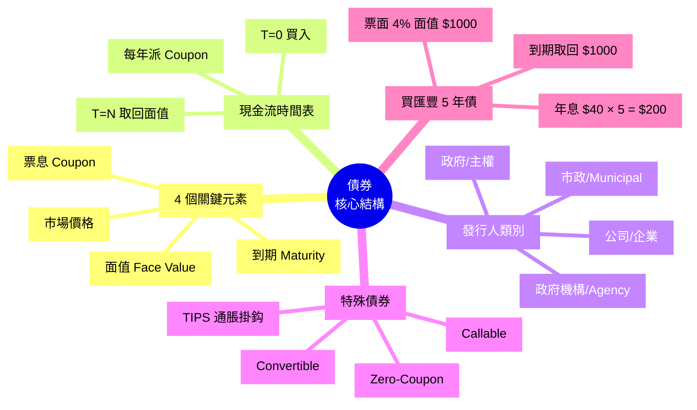
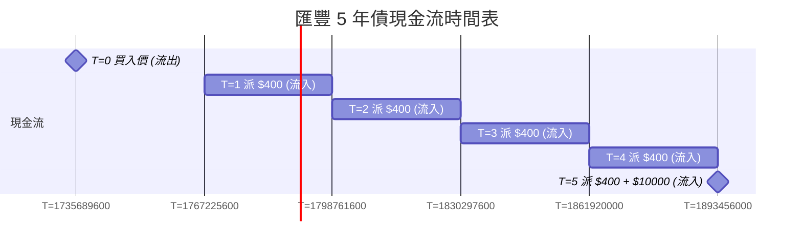

# Module 15: 債券(上)

Est. study time: 1h
Language: yue
Description: 債券核心結構: 票面、Coupon、到期、面值。發行人類別: 政府、機構、公司。認識 Zero-Coupon、Callable、可轉換。

## Knowledge Map



---

## Learning Objectives
- 講出債券 4 個關鍵元素 (面值、票息、到期、價格)
- 區分 4 種發行人 (政府、機構、公司、市政)
- 識別特殊債券變種 (零息、可贖回、可轉換、TIPS)
- 用現金流時間表分析債券回報
- 解釋「票面利率 vs 當期收益率」嘅分別

---

## Real-World Example

你 30 歲, 開始諗退休。阿明銀行客戶經理 recommend 一隻「匯豐 5 年期公司債」:
- 票面 4%, 面值 $10,000
- 每年派息 $400
- 5 年後到期取回 $10,000
- 二手市場流通, 你可以中途賣

**問題**:
1. 我真正要付幾錢買? (面值? 定市價?)
2. 如果我中途賣, 會蝕定賺?
3. 5 年後真係拎到 $10,000 咩? 匯豐會唔會執笠?
4. 「票面 4%」係咪我嘅實際回報?

呢個 module 教識你拆開呢 4 條問題。

---

## Core Content

### Section 1: 債券 4 個關鍵元素

每隻債券都有 4 個核心參數, 缺一不可:

| 元素 | 意思 | 例子 |
|---|---|---|
| **面值 (Face Value)** | 到期還本金額, 印喺債券上 | $1,000 / $10,000 |
| **票面利率 (Coupon Rate)** | 每年派息佔面值百分比 | 4% / 5% |
| **到期日 (Maturity)** | 還本日 | 5 年 / 10 年 / 30 年 |
| **市場價格 (Market Price)** | 二手市場成交價 | $980 / $1,020 |

**派息計算**:
```
每年派息 = 面值 × 票面利率

例子: 面值 $10,000, 票面 4% → 每年 $400
```

> **Cloze**: "債券 4 個關鍵元素係 {面值}、{票面利率}、{到期日} 同 {市場價格}。"
>
> *Answer: 面值、票面利率、到期日、市場價格*

### Section 2: 現金流時間表

債券回報係**時間表**上嘅一系列現金流, 唔係一筆過。

**例子**: 匯豐 5 年債, 面值 $10,000, 票面 4%



```
總回報 (假設買入價 = 面值):
  派息 = $400 × 5 = $2,000
  還本 = $10,000
  總計 = $12,000
  5 年回報 = 20% (總回報; 年化 IRR = 4%)
```

**重要**: 呢個 20% 係 5 年現金流加埋嘅總回報, 唔係複利。如果買入價 = 面值, 每年派息嘅內部回報率 (IRR) 就啱啱等於票面利率 4%; 買入價偏離面值, 或者息再投資回報唔同, IRR 就會跟住變, 計法留返 Module 16。

**兩種派息頻率**:
- 半年派 (Semi-annual): 美國/香港債券常見
- 季派: 短債/CD
- 年派: 較少

半年派即係 $400/2 = $200 每 6 個月。

### Section 3: 發行人類別 (4 種)

| 類型 | 例子 | 風險 | 票面 |
|---|---|---|---|
| **政府/主權** | 美國國債、中國國債、香港政府債 | 最低 | 最低 |
| **政府機構** | Fannie Mae、Freddie Mac (房貸相關) | 低 | 低 |
| **公司** | 匯豐、蘋果、騰訊 | 中 | 中 |
| **市政** | 美國州/市政府 | 中低 | 中低 (有稅務優惠) |

**信用評級** (Moody's / S&amp;P / Fitch):

| 評級 | 意思 | 票面 |
|---|---|---|
| **AAA / Aaa** | 最高質素 | 最低 |
| **AA / Aa** | 高質素 | 低 |
| **A / A** | 中高質素 | 中低 |
| **BBB / Baa** | 投資級別底線 | 中 |
| **BB / Ba** | 投機級 (Junk / High Yield) | 高 |
| **B / C / D** | 越低越危險, D 已違約 | 極高 |

**香港常用評級**: Moody's 對香港政府 Aa3, S&amp;P AA+ (2023)。

> **Think**: 你見到一隻 5 年公司債, 票面 8%, 同類公司平均 4%。你會點想?
>
> *Answer: 8% 票面比同業高 4%, 反映市場認為呢間公司違約風險較高 (俗稱 Junk Bond / High Yield)。應該查信用評級, 同 5 年 CDS (信用違約掉期) 價格。如果評級 BB 或以下, 高息係補償風險, 唔係「平」。*

### Section 4: 特殊債券變種

**(a) Zero-Coupon Bond (零息債券)**
- 唔派息, 折扣價發行
- 例如: 買入 $500, 10 年後取 $1,000
- 鎖定回報率, 適合已知未來需要 (e.g. 10 年後畀首期)

**(b) Callable Bond (可贖回債券)**
- 發行人有權**提前贖回** (通常加 premium)
- 例: 10 年債, 5 年後可贖回 @ $1,020
- **投資者風險**: 利率下跌時, 發行人會贖回, 你要再投資但新債息低
- 補償: Callable 債票面通常高 0.5-1%

**(c) Convertible Bond (可轉換債券)**
- 可以**轉成股票** (按預定比例)
- 例: 債券 $1,000, 5 年後可換 50 股 (轉股價 $20)
- **好處**: 公司升, 你跟著升; 公司跌, 你有債底保障
- 票面通常低過普通債 (因為有股票選擇權價值)

**(d) TIPS (Treasury Inflation-Protected Securities)**
- 美國發行, **本金隨通脹調整**
- 通脹 3% → 面值加 3%, 派息跟住升
- 真正「保本 + 保值」嘅政府債

> **Predict**: 假設通脹預期 3%, 30 年 TIPS 票面 2%, 同期普通 30 年國債票面 5%。你揀邊隻?
>
> *Answer: 視乎你對通脹嘅睇法。(a) 如果你信通脹 3% 真實, 兩隻實際回報一樣 (5% - 3% = 2%), TIPS 啱你, 自動對沖。(b) 如果你覺得通脹會跌到 1%, 普通 5% 國債實際 4%, 跑贏 TIPS。(c) 如果你覺得通脹會升到 6%, TIPS 跟住加, 跑贏普通國債。冇水晶球, 分散買兩隻係穩陣做法。*

> **Cloze**: "{Zero-Coupon} 債券唔派息, {折扣} 價發行, 到期取 {面值}。"
>
> *Answer: Zero-Coupon、折扣、面值*

### Section 5: 票面利率 vs 當期收益率

**關鍵概念**: 票面利率 (Coupon) 係**固定**, 當期收益率 (Current Yield) 隨**市價**變。

```
公式: Current Yield = 年派息 / 買入價

例子:
  票面 4%, 面值 $10,000
  買入價 $9,500
  年派息 $400
  Current Yield = 400 / 9500 = 4.21%
```

**解讀**:
- 買入價 = 面值 ($10,000) → Current Yield = 票面 (4%)
- 買入價 < 面值 ($9,500) → Current Yield > 票面 (4.21%)
- 買入價 > 面值 ($10,500) → Current Yield < 票面 (3.81%)

**點解會咁?** 因為市價反映市場利率, 詳情 Module 16。

> **Spot the Mistake**: 「呢隻債券票面 5%, 我嘅回報就係 5% 啦, 簡單。」
>
> 邊度錯?
>
> *Answer: 票面 5% 只係**發行時**鎖定嘅利率, 你嘅實際回報視乎 (1) 買入價 (市價可能 $950 或 $1050), (2) 持有期 (中途賣可能蝕/賺), (3) 再投資 (派息再買嘅回報)。真正嘅「內部回報率」係 IRR, 要用現金流時間表計, Module 16 詳細講。*

### Section 6: 「平」嘅迷思

**常見誤解**: 「債券面值 $1,000, 二手價 $980, 抵買! 平咗 $20!」

**錯**。債券唔似買衫打折:
- 二手價 $980 通常反映**利率上升**, 市場普遍新債 5%, 呢隻舊債 4% 唔吸引
- 你買 $980 鎖 4%, 之後新債都係 5%, 你蝕緊
- 真正「平」要睇: **同類新發行債券**比較, 而唔係同自己面值比

**比較基準**:
- 同期發行、同評級、同到期嘅新債 (yield curve on-the-run)
- 二手市場同類債嘅 yield to maturity (YTM)
- **唔係**同自己面值比較

---

### Why This Matters

債券係「固定收益」核心, 識得分:
- 4 個關鍵元素就識睇報價
- 4 種發行人就識分風險
- 特殊變種就識用對應場景 (Zero-Coupon 鎖定未來需要, TIPS 抗通脹)
- 票面 vs 當期收益率就唔會被「高票面」誤導

---

## Key Takeaways
- 債券 4 元素: 面值、票面利率、到期、市場價
- 現金流係時間表, 唔係一筆過
- 發行人分 4 種, 風險由低至高: 政府 < 機構 < 市政 < 公司
- 信用評級 AAA 至 D, BB/Ba 或以下屬 Junk Bond
- 特殊變種: Zero-Coupon / Callable / Convertible / TIPS
- 票面 ≠ 實際回報, 真正回報係 YTM (Module 16)
- 二手價「平咗」唔一定真平, 比較同類新債

---

## Common Misconception

**「政府債零風險, 所以一定要買。」**

錯。政府債有 4 種風險:
1. **利率風險**: 利率升, 二手價跌
2. **再投資風險**: 到期後要再買, 利率可能跌
3. **通脹風險**: 名義 4%, 通脹 5% = 實質 -1%
4. **主權違約風險**: 少見但唔係 0 (希臘 2012 違約、阿根廷多次違約)

就算係美國國債, 過去 200 年實質回報都跑輸股票。識用, 唔好迷信。

---

## Spot the Mistake

「匯豐 5 年公司債, 票面 5%, 買入價 $9,800 (面值 $10,000)。平咗 $200, 抵買!」

邊度錯?

*Answer: 至少 3 個錯。(1) 「平咗 $200」係同面值比, 唔係市場比較。可能同期同評級新債都係 5.5%, 呢隻舊債票面 5% 唔吸引所以跌價。(2) Current Yield = 500/9800 = 5.1%, 同票面差唔多, 唔算「抵」。(3) 匯豐公司債有信用風險, 5 年內匯豐會唔會降評級? 應該查 Moody's / S&amp;P 評級, 同 CDS 價格 (信用違約掉期)。如果只睇票面就買, 可能被「高息」吸引而忽略風險。*

---

## Feynman Explain

(用一個 10 歲都明嘅故事解釋「債券 = 借據」: 從「你阿明朋友問你借 $100 學費, 答應每年還 $5 利息, 5 年後還 $100 本金」講起, 講到「呢個就係債券, 你做咗銀行, 阿明做咗公司」。)

---

## Reframe

(試下諗: 你而家揸緊嘅 MPFund 退休組合, 有冇包括任何債券? 你預期退休時(20-30 年後)嘅通脹, 你嘅組合有冇抗通脹工具 (TIPS / 股票 / 房地產)? 寫低你嘅諗法。)

---

## Drill
Take the quiz. MCQs test different angles — recall, application, scenario.

Run: `learn.sh quiz finance-basics-cantonese 15`
Run: `learn.sh cloze finance-basics-cantonese 15`
