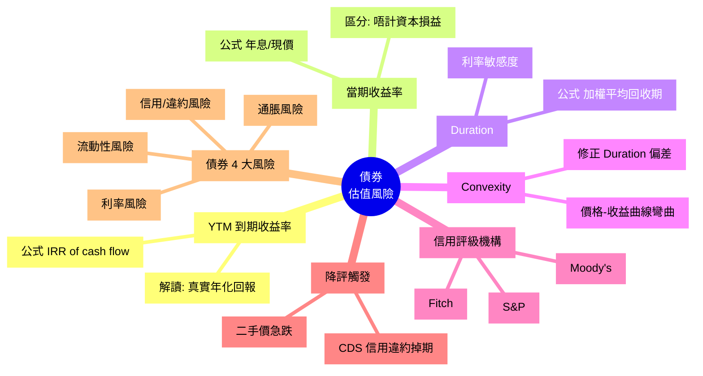

# Module 16: 債券(下): YTM、Duration 同信評

Est. study time: 1h
Language: yue
Description: 債券估值: YTM (到期收益率)、Current Yield、Duration、Convexity、信用評級機構與降評影響。

## Knowledge Map



---

## Learning Objectives
- 用 YTM 計算債券真實年化回報率
- 區分 YTM、Current Yield、Coupon Rate
- 用 Duration 衡量債券對利率變動嘅敏感度
- 解釋 Convexity 點修正 Duration 嘅不足
- 識別降評觸發嘅市場反應

---

## Real-World Example

你見到 2 隻 5 年公司債:
- A 債: 票面 3%, 二手價 $980
- B 債: 票面 5%, 二手價 $1,020

**問題**: 邊隻回報高? 邊隻利率風險大?

直覺: B 票面高 → 回報高?

現實: A 二手價 $980, 5 年後取 $1,000 (賺 $20), 加 5 年派息 $150 ($30/年×5), 總回報 = $170 / $980 ≈ 17.4% 5 年, YTM ≈ **3.6%** 年化。

B 二手價 $1,020, 5 年後取 $1,000 (蝕 $20), 加 5 年派息 $250 ($50/年×5), 總回報 = $230 / $1,020 ≈ 22.5% 5 年, YTM ≈ **4.5%** 年化。

所以 B 真實回報高過 A。呢個 module 教你點計 YTM。

---

## Core Content

### Section 1: YTM — 真正嘅回報率

YTM (Yield to Maturity) 係債券嘅**內部回報率 (IRR)**, 反映「買入後揸到到期, 真實年化回報率」。

**計算概念** (Excel / 計數機):
```
YTM 係令以下方程式 = 0 嘅 r:

買入價 = Σ [Coupon / (1+r)ᵗ] + 面值 / (1+r)ᴺ
```

**例子** (簡化):
- 面值 $1,000, 票面 5% (年派 $50), 5 年期, 買入價 $950
- 試 r=6%: 50/1.06 + 50/1.06² + ... + 50/1.06⁵ + 1000/1.06⁵ = $957 (略高過 $950)
- 試 r=6.5%: ≈ $932 (略低)
- **YTM ≈ 6.4%**

**Excel 公式**: `=YIELD(settlement, maturity, rate, pr, redemption, frequency)`
**Calculator**: `=RATE(N, -coupon, price, -face_value)`

> **Cloze**: "YTM 嘅全寫係 {Yield to Maturity}, 反映 {買入後揸到到期, 真實年化回報率}。"
>
> *Answer: Yield to Maturity、買入後揸到到期, 真實年化回報率*

### Section 2: YTM vs Current Yield vs Coupon

| 指標 | 公式 | 反映 |
|---|---|---|
| **Coupon Rate** | 票面 / 面值 | 發行時鎖定 |
| **Current Yield** | 年息 / 買入價 | 當下現金回報率 |
| **YTM** | IRR | 揸到到期嘅總回報率 |

**例子**: 票面 5%, 買入價 $950, 5 年期, 面值 $1,000
- Coupon = 5% (鎖定)
- Current Yield = 50/950 = 5.26%
- YTM = 6.4% (因為平買, 加上 5 年後 $1,000 升值)

**關係**:
- 買入價 = 面值 → YTM = Coupon
- 買入價 < 面值 (折價) → YTM > Coupon
- 買入價 > 面值 (溢價) → YTM < Coupon

### Section 3: Duration — 利率敏感度

Duration 量度**債券價格對利率變動嘅敏感度**。

**Macaulay Duration 概念**:
```
公式: D = Σ [t × PV(CF_t)] / Price

  t    = 時期 (年)
  CF_t = 第 t 期現金流 (Coupon 或 還本)
  PV   = 現值
```

**簡化理解**: Duration = 加權平均回收期 (加權 = 現金流大小)。

**例子**:
- 5 年期零息債: Duration = 5 年
- 5 年期 5% 票息: Duration ≈ 4.5 年 (因為中間已收息, 縮短加權平均)
- 30 年期 5% 票息: Duration ≈ 18 年 (超長)

**Modified Duration** (價格敏感度):
```
ΔP/P ≈ -MD × Δy

例子: MD = 5, 利率升 1%
  ΔP/P ≈ -5 × 0.01 = -5%
  債券價格跌約 5%
```

**應用**:
- 短 Duration (1-3): 短期債, 利率風險低
- 中 Duration (5-7): 中期債, 平衡
- 長 Duration (10+): 長期債, 利率風險高

**現實**: 30 年美債, 利率升 1%, 價格跌 ~15-18% (MD ≈ 15-18)。

> **Cloze**: "Modified Duration 量度 {債券價格對利率變動嘅敏感度}, MD={5} 嘅債, 利率升 1%, 價格跌約 {5%}。"
>
> *Answer: 債券價格對利率變動嘅敏感度、5、5%*

### Section 4: Convexity — Duration 嘅修正

**問題**: Duration 假設價格-收益係**直線**關係, 現實係**曲線** (凸)。

```
實際: 價格-收益關係 = 凸曲線
Duration 估計: 直線 (只係 tangent)

差距 = Convexity 修正
```

**改進公式**:
```
ΔP/P ≈ -MD × Δy + 0.5 × Convexity × (Δy)²
```

**應用**:
- 高 Convexity 嘅債 (e.g. Zero-Coupon、長期、低 Coupon): 利率跌時賺多啲, 利率升時蝕少啲
- 對投資者有利 (凸 = 賺蝕不對稱, 賺多蝕少)
- Callable 債有 **Negative Convexity**: 利率跌反為蝕 (發行人會贖回)

**策略**:
- 預期利率跌: 揸長 Duration + 高 Convexity
- 預期利率升: 揸短 Duration

### Section 5: 信用評級機構

3 大國際評級機構 (Big 3):

| 機構 | 特點 | 評級 (高至低) |
|---|---|---|
| **Moody's** | 美國, 商行評級歷史最長 | Aaa, Aa, A, Baa, Ba, B, Caa, Ca, C |
| **S&amp;P** | 美國, 規模最大 | AAA, AA, A, BBB, BB, B, CCC, CC, C, D |
| **Fitch** | 歐美混合 | 同 S&amp;P 評級 |

**評級啟示**:
- **投資級 (Investment Grade)**: BBB-/Baa3 或以上
- **投機級 / 高息 (Junk / High Yield)**: BB+/Ba1 或以下
- **違約 (Default)**: D / C 評級

**降評觸發**:
- 盈利大跌
- 債務過高 (Debt/EBITDA > 5x)
- 行業逆風 (e.g. 油價跌對能源債)
- 公司管治問題 (醜聞、欺詐)

**降評即時影響**:
- 二手價急跌 (投資者要補償新風險)
- 借貸成本升 (新發債息高)
- 部分基金 (e.g. 投資級債基金) 強制沽出 (合約限制)

> **Cloze**: "Big 3 評級機構包括 {Moody's}、{S&amp;P} 同 {Fitch}。"
>
> *Answer: Moody's、S&amp;P、Fitch*

### Section 6: 4 大債券風險

| 風險 | 來源 | 影響 | 對沖方法 |
|---|---|---|---|
| **利率風險** | 市場利率升, 二手價跌 | MD × Δy | 短 Duration |
| **信用風險** | 發行人違約 | 損失本金 | 分散 + 高評級 |
| **通脹風險** | 名義回報跑輸通脹 | 實質蝕 | TIPS / 短 Duration |
| **流動性風險** | 二手市場冷清 | 賣唔出蝕住賣 | 揀活躍債 |

**避開方法**:
- 分散 (唔好 all-in 一隻)
- 配對 (短期 + 長期, 高評級 + 中評級)
- 再平衡 (定期調整)

> **Think**: 你揸緊 10 年期國債, 5 年後想賣, MD=7。依家利率升 0.5%, 你嘅債跌咗幾多?
>
> *Answer: ΔP/P ≈ -7 × 0.005 = -3.5%。如果本金 100 萬, 蝕 3.5 萬。呢個就係利率風險嘅實際威力。*

> **Predict**: 假設聯儲局準備減息 0.5%, 你而家揸 5 年短債 (MD=4) 同 30 年長債 (MD=18)。邊個賺多啲?
>
> *Answer: 30 年長債賺多。ΔP/P 短債 ≈ -4 × (-0.005) = +2%。ΔP/P 長債 ≈ -18 × (-0.005) = +9%。長債升 4.5 倍。所以預期減息, 應該揸長債。但要承擔「如果唔減息反為加息」嘅風險。*

> **Spot the Mistake**: 「我揸住 10 年美債, 因為美國永遠唔違約, 所以我 100% 安心。」
>
> 邊度錯?
>
> *Answer: 兩個錯。(1) 美國國債信貸風險近乎 0, 但**利率風險極高**: MD ~15, 利率升 1% 價格跌 ~15%。2009-2021 30 年美債跌過 50%。(2) 「永遠唔違約」係 marketing, S&amp;P 2011 曾將美國主權降 AA+, 反映政治風險。即使信貸 0 風險, 利率風險都足以蝕到入肉。應該 (a) 短 Duration, (b) 配合 TIPS, (c) 唔好 All-in。*

---

### Why This Matters

識 YTM + Duration + 評級, 你就:
- 唔會被「票面 5%」吸引而忽略折溢價
- 識得睇「長債定短債」配合利率預期
- 識得避開高槓桿 / 降評風險

---

## Key Takeaways
- YTM = 揸到到期真實年化回報率, 反映折溢價 + 派息
- Current Yield 只反映當下現金回報, YTM 反映總回報
- Duration 量度利率敏感度, MD × Δy = 預期價格變動
- Convexity 修正 Duration 嘅直線假設, 凸曲線更有利投資者
- Big 3 評級機構: Moody's, S&amp;P, Fitch
- 降評觸發二手價急跌 + 借貸成本升
- 4 大風險: 利率、信用、通脹、流動

---

## Common Misconception

**「高票面 = 高回報」**

錯。票面 5% 二手價 $1,100, YTM 係幾多?
- 派息 $50/年 × 5 = $250
- 5 年後取 $1,000 (蝕 $100 價差)
- 總回報 = $150 / $1,100 ≈ 13.6% 5 年, YTM ≈ **3%** (低過另一隻票面 4% 但平買嘅 YTM 5%)

**正確做法**: 永遠睇 YTM, 唔好淨睇票面。

---

## Spot the Mistake

「我揸咗 5 年 5% 票面債, 中途想賣但跌價 10%。我等等, 揸到到期就 OK 啦, 5% 嘛。」

邊度錯?

*Answer: 兩個錯。(1) 如果你真係揸到到期, 票面 5% 鎖定, 中途跌價同你無關(只要公司唔違約)。(2) 但如果你現金流需要中途賣, 蝕 10% 就係 10%。(3) 跌價 10% 通常反映**利率升咗 1-2%** 或 **公司被降評**。兩者都應該重新審視: 利率升, 可能繼續跌, 應該檢討 Duration 配對; 降評, 應該考慮止蝕。唔好盲目 hold 到到期。*

---

## Feynman Explain

(用一個 10 歲都明嘅故事解釋「YTM 同 Duration」: 從「你借錢俾朋友 5 年, 每年收 $50 息, 最後攞 $1000 本金」講起, 講到「如果你只係借 1 年就攞返 $1000, 對利率敏感度低; 借 30 年, 中間升跌都大影響」。)

---

## Reframe

(試下諗: 你而家退休組合, 揸咗幾多 % 嘅長債 (>10 年)? 利率每升 1%, 你嘅組合會蝕幾多? 寫低你嘅諗法, 再諗下應唔應該 rebalance 到短中期債。)

---

## Drill
Take the quiz. MCQs test different angles — recall, application, scenario.

Run: `learn.sh quiz finance-basics-cantonese 16`
Run: `learn.sh cloze finance-basics-cantonese 16`
