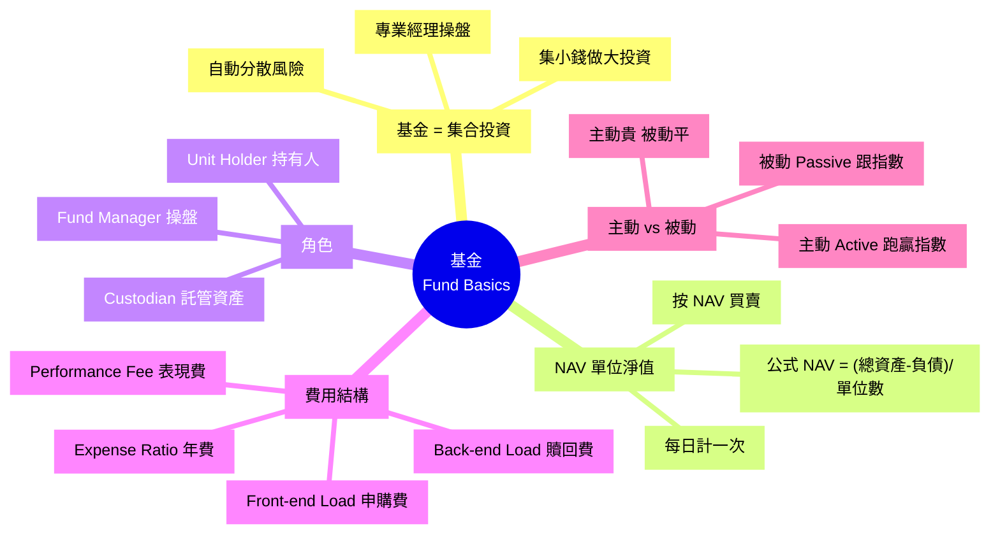

# Module 17: 基金: 概念同 NAV

Est. study time: 1h
Language: yue
Description: 基金概念、NAV 計算、Fund Manager 角色、Load Fee (前端/後端)、Expense Ratio、其他費用。

## Knowledge Map



---

## Learning Objectives
- 解釋基金嘅本質 (集合投資、專業管理)
- 用 NAV 公式計算基金單位淨值
- 識別 4 種主要費用 (Load + Expense + Performance)
- 區分主動基金同被動基金 (ETF 嘅前身)
- 計算總費用對長期回報嘅影響

---

## Real-World Example

你 $10,000 想買股, 但:
- 個股 $300/股, 買 33 股要 $9,900 (1 隻唔夠分散)
- 5 隻股要 $15,000 (但你只有 $10,000)
- 揀股 + 監察要時間 + 識行業

**解決**: 買「香港科技基金」
- 入場費 $10,000 (平過買 1 隻個股, 但買到 30+ 隻科技股)
- 基金經理幫你揀股 + 監察
- 你只需要睇住個 NAV 數字

呢個就係基金嘅存在意義。呢個 module 教你識分佢嘅結構同費用。

---

## Core Content

### Section 1: 基金 = 集合投資

**本質**: 基金公司收集好多小投資者嘅錢, 集合做大投資, 由專業經理操盤。

**好處**:
1. **入場平**: $1,000 就可以買到 30+ 隻股票
2. **自動分散**: 唔使自己揀 30 隻
3. **專業管理**: 經理研究 + 監察
4. **流動性高**: T+1 贖回, 唔使等買家

**代價**:
1. **管理費**: 年 0.5-2%, 蝕緊嘅錢
2. **買賣差價**: 申購/贖回費
3. **經理錯判**: 跑輸指數 (尤其主動基金)
4. **黑盒**: 你唔知經理揸咗咩

> **Cloze**: "基金嘅本質係 {集合投資}, 投資者付 {管理費 + 申購贖回費} 換取 {專業管理 + 自動分散}。"
>
> *Answer: 集合投資、管理費 + 申購贖回費、專業管理 + 自動分散*

### Section 2: NAV — 單位淨值

**核心概念**: 基金按 NAV (Net Asset Value) 買賣, 唔似股票有 supply/demand。

```
公式: NAV = (基金總資產 - 基金總負債) / 流通單位數

每日計一次 (通常收市後)
```

**例子**: 香港科技基金
- 總資產 (持倉市值) = $1,000 億
- 總負債 (應付費用) = $5,000 萬
- 流通單位 = 5 億
- NAV = (1000 億 - 5000 萬) / 5 億 = $199.90

**意思**: 1 個基金單位代表 $199.90 嘅底層資產 (騰訊 + 美團 + 阿里... 各佔幾多%)。

**買賣價**:
- 申購價 (Ask) = NAV + 申購費
- 贖回價 (Bid) = NAV - 贖回費
- 差價就係基金公司賺

**與股票對比**:

| 特性 | 股票 | 基金 |
|---|---|---|
| 價格 | 市場供需 | 每日 NAV |
| 交易時間 | 開市內 | 收市後計 NAV |
| 入場費 | 1 股 | 通常 $1,000 起 |
| 透明度 | 高 (公開) | 中 (季度報告) |
| 費用 | 佣金 | 管理費 + 申購贖回 |

### Section 3: 基金 3 個角色

| 角色 | 職責 | 受誰監管 |
|---|---|---|
| **Fund Manager (經理)** | 揀股、買賣、配置 | 證監會 (SFC) |
| **Custodian (託管人)** | 保管資產、執行交易 | 獨立於基金公司 |
| **Unit Holder (持有人)** | 出資、收 NAV 升值 | 受法律保護 |

**香港法律保障**:
- 託管人**獨立於**基金公司 (基金公司唔可以自己揸住你啲錢)
- 即使基金公司執笠, 託管人會將資產歸還持有人
- SFC 監管, 基金公司要持牌

**例子**: 你買 HSBC Fund, 託管人可能係 HSBC Trustee, 同 HSBC Fund Management 分開。

### Section 4: 4 種費用結構

**(a) Front-end Load (前端申購費)**
- 買入時扣, 通常 1-5%
- 例子: 申購 $10,000, 3% Load, 實際買到 $9,700 嘅基金單位

**(b) Back-end Load / Contingent Deferred Sales Charge (CDSC 後端贖回費)**
- 賣出時扣, 視乎持有期
- 例子: 持有 < 1 年贖回, 5% CDSC; 持有 5 年+, 0%

**(c) Expense Ratio (管理費)**
- 每年扣, 從 NAV 內扣, 你睇唔到
- 典型範圍:
  - 被動指數基金: 0.05-0.5%
  - 主動股票基金: 0.5-2%
  - 對沖基金: 2% + 20% 表現費

**(d) Performance Fee (表現費)**
- 基金跑贏基準 (e.g. S&amp;P 500) 抽佣
- 對沖基金典型: 2% 管理費 + 20% 表現費
- 注意: 部分基金用「High Water Mark」保護 (上次高位後先再收)

> **Spot the Mistake**: 「我買咗年費 0.5% 嘅 ETF, 跟指數 ETF 同主動基金差唔多費用。」
>
> 邊度錯?
>
> *Answer: 0.5% 對被動指數基金嚟講偏貴, iShares/Vanguard 級數通常 0.03-0.2%。而且 ETF 同主動基金**完全唔同**: ETF 係被動跟指數, 主動基金係經理揀股, 想跑贏指數。費用 0.5% 已經接近主動基金範圍, 唔可以話「差唔多」。應該比較 Expense Ratio 同一級數, 再決定值唔值得。*

### Section 5: 主動 vs 被動基金

| 特性 | 主動 Active | 被動 Passive |
|---|---|---|
| **目標** | 跑贏指數 (Alpha) | 跟指數 |
| **費用** | 0.5-2% + 表現費 | 0.03-0.5% |
| **周轉率** | 高 (經理買賣) | 低 (跟指數調整) |
| **長期表現** | 大部分跑輸指數 (S&amp;P 數據) | = 指數 |
| **適合** | 想跑贏 (但難) | 大部分人 (低成本) |

**SPIVA 數據** (S&amp;P 研究):
- 5 年期: 80%+ 美國大型股主動基金跑輸指數
- 15 年期: 90%+ 跑輸
- **即係話**: 揀主動基金長期跑贏指數嘅機率 < 10%

**結論**:
- 大部分人: 揀被動 ETF (Module 18 詳細講)
- 有研究 + 時間 + 識揀經理: 可以試主動, 但要接受 90% 跑輸嘅現實

> **Think**: 你 $100,000 投資 30 年, 主動基金年費 1.2%, 指數 ETF 年費 0.1%。假設兩者回報都 8%/年, 邊個終值高? 高幾多?
>
> *Answer: 指數 ETF 終值 = $100,000 × 1.079³⁰ = $979,000。主動基金 (扣 1.2% 費) = $100,000 × 1.068³⁰ = $720,000。差距 $259,000。1.1% 嘅費用差距, 30 年後食咗成 29% 嘅回報。所以低費永遠跑贏高費, 除非主動真係跑贏指數 > 1.1%/年。*

> **Predict**: SPIVA 數據顯示 90% 主動基金 15 年跑輸指數。假設你揀到一隻跑贏嘅, 你預期會唔會持續?
>
> *Answer: 50/50。原因: (a) 過去跑贏可能係 mark-to-market 偶發, (b) 經理風格可能逆轉, (c) 規模變大操作難。SPIVA 5 年期 80% 跑輸, 15 年 90% 跑輸, 反映「跑贏者」大部分都係短暫。結論: 唔好賭自己係 top 10%, 大部分人應該揀低成本指數 ETF。*

### Section 6: 費用對長期回報嘅影響

**重要**: 0.5% 年費, 30 年後影響巨大。

例子: $100,000 投資 30 年, 年化 8% 回報

| 年費 | 30 年後終值 | 對比無費用 |
|---:|---:|---:|
| 0% | $100,000 × 1.08³⁰ = $1,006,266 | — |
| 0.5% | $100,000 × 1.075³⁰ = $875,500 | 蝕 $131,000 |
| 1% | $100,000 × 1.07³⁰ = $761,225 | 蝕 $245,000 |
| 2% | $100,000 × 1.06³⁰ = $574,349 | 蝕 $432,000 |

**結論**: 費用看似小, 複利 30 年後可以食咗你 13-43% 嘅回報。

> **Cloze**: "$100,000 投資 30 年年化 8%, 0% 費用 → $1M, 1% 費用 → $760K, 費用影響 {20%+ 嘅長期回報}。"
>
> *Answer: 20%+ 嘅長期回報*

### Section 7: 揀基金 checklist

**問自己**:
1. **指數 vs 主動**: 你想跑贏定跟指數?
2. **Expense Ratio**: 邊隻最平? 同類型比較
3. **Track Record**: 5/10 年跑贏基準? (唔等於未來, 但有參考價值)
4. **AUM (資產管理規模)**: 太大 (> $100B) 操作難, 太小 (< $100M) 風險高
5. **Min Investment**: 入場門檻
6. **Tax Efficiency**: 分派 vs 累積 (影響稅務)
7. **Liquidity**: T+1 / T+3 / 鎖定期

**常見誤解**:
- 「過去回報高 = 未來回報高」 → 過去 5 年跑贏, 唔代表未來 5 年
- 「明星經理 = 必然好」 → 經理離職, 基金可能變
- 「規模大 = 穩陣」 → 大基金操作難, 反為跑輸

> **Spot the Mistake**: 「我朋友推薦一隻主動基金, 過去 5 年年化 15%, 同期指數 10%。我即刻買。」
>
> 邊度錯?
>
> *Answer: 3 個錯。(1) 過去跑贏唔等於未來, 5 年樣本太細, 大部分主動基金 15 年後跑輸指數。(2) 過去 15% 可能係 mark-to-market 嘅偶發, 或者係某段時間押對板(e.g. 科技股牛市), 一旦風格逆轉就跌。(3) 應該睇 Expense Ratio 同 Sharpe Ratio, 再睇 10 年以上 Track Record。否則, 自己買低費指數 ETF (e.g. 0.05%) 跑贏機會仲大。*

---

### Why This Matters

識得分:
- 基金 = 集合投資, 入場平但有費用
- 4 種費用, 長期複利蝕好多
- 主動 90% 跑輸, 大部分人揀被動更著數

---

## Key Takeaways
- 基金 = 集合投資, 入場平 + 自動分散
- NAV = (總資產 - 負債) / 單位, 每日計
- 4 種費用: Front-end Load / Back-end Load / Expense Ratio / Performance Fee
- 主動基金 90%+ 長期跑輸指數 (SPIVA 數據)
- 0.5% 年費 30 年後都食咗 13% 回報
- 揀基金: 比較 Expense Ratio + Track Record + 規模

---

## Common Misconception

**「主動基金一定好過指數, 因為有經理揀股。」**

錯。SPIVA 數據顯示 80-90% 主動基金長期跑輸指數, 因為:
1. 費用食咗回報
2. 經理揀股要時間, 跑輸市場平均
3. 倖存者偏差: 你見到嘅「跑贏」基金, 係已經執笠嘅跑輸者 filter 走

指數基金 (低成本 + 跟指數) 對 90% 人嚟講更著數。

---

## Spot the Mistake

「我買咗一隻年費 1.5% 嘅主動基金, 過去 10 年每年跑贏指數 2%, 抵!」

邊度錯?

*Answer: 計錯數。表面睇每年跑贏 2%, 但 1.5% 費用食咗 1.5%, 淨跑贏只有 0.5%/年。再加 1.5% 嘅「機會成本」(同樣錢買 0.1% 指數 ETF 嘅差), 10 年下來你蝕嘅唔止 0.5%/年嘅 0.4%, 仲有 1.4% 嘅費用差距複利。要: (a) 自己用 spreadsheet 計總回報扣費, (b) 同指數 ETF 直接比, (c) 問自己「值唔值得每年畀 1.5% 換呢 0.5% Alpha?」。90% 情況下, 唔值。*

---

## Feynman Explain

(用一個 10 歲都明嘅故事解釋「基金 = 湊份子買嘢」: 從「你同 9 個朋友湊份子買 1 盒朱古力, 揀一個最叻嘅人做揀貨, 拎少少辛苦費」講起, 講到「基金就係咁, 你出錢, 經理幫你揀, 收少少費用」。)

---

## Reframe

(試下諗: 你而家揸緊嘅投資組合, 邊隻有主動基金? 拎到 Expense Ratio, 計下 30 年後呢啲費用蝕咗幾多。寫低你嘅諗法, 再諗下應唔應該換成低費指數 ETF。)

---

## Drill
Take the quiz. MCQs test different angles — recall, application, scenario.

Run: `learn.sh quiz finance-basics-cantonese 17`
Run: `learn.sh cloze finance-basics-cantonese 17`
