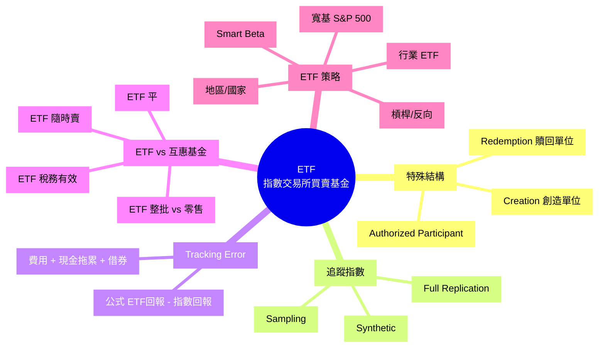
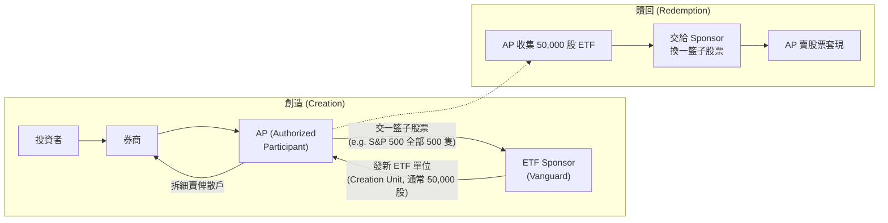

# Module 18: ETF: 結構同優勢

Est. study time: 1h
Language: yue
Description: ETF 結構 (Creation/Redemption)、追蹤指數、Tracking Error、ETF vs 互惠基金、Tax Efficiency。

## Knowledge Map



---

## Learning Objectives
- 解釋 ETF 嘅特殊結構 (Creation/Redemption)
- 區分 3 種追蹤方法 (Full Replication / Sampling / Synthetic)
- 計算 Tracking Error 同解讀
- 比較 ETF 同互惠基金 5 個維度
- 識別常見 ETF 類型 (寬基、行業、地區、Smart Beta、槓桿)

---

## Real-World Example

你想買 S&amp;P 500:
- **互惠基金**: 買 Vanguard 500 Index Fund, 最低 $3,000, NAV 每日計一次, 贖回 T+1
- **ETF**: 買 VOO (Vanguard S&amp;P 500 ETF), 1 股 ~$400, 開市內任何時間賣, 即時成交

兩個跟緊同一個指數, 但結構差好遠。

**呢個 module 解釋**: ETF 點解可以咁平 + 咁有流動性, 同互惠基金嘅核心分別。

---

## Core Content

### Section 1: ETF 嘅特殊結構

**核心創新**: ETF 用「Creation / Redemption」機制, 解決咗傳統基金嘅兩大問題 (高費用 + 低流動性)。

**流程**:



**關鍵好處**:
1. **新單位供應**: AP 可隨時創造, 唔似傳統基金要贖回等現金
2. **價格接近 NAV**: 因為套利機制, 市價接近 NAV
3. **低成本**: 冇銷售佣金, 只需付經紀佣金

**AP (Authorized Participant)** 通常係大型做市商 (e.g. Goldman Sachs, Morgan Stanley, Citadel)。

> **Cloze**: "ETF 嘅特殊結構係 {Creation/Redemption}, 由 {Authorized Participant} 作中介, 令 {新單位供應} 靈活。"
>
> *Answer: Creation/Redemption、Authorized Participant、新單位供應*

### Section 2: 3 種追蹤方法

**(a) Full Replication (完全複製)**
- ETF 持有指數全部成份股, 按權重
- 例: S&amp;P 500 ETF 持有全部 500 隻
- **好處**: 最準確跟指數
- **壞處**: 交易成本高 (500 隻都要買), 細指數/冷門指數可能買唔晒

**(b) Sampling (抽樣)**
- ETF 揀指數部分成份股, 用統計方法模擬
- 例: Russell 2000 ETF 揀 1000 隻 (out of 2000)
- **好處**: 低交易成本, 適合大指數
- **壞處**: 有 Tracking Error

**(c) Synthetic (合成)**
- ETF 唔實際持有股票, 用衍生工具 (Swap) 模擬指數
- 例: 部份歐洲/新興市場 ETF
- **好處**: 可投資限制市場 (e.g. 中國 A 股)
- **壞處**: 有對手方風險 (Swap 對手違約)

**大部分 ETF 用 Full Replication 或 Sampling**, Synthetic 較少用因為有對手風險。

### Section 3: Tracking Error — 追蹤準確度

**公式**:
```
Tracking Error = ETF 實際回報 - 指數實際回報

(常用 Tracking Difference 比較實際表現差)
```

**典型值**:
| ETF 類型 | Tracking Error |
|---|---|
| 大型寬基指數 (S&amp;P 500) | < 0.05%/年 |
| 中型指數 | 0.05-0.2%/年 |
| 行業/主題指數 | 0.1-0.5%/年 |
| 新興市場 / 合成 ETF | 0.3-1.0%/年 |

**Tracking Error 來源**:
1. **管理費**: 從 ETF 資產扣
2. **現金拖累**: 現金部份無投資
3. **再投資時機**: 派息後再投資價格唔啱
4. **稅務差異**: 不同地區稅務處理
5. **借券收入 / 損失**: ETF 借出股票收費, 但有時會蝕

> **Cloze**: "Tracking Error 反映 {ETF 同指數嘅回報差異}, 來源包括 {管理費 + 現金拖累 + 再投資時機 + 稅務}。"
>
> *Answer: ETF 同指數嘅回報差異、管理費 + 現金拖累 + 再投資時機 + 稅務*

### Section 4: ETF vs 互惠基金

| 特性 | ETF | 互惠基金 |
|---|---|---|
| **買賣方式** | 開市內任何時間, 即時 | 收市後按 NAV |
| **最低投資** | 1 股 (e.g. $50-$500) | 通常 $1,000-$3,000 |
| **費用** | 0.03-0.5% (被動) | 0.5-2% (主動) |
| **佣金** | 經紀佣金 (e.g. $0) | 0 (No-load) 或 5% |
| **稅務** | 高效 (In-kind redemption 少觸發稅) | 較差 (現金贖回觸發 CG 稅) |
| **透明度** | 每日持倉 | 季度報告 |
| **槓桿 / Short** | ✓ (槓桿 ETF) | ✗ (傳統) |
| **自動投資** | 較難 (整股買) | 簡單 (Dollar-cost averaging) |

**稅務效率細節**:
- ETF 用 In-kind Redemption: AP 用股票贖回, 唔觸發 CG 稅
- 互惠基金用現金贖回: 經理要賣股套現, 觸發 CG 稅
- **結果**: 同樣回報, ETF 投資者稅後回報通常高過互惠基金 0.1-0.3%/年

**ETF 限制**:
- 細股 / 冷門市場可能無 ETF
- 槓桿 ETF 長期會 decay (每日 reset)
- 唔可以自動 fractional 投資 (但部分 broker 支援)

### Section 5: ETF 類型

**(a) 寬基指數 (Broad Market)**
- S&amp;P 500 (VOO, IVV, SPY)
- Total Stock Market (VTI)
- MSCI World (URTH)
- **適合**: 核心持倉 (60-80% 組合)

**(b) 行業 / 主題 (Sector / Thematic)**
- Technology (XLK, VGT)
- Healthcare (XLV, VHT)
- Energy (XLE)
- 電動車 / AI / 加密幣 (主題, 波動大)
- **適合**: tactical 衛星配置

**(c) 地區 / 國家 (Regional / Country)**
- 港股 (EWH)
- 中國 (MCHI, FXI)
- 日本 (EWJ)
- 新興市場 (EEM)
- **適合**: 地理分散

**(d) Smart Beta / Factor (因子投資)**
- Value (VTV)
- Growth (VUG)
- Dividend (VYM)
- Low Volatility (USMV)
- **適合**: 想跑贏指數嘅特定風格

**(e) 槓桿 / 反向 (Leveraged / Inverse)**
- 2x S&amp;P 500 (SSO)
- -1x S&amp;P 500 (SH)
- 3x 科技 (TQQQ)
- **警告**: 長期持有會 decay, 只適合短炒 (1 日 - 1 週)

> **Spot the Mistake**: 「我買咗 2x S&amp;P 500 ETF (SSO) 揸咗 2 年, 應該賺 2 倍 S&amp;P 500 回報。」
>
> 邊度錯?
>
> *Answer: 槓桿 ETF 每日 reset, 長期持有會 decay。例: S&amp;P 1 年 +20%, 下年 -10%, 累積 +8%。SSO 2x 第 1 年 +40%, 第 2 年 -20%, 累積 +12% (看似 1.5x, 唔係 2x)。如果第 1 年 -10%, 第 2 年 +20%, 累積 +8%, SSO 累積 +16% (2x)。但 volatile path 都會蝕底, 唔係簡單 2x 累積。長期持有 (1 年+) 唔建議, 短炒 (1 日) 先啱。*

### Section 6: 揀 ETF checklist

1. **追蹤指數**: 邊個指數? (S&amp;P 500? MSCI World? 港股?)
2. **Expense Ratio**: 越低越好 (大寬基 < 0.1% 為佳)
3. **AUM**: 大 = 流動性好, 細 = 可能清盤
4. **Tracking Error**: 過去 1-3 年實際 vs 指數
5. **Bid-Ask Spread**: 買賣差價 (高 = 流動性差)
6. **發行商**: Vanguard / iShares / SPDR (信譽好)
7. **Synthetic vs Physical**: 避免 Synthetic (對手風險)

**熱門 ETF 例子**:
- VOO (Vanguard S&amp;P 500): 0.03%, $400B+ AUM
- VTI (Vanguard Total Market): 0.03%, $400B+ AUM
- 2800 (盈富基金, 港股): 0.05%, HK tracking

> **Think**: 你揸 VOO 0.03% ER 30 年, 同期揸 Vanguard 500 Index Fund (VFIAX) 0.04% ER。兩個都跟 S&amp;P 500, 點解 ETF 可能終值高過互惠?
>
> *Answer: 兩個原因。(1) Expense Ratio 差 0.01%, 30 年複利約差 4% 終值。(2) 稅務效率: ETF 用 In-kind Redemption 少觸發 CG 稅, 互惠現金贖回觸發 CG 稅, 同等回報 ETF 稅後高 0.1-0.3%/年, 30 年複利差 5-15%。合計 ETF 終值高 10-20%。*

> **Predict**: 假設你揀 ETF 0.1% ER 同主動基金 1% ER, 兩個都聲稱跑贏指數 2%/年。30 年後邊個終值高?
>
> *Answer: ETF 跑贏 0.1% 淨 Alpha (2% - 0.1% ER - 0% 跑輸風險)。主動基金跑贏 1% 淨 Alpha (2% - 1% ER - 假設真跑贏)。表面主動高 0.9%/年。但 SPIVA 數據: 主動 5 年 80% 跑輸, 15 年 90% 跑輸。即係 80-90% 機會你揀主動係跑輸, 連 1% 淨都無。實際期望: ETF 一定高過大部分主動。*

---

### Why This Matters

ETF 係現代投資者嘅**首選工具**:
- 低費 (被動指數 + 低 ER)
- 高流動 (開市內即時)
- 高透明 (每日持倉)
- 稅務有效 (In-kind redemption)

90% 一般人揀 ETF > 揀主動基金。

---

## Key Takeaways
- ETF = 開放式基金 + 交易所買賣, 用 Creation/Redemption 機制
- 3 種追蹤: Full Replication / Sampling / Synthetic
- Tracking Error < 0.1%/年 算好, 大寬基 ETF 通常 < 0.05%
- ETF 稅務高效, 同樣回報稅後通常高過互惠基金
- 5 種類型: 寬基 / 行業 / 地區 / Smart Beta / 槓桿
- 槓桿 ETF 長期會 decay, 只適合短炒
- 揀 ETF: 低 ER + 大 AUM + 高流動 + 低 Tracking Error

---

## Common Misconception

**「ETF 一定好過互惠基金, 因為費用低。」**

錯。ETF 好過**被動指數互惠基金** (兩者跟緊同一指數, ETF 稍平 + 稅務好)。但 ETF **唔等於好過主動互惠基金**, 因為:
- 主動基金目標係跑贏指數 (但 90% 跑輸)
- 如果你揸嘅主動基金真係跑贏, 可能比 ETF 好
- 但**揀中**跑贏者嘅機率 < 10%

現實: 大部分人揀 ETF 係合理 default。

---

## Spot the Mistake

「我買咗 3x 科技 ETF (TQQQ) 揸咗 1 年, 期待 3x 科技股回報。」

邊度錯?

*Answer: 3x 槓桿 ETF 長期持有會嚴重 decay, 因為每日 reset。例: 科技股 1 年波動: +30% → -25% → +15% → -10%, 累積正回報 ~+5%。TQQQ 第 1 段 +90% → 第 2 段 -75% → 第 3 段 +45% → 第 4 段 -30%, 累積 -50% (3x 跌比 3x 升大)。槓桿 ETF 適合 1 日 - 1 週短炒, 揸過 1 個月風險極高。*

---

## Feynman Explain

(用一個 10 歲都明嘅故事解釋「ETF = 散裝朱古力箱」: 從「1 盒朱古力 24 種口味, 賣俾 1 個人, 太貴」講起, 講到「拆開 1 個 1 個賣, 大家都可以揀幾個自己鍾意嘅, 仲可以即刻轉手」。)

---

## Reframe

(試下諗: 你而家組合入面, 揸咗幾多 % ETF? 邊幾隻? 拎到 Expense Ratio, 比較下同類 (S&amp;P 500, 全球) 嘅最低費選擇。寫低你嘅諗法, 再諗下應唔應該 rebalance。)

---

## Drill
Take the quiz. MCQs test different angles — recall, application, scenario.

Run: `learn.sh quiz finance-basics-cantonese 18`
Run: `learn.sh cloze finance-basics-cantonese 18`
