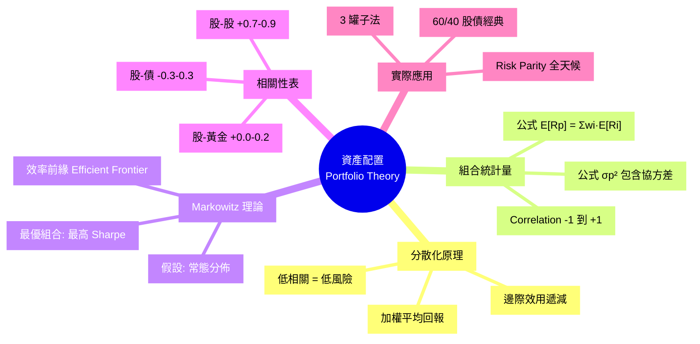
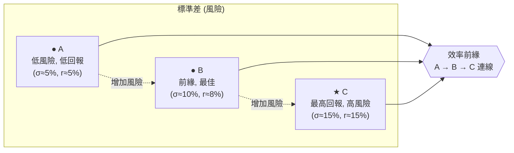

# Module 19: 資產配置(上): 原理同 Correlation

Est. study time: 1h
Language: yue
Description: 資產配置原理、相關性 (Correlation)、組合預期回報、Markowitz 現代投資組合理論、效率前緣。

## Knowledge Map



---

## Learning Objectives
- 解釋 Markowitz 現代投資組合理論嘅核心原理
- 計算組合嘅預期回報同方差
- 理解相關性 (-1 到 +1) 對組合風險嘅影響
- 識別效率前緣 (Efficient Frontier)
- 應用 60/40 策略, 明白點解佢有效

---

## Real-World Example

你 100 萬要投資, 兩個選擇:
- A: 100% 買 S&amp;P 500 ETF
- B: 60% S&amp;P 500 + 40% 美國國債

過去 30 年:
- A: 年化 ~10%, 標準差 ~15%
- B: 年化 ~8%, 標準差 ~10%

**A 回報高啲, B 風險低啲。邊個好?**

睇你嘅目標:
- 30 年後先要錢 (長線) → A 可能好
- 隨時可能要錢 (短中線) → B 穩陣

呢個 module 解釋: 點解 B 嘅波動低咗但回報冇跌太多, 背後係 Markowitz 嘅組合原理。

---

## Core Content

### Section 1: 預期回報 — 簡單加權平均

**公式**:
```
E[Rp] = Σ wi × E[Ri]

E[Rp] = 組合預期回報
wi    = 資產 i 嘅權重
E[Ri] = 資產 i 預期回報
```

**例子**: 60% 股 (10%) + 40% 債 (4%)
- E[Rp] = 0.6 × 10% + 0.4 × 4% = 6% + 1.6% = 7.6%

**簡單**。預期回報就係加權平均, 唔涉及相關性。

> **Cloze**: "組合預期回報 = {Σ wi × E[Ri]}, 即 {資產預期回報嘅加權平均}。"
>
> *Answer: Σ wi × E[Ri]、資產預期回報嘅加權平均*

### Section 2: 組合方差 — 涉及相關性

**公式** (2 資產):
```
σp² = w1²σ1² + w2²σ2² + 2w1w2ρ12σ1σ2

w1, w2 = 權重
σ1, σ2 = 個別標準差
ρ12   = 相關性 (-1 到 +1)
```

**重要**: 第三項 (2w1w2ρ12σ1σ2) 涉及**相關性**。

**3 個極端情況**:
- ρ = +1: 兩資產完全同步, 組合方差 = 加權平均方差 (無分散效果)
- ρ = 0: 兩資產無關, 組合方差 < 加權平均 (有分散效果)
- ρ = -1: 兩資產完全相反, 組合方差可達 0 (完美對沖)

**例子**: 60% 股 σ=15% + 40% 債 σ=5%
- ρ = +1: σp = 0.6×15 + 0.4×5 = 11%
- ρ = 0: σp = √(0.36×225 + 0.16×25) = √86.5 ≈ 9.3%
- ρ = -1: σp = |0.6×15 - 0.4×5| = 7%
- 現實 ρ = 0.0~0.3 (股債低相關): σp ≈ 9.3-9.5%

**結論**: 低相關 → 組合標準差低過個別加權平均 → 分散有效。

### Section 3: 相關性 (Correlation) 詳解

**相關係數 ρ** 範圍 -1 到 +1:

| ρ | 意思 | 例子 |
|---|---|---|
| +1.0 | 完全同步 | 同一指數嘅 2 隻股 |
| +0.7 | 強正相關 | 2 隻大型科技股 |
| +0.3 | 弱正相關 | 股 + REITs |
| 0.0 | 無關 | 美股 + 美國債 (現代) |
| -0.3 | 弱負相關 | 股 + 黃金 (部分對沖) |
| -0.5 | 中度負相關 | 罕見 |
| -1.0 | 完全相反 | 理論對沖 |

**現實組合常用相關性**:
| 組合 | 典型 ρ |
|---|---|
| 美股 + 美債 | 0.0 - 0.3 |
| 美股 + 黃金 | 0.0 - 0.2 |
| 美股 + 房地產 | 0.5 - 0.7 |
| 美股 + 港股 | 0.5 - 0.7 |
| 港股 + A 股 | 0.7 - 0.9 |
| 比特幣 + 任何 | 0.2 - 0.4 |

**重要**: 相關性**唔係固定**, 危機時會急升 (e.g. 2008 所有資產一起跌, ρ 趨向 +1)。

> **Predict**: 2008 金融海嘯, 原本相關性 0.2 嘅股債組合, 預期 ρ 變幾多?
>
> *Answer: 趨向 +0.5 至 +0.8。危機時所有風險資產一起跌, 避險資產(國債/黃金)雖然逆向但幅度有限, 整體 ρ 急升。呢個就係「分散失效」, 組合短期內跌過原本計算嘅 σ。*

### Section 4: Markowitz 現代投資組合理論

**Harry Markowitz 1952 年提出**, 攞諾貝爾獎。

**核心**: 喺同一個預期回報下, 揀**最低風險**嘅組合; 或者喺同一個風險下, 揀**最高回報**嘅組合。

**效率前緣 (Efficient Frontier)**:



- 曲線上面嘅組合 = 效率前緣 (最佳)
- 曲線下面嘅組合 = 劣等 (可以改善)
- 曲線唔存在 = 可改善空間

**最優組合**: 效率前緣上接觸到資本市場線 (CML) 嘅切點 (即 **最高 Sharpe Ratio** 嘅組合)。

**假設**:
1. 投資者理性, 風險厭惡
2. 預期回報同方差足夠描述分佈
3. **常態分佈** (現實 fat tail 唔成立)
4. 唔考慮交易成本同稅務

**現實限制**:
- 估算相關性同預期回報有誤差
- 過去 ρ 唔等於未來 ρ
- 假設常態分佈低估 extreme event 概率 (2008 跌 40%)

### Section 5: 60/40 經典組合

**最常見資產配置**: 60% 股 + 40% 債

| 指標 | 60/40 | 100% 股 |
|---|---|---|
| 年化回報 (長期) | 7-8% | 9-10% |
| 標準差 | 10-12% | 15-18% |
| 最大年度跌幅 | -20% (2008) | -40% (2008) |
| Sharpe Ratio | 0.5-0.7 | 0.4-0.5 |

**點解有效**:
1. 股債低相關 (~0.0-0.3), 分散效果顯著
2. 債提供穩定收益, 緩衝股嘅波動
3. 簡單, 容易執行 (rebalance 一年 1-2 次)
4. 適合大部分人嘅風險承受度

**缺點**:
- 2022 股債齊跌 (通脹+加息), 60/40 跌 ~17%, 分散失效
- 利率長期下行, 債回報有限
- 只用 2 種資產, 未充分分散

**改良版**:
- 三罐子: 60% 股 + 30% 債 + 10% 商品/黃金
- Risk Parity: 風險平價, 唔係金額平價
- 永續組合 (All-weather): 30% 股 + 55% 債 + 7.5% 黃金 + 7.5% 商品

> **Spot the Mistake**: 「我組合 60% 美股 + 40% 美國科技股, 同 60% 美股 + 40% 美國國債, 都係 60/40, 風險應該一樣。」
>
> 邊度錯?
>
> *Answer: 錯晒。60% 美股 + 40% 美國科技股: 兩者 ρ ≈ 0.9, 分散效果近乎 0, 組合 σ ≈ 美股 σ。60% 美股 + 40% 美國國債: ρ ≈ 0.1, 分散效果顯著, 組合 σ 低好多。**「60/40」嘅核心係資產相關性, 唔係機械 60/40 數字。**應該分散到低相關資產類別, 唔好同類型資產再分。*

### Section 6: 三罐子法 (3-Fund Portfolio)

**Bogle 推薦**: 3 隻基金覆蓋全球

1. **美股總市場 ETF** (VTI, 0.03% ER) — 60%
2. **國際股 ETF** (VXUS, 0.07% ER) — 20% 或美股 + 美國債
3. **美國債 ETF** (BND, 0.03% ER) — 20%

**優點**:
- 3 隻, 簡單到極
- 全球分散 (美 + 國際)
- 股債平衡
- 總費用 < 0.05%

**適合**: 90% 散戶, 唔想做研究, 揀呢 3 隻 rebalance 就夠。

> **Think**: 你組合 70% 騰訊 + 30% 美團, ρ ≈ 0.85, 個別 σ ≈ 40%。預期組合 σ?
>
> *Answer: σp² = 0.7²×40² + 0.3²×40² + 2×0.7×0.3×0.85×40×40 = 784 + 144 + 571 = 1499。σp ≈ 38.7%。同個別 40% 差唔多。**分散近乎 0**, 因為兩隻都係港股科技。應該加低相關資產, e.g. 改 50% 騰訊 + 20% 美團 + 20% 美國國債 + 10% 黃金。*

---

### Why This Matters

資產配置決定咗 90% 嘅組合波動同回報, 個股揀選只係 10%。

識 Markowitz + 相關性, 你就識得:
- 點解 60/40 有效
- 點解唔好同類型資產再分
- 點解 rebalance 重要

---

## Key Takeaways
- 組合預期回報 = 加權平均, 簡單
- 組合方差涉及相關性, ρ 越低越分散
- Markowitz 理論: 效率前緣 = 最低風險/最高回報
- 60/40 經典組合, 適合大部分人
- 相關性唔固定, 危機時會升
- 三罐子法: 美股 + 國際股 + 美債, 簡單全球分散

---

## Common Misconception

**「我組合有 10 隻股, 已經充分分散。」**

錯。10 隻都係同類型 (e.g. 港股科技) 嘅話, ρ ≈ 0.8, 分散效果有限。真正分散要:
- 跨資產類別 (股、債、商品、黃金)
- 跨地區 (港、美、歐、日、新興市場)
- 跨行業 (科技、醫療、消費、能源)

10 隻港股科技股 ≈ 1 隻港股科技 ETF 嘅分散效果。

---

## Spot the Mistake

「我組合 60% 美股 + 40% 美債 (60/40), 過去 10 年年化 7%, 最大年度跌 20%。我覺得保守, 加多 10% 美股 (變 70/30)。」

邊度錯?

*Answer: 多 10% 美股, 預期回報由 7% → 7.6% (+0.6%), 但 σ 由 ~11% → ~13% (+18% 風險), 兩者唔對等。回報線性加, 風險平方加。如果再調整, 應該 (a) 加到 70/30, 但要承受 13% σ; 或 (b) 加海外股分散 (e.g. 60% 美股 + 30% 國際股 + 10% 債), 同樣風險但回報可能更好。60/40 唔係神聖, 要按自己風險承受度調整。*

---

## Feynman Explain

(用一個 10 歲都明嘅故事解釋「分散化 = 唔好擺晒所有雞蛋喺同一個籃」: 從「你有 10 粒糖, 全部擺 1 個袋, 跌咗冇晒」講起, 講到「分 3 個袋, 1 個跌咗, 你仲有 7 粒」。)

---

## Reframe

(試下諗: 你而家組合入面有冇同類型資產 (e.g. 港股 + A 股) 扮分散? 拎到 5 隻最大持倉嘅 ρ, 計下實際組合 σ。寫低你嘅諗法, 再諗下應唔應該加 1-2 種低相關資產。)

---

## Drill
Take the quiz. MCQs test different angles — recall, application, scenario.

Run: `learn.sh quiz finance-basics-cantonese 19`
Run: `learn.sh cloze finance-basics-cantonese 19`
