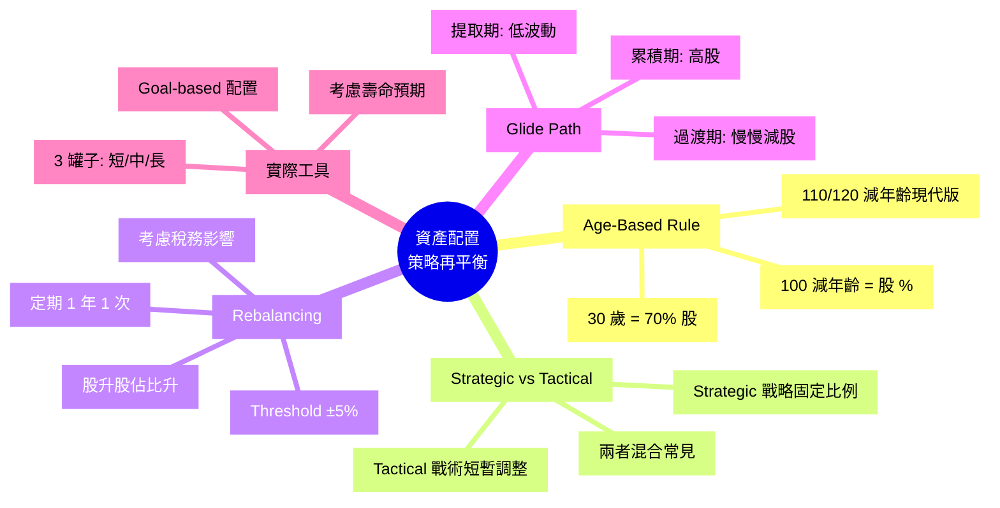
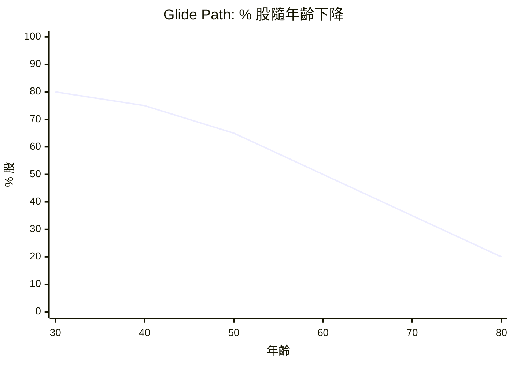

# Module 20: 資產配置(下): 策略同再平衡

Est. study time: 1h
Language: yue
Description: Age-based 規則 (100/年龄)、Strategic vs Tactical 配置、Rebalancing 策略、生命周期 Glide Path。

## Knowledge Map



---

## Learning Objectives
- 用 Age-Based Rule 計目標股債比例
- 區分 Strategic vs Tactical 配置策略
- 執行 Rebalancing (定期 / Threshold-based)
- 設計生命周期 Glide Path (累積 → 提取)
- 避開 Rebalancing 嘅稅務陷阱

---

## Real-World Example

你 30 歲, 開始投資:
- 100 減年齡 = 70% 股 + 30% 債
- 每年 rebalance 1 次
- 到 60 歲, 改成 40% 股 + 60% 債 (接近退休)

**或者用 Glide Path**:
- 30-50 歲: 80% 股 (高增長期)
- 50-60 歲: 60% 股 (過渡期)
- 60+ 歲: 40% 股 (提取期)

呢個 module 教你設計適合你嘅配置策略, 同點樣 rebalance。

---

## Core Content

### Section 1: Age-Based Rule (100 減年齡)

**經典規則** (源於傳統智慧):
```
股 % = 100 - 年齡
債 % = 100 - 股 %

例子:
  30 歲 → 70% 股 + 30% 債
  50 歲 → 50% 股 + 50% 債
  70 歲 → 30% 股 + 70% 債
```

**邏輯**:
- 年輕有時間 recover, 承受高波動 (高股)
- 年老要保本, 接受低波動 (高債)
- 簡單易記, 大部分人用得到

**現代修訂**:
- **110 減年齡** (Bogle 修訂, 現代人壽命長)
- **120 減年齡** (更激進, 美國年輕投資者常用)
- 例子: 30 歲用 110 - 30 = 80% 股

**限制**:
- 唔考慮個人風險承受度
- 唔考慮其他收入 (租金、退休金)
- 唔考慮目標 (5 年後買樓 vs 30 年後退休)
- 同齡人都用唔同配置 (30 歲醫生 vs 30 歲 freelancer)

> **Cloze**: "Age-Based Rule: 股 % = {100 - 年齡}。30 歲 → {70% 股 + 30% 債}。"
>
> *Answer: 100 - 年齡、70% 股 + 30% 債*

### Section 2: Strategic vs Tactical 配置

**Strategic Asset Allocation (SAA)**
- 設定固定比例, 長期維持
- 例: 永遠 60/40, 每年 rebalance
- **好處**: 簡單、可預測、低交易成本
- **壞處**: 唔識 capture 短期機會

**Tactical Asset Allocation (TAA)**
- 短期調整比例 (3-12 個月)
- 例: 覺得股市貴, 短期減到 50% 股
- **好處**: 可能 capture 低買高賣
- **壞處**: 需要識時機, 大部分人 timing 錯

**現實**:
- 90% 散戶應該用 SAA
- 10% 有經驗 + 研究 + 識認 macro 嘅可以 TAA
- 兩者混合常見: 70% SAA + 30% TAA

**Caveat**: 大量研究顯示, TAA 嘅 timing 能力大部分都係 noise, SAA 長期回報通常更穩定。

> **Predict**: 你覺得 2024 年股市會跌。你會減股到 40%, 等待跌完再加返 60%?
>
> *Answer: 唔建議。Market timing 90% 失敗, 你估 2024 跌可能錯 (實際升)。就算跌, 你可能 30% 跌咗先加返 (因為驚再跌), 結果跑輸 SAA 60/40。SAA 心理上更易執行, 唔使做預測。TAA 只適合 (a) 有 macro 研究背景, (b) 有系統方法 (e.g. 用 PE ratio 調整), (c) 接受跑輸 SAA 嘅機率。*

### Section 3: Rebalancing 策略

**問題**: 開始 60/40, 1 年後股升 20%, 債升 5%
- 原本: $60 股 + $40 債 = $100
- 1 年後: $72 股 + $42 債 = $114
- 新比例: 63% 股 + 37% 債
- 已經 drift 咗

**點 rebalance**:
- 賣 $3.6 股 (變 $68.4) + 買 $3.6 債 (變 $45.6)
- 變返 60/40 (60% of $114 = $68.4, 40% = $45.6, 因為 total 已經變成 $114)

**2 種 rebalancing 方法**:

**(a) Calendar-based (定期)**
- 每季/半年/1 年 rebalance 1 次
- 簡單, 自動化
- 缺點: 牛市時賣啱, 熊市時又買啱 (但執行難)

**(b) Threshold-based (閾值)**
- 任何資產 drift 過 5% (絕對) 或 25% (相對), 就 rebalance
- 例: 目標 60% 股, 跌到 50% 或升到 70% 就 rebalance
- 優點: 交易次數少, 稅務友好
- 缺點: 牛市時無 rebalance, 可能錯過賣高

**混合**:
- 半年 check 1 次
- 超過 ±5% drift 先 rebalance
- 大部分人 default 方案

**稅務考慮**:
- Rebalancing 觸發賣出, 觸發資本利得稅
- 美國: 短炒 (< 1 年) 高稅, 長揸 (> 1 年) 低稅
- 香港: 0% 資本利得稅, 唔使擔心
- 退休戶口 (IRA / 401k / MPF): 內部 rebalance 唔觸發稅

> **Cloze**: "Rebalancing 兩種方法: {Calendar-based 定期} (簡單) 同 {Threshold-based 閾值} (稅務友好)。"
>
> *Answer: Calendar-based 定期、Threshold-based 閾值*

### Section 4: Glide Path (生命周期路徑)

**Glide Path = 隨年齡/時間改變股債比例嘅曲線**

**3 段式**:



**典型設計**:
- **累積期 (30-50 歲)**: 80-90% 股 (高增長)
- **過渡期 (50-65 歲)**: 慢慢減到 50-60% 股 (5-10 年)
- **提取期 (65+ 歲)**: 30-50% 股 (保本 + 通脹保護)

**MPF 默認 Glide Path** (香港):
- 預設投資 (DIS): 隨年齡由約 60% 股降到 64 歲約 20% 股
- 自動 rebalance
- 適合唔想煩嘅人

**個人化**:
- 延遲退休 → 可以延後 glide
- 有其他收入 (物業、年金) → 可以高啲股
- 想留遺產 → 提取期都可以高啲股

> **Cloze**: "Glide Path 3 段: {累積期高股}、{過渡期慢慢減}、{提取期低波動}。"
>
> *Answer: 累積期高股、過渡期慢慢減、提取期低波動*

### Section 5: Goal-Based 配置

**更精細嘅做法**: 按目標分罐, 每罐用唔同配置。

**3 罐子法** (改良版):

**罐 1: 短期 (0-2 年)**
- 目標: 應急錢 + 短期需要
- 配置: 100% 現金 / MMF / 短債
- 例子: 6 個月生活費

**罐 2: 中期 (2-10 年)**
- 目標: 中期目標 (首期、進修、子女教育)
- 配置: 40% 股 + 60% 債
- 例子: 5 年後買樓首期

**罐 3: 長期 (10+ 年)**
- 目標: 退休、財富增長
- 配置: 80% 股 + 20% 債
- 例子: 30 年後退休

**優點**:
- 每罐清晰, 唔會短期目標用長期投資
- Rebalancing 簡單 (罐內 rebalance)
- 心理上更易執行

> **Think**: 你 30 歲用 110 - 30 = 80% 股, 但 5 年後市場跌 30%, 你嘅 80% 股蝕 24%, 總組合蝕 19%。你會點做?
>
> *Answer: 紀律上應該 rebalance: 賣部分債, 買入部分股 (因為股跌咗, 比例已經低過 80%)。心理上難, 但係 rebalance 嘅紀律 — 跌市時買貨。90% 散戶會「等反彈先算」, 結果錯過平貨。如果你真係 cover 唔到 19% 跌幅, 應該 rebalance 之後再減股到 70% (預留 10% 心理緩衝)。Glide Path 唔係神聖, 要按自己承受度調整。*

> **Cloze**: "Goal-Based 配置: {短期罐 (0-2 年) 100% 現金/短債}、{中期罐 (2-10 年) 40/60}、{長期罐 (10+ 年) 80/20}。"
>
> *Answer: 短期罐 (0-2 年) 100% 現金/短債、中期罐 (2-10 年) 40/60、長期罐 (10+ 年) 80/20*

### Section 6: 重新平衡嘅常見錯誤

**錯誤 1: 永遠唔 rebalance**
- 結果: 組合 drift 越來越極端 (e.g. 90% 股), 風險超預期
- 修正: 訂 calendar 或 threshold

**錯誤 2: 過度 rebalance**
- 結果: 交易成本高, 短期 noise 觸發
- 修正: 半年 / 1 年 1 次, 或 ±5% 先做

**錯誤 3: 熊市時唔敢買**
- 結果: rebalance 需要買股 (因為股跌咗), 但你怕再跌唔敢買
- 心理陷阱: 「再睇下先」, 結果錯過買平貨
- 修正: 自動 rebalance, 唔好 manual 介入

**錯誤 4: 牛市時太早賣**
- 結果: rebalance 需要賣股 (因為股升咗), 但你覺得「仲會升」唔捨得賣
- 心理陷阱: 怕錯過升市
- 修正: 跟計劃, 唔好預測

**錯誤 5: 忽略稅務**
- 結果: 觸發大量 CG 稅 (美國)
- 修正: 優先用免稅戶口 (IRA / 401k / TFSA)

> **Spot the Mistake**: 「我嘅 60/40 組合 5 年無 rebalance, 而家 85% 股 15% 債, 但我覺得 OK, 反正股會升。」
>
> 邊度錯?
>
> *Answer: 兩個錯。(1) 組合 drift 已經違反咗你原本嘅風險預算。原本預期 σ ~10%, 而家可能 ~15%, 你嘅承受度可能 cover 唔到。(2) 「反正股會升」係 market timing 預測, 90% 失敗。應該 rebalance 返 60/40, **賣出 25% 股** 換債。心理上難受, 但呢個就係 rebalance 嘅紀律。*

---

### Why This Matters

資產配置決定 90% 風險回報, 但**執行**先係難。

識:
- Age-Based Rule 起步
- SAA + Rebalancing 自動執行
- Glide Path 配合年齡
- 避免心理陷阱

---

## Key Takeaways
- Age-Based Rule: 100 - 年齡 = 股 %
- SAA 適合 90% 人, TAA 需要 timing 能力
- Rebalancing 兩種: Calendar / Threshold, 半年 1 次 + ±5% drift
- Glide Path 3 段: 累積 / 過渡 / 提取
- Goal-Based 配置: 短/中/長 3 罐
- 5 大 rebalance 錯誤: 唔做 / 過度 / 唔敢買 / 太早賣 / 忽略稅

---

## Common Misconception

**「Market timing 高手可以跑贏 SAA。」**

錯。大量研究 (SPIVA 等) 顯示:
- 90% 主動基金跑輸指數
- Market timing 成功率 < 10%
- 心理偏差 (loss aversion, overconfidence) 令 timing 更難

SAA + Rebalancing 雖然悶, 但長期跑贏 80%+ 嘅 active 投資者。

---

## Spot the Mistake

「我 30 歲, 朋友話 100 減年齡太保守, 我用 120 減年齡 = 90% 股。等於 All-in 股票。」

邊度錯?

*Answer: 至少有 3 個考慮。(1) 90% 股雖然回報高, 但 σ ~16-18%, 心理上要頂得住。如果 2008 跌 40%, 你 30 歲可能 30% 斬倉。(2) 唔係所有 30 歲都一樣: 醫生/律師有穩定高收入, 承受度可高; freelancer 收入浮動, 承受度應低。(3) 應該睇**短期需要 + 流動性**: 如果你 5 年後要買樓, 5 年內嘅錢唔應該 90% 股。**修正**: 用 Goal-Based 3 罐, 短期罐低股, 長期罐高股。綜合未必係 90% 股。*

---

## Feynman Explain

(用一個 10 歲都明嘅故事解釋「Rebalancing = 整理書包」: 從「你個書包入面, 數簿越嚟越多, 英文書越嚟越少」講起, 講到「每年開學整理返, 比例正常」)。

---

## Reframe

(試下諗: 你而家組合最後一次 rebalance 係幾時? 拎到目標比例, 同現有比例比, drift 咗幾多? 如果 > 5%, 應該 rebalance。寫低你嘅諗法, 訂下 calendar (e.g. 每年 1 月 1 日)。)

---

## Drill
Take the quiz. MCQs test different angles — recall, application, scenario.

Run: `learn.sh quiz finance-basics-cantonese 20`
Run: `learn.sh cloze finance-basics-cantonese 20`
