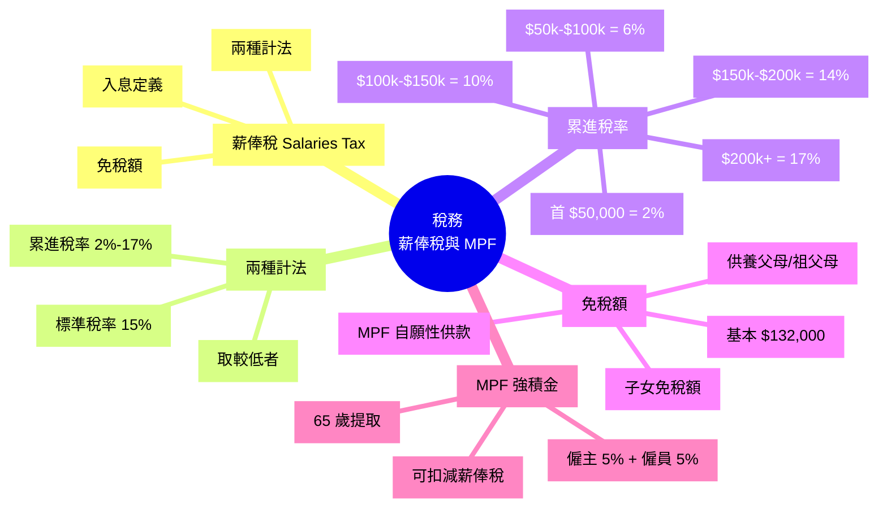

# Module 21: 稅務(上)

Est. study time: 1h
Language: yue
Description: 香港薪俸稅 (Salaries Tax) 兩種計法: 累進稅率 vs 標準稅率。MPF 強制性公積金: 5% 僱主 + 5% 僱員, 稅務扣減。

## Knowledge Map



---

## Learning Objectives
- 區分香港薪俸稅嘅兩種計法
- 計算累進稅率實際應繳稅款
- 應用免稅額降低稅務負擔
- 解釋 MPF 強制性供款結構
- 識用 MPF 自願性供款做稅務規劃

---

## Real-World Example

你而家月入 $50,000 (年薪 $600,000), MPF 強制供款 $1,500/月 (僱員部分):
- 累進稅率: 應評稅入息 $600,000 - $132,000 (基本免稅) - $18,000 (MPF) = $450,000
  - 稅 = $50k×2% + $50k×6% + $50k×10% + $50k×14% + $250k×17% = $1,000 + $3,000 + $5,000 + $7,000 + $42,500 = $58,500
- 標準稅率: ($600,000 - $18,000) × 15% = $87,300
- 較低者: $58,500 (累進)

呢個 module 教你識用兩種計法 + 免稅額, 合法節稅。

---

## Core Content

### Section 1: 薪俸稅 (Salaries Tax) 兩種計法

香港薪俸稅用「**兩選一, 取較低**」原則:

**(a) 累進稅率 (Progressive Rates)**
- 2024/25 年度 5 級: 2% / 6% / 10% / 14% / 17%
- 累進, 高收入邊際稅率高
- 適合中低收入

**(b) 標準稅率 (Standard Rate)**
- 2024/25 起兩級制: 15% (應評稅入息淨額 $500 萬以內) / 16% (超過部分)
- 簡單, 唔使分級 (大部分人唔會去到 16% 嗰級)
- 適合高收入

**入息定義**:
- 包括: 底薪、佣金、花紅、津貼、房屋福利、股票獎勵
- 唔包括: 真正嘅辦公室費用 (e.g. 影印費)
- 計算: 應評稅入息 = 總入息 - 免稅額 - 扣除

> **Think**: 邊際稅率同平均稅率有咩分別? 如果你年收入 $250,000, 兩者大概幾多?
>
> *Answer: 邊際稅率係「每多賺 1蚊嘅稅率」(累進最高 17%), 平均稅率係「總稅 / 總收入」(反映實際稅負)。$250,000 應評稅: 累進稅 = $1k+$3k+$5k+$7k+$50k×17% = $24,500, 平均 = 9.8% < 邊際 17%。所以加薪 $50k → 邊際 17% 稅, 但平均仲係 9.8%。*

> **Predict**: 你而家年薪 $400,000, 老闆話加你 $100,000 (變 $500,000), 但你認為新邊際稅率高, 計下實際加薪幾多 (扣 MPF 強制 $18,000, 加稅前 vs 加稅後)?
>
> *Answer: 加薪前: 應評稅 = $400k - $132k - $18k = $250k。累進稅 ≈ $1k+$3k+$5k+$7k+$50k×17% = $24,500。淨收入 = $400k - $18k - $24,500 = $357,500。加薪後: 應評稅 = $350k。累進稅 ≈ $1k+$3k+$5k+$7k+$200k×17% = $50,000。淨收入 = $500k - $18k - $50,000 = $432,000。實際加薪 = $74,500, 即 $100k 加薪嘅 74.5%。邊際稅率 17% + MPF 5% + 其他 = 25.5% 「消失」。*

> **Cloze**: "香港薪俸稅有 {兩種計法}, {累進稅率} 同 {標準稅率}, {取較低者} 計稅。"
>
> *Answer: 兩種計法、累進稅率、標準稅率、取較低者*

### Section 2: 累進稅率詳細表 (2024/25)

| 級別 | 應課稅入息 | 稅率 | 累進稅 |
|---|---|---|---|
| 1 | 首 $50,000 | 2% | $1,000 |
| 2 | $50,001 - $100,000 | 6% | $3,000 |
| 3 | $100,001 - $150,000 | 10% | $5,000 |
| 4 | $150,001 - $200,000 | 14% | $7,000 |
| 5 | $200,000 以上 | 17% | (按比例) |

**例子** (應評稅入息 $300,000):
```
稅 = $50,000 × 2%      = $1,000
   + $50,000 × 6%      = $3,000
   + $50,000 × 10%     = $5,000
   + $50,000 × 14%     = $7,000
   + $100,000 × 17%    = $17,000
   = $33,000
```

**Break-even 點**: 標準稅率 15% 同累進稅率嘅臨界點大約喺 $900,000 應評稅入息 (累進 = $135,000 = 標準 15% × $900k)。低過呢個累進平好多 (e.g. $200,000: 累進 $16,000 vs 標準 $30,000), 高過先係標準贏。

### Section 3: 免稅額 (Allowances) 完整表

| 免稅額 | 2024/25 年度 (HKD) |
|---|---|
| 基本免稅額 (個人) | 132,000 |
| 已婚人士免稅額 | 264,000 |
| 供養父母 / 祖父母 (每名, 60+) | 50,000 (同住) / 25,000 (非同住) |
| 供養父母 (55-59) | 25,000 / 12,500 |
| 子女免稅額 (每名) | 130,000 (首 9 名, 每名都係) |
| 傷殘受養人 | 75,000 |
| 個人進修開支 | 100,000 (上限) |
| 居所貸款利息 | 100,000 (上限, 20 年) |
| 強積金強制性供款 | 18,000 (上限) |
| 認可慈善捐款 | 入息 35% (上限) |

**注意**: 免稅額同扣除項目只適用**累進稅率計法**, 標準稅率 15% 唔再扣 (但 MPF 都可扣)。

> **Cloze**: "2024/25 年度基本免稅額係 {$132,000}, 已婚 {$264,000}。"
>
> *Answer: $132,000、$264,000*

### Section 4: 累進 vs 標準 計法比較

**例子 1**: 應評稅入息 $150,000
- 累進: $50k×2% + $50k×6% + $50k×10% = $9,000
- 標準: $150k × 15% = $22,500
- **較低: 累進 $9,000** ✓

**例子 2**: 應評稅入息 $500,000
- 累進: $50k×2% + $50k×6% + $50k×10% + $50k×14% + $300k×17% = $1k+$3k+$5k+$7k+$51k = $67,000
- 標準: $500k × 15% = $75,000
- **較低: 累進 $67,000** ✓

**例子 3**: 應評稅入息 $1,000,000 (極端)
- 累進: $50k×2% + $50k×6% + $50k×10% + $50k×14% + $800k×17% = $1k+$3k+$5k+$7k+$136k = $152,000
- 標準: $1M × 15% = $150,000
- **較低: 標準 $150,000** ✓ (標準稅率喺 $900k 以上先贏)

**結論**: 大部分中產用累進 (有免稅額), 超高收入 (>$900k 應評稅) 標準先贏。

> **Predict**: 你年薪 $800,000, MPF 強制供款 $18,000, 供養一位 65 歲父親 (同住)。邊種計法低?
>
> *Answer: 應評稅入息 = $800,000 - $132,000 (基本) - $50,000 (供養父母) - $18,000 (MPF) = $600,000。累進 ≈ $50k×2% + $50k×6% + $50k×10% + $50k×14% + $400k×17% = $1k+$3k+$5k+$7k+$68k = $84,000。標準 = $600,000 × 15% = $90,000。**累進低 $6,000**。供養父母免稅額起咗作用。*

### Section 5: MPF 強制性公積金

**結構**:
- **僱主供款**: 5% 月薪 (上限 $1,500/月, 即 $18,000/年)
- **僱員供款**: 5% 月薪 (上限 $1,500/月, 即 $18,000/年)
- **總供款**: 10% 月薪 (上限 $3,000/月, 即 $36,000/年)
- **收入定義**: 有關入息 ≥ $7,100/月 (月薪) 或 $280/日 (日薪)

**特點**:
- 強制性, 唔可以唔供
- 投資於 MPF 基金 (股票/混合/債券/貨幣/保證)
- 65 歲提取 (或符合其他條件提早)
- 僱員部分可扣減薪俸稅 (但有上限 $18,000)

**僱主供款細節**:
- 僱主供款即時歸屬僱員 (vesting), 唔可以沒收
- 轉工時, 累積權益可轉移至新僱主或個人戶口 (TVC)

**常見誤解**:
- 「MPF 蝕晒」 → 短期可能蝕, 長期 (20+ 年) 多數正回報
- 「應該揀保證基金」 → 保證基金回報低但保本, 適合接近退休人士
- 「我換 MPF 會好啲」 → MPF 整體回報差唔多, 手續費各異

> **Cloze**: "MPF 強制供款結構: {僱主 5% + 僱員 5%}, 上限 {$1,500/月} 各, 提取年齡 {65 歲}。"
>
> *Answer: 僱主 5% + 僱員 5%、$1,500/月、65 歲*

### Section 6: 稅務規劃 (合法節稅)

**方法**:
1. **善用免稅額**: 供養父母 (50+) 同住, 加 $50,000 免稅
2. **MPF 供滿上限**: 確保用盡 $18,000 扣減
3. **個人進修開支**: 持續教育 (CPD), 上限 $100,000
4. **居所貸款利息**: 20 年內, 上限 $100,000/年
5. **認可慈善捐款**: 35% 入息上限, 又可以做善事
6. **自願性 MPF 供款 (TVC)**: 可扣稅, 上限 $60,000/年 (2019 年 4 月起推出)

**TVC (Tax-deductible Voluntary Contributions)**:
- 自願性 MPF 供款, **可扣稅**
- 上限 $60,000/年, 同強制性 MPF 分開
- 適合高收入人士 (邊際稅率 17% 或標準 15%)
- 65 歲提取, 提取時免稅

**例子** (年薪 $1M, 邊際稅率 15%):
- 供 TVC $60,000, 每年慳稅 = $60,000 × 15% = $9,000
- 20 年供款, 慳稅 = $180,000
- 投資回報另計

> **Spot the Mistake**: 「我 MPF 全部揀保證基金 (Guaranteed Fund), 因為保本, 最安全。」
>
> 邊度錯?
>
> *Answer: 錯晒, 視乎你幾時退休。如果 30 歲開始供 MPF, 30+ 年後先 65 歲提取, 咁長時間可以承受短期波動, 揀股票基金或混合基金長遠回報高過保證基金 2-3%/年。30 年複利下, 2%/年差異 = 終值差 ~50%。保證基金只適合**接近退休 (5-10 年內)** 嘅人, 短期要保本。*

---

### Why This Matters

識計薪俸稅 + 善用免稅額 + MPF TVC, 高收入人士每年可以合法慳稅 $10,000-50,000。

---

## Key Takeaways
- 薪俸稅兩種計法: 累進 2-17% 或 標準兩級制 (15% / 超過 $500 萬部分 16%), 取較低
- 累進適合中產 (因有免稅額)
- 標準適合超高收入 (>$900k 應評稅)
- 2024/25 基本免稅額 $132,000
- MPF 強制: 僱主 + 僱員各 5% (上限 $1,500/月)
- TVC 自願性供款可扣稅, 上限 $60,000/年
- 合法節稅: 善用免稅額 + MPF + TVC + 慈善捐款

---

## Common Misconception

**「我全年收入 $600,000, 計稅簡單, 直接 $600,000 × 15% = $90,000 就係」**

錯。標準稅率 15% 只係其中一個 option。累進稅率 + 免稅額 + MPF 扣除可能更低。應該**兩種都計, 取較低**。大部人中產用累進平啲。

---

## Spot the Mistake

「我 50 歲, 過去 20 年 MPF 揸股票基金, 累積 $1.5M, 仲有 15 年先退休。我即刻轉晒去保證基金保本。」

邊度錯?

*Answer: 錯。(1) 仲有 15 年時間, 短中期波動 (5-10%) 唔影響 15 年後嘅結果, 唔需要即刻保本。(2) 股票基金長期回報高過保證基金 2-3%/年, 15 年複利下, 差 $1M+。(3) 應該做 Glide Path: 隨住退休接近, 慢慢由股票 → 混合 → 保證。例如 50 歲 80% 股票 20% 保證, 60 歲 50/50, 65 歲 20% 股票 80% 保證。唔好一次過轉。*

---

## Feynman Explain

(用一個 10 歲都明嘅故事解釋「兩種計稅」: 從「你擺檔賣汽水, 爸爸話『你賺 100, 兩種方法計, 累進就係 50 以下 2 蚊稅, 50 以上 5 蚊稅; 或者 100 × 15% = 15 蚊』, 邊個平用邊個」講起。)

---

## Reframe

(試下諗: 你今年報稅, 兩種計法都計過未? 你 MPF 揸咩基金? 你有冇用 TVC 自願性供款扣稅? 寫低你嘅稅務狀況, 再諗下應唔應該調整。)

---

## Drill
Take the quiz. MCQs test different angles — recall, application, scenario.

Run: `learn.sh quiz finance-basics-cantonese 21`
Run: `learn.sh cloze finance-basics-cantonese 21`
