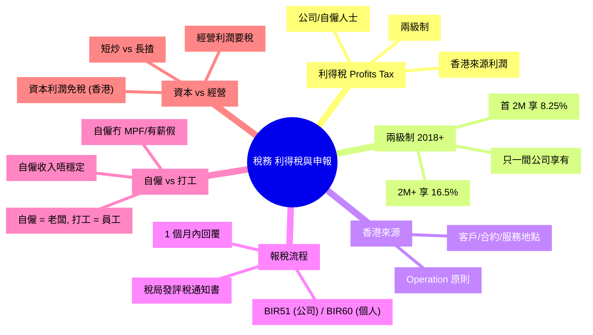

# Module 22: 稅務(下): 利得稅同申報

Est. study time: 1h
Language: yue
Description: 香港利得稅 (Profits Tax) 兩級制、資本利得稅、稅務申報流程、利得稅 vs 薪俸稅、自僱注意點。

## Knowledge Map

---

## Learning Objectives
- 解釋利得稅兩級制 (8.25% / 16.5%)
- 識別「香港來源」利潤嘅判定原則
- 走一次利得稅申報流程
- 區分自僱 vs 打工嘅稅務差異
- 明白香港資本利得免稅嘅特點

---

## Real-World Example

你開咗間一人公司, 為客戶做網頁設計:
- 年利潤 $1,500,000
- 利得稅: 首 $2M = 8.25% → $1.5M × 8.25% = $123,750

如果你公司加埋老婆合資, 兩間公司:
- 公司 A: 利潤 $1,500,000 (8.25% 優惠)
- 公司 B: 利潤 $1,500,000 (8.25% 優惠)

兩級制只容許**一間關聯公司**享有 8.25%, 其餘要 16.5%。

呢個 module 教你識兩級制 + 自僱報稅, 避免罰款。

---

## Core Content

### Section 1: 利得稅 (Profits Tax) 兩級制

**適用對象**:
- 香港註冊公司
- 非香港註冊公司但喺港經營
- 自僱人士 (Sole Proprietor)
- 合夥企業 (Partnership)

**2018 年起兩級制**:
| 級別 | 利潤 | 稅率 |
|---|---|---|
| 第一級 | 首 $2,000,000 | 8.25% |
| 第二級 | $2,000,000 以上 | 16.5% |

**重要限制**:
- **只一間關聯公司**可以享 8.25% 優惠
- 多間關聯公司要「提名」(nominate) 一間
- 自僱人士/合夥同樣只可享一次

**例子** (公司利潤 $3M):
- 首 $2M × 8.25% = $165,000
- 餘 $1M × 16.5% = $165,000
- 總稅: $330,000 (即 11% 平均稅率)

> **Cloze**: "利得稅 2018 起實行 {兩級制}, 首 $2M 享 {8.25%}, 餘下 {16.5%}。"
>
> *Answer: 兩級制、8.25%、16.5%*

### Section 2: 「香港來源」利潤

**核心問題**: 你間公司賺嘅錢, 係咪要喺香港交稅?

**判定原則** (Operation Test):
- 睇**合約簽訂地**、**客戶所在地**、**服務提供地**、**付款地**
- 唔係睇公司註冊地 (可以係 BVI 註冊)

**例子**:
| 情境 | 香港來源? |
|---|---|
| 客戶喺香港, 喺香港交收, 港幣結算 | ✓ 100% 香港來源 |
| 客戶喺美國, 服務喺香港做, 美金結算 | △ 部分香港來源 (要分攤) |
| 客戶喺中國, 合約喺香港簽, 服務喺中國做 | △ 灰色, 要看 Operations |
| 客戶喺中國, 合約喺中國簽, 服務喺中國做 | ✗ 非香港來源 |

**避稅灰色地帶**:
- 「合約喺邊度簽」係關鍵
- 稅局會查 (Operation Test + 實質原則)
- 唔係話搬公司去 BVI 就免稅, 仲要睇 Operations

### Section 3: 申報流程

**時間表** (公司):

| 時間 | 事件 |
|:---|:---|
| 每年 4 月 1 日 | 稅局發 BIR51 表格 |
| 每年 4 月底/5 月 | 公司提交 BIR51 (1 個月內) |
| 提交後 | 稅局可能查帳 / 發問卷 |
| 數月內 | 稅局發評稅通知書 (Notice of Assessment) |
| 1 個月內 | 繳稅 / 申請覆核 (代表反對) |
| 3 個月內 | 仲唔服可上訴稅務上訴委員會 |

**個人 (自僱)**:

| 時間 | 事件 |
|:---|:---|
| 每年 5 月初 | 稅局發 BIR60 表格 (個人報稅表) |
| 每年 6 月底 | 個人提交 (1 個月內, 可延期) |
| 跟住 | 同公司流程 |

**逾期罰款**:
- 第一次逾期: 罰 $1,200 + 稅款 5%
- 第二次 (5 年內): 罰 $3,000 + 稅款 10%
- 蓄意逃稅: 罰款 + 監禁 (最高 3 年)

**常見錯誤**:
- 唔交報稅表 (以為無利潤就唔使報) → 罰 $1,200
- 遲交 (趕唔切) → 罰 $1,200 + 利息
- 收入低報 / 開支高報 → 罰款 + 補稅 + 利息
- 唔記得申報離港 / 海外收入 (如果係香港稅務居民)

### Section 4: 自僱 vs 打工

| 特性 | 打工 (Employee) | 自僱 (Sole Proprietor) |
|---|---|---|
| **身份** | 僱員 | 老闆 |
| **報稅** | 自動從 MPFA 收集 (BIR60 預填) | 自行填寫 + 提交 |
| **MPF** | 強制性 (僱主 5% + 僱員 5%) | 強制性 (自僱 5%, 上限 $1,500/月) |
| **強醫療** | 跟公司 | 冇, 自己買 |
| **有薪假** | 有 | 冇 (病 = 無收入) |
| **開支扣稅** | 個人進修 (上限) | 經營開支 (較寬) |
| **資本開支** | 唔適用 | 折舊免稅額 |
| **風險** | 失業風險 | 客戶流失風險 |
| **上限** | 老闆畀幾多 | 自己決定 |

**自僱可扣稅開支**:
- 辦公室租金
- 器材 (電腦、相機、軟件)
- 交通 (業務用)
- 應酬 (客戶)
- 進修 (與業務相關)
- 強積金自願性供款

**自僱風險**:
- 收入唔穩定 (旺季 vs 淡季)
- 冇勞工保障 (被客 cut 單冇賠償)
- 全部自己搞 (會計、稅務、MPF、客戶)
- 退休要靠自己 (MPF + 自己儲蓄)

> **Think**: 點解香港 2018 年先引入兩級制利得稅? 之前單一 16.5% 對中小企有咩問題?
>
> *Answer: 之前 16.5% 對中小企太重, 中小企利潤薄, 16.5% 食好多。兩級制首 $2M 8.25% 鼓勵創業, 同時大公司繼續交 16.5% 維持稅基。OECD 國家中, 香港本來稅率已偏低, 兩級制進一步傾斜中小企。*

> **Predict**: 你而家係打工仔, 月入 $80k, 老闆建議你開一人公司接 job, 改交利得稅 8.25%。你會點考慮?
>
> *Answer: 先用 IRD56A 判定自僱 vs 僱員 — 如果合約寫明「自僱」但實際受僱 (固定時間地點、跟指示、用公司設備), 仍當僱員交薪俸稅。真自僱要自己搞 MPF + 報稅 + 行政, 派息返自己仲要再交稅。最終可能更貴 + 風險大。應該諮詢會計師, 唔好為咗慳稅搞假自僱。*

> **Cloze**: "自僱 vs 打工主要分別: 自僱 {冇 MPF 自動供款 + 冇有薪假 + 自己搞報稅}, 打工 {老闆供 MPF + 有勞工保障}。"
>
> *Answer: 冇 MPF 自動供款 + 冇有薪假 + 自己搞報稅、老闆供 MPF + 有勞工保障*

### Section 5: 香港資本利得稅

**好消息**: 香港**冇**獨立嘅資本利得稅 (Capital Gains Tax)。

**咩係「資本」vs「經營」?**

| 性質 | 例子 | 稅務處理 |
|---|---|---|
| **經營 (Trading)** | 短炒股票、買賣加密幣、炒樓 | 經營利潤, 交利得稅 |
| **資本 (Capital)** | 長揸股票作投資、買樓收租 | 免稅 (但要解釋) |

**判定原則** (Badges of Trade):
- 持有期 (越短越似經營)
- 買賣頻率 (越多越似經營)
- 改良程度 (越多越似經營)
- 融資方式 (借錢買越似經營)
- 商業規模 (越大越似經營)

**例子**:
- 短炒股票, 1 個月出入, 多次 → **經營**, 交利得稅 16.5%
- 長揸 ETF 10 年收息 → **資本**, 免稅
- 買樓自住 5 年, 升 30%, 賣 → **資本**, 免稅
- 短炒 3 層樓, 1 年出入 → **經營**, 交利得稅 (但要拆按揭利息)
- 加密幣日內交易 → **經營**, 交利得稅

**常見誤解**:
- 「所有股票買賣都免稅」 → 錯, 短炒要稅
- 「樓宇買賣一律免稅」 → 錯, 炒樓要稅
- 「稅局唔會查」 → 錯, 大額交易 (尤其樓) 必查

> **Spot the Mistake**: 「我 2024 年短炒 Bitcoin, 賺 $500,000。Bitcoin 屬於資本資產, 唔使交稅。」
>
> 邊度錯?
>
> *Answer: 錯。香港稅局用 Badges of Trade 判定: 短炒 + 多次交易 + 借貸融資 → 似經營, 要交利得稅 16.5%。Bitcoin 本身冇 capital gain tax 唔代表你嘅交易行為唔係經營。實際判例: 加密幣短炒通常當經營處理。要保留所有交易記錄, 報稅時主動申報。*

### Section 6: 合法節稅策略

1. **善用免稅額**: 個人 (交薪俸稅), 公司 (首 $2M 8.25%)
2. **申報所有可扣減開支**: 經營相關全部保留單據
3. **自僱人士 MPF 供滿上限**: 5% 入息, 上限 $1,500/月
4. **資產配置公司持有**: 高收入個人用有限公司持有投資, 派息稅率較低
5. **資本 vs 經營**: 證明長揸屬資本, 免稅
6. **離岸收入**: 非香港來源利潤免稅, 但要符合 Operation Test
7. **TVC**: 自願性 MPF 供款扣稅, 上限 $60,000/年

**錯誤節稅方式 (會被罰)**:
- 虛報開支 (買傢俬寫公司報銷, 但自己用)
- 隱瞞收入 (現金交易不入帳)
- 偽造合約 (製造非香港來源假象)
- 轉移定價 (關聯公司之間)

---

### Why This Matters

識計利得稅 + 識申報流程, 你可以:
- 自僱 / 開公司合法節稅
- 避免逾期罰款 ($1,200-3,000 蚊都係錢)
- 明白「資本 vs 經營」避開誤報

---

## Key Takeaways
- 利得稅兩級制: 首 $2M = 8.25%, $2M+ = 16.5%
- 只一間關聯公司享 8.25% 優惠
- 香港來源利潤 = Operation Test (合約 / 客戶 / 服務地)
- 申報期限 1 個月, 逾期罰 $1,200 起
- 自僱 vs 打工: 自僱自己搞 MPF + 報稅
- 香港冇 CGT, 但短炒視為經營要稅
- 合法節稅: 善用免稅額 + 全扣減 + TVC

---

## Common Misconception

**「我買股票賺咗錢, 全部免稅, 因為香港冇資本利得稅。」**

部分錯。香港**冇獨立 CGT**, 但稅局會用 Badges of Trade 判定。如果係「經營」(短炒、頻繁交易、融資), 當經營利潤, 交利得稅。如果係「資本」(長揸、買收息), 免稅。唔係話「所有股票買賣都免稅」。

---

## Spot the Mistake

「我老闆叫我開一人公司接 job, 用有限公司交利得稅 8.25% 好過我交薪俸稅 17%。」

邊度錯?

*Answer: 多個錯。(1) 假設你係真正「自僱」(有自己客、自己定價、風險自負), 否則可能係「假自僱」, 仍當僱員交薪俸稅。(2) 公司交利得稅後, 老闆要派息返自己時要再交薪俸稅 (無雙重課稅寬免, 或有但有限制), 唔一定平。(3) 公司有成本 (核數師、秘書、商業登記), 一年幾千蚊。(4) 應該: 諮詢會計師 + 稅局 IRD56A 表格 (判定自僱 vs 僱員), 唔好為慳稅搞假自僱, 風險大。*

---

## Feynman Explain

(用一個 10 歲都明嘅故事解釋「兩級制」: 從「你擺檔賣 100 個蛋糕, 爸爸話『首 50 個 8 蚊稅一個, 50 個以上 16 蚊』」講起, 講到「第一個 50 平, 之後貴, 鼓勵小生意」。)

---

## Reframe

(試下諗: 你自僱 / 開公司未? 你報稅流程熟嗎? 你有冇用免稅額 + TVC? 寫低你嘅稅務狀況, 再諗下應唔應該諮詢會計師。)

---

## Drill
Take the quiz. MCQs test different angles — recall, application, scenario.

Run: `learn.sh quiz finance-basics-cantonese 22`
Run: `learn.sh cloze finance-basics-cantonese 22`
