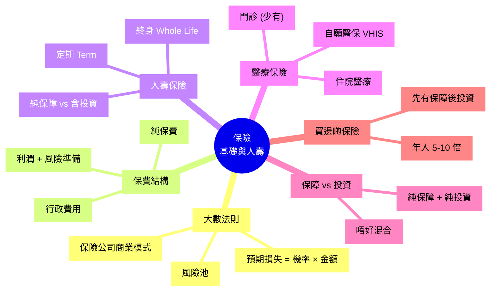

# Module 23: 保險(上)

Est. study time: 1h
Language: yue
Description: 保險核心原則 (大數法則)、保費結構、Term vs Whole-of-Life、人壽保險、醫療保險、保障 vs 投資型。

## Knowledge Map



---

## Learning Objectives
- 解釋保險嘅大數法則同運作原理
- 識分保費結構 (純保費 + 費用 + 利潤)
- 區分 Term vs Whole-of-Life 人壽保險
- 明白醫療保險嘅種類 (住院/門診/VHIS)
- 識分保障型 vs 投資型保險
- 用 4 步決定需要買咩保險

---

## Real-World Example

你 30 歲, 父母 60+, 有老婆 + 1 歲 BB:
- 你係家庭唯一收入支柱
- 月入 $50,000, 家庭開支 $35,000
- 老婆冇收入 (湊 BB)
- 父母靠你供養

**問題**:
1. 你死咗 / 大病, 屋企點算?
2. 你受傷住院 3 個月, 收入歸零, 點算?
3. 父母將來醫療費, 你有幾多準備?

呢個 module 教你用保險做風險轉移, 唔好將家庭風險全部揸喺自己度。

---

## Core Content

### Section 1: 保險 = 大數法則

**核心**: 一個人嘅風險難預測, 一萬個人嘅風險可以準確估算。

```
公式: 預期損失 = 損失機率 × 損失金額

例子: 1 萬人, 1% 機會死, 死咗要賠 $1M
預期總賠 = 10,000 × 1% × $1M = $100M
平均每人 = $10,000
保費 = $10,000 + 行政 + 利潤 (e.g. $12,000)
```

**運作**:
- 健康嘅人補貼唔健康嘅人
- 短期無風險嘅人買保障
- 集中風險, 攤分成本

**商業模式**:
- 保險公司收保費
- 投資保費 (Invest Premium) 賺投資回報
- 客戶出險時賠付
- 多年投資回報係保險公司主要利潤來源

> **Cloze**: "保險嘅核心原理係 {大數法則}, 透過 {集中風險, 攤分成本} 運作。"
>
> *Answer: 大數法則、集中風險, 攤分成本*

### Section 2: 保費結構

**保費 = 純保費 + 行政費用 + 利潤 + 風險準備**

| 部分 | 佔比 | 意思 |
|---|---|---|
| 純保費 (Pure Premium) | 60-80% | 預期賠付 |
| 行政費用 (Expense Loading) | 15-25% | 核保、行政、佣金 |
| 利潤 (Profit Loading) | 5-10% | 保險公司盈利 |
| 風險準備 (Risk Margin) | 5-10% | 緩衝 buffer |

**例子** (年保費 $12,000):
- 純保費: $8,000 (預期賠付)
- 行政: $2,500
- 利潤: $1,000
- 風險: $500
- 合計: $12,000

**重要**: 第一年保費可能有 50%+ 係行政 (佣金、Setup), 後年先回到正常結構。

### Section 3: 人壽保險 (Life Insurance)

**(a) Term Life (定期壽險)**
- 純保障, 冇投資成分
- 期限: 10/20/30 年
- 賠付: 期間內死亡, 賠保額
- 期滿無賠: 保費已收, 唔退
- **便宜**: 30 歲 $1M 保額, 年保費 ~$1,500

**(b) Whole-of-Life (終身壽險)**
- 終身保障
- **含投資成分 (現金價值)**: 保費一部份投資
- 死亡必賠 (年期內)
- **貴**: 同樣 $1M 保額, 年保費 ~$30,000-50,000
- 退保可取回現金價值

**(c) 其他變種**:
- Endowment (儲蓄保): 限期 + 滿期金
- Universal Life (萬能壽險): 彈性保費
- Variable Life: 投資選項

**比較**:

| 特性 | Term | Whole Life |
|---|---|---|
| 保障期 | 限定 | 終身 |
| 投資成分 | ✗ | ✓ (現金價值) |
| 保費 | 平 (千幾蚊) | 貴 (幾萬蚊) |
| 退保現金 | ✗ | ✓ |
| 適合 | 短期需要 (湊大 BB) | 遺產規劃 / 強制儲蓄 |
| 投資回報 | N/A | 內部 IRR 通常 2-4% |

> **Cloze**: "{Term Life} 係 {純保障, 冇投資成分}, 平啲; {Whole Life} 係 {含投資成分}, 貴但有現金價值。"
>
> *Answer: Term Life、純保障, 冇投資成分、Whole Life、含投資成分*

### Section 4: 醫療保險 (Medical Insurance)

**種類**:
- **住院醫療 (Hospitalization)**: 病房、手術、雜費 (必備)
- **門診 (Outpatient)**: 診所求診 (少有, 通常附加)
- **牙科 (Dental)**: 洗牙、補牙 (少有, 自付多)
- **危疾 (Critical Illness)**: 癌症/心臟病 (一次過賠, Module 24)

**自願醫保 VHIS (Voluntary Health Insurance Scheme)**:
- 2019 年推出, 認可產品
- 標準化保單 (基本) + 彈性計劃 (高端)
- **扣稅優惠**: 保費可扣稅, 上限 $8,000/人/年
- 保證續保至 100 歲
- 涵蓋先天疾病治療 (8 歲後)
- 未知既往病史保障

**VHIS 標準計劃 vs 彈性計劃**:
| 特性 | 標準 | 彈性 |
|---|---|---|
| 保障 | 基本住院 | 較高限額 + 門診/牙科 |
| 保費 | 較平 | 較貴 |
| 扣稅 | ✓ $8,000 上限 | ✓ $8,000 上限 |
| 適合 | 預算緊 / 年輕 | 想要更全面保障 |

**自願醫保 vs 公司團體醫療**:
- 公司團體: 老闆包, 通常只限在職期間, 離職後 失效
- 自願醫保: 自己買, 終身保證續保
- **永遠自己買一份自願醫保**, 唔好依賴公司

### Section 5: 保障 vs 投資 — 分開做

**錯誤做法**: 買「儲蓄保」/「分紅保」當投資
- 內部 IRR 通常 2-4%
- 鎖定 20+ 年, 提前退保蝕晒
- 保障 + 投資混埋, 兩邊都做唔好

**正確做法**:
- 純保障 (Term + 醫療) + 純投資 (ETF / 指數)
- 投資回報預期 6-8%/年 (長期股票)
- 保障部分保費低, 投資部分靈活

**例子** (30 歲, $500,000 累積):
- **方案 A**: 全部買儲蓄保, 20 年後現金價值 $700,000 (IRR 只係 ~1.7%)
- **方案 B**: Term 壽險 $3,000/年 + 投資 ETF $400,000
  - Term 保費 20 年 = $60,000
  - ETF 投資 20 年, 7%/年 = $1.5M
  - 累計 $1.5M + $1M 人壽保障 (如果期間死)

明顯 B 方案更佳。

> **Spot the Mistake**: 「我買咗 10 份儲蓄保 (年繳 $50,000), 有 10 個人壽保障 + 儲蓄, 一舉兩得。」
>
> 邊度錯?
>
> *Answer: 兩件事都做唔好。(1) 儲蓄保內部 IRR 2-4%, 蝕緊 (低過 ETF 7-8%)。(2) 保障部分成本高, 唔係最平嘅 Term。(3) 鎖定 20+ 年, 唔靈活。正解: 純 Term ($1,000/年) + 純 ETF 投資 ($49,000/年), 投資回報高 + 保障平。*

### Section 6: 4 步決定買咩保險

**Step 1: 風險評估**
- 邊個死咗 / 大病會影響家庭?
- 邊個係主要收入支柱?
- 邊個依靠你供養 (老婆/仔女/父母)?

**Step 2: 計算需要**
- 收入: 年入 $600,000
- 家庭開支: $400,000
- 撫養年期: BB 18 歲, 即 18 年
- 需要: $400,000 × 18 + 通脹 + 應急 = ~$10M

**Step 3: 已有保障**
- 公司團體壽險: $1M
- 公司醫療: ✓
- 個人儲蓄: $500,000
- MPF: $300,000

**Step 4: 缺口**
- 壽險: $10M 需要 - $1M 公司 - $500k 儲蓄 = $8.5M (買 Term)
- 醫療: 公司有, 仍要自願醫保打底
- 危疾: 視乎需要 (Module 24)

**原則**: **先大人後小孩, 先保障後投資, 先急後緩**。

> **Think**: 你 30 歲, 公司提供 $1M Term 壽險 (在職期間)。要唔要自己再買 Term 壽險 $5M?
>
> *Answer: 要。3 個原因。(1) 公司 Term 限在職, 失業/轉工即失效。(2) $1M 對家庭 $400k 年開支, 只撐 2.5 年。(3) 自己買 Term $5M, 年保費 $2,000-3,000, 終身可續 (新公司 + 個人保)。即使轉工都唔會斷。*

> **Predict**: 儲蓄保 + ETF 20 年後, 邊個累積多啲? 假設每年供 $50,000, 儲蓄保 IRR 3%, ETF 7%。
>
> *Answer: 儲蓄保 20 年 = $50k × [(1.03²⁰ - 1) / 0.03] = $1.34M。ETF 20 年 = $50k × [(1.07²⁰ - 1) / 0.07] = $2.05M。差距約 $0.71M, ETF 贏約 53%。儲蓄保仲要鎖定, 提前退保蝕晒。*

---

### Why This Matters

保險唔係投資, 係**風險轉移**。識用:
- 保障家庭 (壽險、醫療)
- 避開錯誤 (儲蓄保當投資)
- 識分純保障 + 純投資

---

## Key Takeaways
- 保險 = 大數法則, 集中風險, 攤分成本
- 保費 = 純保費 + 行政 + 利潤 + 風險
- Term 平, 純保障; Whole Life 貴, 含投資
- 醫療必備, 自願醫保 VHIS 扣稅 $8,000
- 永遠自己買醫保, 唔好依賴公司
- 保障 vs 投資分開做, 唔好混喺儲蓄保
- 4 步: 風險評估 → 計算需要 → 已有保障 → 缺口

---

## Common Misconception

**「儲蓄保有投資成分, 又有人壽保障, 比買 ETF 化算。」**

錯。儲蓄保內部 IRR 通常 2-4%, ETF 長期 7-8%。壽險部分 (Term) 一年幾千蚊, 儲蓄保壽險部分成本高幾倍。兩件事分開做, 加埋平過儲蓄保。

---

## Spot the Mistake

「我 30 歲, 月入 $40,000, 有老婆 + BB。公司提供醫療, 我冇買任何個人保險。」

邊度錯?

*Answer: 3 個錯。(1) 醫療: 公司醫療只限在職, 失業/轉工就冇。要自願醫保 VHIS 終身保證續保, $5,000-8,000/年。(2) 壽險: 你係家庭支柱, 死咗屋企冇收入。應該買 Term 壽險 $5M, 年保費 ~$2,000。(3) 危疾: 大病收入歸零, 應考慮危疾保險 (Module 24)。最平起步: 自願醫保 + Term 壽險 = 年 $10,000, 基本保障已備。*

---

## Feynman Explain

(用一個 10 歲都明嘅故事解釋「保險 = 大家夾錢幫不幸嘅人」: 從「100 個同學, 1 個可能跌斷手要 $1萬醫藥費, 每人夾 $100」講起, 講到「保險就係咁, 保費係預期損失分攤」。)

---

## Reframe

(試下諗: 你而家買咗咩保險? 公司提供咩? 你屋企如果主要收入支柱死咗 / 大病, 儲蓄夠撐幾耐? 寫低你嘅保障狀況, 再諗下邊啲要加。)

---

## Drill
Take the quiz. MCQs test different angles — recall, application, scenario.

Run: `learn.sh quiz finance-basics-cantonese 23`
Run: `learn.sh cloze finance-basics-cantonese 23`
