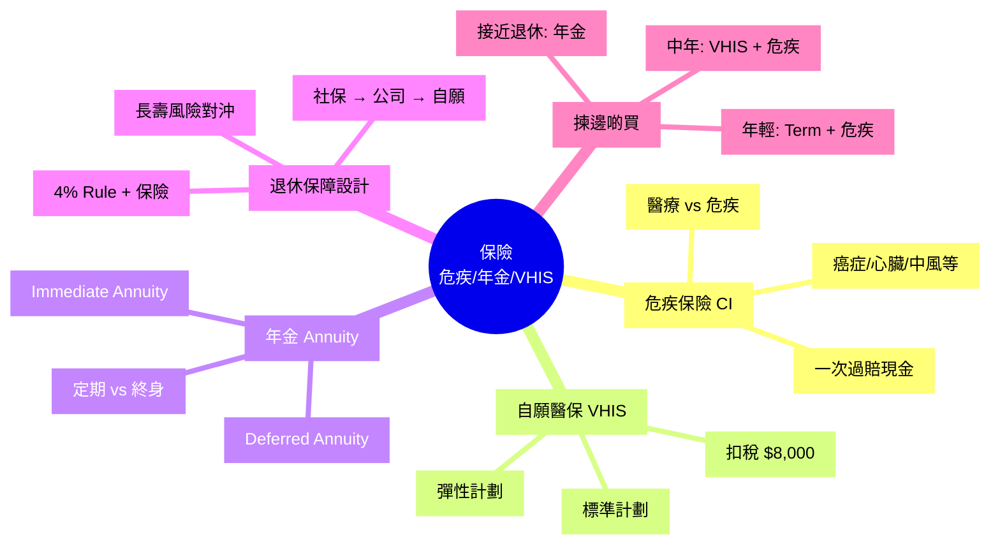

# Module 24: 保險(下)

Est. study time: 1h
Language: yue
Description: 危疾保險 (Critical Illness)、年金 (Annuity)、自願醫保 VHIS 深入、年金 vs 4% Rule、退休保障設計。

## Knowledge Map



---

## Learning Objectives
- 區分危疾保險 vs 醫療保險嘅功能
- 解釋自願醫保 VHIS 嘅標準 vs 彈性計劃
- 計算年金嘅內部回報率
- 用 4% Rule + 保險設計退休組合
- 識揀年紀對應嘅保險組合

---

## Real-World Example

你 35 歲, 健康, 月入 $80,000:
- 公司有團體醫療 (在職)
- 老婆 + 1 歲 BB
- 供緊 MPF $36,000/年
- 有 $1M 應急錢 + $2M 投資組合

**問題**:
1. 如果你癌症確診, 醫療 + 收入歸零, 點算?
2. 65 歲退休, 活到 95 歲, 點確保最後 30 年有錢?
3. 應該買咩保險?

呢個 module 教你識危疾 + 年金 + VHIS, 設計完整保障。

---

## Core Content

### Section 1: 危疾保險 (Critical Illness)

**核心功能**: 確診指定危疾, **一次過賠現金** (唔係實報實銷)。

**涵蓋疾病** (典型 50-100 種):
- 癌症
- 心臟病 (心肌梗塞)
- 中風
- 冠狀動脈搭橋手術
- 腎衰竭
- 主要器官移植
- 失明、失聰、燒傷
- 柏金遜症、阿茲海默症

**賠付方式**:
- **一筆過現金**: $1M-$3M (視乎保額)
- 受保人自由使用 (醫療、收入補償、家庭開支)

**vs 醫療保險**:

| 特性 | 醫療保險 | 危疾保險 |
|---|---|---|
| 賠付方式 | 實報實銷 (醫院單據) | 一筆過現金 |
| 涵蓋 | 所有疾病 (住院/手術) | 指定危疾 (癌症/心臟病) |
| 用於 | 醫療費用 | 收入補償 + 任何用途 |
| 必要性 | 必需 | 視乎需要 |

**例子** (癌症):
- 醫療保險: 賠住院 + 手術 + 化療費用 (實報實銷)
- 危疾保險: 確診癌症, 一次過賠 $1M
  - 醫療保險已賠部分用嚟做治療
  - 剩 $500k 用嚟做收入補償 (治療期 6-12 個月無收入)

> **Cloze**: "危疾保險賠付方式係 {一次過現金}, 唔係 {實報實銷}, 用於 {收入補償 + 醫療 + 任何用途}。"
>
> *Answer: 一次過現金、實報實銷、收入補償 + 醫療 + 任何用途*

### Section 2: 危疾保額計算

**考慮因素**:
- 治療期 (癌症 6-12 個月, 心臟病 3-6 個月)
- 收入補償
- 家庭開支 (撫養)
- 醫療自付 (醫保有自負額)

**公式** (簡化):
```
保額 = 治療期月數 × 月收入 + 醫療自付 + 應急

例子: 12 個月 × $80,000 + $200,000 + $300,000 = $1.46M
```

**保費** (30 歲, $1M 保額, 20 年期):
- 男性: ~$6,000-10,000/年
- 女性: ~$5,000-8,000/年 (女性癌症較平)

**吸煙 / 肥胖 / 家族病史**: 加 30-100% 保費

### Section 3: 自願醫保 VHIS 深入

**兩類計劃對比**:

| 特性 | 標準計劃 | 彈性計劃 |
|---|---|---|
| 每年保障額 | $420,000 (病房膳食) | 高至 $5M+ |
| 終身保障額 | 無限 (保證續保) | 無限 |
| 自願醫保扣稅 | ✓ $8,000/人/年 | ✓ $8,000/人/年 |
| 病房類型 | 普通房 | 半私家 / 私家 |
| 額外保障 | 基本 | 門診、牙科、視力 |
| 保費 (30 歲) | $3,000-5,000/年 | $8,000-30,000/年 |

**已知投保時未察覺疾病**: 標準計劃保險前未知疾病, 投保後第 31 日起先全數賠償 (等候期)。**先天的投保時未察覺疾病**: 8 歲後全數賠償。

**VHIS vs 公司團體醫療**:
- 公司團體: 包到離開, 唔包終身
- VHIS: 終身保證續保, 永遠自己一份

> **Cloze**: "自願醫保 VHIS 扣稅上限 {$8,000/人/年}, {保證續保至 100 歲}。"
>
> *Answer: $8,000/人/年、保證續保至 100 歲*

### Section 4: 年金 (Annuity)

**核心**: 畀一次過大筆錢 (或分期), 保險公司每月/每年派錢, 直到**期滿或終身**。

**種類**:
- **Immediate Annuity (立即年金)**: 一次過畀, 立即開始派
- **Deferred Annuity (延期年金)**: 先供若干年 (5/10/20), 期滿開始派
- **Term Annuity (定期年金)**: 派 10/20 年, 期滿停
- **Life Annuity (終身年金)**: 派到你死 (對沖長壽風險)

**例子** (60 歲, 一次過 $1M, 終身年金):
- 內部回報率 (IRR) ~3-4%
- 每月派 $4,000-5,000 (預期壽命 85 歲)
- 越長命, 越化算 (保險公司蝕)
- 短命 (<75 歲), 蝕底

**vs 4% Rule** (Module 26):
- 4% Rule: 自己投資 $1M, 每年提 $40k, 靈活但要管理
- 終身年金: 保險公司派, 唔使管理, 唔使擔心長壽

**長壽風險對沖**:
- 香港人平均壽命 ~85 歲
- 如果你活到 100 歲, 投資組合可能要面臨最後 15 年資金耗盡
- 終身年金解決呢個問題

> **Spot the Mistake**: 「我 60 歲有 $5M, 全部買終身年金, 每月派 $25k, 退休無憂。」
>
> 邊度錯?
>
> *Answer: 過度保守。終身年金 IRR 只有 3-4%, 蝕緊 (跑輸通脹 + 失去投資機會)。應該: $2M 買終身年金 (基本生活費) + $3M 繼續投資 (增長, 應急)。分散風險, 唔好全 lock 喺年金。*

### Section 5: 退休保障 4 層

**第 1 層: 強制性 (政府)**
- 強積金 MPF (僱主 5% + 僱員 5%)
- 65 歲提取
- 預期累積: $1-3M (視乎年期 + 收入)

**第 2 層: 公司保障**
- 公司團體醫療
- 公司年金 / 公積金 (少有)
- 離職 / 退休後失效

**第 3 層: 自願性 (自己)**
- 自願醫保 VHIS (終身)
- 個人投資組合 (ETF / 股票)
- 個人儲蓄
- 自願性 MPF 供款 TVC

**第 4 層: 終身年金 (對沖長壽)**
- 60-65 歲購買
- 一次過大筆, 終身派
- 對沖長壽風險

**例子** (60 歲退休):
- MPF: $2M (提一次過或保留)
- 自願醫保: $0/年 (VHIS 終身)
- 投資組合: $5M (4% Rule 提 $200k/年)
- 終身年金: $1M (每月 $5k 基本生活費)
- **總收入: 投資 $200k + 年金 $60k = $260k/年**, 足夠退休

### Section 6: 揀邊啲保險 (按年紀)

| 年紀 | 優先 | 原因 |
|---|---|---|
| 20-30 歲 | Term 壽險 + 危疾 (平) | 起步, 健康保費最低 |
| 30-40 歲 | + 自願醫保 VHIS | 家庭開始, 醫療打底 |
| 40-50 歲 | 危疾加大保額 + VHIS | 家庭負擔重, 保障加碼 |
| 50-60 歲 | 危疾續保 + 開始諗年金 | 接近退休, 對沖長壽 |
| 60+ 歲 | 終身年金 + 保留 VHIS | 退休執行, 鎖定收入 |

**終身人壽 (Whole Life) 適合邊個?**:
- 高資產 (>$10M) 想做遺產規劃
- 想強制儲蓄 (紀律差嘅人)
- 信託架構入面嘅資產保護

**一般人**: Term + 投資, 唔好 Whole Life。

> **Think**: 你 35 歲買危疾 $1M, 年保費 $8,000 (20 年期), 即總保費 $160,000。如果 20 年內冇事, 保費已收, 唔退。值唔值得?
>
> *Answer: 視乎你點睇「保障」。(1) 20 年內患癌症/心臟病, 賠 $1M 救命 + 收入補償 → 抵。(2) 20 年冇事, 蝕 $160,000 → 但你買嘅係「保障」, 唔係「投資」, 等同買咗個保險。(3) 比起儲蓄保 IRR 2-4%, 危疾 20 年期純保障成本合理。重點: 唔好將危疾當投資, 當保險就 OK。*

> **Predict**: 60 歲退休, $5M 投資組合, 應該買幾多終身年金?
>
> *Answer: 視乎生活費 + 長壽預期。(1) 假設月基本生活費 $30,000 = 年 $360,000, 用年金對沖 $360k → 買 ~$1.5M 終身年金 (每月派 $6-7k)。(2) 其餘 $3.5M 投資, 4% Rule 提 $140k/年。(3) 合計年收入 = $360k (年金) + $140k (投資) = $500k, 加 MPF 一次性提取 ~$2M。(4) 結論: 唔好全 lock 喺年金, 留 60-70% 投資保持靈活 + 增長。*

---

### Why This Matters

識用危疾 + 年金 + VHIS:
- 保障大病 (癌症/心臟病)
- 對沖長壽風險
- 退休組合穩定

---

## Key Takeaways
- 危疾保險 = 一次過現金, 對應大病收入歸零
- 自願醫保 VHIS = 終身保證續保 + 扣稅
- 年金 = 對沖長壽風險, IRR 3-4%
- 退休 4 層: MPF + 公司 + 自願 + 年金
- 按年紀揀保險: 年輕 Term, 中年加 VHIS + 危疾, 退休加年金
- 終身年金唔好全買, 部分對沖

---

## Common Misconception

**「買儲蓄保當退休年金」**

錯。儲蓄保 IRR 2-4%, 鎖定 20+ 年。退休前 5-10 年先考慮年金, 用終身年金對沖長壽。儲蓄保 + 投資分開做, 唔好混。

---

## Spot the Mistake

「我 50 歲, 有 $3M 投資組合, 想退休。我即刻買 $2M 終身年金 + 保留 $1M 投資。」

邊度錯?

*Answer: 退休年紀太早 (50 歲), 預期仲有 30-40 年命。(1) 終身年金 IRR 3-4% 蝕緊 (通脹 + 失去投資機會)。(2) $2M 鎖死, 失去靈活度 (應急、傳承)。(3) 應該: 延遲退休到 60-65 歲, 期間繼續累積, 65 歲先考慮買部分年金 (e.g. $1M 對沖長壽基本生活費, 其餘 $2M 投資 4% Rule 提 $80k/年)。*

---

## Feynman Explain

(用一個 10 歲都明嘅故事解釋「年金 = 食長糧」: 從「你儲咗 $100 萬, 食到老」講起, 講到「保險公司幫你管理, 每月派錢, 唔使擔心活到 100 歲冇錢」。)

---

## Reframe

(試下諗: 你而家買咗危疾未? VHIS 未? 接近退休先考慮年金? 寫低你嘅保險狀況, 再諗下按年紀加咩。)

---

## Drill
Take the quiz. MCQs test different angles — recall, application, scenario.

Run: `learn.sh quiz finance-basics-cantonese 24`
Run: `learn.sh cloze finance-basics-cantonese 24`
