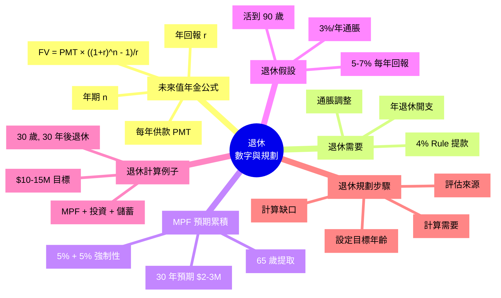

# Module 25: 退休(上): 數字同 Annuity

Est. study time: 1h
Language: yue
Description: 退休數字 (Future Value Annuity)、通脹調整、4% Rule、MPF 預期累積、退休需要計算。

## Knowledge Map



---

## Learning Objectives
- 用 Future Value Annuity 公式計算累積金額
- 估算退休需要 (年開支 + 通脹 + 壽命)
- 解釋 4% Rule 嘅原理同假設
- 計算 MPF 預期累積金額
- 設定退休目標年齡同計算缺口

---

## Real-World Example

你 30 歲, 月入 $50,000, 想 65 歲退休, 預期活到 90 歲:
- 家庭年開支: $400,000
- 通脹: 3%/年
- MPF: 強制性 5% + 5%, 預期回報 5%/年
- 投資: 7%/年 (股票 ETF)

**問題**:
1. 65 歲時需要幾多錢?
2. MPF 會累積幾多?
3. 投資要再儲幾多?
4. 退休後每月可提幾多?

呢個 module 教識你用數字回答呢啲問題, 唔靠估。

---

## Core Content

### Section 1: Future Value Annuity (未來值年金)

**核心公式**:
```
FV = PMT × [(1+r)ⁿ - 1] / r

PMT = 每年供款
r   = 年回報率
n   = 年期
```

**PMT 例子**: 月供 $10,000 = 年供 $120,000

**3 個回報率比較** (年供 $120,000, 30 年):

| 回報率 | 終值 |
|---|---|
| 3% (保守) | $5.7M |
| 5% (MPF 平均) | $7.97M |
| 7% (股票長期) | $11.3M |
| 10% (進取) | $19.7M |

**公式計算法 (5% 回報)**:
```
FV = 120,000 × [(1.05)³⁰ - 1] / 0.05
   = 120,000 × [4.322 - 1] / 0.05
   = 120,000 × 66.44
   = $7.97M
```

**Excel**: `=FV(0.05, 30, -120000)` (注意 sign)

> **Cloze**: "Future Value Annuity 公式: {FV = PMT × [(1+r)ⁿ - 1] / r}, 計 {未來累積金額}。"
>
> *Answer: FV = PMT × [(1+r)ⁿ - 1] / r、未來累積金額*

### Section 2: 退休需要點計

**Step 1: 估算退休時年開支**
- 而家年開支: $400,000
- 退休時通脹: 35 年後, 3%/年, 通脹因子 (1.03)³⁵ = 2.81
- **退休時年開支**: $400,000 × 2.81 = $1,124,000/年

**Step 2: 估算退休年期**
- 65 歲退休, 預期活到 90 歲 = **25 年**

**Step 3: 計算總需要 (用 4% Rule)**
- 4% Rule: 第一年提 4%, 之後按通脹加
- **總需要** = $1,124,000 / 4% = $28.1M
- 4% Rule 假設 50/50 股債, 30 年提取成功率高 (Trinity Study)

**Step 4: 通脹後 25 年提取 (簡化)**
- 4% Rule 細節: 第 1 年提 $1,124,000, 第 2 年提 $1,158,000 (+3%), ... 第 25 年提 $2,255,000
- 25 年總提取 = ~$40M
- 4% Rule 自動平衡, 唔使每點計

### Section 3: MPF 預期累積

**假設**:
- 30 歲, 月入 $50,000 (有關入息)
- MPF 強制: 5% + 5%, 即僱員 $1,500/月 + 僱主 $1,500/月 (月薪 5% = $2,500, 爆上限 $1,500/月 各)
- 供到 65 歲 = 35 年
- 預期回報 5%/年 (混合基金平均)

**計算** (僱主 + 僱員都係你嘅錢, 兩邊都計):
```
每年供款: $1,500 × 2 × 12 = $36,000 (僱主 + 僱員)
FV = 36,000 × [(1.05)³⁵ - 1] / 0.05
   = 36,000 × [5.516 - 1] / 0.05
   = 36,000 × 90.32
   = $3,251,531
```

**即係**: 35 年後 MPF 約 **$3.25M** (僱主 + 僱員合計, 假設 5% 回報)。如果只計僱員部分 ($18,000/年), 就係約 $1.6M — 唔好漏咗僱主嗰份, 嗰啲都係你嘅退休錢。

**MPF 提取**:
- 65 歲提取 (一次過或分期)
- 提取時**免稅**
- 一般用作退休一部分, 唔係全部

**限制**:
- 提取年齡 65 歲
- 提早提取罰款
- 投資選擇有限 (保守者選保證基金蝕底)

> **Cloze**: "MPF 35 年強制供款 (僱主 + 僱員 $36,000/年), 5% 回報, 預期累積 ~{$3.25M}。"
>
> *Answer: $1.6M*

### Section 4: 4% Rule 詳細

**1998 年 Trinity Study** 發現:
- 60/40 股債組合 (60% 股票 + 40% 債券)
- 第一年提 4%, 之後按通脹加
- 30 年提取成功率 95%+
- 條件: 30 年時間橫, 股票回報 ≥ 通脹

**例子** ($10M 組合):
- 第 1 年: 提 $400,000
- 第 2 年: 提 $400,000 × 1.03 = $412,000
- 第 3 年: 提 $412,000 × 1.03 = $424,360
- ... 30 年累計提取 ~$20M
- 終值: 剩 $5-10M (視乎回報)

**限制**:
- 假設 30 年提取, 超過要小心
- 香港股票長期回報可能低過美股
- 4% 太樂觀? 3% 更安全
- 通脹急升 (e.g. 2022) 會令實際購買力跌

**4% vs 3% vs 3.5%**:
- 4% 標準, 95% 成功率
- 3% 保守, 99% 成功率
- 3.5% 中間

### Section 5: 退休計算實例

**30 歲, 月入 $50,000, 65 歲退休, 預期活到 90 歲**

**Step 1: 退休需要**
- 退休時年開支: $1,124,000 (通脹調整)
- 4% Rule 總需要: $1,124,000 / 4% = **$28.1M**

**Step 2: MPF 預期**
- 35 年強制供款 (僱主 + 僱員 $36,000/年): $3.25M
- 提取免稅, 補貼退休

**Step 3: 投資組合累積**
- 月投 $15,000 (年 $180,000), 7% 回報, 35 年
- FV = 180,000 × [(1.07)³⁵ - 1] / 0.07 = 180,000 × 138.24 = $24.9M

**Step 4: 個人儲蓄**
- 月儲 $5,000, 2% 利息, 35 年
- FV ≈ $3.0M

**Step 5: 退休時總資產**
- MPF: $3.25M
- 投資: $24.9M
- 儲蓄: $3.0M
- **合計: $31.1M**

**Step 6: 對比需要**
- 需要: $28.1M
- 有: $31.1M
- **盈餘: ~$3.0M ✓** (有錢剩)

**結論**: 月投 $15,000 + 儲蓄 $5,000, 35 年後足夠退休。

### Section 6: 常見退休規劃錯誤

1. **低估通脹**: 用今日開支計, 唔通脹調整
2. **高估回報**: 假設 10% 永遠 (現實 7% 較合理)
3. **短視年期**: 假設 65-80 歲 (15 年), 忽略長壽風險
4. **忽略醫療**: 65 歲後醫療開支可能 +5%/年
5. **過早退休**: 50 歲退休, 35 年提取, 風險高
6. **無應急錢**: 退休組合 100% 投資, 跌市被迫賣

> **Think**: 4% Rule 假設 30 年提取, 但你可能活到 95 歲 (35 年)。會唔會有問題?
>
> *Answer: Trinity Study 30 年 95% 成功率, 35 年降至 80-85%。長壽風險 (longevity risk) 即係: 投資組合要撐到你死為止, 唔係固定 30 年。應該: (a) 留 5-10% buffer, (b) 配終身年金對沖長壽 (Module 24), (c) 退休後持續留意組合, 唔好坐視不理。*

> **Predict**: 你 30 歲, 65 歲退休, 預期活到 90 歲。$1.124M 年開支需要 $28M 本金。如果 MPF 提 $1.6M, 投資要有幾多先夠?
>
> *Answer: 投資需要 = $28.1M - $3.25M (MPF, 僱主 + 僱員) = $24.85M。35 年投資, 月投 $X, 7% 回報: $X × 12 × [(1.07)³⁵ - 1] / 0.07 = $24.85M → $X ≈ $15,000/月。如果月投 $15,000, 啱啱好足夠 (終值 $24.9M)。*

> **Spot the Mistake**: 「我 50 歲儲咗 $5M, 夠啦, 退休! 每月提 $20k 用 20 年, 點都夠。」
>
> 邊度錯?
>
> *Answer: 3 個錯。(1) 通脹 3%/年, 20 年後 $20k 購買力 = $20k / 1.03²⁰ ≈ $11k。(2) 預期壽命 85+, 20 年後仍要錢。(3) 4% Rule: $5M × 4% = $200k/年 = $16,670/月, 已好緊張。應該延遲退休 / 加大儲蓄 / 縮減開支。50 歲退休太早, 至少 60 歲。*

---

### Why This Matters

識計數, 退休規劃由「靠感覺」變「靠數字」。你會知道:
- 每月要儲幾多
- 投資回報要幾多
- 退休要幾耐
- 會唔會夠

---

## Key Takeaways
- FV = PMT × [(1+r)ⁿ - 1] / r 計累積
- 退休需要: 今日開支 × 通脹因子 / 4% Rule
- MPF 35 年強制供款 (僱主 + 僱員) 預期 ~$3.25M (5% 回報)
- 4% Rule: 第一年提 4%, 之後按通脹加
- 30 歲起, 月投 $15k + 儲 $5k, 35 年後 $31M
- 退休錯誤: 低估通脹 + 高估回報 + 短視年期
- 50 歲退休太早, 至少 60 歲

---

## Common Misconception

**「我而家儲到 $5M 就夠退休」**

未必。要睇 (1) 通脹後 25-30 年要幾多, (2) 4% Rule 提取可唔可以持續, (3) 退休年期。$5M / 4% = $200k/年, 通脹 3% 30 年後 = $200k / 1.03³⁰ ≈ $82k 購買力, 緊張。

---

## Spot the Mistake

「我而家 40 歲, 有 $2M 投資 + $800k MPF, 應該 50 歲退休。」

邊度錯?

*Answer: (1) $2M 投資 4% Rule = $80k/年, 不足夠生活費。(2) MPF 仲有 25 年先至 65 歲, 未拎得。(3) 應該延遲退休到 60 歲, 期間加大儲蓄。或者退休後繼續兼職, 補貼收入。10 年差距 (50 vs 60) 對退休可持續性影響巨大。*

---

## Feynman Explain

(用一個 10 歲都明嘅故事解釋「複利 + 通脹」: 從「你儲錢 30 年, 每年加 $120k, 5% 回報, 變 $8M」講起, 講到「但通脹令錢越嚟越唔值錢, 要通脹調整先知真正購買力」。)

---

## Reframe

(試下計: 你而家儲蓄 / 投資每月幾多? 用 FV 公式計到 65 歲有幾多。對比 Module 25 Step 5 嘅需要, 寫低你嘅退休計劃 + 缺口。)

---

## Drill
Take the quiz. MCQs test different angles — recall, application, scenario.

Run: `learn.sh quiz finance-basics-cantonese 25`
Run: `learn.sh cloze finance-basics-cantonese 25`
