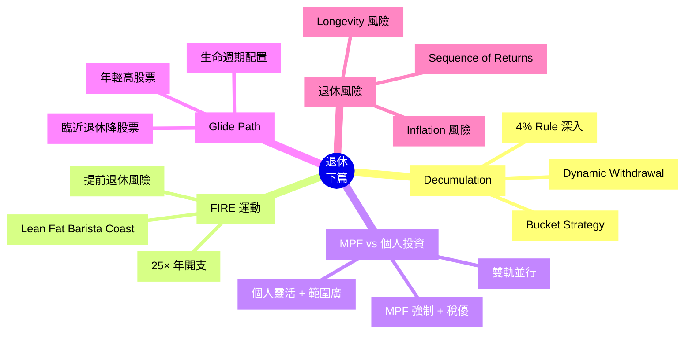

# Module 26: 退休(下)

Est. study time: 1h
Language: yue
Description: 4% Rule 深入、FIRE 概念、MPF vs 個人投資、Decumulation 提取策略、Glide Path 動態配置

## Knowledge Map

---

## Learning Objectives
- 4% Rule 深入: Trinity Study 成功率 vs 提取率
- 識別 4 種 FIRE 變體
- 比較 MPF 同個人投資嘅取捨
- 設計 Glide Path 動態配置
- 預防 3 大退休風險 (長壽 / 序列 / 通脹)

---

## Real-World Example

你 50 歲, 1,000 萬儲蓄, 65 歲退休, 預期活到 90 歲, 年開支 40 萬。

**4% Rule 計**: 1,000 萬 × 4% = 40 萬/年 ✓

但現實 2008 金融海嘯你 65 歲, 1000 萬 → 600 萬 (-40%), 4% = 24 萬, 唔夠生活。

**Sequence of Returns Risk**: 退休頭 5 年市場大跌, 終身提款都受影響。

呢個 module 教識你避開呢啲陷阱。

---

## Core Content

### Section 1: 4% Rule 深入

**Trinity Study 結果** (4% 提取率, 30 年期):

| 股票 % | 債券 % | 30 年成功率 |
|---|---|---|
| 100% 股 | 0% | 85% |
| 75% 股 | 25% 債 | 90% |
| 50% 股 | 50% 債 | 95% |
| 25% 股 | 75% 債 | 90% |
| 0% 股 | 100% 債 | 65% |

**結論**:
- 4% 提取率 + 50/50 股債 → 95% 成功率 (30 年)
- 5% 提取率 → 80% 成功率
- 3% 提取率 → 99% 成功率
- 100% 債券 → 唔夠通脹, 失敗率高

**現實限制**:
- 美國市場歷史, 唔等於香港
- 過去 30 年超長牛市 (債券 + 股票齊升), 退休條件特別好
- 未來 30 年可能低回報 (人口老化, 低利率)

**保守版**: 3-3.5% 提取率, 或動態調整。

> **Cloze**: "Trinity Study 顯示 4% 提取率 + 50/50 股債 30 年成功率 {95%}, 100% 債券只有 {65%}。"
>
> *Answer: 95%、65%*

### Section 2: 動態提款策略 (Dynamic Withdrawal)

**問題**: 4% Rule 假設通脹調整固定金額, 跌市時提取不變, 蝕更勁。

**改進**: 動態調整提取金額

**(a) Floor + Ceiling (下限 + 上限)**
- 提取 = 5% 過去 3 年平均組合
- 設定下限 (e.g. 3% 開支) + 上限 (e.g. 6%)
- 跌市提少啲, 升市提多啲

**(b) Guyton-Klinger Rules**
- 提取率規則: 初始 5%, 過去 30 年回報 < 0 減 10%, > 0 加 10%
- 資本消耗規則: 提取後資本 > 初始 50% 維持, < 30% 強制減
- 雙重保險

**(c) Bucket Strategy (桶子策略)**
- 桶 1 (短期, 1-3 年開支): 現金 / 短債
- 桶 2 (中期, 3-7 年): 中期債 / 均衡
- 桶 3 (長期, 7+ 年): 股票
- 跌市時由桶 3 補桶 1, 唔使賣股

> **Cloze**: "Guyton-Klinger 規則結合 {提取率規則} 同 {資本消耗規則} 雙重保險。"
>
> *Answer: 提取率規則、資本消耗規則*

### Section 3: FIRE 運動 4 種變體

**FIRE = Financial Independence, Retire Early**

**(a) Lean FIRE**
- 極簡生活, 提取率 3-4%
- 條件: 25× 極低開支
- 例: 年開支 12 萬, 需要 300 萬
- 適合: 真心享受簡樸

**(b) Fat FIRE**
- 正常生活, 提取率 3-4%
- 條件: 25× 中高開支
- 例: 年開支 60 萬, 需要 1,500 萬
- 適合: 標準退休生活

**(c) Barista FIRE**
- 半退休, 兼職蓋醫保
- 條件: 較少儲蓄 + 部分工作收入
- 例: 儲蓄 500 萬, 兼職蓋一半開支
- 適合: 想轉跑道但未完全自由

**(d) Coast FIRE**
- 儲夠一筆錢讓複利滾到退休
- 條件: 年開支 12 萬, 25 歲儲 300 萬, 之後唔使再儲
- 適合: 早起步

**現實風險**:
- 醫療通脹 (長壽 + 醫療貴)
- 政策風險 (退休制度改)
- 心理風險 (無所事事, 失去意義)

### Section 4: MPF vs 個人投資

| 特性 | MPF | 個人投資 |
|---|---|---|
| **強制性** | 5% 老闆 + 5% 員工 | 自願 |
| **稅務優惠** | 供款扣稅 (最高 $18,000) | 無 (但資本利得無稅) |
| **選擇範圍** | 20+ 核准基金 | 任何股票/ETF/債 |
| **費用** | 0.5-2% MPF 基金 | 0.03-0.5% ETF |
| **靈活性** | 65 歲前鎖住 | 隨時賣 |
| **回報** | 平均 3-5% (保守預設) | 可達 7-10% (全球 ETF) |

**雙軌並行策略**:
- MPF 放 Default Fund (低費, 唔好 active pick)
- 個人投資全球 ETF (VTI + VXUS + BND)
- 65 歲前提 MPF, 個人投資可靈活周轉

**例子**: 30 歲, 月入 $30,000
- MPF 強制: $3,000/月 (老闆 $1,500 + 員工 $1,500)
- 個人投資: 額外 $5,000/月
- TVC (可扣稅自願性): 額外 $5,000/月 (扣稅)

> **Cloze**: "MPF 供款可 {扣稅} (最高 $18,000), TVC 額外供款可 {扣稅} (最高 $60,000)。"
>
> *Answer: 扣稅、扣稅*

### Section 5: Glide Path 生命週期配置

**核心**: 隨年齡調整股債比

**傳統 Glide Path**:

| 年齡 | 股 % | 債 % |
|---|---|---|
| 25 | 90 | 10 |
| 35 | 80 | 20 |
| 45 | 70 | 30 |
| 55 | 60 | 40 |
| 65 | 50 | 50 |
| 75+ | 40 | 60 |

**理論**:
- 年輕: 高股票 (長線, 承受波動)
- 中年: 慢慢加債券 (平衡)
- 退休前: 50/50 (保護累積)
- 退休後: 偏債券 (保護提取)

**變體**:
- **Target Date Fund**: 自動按目標退休年份調整
- **Rising Equity Glide Path**: 反向, 年紀大反而更多股票 (研究顯示更佳)
- **Hybrid**: 動態 Glide Path, 按市況調整

**現實**: 唔需要每日 rebalance, 一年 1-2 次檢查就夠。

### Section 6: 3 大退休風險

**(a) Longevity Risk (長壽風險)**
- 預期壽命 90, 但可能活到 100+
- 對沖: 終身年金 (Module 24), 或 1-2% 緩衝資金

**(b) Sequence of Returns Risk (回報序列風險)**
- 退休頭 5 年大跌, 終身受影響
- 例: 1000 萬 → 600 萬, 之後升返要更長時間恢復
- 對沖: Bucket Strategy, Floor + Ceiling 動態提取

**(c) Inflation Risk (通脹風險)**
- 30 年通脹 3%, 購買力跌 60%
- 對沖: TIPS, 股票 (長線抗通脹), 動態提款

> **Spot the Mistake**: 「我 65 歲退休, 1,000 萬, 用 4% Rule 提 40 萬/年。萬事俱備。」
>
> 邊度錯?
>
> *Answer: 3 個錯。(1) 通脹調整: 4% 係首年提取, 之後要按通脹加。30 年後 40 萬實際購買力 ≈ 40 / 1.03³⁰ ≈ 16 萬, 唔夠生活。(2) 序列風險: 退休頭 5 年跌 30%, 1,000 萬變 700 萬, 4% 提 28 萬, 之後升返要 10+ 年。(3) 長壽風險: 活到 95 歲 (30 年), 4% Rule 假設剛好, 沒 buffer 應付醫療通脹或長壽。應該: (a) 動態提款, (b) 留 5-10% buffer, (c) 部分資金買終身年金, (d) 持續監察組合。*

---

### Why This Matters

退休係 30+ 年嘅事, 唔係 5 年計劃:
- 4% Rule 係起點, 唔係終點
- MPF 唔可以靠晒, 個人投資要跟
- Glide Path 動態配置, 唔好 set-and-forget
- 3 大風險要逐個對沖

---

## Key Takeaways
- 4% Rule + 50/50 → 30 年 95% 成功率
- 動態提款 (Guyton-Klinger) 抗序列風險
- FIRE 4 變體, 唔係人人都要極端
- MPF + 個人投資雙軌並行
- Glide Path 由 90/10 → 40/60 隨年齡
- 3 大退休風險: 長壽 / 序列 / 通脹

---

## Common Misconception

**「我而家 30 歲, 諗 60 歲退休, 35 年後嘅事到時先算。」**

錯。30 歲開始複利 vs 50 歲開始, 終值差 3-5 倍。提早 20 年準備 vs 遲 20 年, 唔係雙倍, 可能 5 倍。Module 25 嘅 FV 公式: $15K/月 7% 35 年 = $28M, 遲 10 年開始 (25 年) = $11M, 蝕 $17M。**時間係最珍貴嘅資產, 唔可以等到「有錢先開始」。**

---

## Spot the Mistake

「我 MPF 揀咗個高回報基金 (5 年跑贏同類), 同時個人投資 ETF。雙軌好安心。」

邊度錯?

*Answer: 兩個錯。(1) MPF 過去 5 年跑贏唔等於未來, 5 年樣本太細, 揀 MPF 應該睇 Expense Ratio 同 Default Fund (低費), 唔係揀明星基金。(2) MPF 同個人投資應該互補, 唔係重疊。如果 MPF 已經 60% 股 (港股 + 環球), 個人 ETF 應該唔好再加 60% 股 (會成 80%+ 港股相關)。應該按 Glide Path 整體計算, 唔好分開睇。*

---

## Feynman Explain

(用一個 10 歲都明嘅故事解釋「退休 = 食老本」: 從「你有 100 粒糖, 每日食 1 粒, 100 日食晒」講起, 講到「如果你想食 30 年, 就要儲 11,000 粒 + 投資滾大 + 動態調整」。)

---

## Reframe

(試下諗: 你而家 MPF 揀咗邊個基金? Expense Ratio 幾多? 同 Default Fund 比? 你嘅 MPF 同個人投資加埋, 整體股債比例係點? 寫低你嘅諗法, 再諗下應唔應該 rebalance。)

> **Think**: 4% Rule 提取 30 年 95% 成功, 但如果你 65 歲退休遇上 2008 跌 40%, 之後 5 年都唔反彈, 點算?
>
> *Answer: 序列風險 real-world example。1,000 萬 → 600 萬, 4% 提 24 萬 (原 40 萬), 購買力已經跌 40%。如果 5 年後只反彈到 700 萬, 永久錯失 30% 本金。對沖: (a) Guyton-Klinger 動態提款 (跌市提更少), (b) Bucket 桶子 (有短中期現金緩衝), (c) 5-10% buffer 喺現金, 唔好 100% 投資。*

> **Predict**: 假設 4% Rule 失敗, 你嘅 1,000 萬 25 年後跌到 200 萬, 點應對?
>
> *Answer: (1) 暫停提取 1-2 年, 讓組合恢復; (2) 削減開支 20-30% (由 40 萬 → 28 萬); (3) 兼職補貼 (Barista FIRE); (4) 賣資產 (屋, 保險現金值); (5) 申請長者生活津貼 (香港). 提早 5-10 年 rebalance 90/10 → 50/50 可以避免。*

---

## Drill
Take the quiz. MCQs test different angles — recall, application, scenario.

Run: `learn.sh quiz finance-basics-cantonese 26`
Run: `learn.sh cloze finance-basics-cantonese 26`
