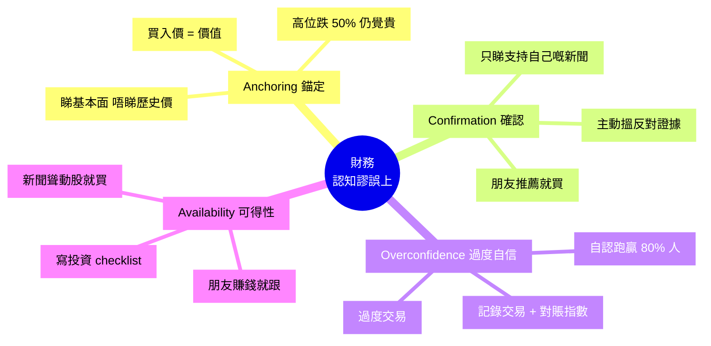

# Module 27: 常見財務謬誤(上): 認知 Bias

Est. study time: 1h
Language: yue
Description: 4 大認知 Bias: Anchoring、Confirmation Bias、Overconfidence、Availability。點樣影響投資決策, 點避開。

## Knowledge Map

---

## Learning Objectives
- 識別 4 大認知 Bias 對投資決策嘅影響
- 用具體例子說明每個 Bias
- 實踐避免 Bias 嘅具體方法
- 記錄自己投資決策, 對賬指數

---

## Real-World Example

你 2020 年買咗隻科技股 $200, 2022 年跌到 $100, 你覺得「等返家鄉 ($200) 至賣」。

朋友推薦另一隻 AI 股, 你買咗, 跌 30%, 你再加碼 (平均低), 結果再跌 50%。

你 2023 年睇新聞 Bitcoin 升 3 倍, FOMO 入市, 結果接刀。

**呢啲全部都係 Bias 影響嘅例子**。Module 27 教識你辨識同避開。

---

## Core Content

### Section 1: Anchoring (錨定效應)

**定義**: 過度依賴第一個信息 (錨點), 後續判斷被呢個錨點影響。

**投資例子**:
- **買入價錨定**: 股票 $50 買入, 跌到 $30 仍覺「平」 (因為錨住 $50)
- **歷史高位錨定**: TSLA 高位 $400, 跌到 $200 仍覺「貴」 (因為錨住 $400)
- **目標價錨定**: 朋友話「呢隻會上 $100」, 你喺 $80 等, 結果跌到 $60

**研究** (Tversky & Kahneman 1974):
- 轉盤隨機轉到 65, 問「非洲國家喺聯合國佔幾多 %」
- 轉到 10 嘅組: 平均估 25%
- 轉到 65 嘅組: 平均估 45%
- 純粹隨機數字影響判斷

**避開方法**:
1. **睇基本面, 唔睇歷史價**: 問「呢間公司值幾多」, 唔問「之前幾多」
2. **重新分析**: 每次決策由零開始, 唔好「之前咁決定, 所以依家都」
3. **寫投資 thesis**: 買入前寫低原因, 跌 30% 時重新睇 thesis, 唔好因為「已經跌」就 hold

> **Cloze**: "Anchoring 效應指 {過度依賴第一個信息, 後續判斷被呢個錨點影響}, 例如 {買入價錨定, 跌咗仍覺平}。"
>
> *Answer: 過度依賴第一個信息, 後續判斷被呢個錨點影響、買入價錨定, 跌咗仍覺平*

### Section 2: Confirmation Bias (確認偏誤)

**定義**: 傾向搵支持自己睇法嘅證據, 忽略反對證據。

**投資例子**:
- 你覺得科技股會升 → 只睇利好新聞, 忽略利淡
- 朋友推薦股 → 你只睇支持訊息, 唔睇公司財報弱點
- 買咗之後跌 → 搵文章話「長期持有無事」, 唔睇「應該止蝕」

**社交媒體放大**:
- Facebook/Twitter 演算法推你睇過嘅相似內容
- 訂閱同溫層 KOL
- 結果: 永遠只睇到一個角度

**避開方法**:
1. **主動搵反對證據**: 買入前 google「[股名] 風險」, 唔好淨搜「[股名] 看好」
2. **預先定下止蝕/再平衡規則**: 跌 X% 就沽, 唔好因為「睇好」就 hold
3. **找 Devil's Advocate**: 朋友扮反方, 強迫自己聽反對理由
4. **讀取多角度來源**: 華爾街 + 反華爾街, 唔好單一 KOL

> **Spot the Mistake**: 「我覺得 Bitcoin 會上 $100K, 我只睇 Twitter 加密幣 KOL, 因為佢哋都同意我。」
>
> 邊度錯?
>
> *Answer: Confirmation Bias。KOL 為咗 engagement + 你 follow 咗同溫層, 自然強化你嘅睇法。應該 (a) 主動 follow 反對 BTC 嘅經濟學家 (e.g. Nouriel Roubini), (b) 睇 BTC 失敗嘅 case studies, (c) 寫低自己嘅 thesis, 半年後 review。*

### Section 3: Overconfidence (過度自信)

**定義**: 高估自己知識同能力, 低估風險。

**研究** (Barber & Odean 2000):
- 男性投資者交易頻率比女性高 50%, 回報反而低過市場
- 過度交易 = 過度自信 = 蝕交易費 + 蝕 timing

**投資表現**:
- 90% 主動基金 15 年跑輸指數
- 但 80% 投資者認為自己跑贏指數
- **統計上冇可能**, 即係大部分人 overconfident

**投資例子**:
- 「我揀股眼光好過 80% 人」(事實: 50/50)
- 「我識得揀入市時機」(事實: 研究顯示 timing 失敗率高)
- 「我研究過呢隻, 一定升」(事實: 黑天鵝年年有)

**避開方法**:
1. **記錄所有交易**: Buy/Sell 價, 原因, 結果
2. **定期對賬指數**: 1 年後, 計自己 vs S&amp;P 500 差距
3. **承認市場有效**: 大部分信息已反映喺價, 你嘅 edge 可能唔存在
4. **被動投資**: 自己跑輸指數嘅機率高, 唔如直接買 ETF

> **Cloze**: "{Overconfidence} 即 {高估自己知識同能力, 低估風險}, 投資表現係 {90% 主動基金 15 年跑輸指數}, 但 80% 投資者認為自己跑贏。"
>
> *Answer: Overconfidence、高估自己知識同能力, 低估風險、90% 主動基金 15 年跑輸指數*

### Section 4: Availability Heuristic (可得性)

**定義**: 憑「容易記起」嘅例子判斷概率, 忽略實際頻率。

**投資例子**:
- 新聞聳動 Bitcoin 升 3 倍 → 你覺得 Bitcoin 一定升 (但比特幣歷史上多次跌超過 70%, 升得急跌得更急)
- 朋友賺咗 10 倍 Crypto → 你覺得自己都會 (但朋友只報喜唔報憂)
- 911 恐怖襲擊 → 美國人短期內唔敢坐飛機 (但統計上揸車其實比搭飛機危險得多)
- 看到 Tesla 幾年升幾倍嘅新聞 → 你覺得 EV 股一定升 (但散戶追熱門股往往高買低賣)

**媒體 bias**:
- 聳動標題獲更多 click
- 沉悶嘅「X 股票 5 年平穩」冇人睇
- 你接觸到嘅資訊 ≠ 真實市場狀況

**避開方法**:
1. **睇數據, 唔睇故事**: 統計勝率, 唔係「我朋友賺咗」
2. **寫投資 checklist**: 強制自己過冷靜 criteria, 唔好被新聞沖昏頭腦
3. **限制睇新聞時間**: 每日 15 分鐘, 唔好被 24/7 news cycle 影響
4. **回測策略**: 用歷史數據測試, 唔係睇 KOL backtest

> **Cloze**: "可得性謬誤指 {憑容易記起嘅例子判斷概率, 忽略實際頻率}, 媒體 {聳動標題獲更多 click, 沉悶資訊被忽略}。"
>
> *Answer: 憑容易記起嘅例子判斷概率, 忽略實際頻率、聳動標題獲更多 click, 沉悶資訊被忽略*

### Section 5: 4 大 Bias 互動

**真實世界**: Bias 唔係獨立, 會互相強化

**例子** (矽谷銀行 2023 倒閉):
1. **Anchoring**: 大家錨住 SVB 過去 30 年安全歷史
2. **Confirmation**: 朋友/同業都話「放心, 政府會保」
3. **Overconfidence**: 「我研究過, 唔會倒」
4. **Availability**: 媒體報導好穩陣, 冇人提風險
→ 結果: 存款人無準備, 48 小時內擠提, 倒閉

**通用防禦**:
1. **寫 Decision Log**: 每次交易前寫低 (1) 原因, (2) 反對理由, (3) 退場條件
2. **Pre-mortem**: 假設一年後蝕 50%, 你而家會點? 預先應對
3. **Sounding Board**: 搵 1-2 個理性朋友, 強制佢哋挑戰你嘅決策
4. **統計思維**: 問「base rate 係咩」, 唔係問「我朋友點」

> **Think**: 你 2024 年買咗隻股 $50, 2025 年跌到 $30。你嘅 4 個 Bias 會點影響你嘅決定?
>
> *Answer: (1) Anchoring: 「之前 $50, 而家 $30 平咗」其實可能仲貴, 因為公司基本面變咗。(2) Confirmation: 只睇支持 hold 嘅文章, 忽略「應該止蝕」。(3) Overconfidence: 「我研究過, 一定會返」其實可能錯。(4) Availability: 朋友嗰隻同類股 5 倍, 你覺得你嗰隻都會 (但每隻唔同)。應該: 重新睇 thesis, 寫反對理由, 設止蝕位。*

> **Predict**: 假設你朋友 2024 年靠 NVDA 賺 3 倍, 同你講「快啲買」。你會點做?
>
> *Answer: 警惕 4 個 Bias。(1) Anchoring: 朋友嘅 entry price 唔係 reference。(2) Confirmation: 朋友賺咗自然 support 你買。(3) Overconfidence: 朋友 1 次成功唔等於佢眼光好。(4) Availability: 呢個聳動案例容易記住, 忽略大部分人 NVDA 賺唔到 (只報喜唔報憂)。應該: 自己研究, 睇 NVDA 基本面, 問「如果跌 50% 我頂唔頂到」, 唔好因為朋友就 FOMO。*

---

### Why This Matters

投資最大敵人唔係市場, 係自己。

識得分 Bias, 你就:
- 唔會被聳動新聞影響
- 唔會過度自信
- 唔會只睇支持自己嘅證據
- 唔會錮喺買入價

識避開, 你就跑贏 80% 散戶。

---

## Key Takeaways
- Anchoring: 過度依賴第一個信息, 買入價 / 歷史價陷阱
- Confirmation: 只睇支持自己嘅, 忽略反對
- Overconfidence: 90% 跑輸指數, 但 80% 人自認跑贏
- Availability: 聳動故事影響, 忽略實際頻率
- 4 個 Bias 互動強化, 通用防禦: Decision Log + Pre-mortem + Sounding Board

---

## Common Misconception

**「我研究好多, 唔會有 Bias。」**

錯。研究愈多, 反而 Confirmation Bias 愈強 (愈搵到支持自己嘅證據)。解決方法: 強制自己搵反對證據, 唔係淨係研究支持。

---

## Spot the Mistake

「我做咗大量研究, 確信呢隻股會上, 所以 all-in 50% 身家。」

邊度錯?

*Answer: 兩個錯。(1) Confirmation Bias: 「大量研究」可能只係搵支持, 唔代表真確。應該搵反對觀點。(2) Overconfidence: 50% 身家集中一隻, 風險極高。即使你 80% 確定, 20% 錯嘅機會 = 10% 身家風險。應該: (a) 搵反對觀點, (b) 5% 上限集中, 50% 用 ETF 分散, (c) 設止蝕位。*

---

## Feynman Explain

(用一個 10 歲都明嘅故事解釋「4 個 Bias」: 從「你揀餐廳, 朋友話好食, 你覺得好食 (Confirmation + Availability); 你覺得自己廚神 (Overconfidence); 你記住第一間餐廳 $200 好好, 之後 $150 都嫌貴 (Anchoring)」講起。)

---

## Reframe

(試下諗: 你最近一次投資決策, 邊個 Bias 影響咗你? 寫低 (1) 原因, (2) 反對理由, (3) 退場條件。寫低你嘅諗法。)

---

## Drill
Take the quiz. MCQs test different angles — recall, application, scenario.

Run: `learn.sh quiz finance-basics-cantonese 27`
Run: `learn.sh cloze finance-basics-cantonese 27`
