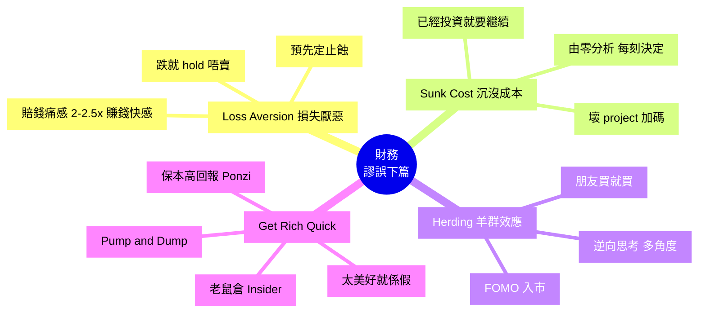

# Module 28: 常見財務謬誤(下)

Est. study time: 1h
Language: yue
Description: 4 大情緒/社會 Bias: Loss Aversion、Sunk Cost、Herding、Get-Rich-Quick Scam、Ponzi Scheme 防範

## Knowledge Map

---

## Learning Objectives
- 識別 Loss Aversion 對止蝕決策嘅影響
- 區分 Sunk Cost 謬誤同「繼續投資」嘅合理理由
- 避開 Herding 同 FOMO 衝動
- 識破 Get-Rich-Quick 同 Ponzi Scheme
- 建立系統性防 Bias 機制

---

## Real-World Example

你 2020 年買咗隻股 $100, 2022 年跌到 $50, 你:
- 唔賣 (蝕 50% 太痛)
- 朋友推薦 NVDA, 你跟 (FOMO)
- 朋友推薦 AI 內幕訊息, 你信 (太美好)

你 2023 年發現:
- 嗰隻股再跌到 $20, 永久蝕 80%
- NVDA 你遲入, 只賺 20%
- 「內幕」係 pump and dump, 你接刀蝕 30%

呢個 module 教識你避開呢啲陷阱。

---

## Core Content

### Section 1: Loss Aversion (損失厭惡)

**Kahneman & Tversky Prospect Theory**:
- 賺 $100 嘅快樂 = +1
- 蝕 $100 嘅痛苦 = -2 至 -2.5
- 蝕嘅感覺強過賺

**投資表現**:
- **跌就 hold 唔賣**: 蝕本太痛, 寧願 hold 等返家鄉
- **賺就快賣**: 賺少少就鎖定, 怕之後跌
- 結果: 贏嘅倉短, 輸嘅倉長 (反智)

**研究** (Odean 1998):
- 投資者賣賺錢股嘅機率高過蝕本股 50%
- 即使稅務 + 交易費考量, 蝕本 hold 仍不合理

**避開方法**:
1. **預先定止蝕位**: 跌 20% 就沽, 唔好睇住跌而 hold
2. **Rebalance 規則**: 每年 1 次, 賣升最多買跌最多, 反人性
3. **「呢個倉係咪會今日再買」**: 跌咗之後, 問「如果今日先有錢, 會唔會買呢個」, 唔會就賣
4. **睇組合, 唔睇個股**: 單一蝕本唔代表組合失敗, 唔好為咗救個股 hold

> **Cloze**: "Loss Aversion 指 {蝕嘅感覺強過賺}, 結果 {贏嘅倉短, 輸嘅倉長}。"
>
> *Answer: 蝕嘅感覺強過賺、贏嘅倉短, 輸嘅倉長*

### Section 2: Sunk Cost (沉沒成本謬誤)

**定義**: 因為已經投資, 所以要繼續投資, 即使現時理性分析唔應該再投。

**投資例子**:
- 壞 project 加碼: 你買咗 $100K 隻股, 跌到 $50K, 你再買 $50K「平均低」, 結果再跌 $20K
- 持有壞基金: 5 年蝕 30%, 你覺得「等返家鄉先賣」, 結果 10 年後再蝕
- 唔肯止蝕, 因為「已經輸咁多」

**關鍵**: Sunk cost 係**過去**, 唔影響**未來**決策。

**避開方法**:
1. **「由零分析」**: 每次決策, 問「如果我而家先有呢個倉, 我會點?」, 唔會就賣
2. **Opportunity Cost 思維**: 錢擺喺壞倉, 機會成本係放喺好倉
3. **預先定退場**: 唔好到時再決定
4. **分開睇**: 「已經蝕」同「應該繼續」係兩件事

> **Spot the Mistake**: 「我已經蝕咗 50%, 等返家鄉 ($100) 至賣, 否則蝕咗都白蝕。」
>
> 邊度錯?
>
> *Answer: Sunk Cost + Loss Aversion 兩個 Bias。(1) 過去蝕 50% 唔影響未來, 應該睇「如果而家有 $50K, 會唔會再買呢隻」, 唔會就沽。(2) 「等返家鄉」可能永遠等唔到, 資金機會成本大。應該設止蝕位, 唔好為咗過去決定未來。*

### Section 3: Herding (羊群效應)

**定義**: 跟風別人決策, 獨立分析不足。

**投資表現**:
- **FOMO 入市**: 朋友 / KOL 買咗賺, 你怕執輸
- **FUD 出市**: 媒體恐慌, 你跟沽
- **Bubble 同 Crash 嘅燃料**: 1999 科網泡、2008 樓市、2021 GME, 全部羊群效應

**社交媒體放大**:
- 微信/Twitter 群組瘋傳「呢隻必升」
- 加密幣 Telegram 群組 pump
- 結果: 99% 人高位接火棒

**避開方法**:
1. **逆向思考**: 大部分人講嘅, 已經反映喺價。問「邊個係 counterparty?」
2. **獨立研究**: 自己睇基本面, 唔好淨睇 KOL
3. **等確認**: FOMO 入市通常接刀, 等回調先入場
4. **Sounding Board**: 搵獨立思考嘅朋友討論, 唔好同溫層

> **Cloze**: "Herding 指 {跟風別人決策, 獨立分析不足}, 社交媒體 {放大羊群效應, 群組瘋傳必升訊息}。"
>
> *Answer: 跟風別人決策, 獨立分析不足、放大羊群效應, 群組瘋傳必升訊息*

### Section 4: Get-Rich-Quick Scam (快速致富騙局)

**常見特徵**:
1. **保本高回報**: 「保證 30% 年回報, 零風險」(唔可能)
2. **壓力銷售**: 「限時優惠」「最後幾個位」
3. **Insider Info**: 「你唔會喺外面聽到」
4. **不透明**: 「秘密策略」「我哋自己人」
5. **名人代言**: 假 Elon Musk / 假政府官員

**典型騙局**:

**(a) Ponzi Scheme (龐氏騙局)**
- 用後期投資者嘅錢, 付前期投資者「回報」
- 無真實業務
- 例子: Bernie Madoff ($65B), OneCoin ($4B), PlusToken (中國)
- 結果: 後加入者全蝕, 騙局爆煲

**(b) Pump and Dump (拉高拋售)**
- KOL / 群組 pump 某隻細價股 / 加密幣
- 散戶接火棒, KOL 散貨
- 結果: 散戶 80%+ 蝕

**(c) 老鼠倉 (Insider Trading)**
- 內幕消息買賣, 香港《證券及期貨條例》罪行
- 刑罰: 罰款 + 監禁最高 10 年
- 普通人接收「內幕」多數係假

**(d) 假 App / 假平台**
- 假投資 App 顯示高回報
- 提款時先發現攞唔到錢
- 香港 SFC 持牌名單可查

**避開方法**:
1. **「太美好就係假」**: 保本 + 高回報 = 騙局
2. **查 SFC 持牌**: https://www.sfc.hk/ 查公司/個人持牌
3. **壓力銷售 = 騙局**: 真投資唔會限時限刻
4. **Insider Info 多數假**: 即使真, 你都係被利用嘅一方
5. **問自己**: 「如果咁容易賺, 點解銀行唔自己做?」

> **Cloze**: "Ponzi Scheme 係 {用後期投資者嘅錢付前期回報, 無真實業務}, 結果 {後加入者全蝕, 騙局爆煲}。"
>
> *Answer: 用後期投資者嘅錢付前期回報, 無真實業務、後加入者全蝕, 騙局爆煲*

### Section 5: 防 Bias 系統

**個人系統**:
1. **Investment Policy Statement (IPS)**
   - 寫低目標、風險、回報預期、再平衡規則
   - 唔好情緒化時修改

2. **Decision Log**
   - 每次買/賣: 日期、價、原因、退場條件
   - 1 年後 review, 對賬指數

3. **Sounding Board**
   - 1-2 個獨立思考嘅朋友
   - 重大決策前討論

4. **Pre-mortem**
   - 假設失敗, 問「邊度錯」
   - 預先設退場

5. **限制睇新聞**
   - 每日 15 分鐘, 唔好被 24/7 影響
   - 關閉 trading App push notification

6. **冷靜期**
   - 重大決策 (e.g. 超過 10% 倉), 等 24-48 小時先做
   - 過咗冷靜期仲想做, 先做

7. **自動投資**
   - 月供 ETF, 自動扣款
   - 減少主動決策次數

> **Think**: 你 2023 年想 all-in 隻新興加密幣, 朋友賺咗 10 倍。你會點做?
>
> *Answer: 警惕 4 個 Bias。(1) Herding: 朋友賺唔等於我會賺。(2) Availability: 朋友成功案例易記住, 忽略 99% 失敗。(3) Loss Aversion: FOMO 怕執輸。(4) Sunk Cost: 之前錯過 Bitcoin 嘅遺憾。應該: 寫 Decision Log (原因、反對理由、退場), Sounding Board 討論, 24 小時冷靜期, 設上限 5% 倉。*

> **Predict**: 你收到 WhatsApp 群組, 「內部消息, [細價股] 即將被收購, 升 5 倍, 限時入」。你會點做?
>
> *Answer: 100% 騙局訊號。(1) Insider Info 多數假。(2) 限時 = 壓力銷售。(3) WhatsApp 群組 = 散貨渠道。應該: (a) 唔回覆, (b) 退群, (c) 報警 / SFC, (d) 反向思考: 如果真嘅, 點解免費分享?*

---

### Why This Matters

投資最大風險唔係市場, 係自己嘅 Bias + Scam。

識得分 + 避開:
- 你跑贏 80% 散戶 (因佢哋被 Bias 影響)
- 唔會被 Scam 呃
- 長期複利穩定累積

---

## Key Takeaways
- Loss Aversion: 蝕嘅感覺 2-2.5x 賺, 設止蝕位
- Sunk Cost: 過去唔影響未來, 由零分析
- Herding: 跟風 = 接火棒, 逆向思考
- Scam: 保本高回報 = 假, 查 SFC 持牌
- 系統防 Bias: IPS + Decision Log + Sounding Board + Pre-mortem + 冷靜期

---

## Common Misconception

**「朋友賺咗, 我都可以。」**

錯。每個人時機、倉位、風險承受唔同。朋友賺 10 倍可能係 (a) 早入, (b) 高槓桿, (c) 賭晒身家, (d) 好彩。唔可以照抄。要做: 自己研究, 寫 Decision Log, 設倉位上限。

---

## Spot the Mistake

「WhatsApp 群組話『XX 加密幣下週上 Coinbase, 升 5 倍』, 我信, 因為群組好多人都買咗。」

邊度錯?

*Answer: 5 個錯 + 5 個 Scam 訊號。(1) Herding: 群組買 = 羊群。(2) Insider Info 假。(3) 「上 Coinbase」係 pump 借口。(4) 限時 5 倍 = 壓力銷售。(5) 群組 = KOL 散貨渠道。應該: 唔回覆, 退群, 報 SFC。*

---

## Feynman Explain

(用一個 10 歲都明嘅故事解釋「4 個情緒 Bias + Scam」: 從「你朋友食糖, 你都想食 (Herding) / 你跌親嗰隻手會縮 (Loss Aversion) / 你已經食咗半粒糖, 唔好嘥要食埋 (Sunk Cost) / 街邊有人話『跟我賺 100 倍』 (Scam)」講起。)

---

## Reframe

(試下諗: 你最近一次投資決策, 邊個 Bias 影響咗你? 寫低 (1) 原因, (2) 反對理由, (3) 退場條件, (4) 24-48 小時後仲想唔想做。寫低你嘅諗法。)

---

## Drill
Take the quiz. MCQs test different angles — recall, application, scenario.

Run: `learn.sh quiz finance-basics-cantonese 28`
Run: `learn.sh cloze finance-basics-cantonese 28`
