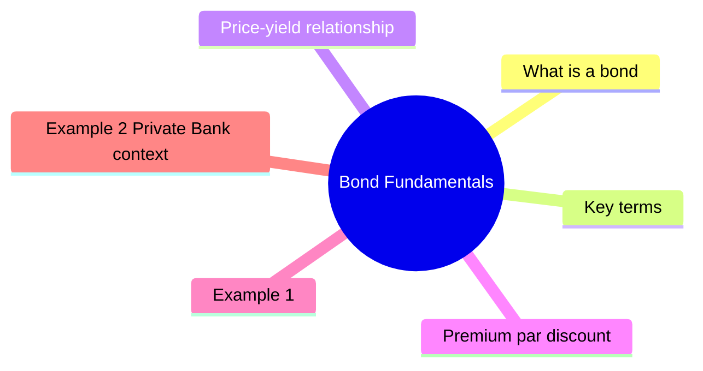

# Module 1: Bond Fundamentals

Est. study time: 2h

## Learning Objectives
- Define key bond terms: face value, coupon, maturity, yield
- Explain inverse relationship between price and yield
- Distinguish premium, par, and discount bonds
- Calculate current yield and understand YTM

---

## Core Content

### What is a bond?

Bond = loan from investor to issuer. Issuer pays periodic interest, repays principal at maturity.

### Key terms

| Term | Definition |
|------|------------|
| **Face value (par)** | Principal repaid at maturity. Usually $1,000 per bond |
| **Coupon rate** | Annual interest rate (% of face value) |
| **Coupon payment** | Periodic interest = coupon rate × face value ÷ frequency |
| **Maturity** | Date principal is repaid |
| **Yield** | Return investor earns (varies with price) |
| **Price** | Market price (can be above, below, or at par) |

### Price-yield relationship

**Inverse**: When yield goes UP, price goes DOWN. When yield goes DOWN, price goes UP.

Reason: fixed coupon. If market rates rise, existing bonds with lower coupons become less valuable → price falls to match new yield.

Question: Why is price quoted as % of par instead of dollar amount? Answer: historical convention — most corporate bonds historically had $1,000 face, so quoting in % lets you compare across issues without dollar math. Quoted as **clean price** (excludes accrued interest; dirty price = clean + accrued).

Example: A bond quoted at 95.50 = $955.00 clean price per $1,000 face. Compare two bonds at 95.50 vs 102.10 → second trades at premium, regardless of whether one has $1,000 face and other $5,000.

### Premium, par, discount

| Price vs Par | Bond type | Yield vs Coupon |
|-------------|-----------|-----------------|
| Price = Par | Par bond | Yield = Coupon |
| Price > Par | Premium bond | Yield < Coupon |
| Price < Par | Discount bond | Yield > Coupon |

### Pull-to-par intuition

Discount bond price rises toward par as maturity nears.

Reason: not driven by rates — purely mechanical. Shorter time horizon means PV of principal dominates, and PV of $1,000 at any positive yield converges to $1,000 as maturity shrinks.

Question: If you buy discount bond at $950 and hold to maturity, is gain from rates or just mechanics? Answer: mechanical. Price must converge to par at maturity regardless of rate path.

### Current yield

`Current yield = Annual coupon / Market price`

Simple approximation. Does not account for maturity gain/loss.

### Yield to Maturity (YTM)

Total return if held to maturity. Includes:
- Coupon payments
- Gain/loss from price difference to par
- Reinvestment assumption (coupons reinvested at same YTM)

YTM = IRR of bond's cash flows. Most important yield measure.

### Accrued interest & clean vs dirty price

When you buy a bond between coupon dates, seller earned part of next coupon. Buyer must compensate.

`Accrued interest = Coupon × (days since last coupon / days in coupon period)`

- **Clean price**: quoted price (excludes accrued interest)
- **Dirty price**: what buyer actually pays = clean + accrued

Example: $1,000 face, 5% coupon, semiannual ($25 every 6 months). 90 days into coupon period (180-day period):
- Daily coupon = $25 / 180 = $0.1389
- Accrued = $0.1389 × 90 = $12.50
- If clean quoted 99.00 → buyer pays $990 + $12.50 = $1,002.50

### Day count conventions

How you count days between dates varies by market:
- **30/360**: US corporates, munis. Each month = 30 days
- **ACT/ACT**: US Treasuries. Actual days ÷ actual days in period
- **ACT/360**: repos, money market. Actual days ÷ 360

Affects accrued interest calculation. Same bond, different convention → slightly different accrued.

### Settlement

US bond market settles **T+1** (one business day after trade). Previously T+2 until May 2024. Buyer pays, seller delivers bonds on settlement date.

---

## Examples

### Example 1
Bond: $1,000 face value, 5% coupon (annual), 10yr maturity

Annual coupon = $50

If market price = $1,000:
- Current yield = $50/$1,000 = 5%
- Yield = coupon rate (par bond)

If market price = $950:
- Current yield = $50/$950 = 5.26%
- YTM ≈ 5.67% (buyer gets $50/yr coupon + $50 gain at maturity, compounded over 10 years)
- Solve: PV of $50 annuity + $1,000 lump sum @ y = $950 → y ≈ 5.67%

### Example 2 (Private Bank context)
Client holds $1M face of 4% Treasuries. Fed raises rates → new Treasuries yield 5%.

What happens to client's bond value? Price falls. Old 4% bonds less attractive → price drops until yield matches 5%.

As broker, you explain: "Paper loss if marked to market, but if held to maturity full principal returned."

---

## Common Misconception

**"Higher coupon = better bond."** No. Two bonds with same YTM can have very different coupons. Discount bond (low coupon) buys below par, gains mechanically as maturity nears. Premium bond (high coupon) buys above par, loses mechanically.

Example: 5yr, YTM = 6%
- Bond A: 4% coupon, price ≈ $915 (discount, gains $85)
- Bond B: 8% coupon, price ≈ $1,084 (premium, loses $84)

Same YTM = same expected total return if held to maturity. Coupon choice depends on reinvestment assumptions and tax treatment (zero-coupon = no reinvestment risk, but taxable accreted gain annually in many jurisdictions).

---

## Key Takeaways
- Bonds = loans with fixed coupons, defined maturity
- Price and yield move inversely
- Premium bonds: price > par, yield < coupon
- Discount bonds: price < par, yield > coupon
- YTM is the complete return measure (coupons + price gain/loss)

---
## Feynman Explain

Teach price-yield relationship to a colleague who doesn't do fixed income. Use simplest words. Give concrete example from private bank context — a client's bond losing value when rates rise.

*Self-check: Did you skip WHY prices fall (fixed coupon less attractive vs new bonds)? Did you mention both paper loss (if sold) vs full principal back (if held to maturity)?*

---

## Reframe
Judge the price-yield relationship: When does the inverse relationship NOT hold? (Think: distressed bonds, zero-coupon bonds, very short maturity.) Write your answer.

---

## Think

> **Think**: A 5-year, 6% coupon bond is priced at 95. A 5-year, 4% coupon bond is priced at 91. Both have YTM ≈ 6.5%. A client asks "which is the better buy?" What's your one-sentence answer that doesn't touch yield?
>
> *Answer: Neither — both deliver the same YTM if held to maturity. The 6% coupon bond has higher reinvestment risk (you must reinvest those bigger coupons at unknown future rates); the 4% coupon has lower reinvestment risk but more price risk if rates rise. Match coupon to liability stream, not to "highest number."*

---

## Predict

> **Predict**: You buy a 10-year zero-coupon bond at $500 (face $1,000, YTM ≈ 7.18%). Three years pass with no change in market rates. What is the bond's price now, and why?
>
> *Answer: Approximately $619 — purely mechanical pull-to-par. With 7 years left and the same 7.18% YTM, PV of $1,000 discounted 7 years at 7.18% is ~$619. No new information, no rate move, yet price rose 24% over 3 years. This is the magic (and trap) of zeros: locked-in compounding, but taxable accreted gain each year in many jurisdictions.*

---

## Spot the Mistake

> **Spot the Mistake**: A junior advisor tells a client: "This 5% coupon bond yields 5%, and this 7% coupon bond yields 7% — the 7% is the better bond."
>
> The advisor's error is comparing coupon rate to yield as if they were equivalent. They are equal only at par. The 7% coupon bond either trades at a premium (yield < coupon) or a discount (yield > coupon). What single question should you ask the junior to expose the error?
>
> *Answer: "What's the clean price of each bond?" If the 7% bond is at 105, its yield is below 7% and likely below the 5% bond's yield. The mistake is treating coupon as a return metric instead of a cash-flow schedule. Yield-to-maturity is the apples-to-apples return measure.*

---

## Cloze

The {coupon rate} is the annual interest as a percent of {face value}, while the {yield} is the actual return earned based on the price paid. A bond trading above par is called a {premium} bond; below par is a {discount} bond. The quoted price is the {clean price}, and the buyer actually pays the {dirty price} which adds {accrued interest}. The total return measure that includes coupons plus any gain or loss to maturity is the {YTM}.

---

## Drill
Take the quiz. MCQs test recall, application, and private bank scenarios.

Run: `./scripts/learn.sh quiz fixed-income 01-bond-fundamentals`
