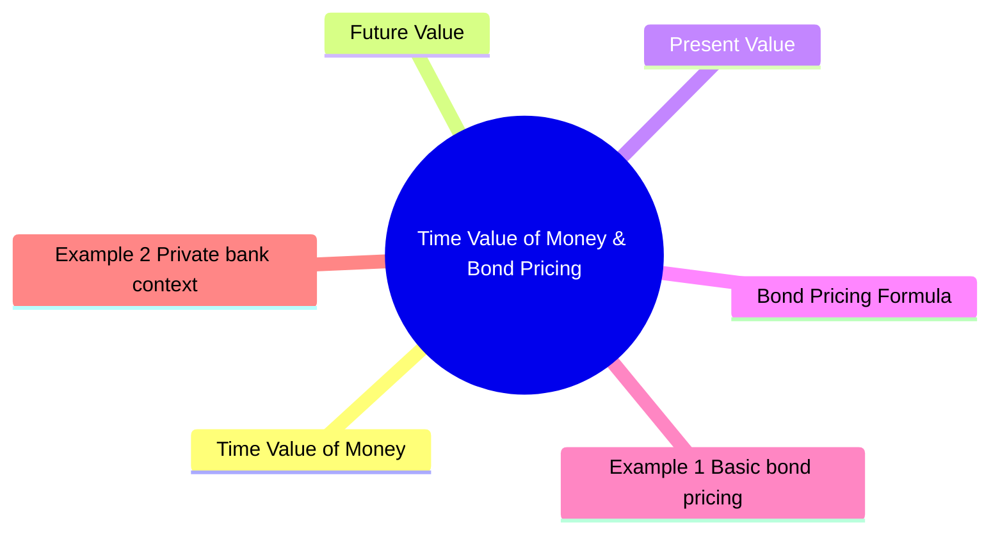

# Module 2: Time Value of Money & Bond Pricing

Est. study time: 2h



## Learning Objectives
- Explain time value of money concept
- Calculate present value of future cash flows
- Price bond using discounted cash flow method
- Understand YTM as IRR of bond cash flows
- Distinguish spot rates from YTM

---

## Core Content

### Time Value of Money

$1 today worth more than $1 tomorrow. Reason: can invest today's dollar and earn interest.

Key variables:
- **PV**: Present Value (price today)
- **FV**: Future Value (principal + interest)
- **r**: Discount rate (yield)
- **n**: Number of periods
- **PMT**: Periodic payment

### Future Value

```text
FV = PV × (1 + r)^n
```

Example: $1,000 today at 5% for 3 years
```text
FV = 1,000 × (1.05)^3 = $1,157.63
```

### Present Value

```text
PV = FV / (1 + r)^n
```

Example: $1,000 received in 3 years, discount at 5%
```text
PV = 1,000 / (1.05)^3 = $863.84
```

### Bond Pricing Formula

Bond price = PV of all future cash flows (coupons + principal)

```text
P = C/(1+r)^1 + C/(1+r)^2 + ... + C/(1+r)^n + FV/(1+r)^n
```

Where:
- C = coupon payment per period
- r = periodic yield (YTM / periods per year)
- n = total periods
- FV = face value (par)

### Semi-annual convention

Most bonds pay coupons semi-annually (2x per year).

Why semi-annual? Historically aligned with corporate earnings cycles (6-month reporting). Also gives investors more frequent cash flow vs annual. European bonds often annual — convention varies by region.

Question: If bond is semi-annual and you halve yield to 2.5%, does this assume compounding? Answer: Yes. Effective annual yield = (1.025)^2 - 1 = 5.0625%, slightly above stated 5% YTM. Semi-annual convention understates effective yield vs annual.

Example: 5yr bond, 6% coupon, YTM 5%, semi-annual

```text
Periodic coupon = (0.06 × $1,000) / 2 = $30
Periods = 5 × 2 = 10
Periodic yield = 5% / 2 = 2.5%
```

Price = PV of 10 semi-annual coupons of $30 + PV of $1,000 at maturity

P = $30 × [1 - (1.025)^-10] / 0.025 + $1,000 / (1.025)^10

P = $30 × 8.7106 + $1,000 × 0.7812

P = $261.32 + $781.20 = $1,042.52 (premium bond)

### Annuity formula shortcut

Coupons form an annuity. Use:

```text
PV_annuity = C × [1 - (1+r)^-n] / r
```

Then add PV of principal.

### YTM as IRR

YTM = discount rate that makes PV of cash flows equal market price.

Cannot solve directly (iterative). Use financial calculator or `=YIELD()` in Excel.

```text
Price = Σ C/(1+YTM/2)^t + FV/(1+YTM/2)^n
```

YTM assumes every coupon reinvested at same YTM — full treatment in "Common Misconception" section below.

### Spot rates vs YTM

| Concept | Definition |
|---------|------------|
| **Spot rate** | Yield on zero-coupon bond for specific maturity |
| **YTM** | Single discount rate applied to ALL cash flows |
| **Implication** | YTM assumes constant reinvestment rate across time — unrealistic |

Bootstrapping: derive spot rates from coupon bonds.

Question: If spot curve is upward sloping, what does YTM overstate or understate? Answer: YTM (single rate) understates yield on distant cash flows and overstates yield on near cash flows. Spot rates give truer picture.

### Accrued interest & clean/dirty price

Quick reference — full treatment in Module 1. Transaction settled between coupon dates → buyer pays seller accrued interest.

---

## Examples

### Example 1: Basic bond pricing

Bond: $1,000 face, 4% coupon (annual), 3yr maturity, YTM 3.5%

```text
P = 40/(1.035)^1 + 40/(1.035)^2 + 1040/(1.035)^3
P = 38.65 + 37.34 + 938.02
P = $1,014.01 (premium)
```

### Example 2: Private bank context

Client sees bond quoted at clean price 98.50. Coupon 5% semi-annual, last coupon paid 60 days ago (182-day period).

```text
Accrued interest = (5%/2) × (60/182) × $1,000 = 0.025 × 0.3297 × $1,000 = $8.24
Dirty price = $985.00 + $8.24 = $993.24
Client pays $993.24.
```

### Example 3: YTM approximation

Bond: $1,000 face, 5% coupon, 5yr, price $960

Approximate YTM formula:
```text
YTM ≈ [C + (FV - P)/n] / [(FV + P)/2]
YTM ≈ [50 + (1000-960)/5] / [(1000+960)/2]
YTM ≈ [50 + 8] / 980 = 58/980 = 5.92%
```

Check: actual YTM ≈ 5.95% (close).

---

## Common Misconception

**"YTM = guaranteed return."** No. YTM assumes every coupon reinvested at the same YTM. Realized return diverges if rates move:

- Falling rates: coupons reinvest at lower rates → realized return < YTM (biggest risk for high-coupon long bonds)
- Rising rates: coupons reinvest at higher rates → realized return > YTM
- Zero-coupon bonds: no reinvestment risk; YTM = realized return if held to maturity

Reinvestment risk = the gap between YTM and what you actually earn from coupons being reinvested.

---


## Key Takeaways
- Bond price = sum of PV of future cash flows
- Semi-annual convention: halve coupon and yield, double periods
- YTM = single discount rate matching price to cash flows
- Spot rates differ from YTM — YTM assumes flat reinvestment rate
- Clean price excludes accrued interest; dirty price is actual cost

---

## Feynman Explain
Explain bond pricing to a colleague: "Why does a bond's price change when rates move?" Use discounting concept — no formulas. Connect to Module 1's price-yield relationship using TVM reasoning.

*Self-check: Can you explain why a $1,000 par bond paying $30 semi-annually for 10 years is worth MORE than $1,000 when rates are 5% but LESS when rates are 7%?*


---

## Reframe
When does bond pricing as PV of cash flows break down? Consider: perpetual bonds (no maturity), floating-rate notes (coupon resets), convertible bonds (equity option embedded). Write your answer.

---

## Think

> **Think**: A 5-year, 6% semiannual bond has YTM 5%. You compute price = $1,042.52 (premium). A colleague says "premium, so yield < coupon — I thought the bond yields 5% and coupon is 6%, so yield IS less than coupon. Where's the paradox?" What's missing from the colleague's mental model?
>
> *Answer: The colleague conflates coupon with cash flow. The 6% coupon is $60/year paid in two $30 chunks. The 5% YTM is the discount rate applied to all 10 future $30 coupons plus the $1,000 principal. YTM is lower than coupon because the bond pays back MORE than $1,000 over its life (10 × $30 = $300 in coupons, plus the $1,000 par). To get that extra $300 of coupons, the buyer pays $42.52 above par today. YTM < coupon doesn't mean "worse bond" — it means "you're paying up front for the future coupon stream."*

---

## Predict

> **Predict**: The spot curve today is: 1Y = 4%, 3Y = 5%, 5Y = 6%. You price a 5-year, 5% semiannual bond using these spot rates. Will the price be HIGHER, LOWER, or SAME as pricing it with a flat 5% YTM? Why?
>
> *Answer: HIGHER. With YTM=5% (flat), you discount every cash flow at 5%. With the actual spot curve, distant cash flows (years 3, 4, 5) get discounted at 5-6% — HIGHER rates than 5% — which makes their PV smaller, which makes the bond price... wait, this is the common error. Re-check: if you use the spot curve to discount, you get the no-arbitrage price. If you use YTM=5% (a flat curve), you use 5% everywhere. The spot curve says 5Y rate is 6% — so discounting the year-5 principal at 6% gives a LOWER PV than at 5%. Net: the spot-curve price is LOWER than the YTM=5% price because more distant cash flows are discounted harder. YTM(5%) overstates the true cost-of-capital for the long-dated cash flows.*

---

## Spot the Mistake

> **Spot the Mistake**: A junior calculates accrued interest for a semiannual bond: "Coupon 5%, so annual coupon = $50, semiannual = $25. 60 days into a 182-day period → accrued = $25 × 60/182 = $8.24. Clean = 98.50, dirty = 98.50 + 8.24 = 106.74."
>
> The mistake is conflating price points and dollar amounts. Spot the exact error and write the correct dirty price.
>
> *Answer: Clean price 98.50 means 98.50% of par = $985.00, not 98.50 dollars. Accrued $8.24 is correct (dollars). Dirty = $985.00 + $8.24 = $993.24. The junior added dollars to percent. Always convert clean price to dollars (multiply by face/100) before adding accrued.*

---

## Cloze

A bond's price equals the {present value} of all future {cash flows} — coupons plus principal — discounted at the appropriate {yield}. Under the {semi-annual} convention, you halve the coupon and the yield, and double the number of {periods}. The {YTM} (yield to maturity) is the single discount rate that sets this PV equal to the observed market price, and equals the {IRR} of the bond's cash flows. {Spot rates} are yields for specific maturities on zero-coupon bonds, and they differ from YTM when the curve is not flat.

---

## Drill
Take the quiz. MCQs test TVM calculations, bond pricing, YTM, and accrued interest.

Run: `./scripts/learn.sh quiz fixed-income 02-time-value-of-money-and-bond-pricing`
