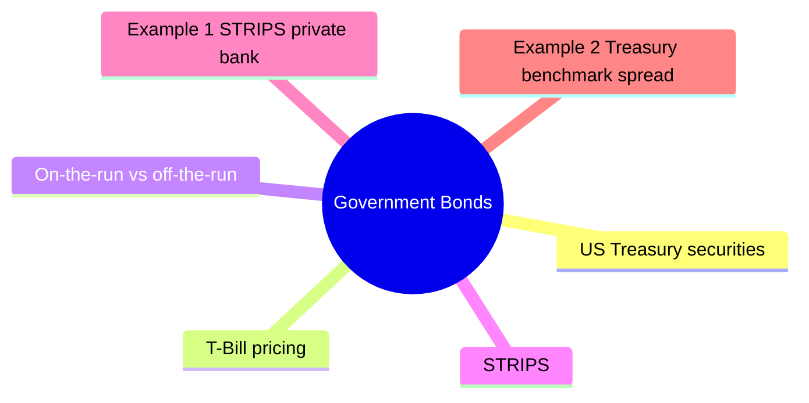

# Module 3: Government Bonds

Est. study time: 2h



## Learning Objectives
- Describe Treasury bill, note, bond structure
- Understand STRIPS and zero-coupon Treasuries
- Distinguish on-the-run vs off-the-run liquidity
- Explain agency bonds (Fannie Mae, Freddie Mac)
- Use Treasuries as benchmark yield curve

---

## Core Content

### US Treasury securities

| Type | Maturity | Coupon | Notes |
|------|----------|--------|-------|
| **T-Bill** | ≤1yr | Zero-coupon | Discount, no periodic interest |
| **T-Note** | 2-10yr | Semi-annual coupon | Most liquid benchmark |
| **T-Bond** | 20-30yr | Semi-annual coupon | Longest duration |
| **TIPS** | 5-30yr | Inflation-adjusted | Principal indexed to CPI |

### T-Bill pricing

Discount instrument. Price quoted on discount yield basis.

Why 360-day convention? Historical banking practice (pre-computer era) — 360 simplifies interest calc (12 months × 30 days). T-Bill uses discount yield where return is expressed as % of face, not % of price. BEY converts to bond-equivalent for comparison with coupon bonds.

```text
Price = Face × (1 - discount_rate × days/360)
```

Example: 90-day T-Bill, discount rate 4%
```text
Price = $1,000,000 × (1 - 0.04 × 90/360) = $990,000
```

Actual yield (bond equivalent yield):
```text
BEY = (Face - Price)/Price × 365/days
     = $10,000/$990,000 × 365/90 = 4.10%
```

### On-the-run vs off-the-run

- **On-the-run**: Most recently issued. Highest liquidity, tightest bid-ask.
- **Off-the-run**: Previously issued. Wider spreads, lower liquidity.

Premium for liquidity: on-the-run trades at slightly lower yield.

### STRIPS

Separate Trading of Registered Interest and Principal of Securities.

Each coupon and principal becomes separate zero-coupon security.

Example: 10yr Treasury $1,000 face, 4% coupon → 20 semi-annual coupons + 1 principal strip = 21 STRIPS securities.

STRIPS appeal: zero-coupon, known maturity value, no reinvestment risk.

### Agency bonds

Government-sponsored enterprises (GSEs):
- **Fannie Mae** (FNMA): mortgage-backed securities
- **Freddie Mac** (FHLMC): mortgage-backed securities  
- **Federal Home Loan Banks** (FHLB): advance funding to banks
- **Farm Credit System**: agricultural lending

Agency status: implicit government backing (not explicit). Historically bailed out.

Agency yields: between Treasuries and corporate bonds.

Question: If agencies have implicit backing, why yield more than Treasuries? Answer: No explicit guarantee. During 2008 crisis, agencies placed into conservatorship — bondholders made whole but equity wiped out. Market prices this tail risk.

### Benchmark yield curve

Treasury curve = risk-free benchmark for all fixed income.

Used for:
- Pricing corporate bonds (spread over Treasury)
- Valuing derivatives (swap curve benchmark)
- Economic indicator (shape predicts growth/recession)

### Sovereign bonds globally

| Country | Benchmark | Key features |
|---------|-----------|--------------|
| Germany | Bund | Eurozone benchmark |
| UK | Gilt | Long history, liquid |
| Japan | JGB | Low yield, deep market |
| Switzerland | Swiss govt | Negative yield history |
| Emerging markets | Local/Eurobond | Currency risk, higher yield |

---

## Examples

### Example 1: STRIPS private bank

Client wants guaranteed $500,000 in 8 years for child's education. You buy 8yr STRIPS.

If 8yr zero-coupon yield = 4.5%, cost today:
```text
PV = $500,000 / (1.045)^8 = $500,000 / 1.4221 = $351,593
```

Known outcome: $500,000 at maturity. No coupon reinvestment risk.

### Example 2: Treasury benchmark spread

Corporate bond priced at 135bp over 5yr Treasury (yield 4.20%).

Corporate yield = 4.20% + 1.35% = 5.55%.

If Treasury yield rises to 4.50%, corporate bond likely yields 5.85% (spread stable) or adjusts if risk perception changes.

---

## Common Misconception

**"Treasuries = zero risk."** No. Only credit/default risk is zero. Risks that remain:

- **Interest rate risk**: price falls if rates rise (Module 1 inverse relationship)
- **Inflation risk**: fixed coupon loses purchasing power (TIPS solve this)
- **Reinvestment risk**: coupons reinvest at uncertain future rates
- **Liquidity risk**: in 2008-2009 and March 2020 even Treasuries saw bid-ask blow out and circuit breakers triggered
- **Currency risk**: foreign holders exposed to USD moves
- **Opportunity cost**: yield may underperform risk assets in expansions

**"Agency bonds = government bonds."** No. Agencies (Fannie/Freddie) have implicit not explicit backing. Post-2008 placed in conservatorship. Bondholders protected so far but no statutory guarantee like Treasuries.

---


## Key Takeaways
- T-Bills: discount, ≤1yr. T-Notes/Bonds: coupon, semi-annual
- On-the-run: most liquid. Off-the-run: cheaper but wider spreads
- STRIPS: zero-coupon Treasuries from separating coupons/principal
- Agencies: GSEs, implicit backing, yield between Treasuries and corporates
- Treasury curve = global risk-free benchmark

---

## Feynman Explain
Explain on-the-run vs off-the-run Treasury liquidity to a private banking client. Why does the newly issued 10yr trade at lower yield than last year's 10yr? Use analogy (new car vs used car?).

*Self-check: Can you explain why STRIPS have zero reinvestment risk?*


---

## Reframe
Critique the idea that Treasuries are "risk-free." What risks remain? (Inflation, liquidity during crisis, currency for foreign holders, opportunity cost.) Write your answer.

---

## Think

> **Think**: Two 10-year Treasuries. Bond A is the most-recently issued "on-the-run" 10-year yielding 4.20%. Bond B is the previous issue "off-the-run" 10-year yielding 4.27%. Same issuer, same maturity, same coupon date structure. Why does B yield 7bp more, and which would a discretionary buy-and-hold pension fund prefer?
>
> *Answer: B yields more because off-the-run issues trade less frequently → wider bid-ask → lower liquidity. The 7bp premium is the "liquidity premium" the market pays to hold the less-tradeable security. A pension fund with long horizon and low trading frequency would prefer B (or even just track both via index), capturing ~7bp/year of extra yield with no expected mark-to-market impact. A market-maker or relative-value hedge fund prefers A for tighter spreads. Liquidity premium is real compensation, not a free lunch.*

---

## Predict

> **Predict**: A client wants exactly $1,000,000 in 10 years for a known future liability (college tuition block, property down-payment). They hold a balanced portfolio but want this single obligation locked in. Compare two approaches: (a) buy a 10-year on-the-run Treasury note at par yielding 4.5%, reinvest coupons; (b) buy a 10-year STRIPS at the 10Y zero-coupon yield of 4.0%. Which costs less today, and which has more reinvestment risk?
>
> *Answer: STRIPS costs less. The 4.0% zero rate vs 4.5% coupon rate reflects the missing reinvestment income on intermediate coupons. Approximate: STRIPS price = $1,000,000 / 1.04^10 = $675,564. The Treasury note at par costs $1,000,000 but with coupons reinvested, you reach the goal only if reinvestment rates match the 4.5% YTM. Realized return will deviate if rates fall — biggest risk for high-coupon long bonds. STRIPS have ZERO reinvestment risk: the $1M outcome is contractually locked. For a hard liability, STRIPS wins on certainty; the cost premium is the insurance against reinvestment-rate uncertainty.*

---

## Spot the Mistake

> **Spot the Mistake**: A junior says "Agency bonds are government bonds — Fannie and Freddie have implicit government backing, so they're risk-free like Treasuries. I'll use them in the LCR buffer."
>
> Spot the two errors and explain why each is wrong.
>
> *Answer: Error 1: "Implicit" is not the same as "explicit." Treasuries have statutory full faith and credit of the US government. Agencies have implicit backing (presumed in normal times) but no statutory guarantee. In 2008, both were placed in conservatorship — bondholders made whole, but the mechanism was discretionary, not contractually guaranteed. The market prices this difference: agencies trade at a spread to Treasuries. Error 2: "Risk-free" is the wrong frame even for Treasuries — interest rate, inflation, and liquidity risk remain. For LCR, only the safest assets count; agencies qualify as Level 2A (lower haircut than corporates) but not Level 1 (which is Treasuries and central bank debt only). The junior has confused two distinct concepts: (a) credit backing and (b) regulatory risk-weighting.*

---

## Cloze

US Treasury {T-Bills} mature in one year or less and are issued at a {discount} to face with no periodic coupon. T-{Notes} (2-10yr) and T-{Bonds} (20-30yr) pay semi-annual coupons and serve as the {risk-free benchmark} for global fixed income. {STRIPS} separate each coupon and principal payment into individual zero-coupon securities, eliminating {reinvestment risk}. The {on-the-run} issue of a given maturity is the most recently issued and trades with the tightest bid-ask; off-the-run issues compensate holders with a small {liquidity premium}.

---

## Drill
Take the quiz.

Run: `./scripts/learn.sh quiz fixed-income 03-government-bonds`
