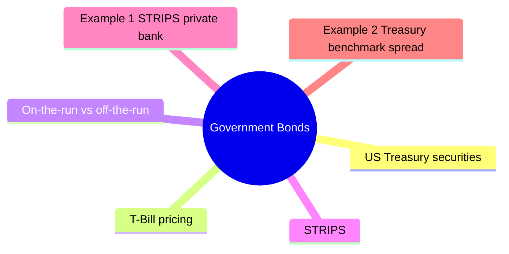

# Module 3: Government Bonds

Est. study time: 2h



## Learning Objectives
- Describe Treasury bill, note, bond structure
- Understand STRIPS and zero-coupon Treasuries
- Distinguish on-the-run vs off-the-run liquidity
- Explain agency bonds (Fannie Mae, Freddie Mac)
- Use Treasuries as benchmark yield curve

---

## Core Content

### US Treasury securities

| Type | Maturity | Coupon | Notes |
|------|----------|--------|-------|
| **T-Bill** | ≤1yr | Zero-coupon | Discount, no periodic interest |
| **T-Note** | 2-10yr | Semi-annual coupon | Most liquid benchmark |
| **T-Bond** | 20-30yr | Semi-annual coupon | Longest duration |
| **TIPS** | 5-30yr | Inflation-adjusted | Principal indexed to CPI |

### T-Bill pricing

Discount instrument. Price quoted on discount yield basis.

Why 360-day convention? Historical banking practice (pre-computer era) — 360 simplifies interest calc (12 months × 30 days). T-Bill uses discount yield where return is expressed as % of face, not % of price. BEY converts to bond-equivalent for comparison with coupon bonds.

```text
Price = Face × (1 - discount_rate × days/360)
```

Example: 90-day T-Bill, discount rate 4%
```text
Price = $1,000,000 × (1 - 0.04 × 90/360) = $990,000
```

Actual yield (bond equivalent yield):
```text
BEY = (Face - Price)/Price × 365/days
     = $10,000/$990,000 × 365/90 = 4.10%
```

### On-the-run vs off-the-run

- **On-the-run**: Most recently issued. Highest liquidity, tightest bid-ask.
- **Off-the-run**: Previously issued. Wider spreads, lower liquidity.

Premium for liquidity: on-the-run trades at slightly lower yield.

### STRIPS

Separate Trading of Registered Interest and Principal of Securities.

Each coupon and principal becomes separate zero-coupon security.

Example: 10yr Treasury $1,000 face, 4% coupon → 20 semi-annual coupons + 1 principal strip = 21 STRIPS securities.

STRIPS appeal: zero-coupon, known maturity value, no reinvestment risk.

### Agency bonds

Government-sponsored enterprises (GSEs):
- **Fannie Mae** (FNMA): mortgage-backed securities
- **Freddie Mac** (FHLMC): mortgage-backed securities  
- **Federal Home Loan Banks** (FHLB): advance funding to banks
- **Farm Credit System**: agricultural lending

Agency status: implicit government backing (not explicit). Historically bailed out.

Agency yields: between Treasuries and corporate bonds.

Question: If agencies have implicit backing, why yield more than Treasuries? Answer: No explicit guarantee. During 2008 crisis, agencies placed into conservatorship — bondholders made whole but equity wiped out. Market prices this tail risk.

### Benchmark yield curve

Treasury curve = risk-free benchmark for all fixed income.

Used for:
- Pricing corporate bonds (spread over Treasury)
- Valuing derivatives (swap curve benchmark)
- Economic indicator (shape predicts growth/recession)

### Sovereign bonds globally

| Country | Benchmark | Key features |
|---------|-----------|--------------|
| Germany | Bund | Eurozone benchmark |
| UK | Gilt | Long history, liquid |
| Japan | JGB | Low yield, deep market |
| Switzerland | Swiss govt | Negative yield history |
| Emerging markets | Local/Eurobond | Currency risk, higher yield |

---

## Examples

### Example 1: STRIPS private bank

Client wants guaranteed $500,000 in 8 years for child's education. You buy 8yr STRIPS.

If 8yr zero-coupon yield = 4.5%, cost today:
```text
PV = $500,000 / (1.045)^8 = $500,000 / 1.4221 = $351,582
```

Known outcome: $500,000 at maturity. No coupon reinvestment risk.

### Example 2: Treasury benchmark spread

Corporate bond priced at 135bp over 5yr Treasury (yield 4.20%).

Corporate yield = 4.20% + 1.35% = 5.55%.

If Treasury yield rises to 4.50%, corporate bond likely yields 5.85% (spread stable) or adjusts if risk perception changes.

---

## Common Misconception

"Treasuries have zero risk." No. Interest rate risk, inflation risk, reinvestment risk, and (for foreign holders) currency risk remain. Only credit/default risk is zero.

> **Predict**: Commit to an answer: does government bonds get simpler or harder once treasury securities enters the picture?
>
> *Answer: Harder locally, simpler globally: individual pieces carry more rules, but the overall system needs fewer special cases.*
> **Think**: What would break first if you ignored **US Treasury securities** in a production government bonds setup?
>
> *Answer: Correctness holds at small scale, then behavior diverges as load or complexity grows — exactly what **US Treasury securities** guards against.*
> **Cloze**: {blank} governs how government bonds behaves when multiple bill pricing concerns collide.
> **Cloze**: The rule that keeps treasury securities correct under load is called {blank}.
> **Cloze**: In government bonds, strips determines {blank}.
> **Spot the Mistake**: Code review note: someone applies bill pricing everywhere "to be safe" in a government bonds codebase. Spot the mistake.
>
> *Answer: Blanket application hides which spots actually need bill pricing. Apply it where the semantics demand it, and document why.*


## Key Takeaways
- T-Bills: discount, ≤1yr. T-Notes/Bonds: coupon, semi-annual
- On-the-run: most liquid. Off-the-run: cheaper but wider spreads
- STRIPS: zero-coupon Treasuries from separating coupons/principal
- Agencies: GSEs, implicit backing, yield between Treasuries and corporates
- Treasury curve = global risk-free benchmark

---

## Feynman Explain
Explain on-the-run vs off-the-run Treasury liquidity to a private banking client. Why does the newly issued 10yr trade at lower yield than last year's 10yr? Use analogy (new car vs used car?).

*Self-check: Can you explain why STRIPS have zero reinvestment risk?*


---

## Reframe
Critique the idea that Treasuries are "risk-free." What risks remain? (Inflation, liquidity during crisis, currency for foreign holders, opportunity cost.) Write your answer.

---

## Drill
Take the quiz.

Run: `./scripts/learn.sh quiz fixed-income 03-government-bonds`
