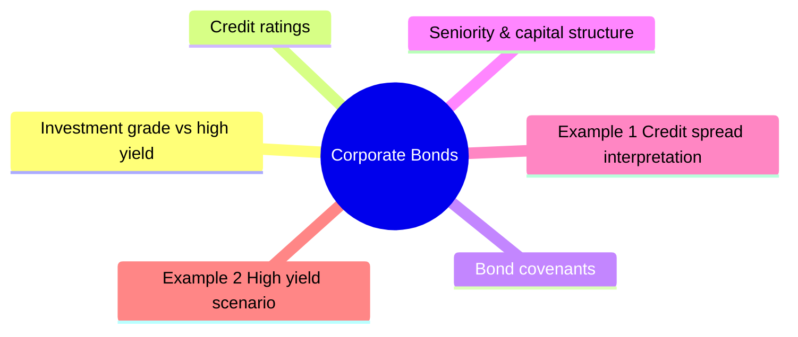

# Module 4: Corporate Bonds

Est. study time: 2.5h



## Learning Objectives
- Distinguish investment grade vs high yield
- Interpret credit ratings from S&P, Moody's, Fitch
- Explain bond covenants and their purpose
- Understand seniority, recovery rates, and capital structure
- Calculate credit spreads

---

## Core Content

### Investment grade vs high yield

| Category | S&P | Moody's | Fitch | Characteristics |
|----------|-----|---------|-------|-----------------|
| **Investment Grade** | AAA to BBB- | Aaa to Baa3 | AAA to BBB- | Low default risk, institutional buyers |
| **High Yield (Junk)** | BB+ to D | Ba1 to C | BB+ to D | Higher yield, higher risk, limited buyers |
| **Default** | D | C | D | Payment missed |

### Credit ratings

Three major agencies: S&P Global, Moody's, Fitch.

Rating factors:
- Business risk: industry, competitive position, diversification
- Financial risk: leverage, coverage ratios, liquidity
- Management: strategy, governance, track record
- Country/regulatory: legal environment, sovereign rating ceiling

Rating watch vs outlook:
- **Outlook**: 6-24 month direction (positive/negative/stable)
- **Watch**: near-term possible change (within 90 days)

### Bond covenants

**Affirmative covenants**: things issuer must do (pay interest, maintain insurance).

**Negative covenants**: things issuer cannot do (incur more debt, sell assets, pay dividends beyond limit).

Protection for bondholders. Stronger in high yield.

### Seniority & capital structure

| Priority | Security | Risk | Recovery |
|----------|----------|------|----------|
| 1 | Senior secured | Lowest | 60-80% |
| 2 | Senior unsecured | | 40-60% |
| 3 | Senior subordinated | | 20-40% |
| 4 | Subordinated | | 10-30% |
| 5 | Junior subordinated | Highest | 0-10% |

Lower priority = higher yield.

### Credit spread

```text
Credit spread = Bond yield - Treasury yield of same maturity
```

Drivers:
- Credit quality (rating)
- Liquidity
- Maturity
- Market risk appetite
- Economic cycle

Spread widens in recession, narrows in expansion.

Question: Spread widens even though company fundamentals unchanged — why? Answer: Market risk aversion (investors demand higher premium for bearing any risk). This is why credit spreads are called "risk premium" not just "default premium."

### Default & recovery

Historical default rates (1970-2023):
- AAA: ~0% annual
- AA: ~0.02% annual
- A: ~0.05% annual
- BBB: ~0.2% annual
- BB: ~0.8% annual
- B: ~2.5% annual
- CCC: ~12% annual

IG (BBB+ and above): ~0.1% annual. HY: ~2-4% annual (varies with cycle).

Recovery rate: % of face value recovered after default.
- Senior secured: ~50-70%
- Senior unsecured: ~30-50%
- Subordinated: ~10-30%

### Make-whole call

Most IG corporates have make-whole call provision.
If issuer calls early, pays bondholder PV of remaining coupons + principal.
Makes early call expensive for issuer → de facto non-callable.

---

## Examples

### Example 1: Credit spread interpretation

5yr Apple bond yields 4.50%. 5yr Treasury yields 4.20%.

Spread = 4.50% - 4.20% = 30bp.

Apple's spread reflects its AA rating, strong liquidity, tech industry position.

### Example 2: High yield scenario

Client asks about 7% yielding bond from CCC-rated retailer. During recession:

- Retail earnings fall → leverage rises → downgrade risk
- Spread widens (risk aversion increases)
- Bond price falls more than IG
- Recovery if default? Senior unsecured → ~40%

### Example 3: Private bank context

Client holds $2M of BBB-rated telecom bonds. Upgrade to A- happens.
- Spread tightens (less credit risk)
- Price rises
- Bond now eligible for more institutional mandates
- Client benefits from price appreciation + tighter yield

---

## Common Misconception

**"IG bonds = no default risk."** BBB-rated bonds default ~0.2%/year — rare but real. "Fallen angels" (IG → HY) spike during stress: 2008 saw ~10% of IG universe downgraded. A bond rated BBB today is not the same as one rated A.

**"Higher coupon = better corporate bond."** No. High coupon often signals compensation for credit risk, not generosity. A 8% CCC bond yielding more than a 4% AAA is NOT "better income" — it prices in default probability and recovery uncertainty. Total return risk-adjusted is what matters.

**"Ratings = truth."** Ratings lag reality. Agencies often downgrade AFTER markets have already priced in distress. Issuer-pays model creates conflict. Watch 2008 (MBs rated AAA) and 2001 (Enron held IG until days before bankruptcy).

---


## Key Takeaways
- IG (BBB-/Baa3+) vs HY (BB+/Ba1+): default risk spectrum
- Ratings reflect business + financial risk profile
- Covenants protect bondholders — stronger in HY
- Seniority determines recovery in default
- Credit spread = risk premium over Treasuries
- Make-whole call: expensive early redemption

---

## Feynman Explain
Explain credit ratings to a private banking client. "Why does an A-rated bond yield less than a BB-rated bond?" Use simple risk analogy — lending money to different people.

*Self-check: Can you explain why a bond's spread might widen even without a downgrade?*


---

## Reframe
Critique credit ratings: "Are ratings useful or harmful?" Consider: rating agencies' conflicts of interest (issuer-pays model), rating lag (downgrade after crisis), and herding behavior. Write your answer.

---

## Think

> **Think**: Two corporate bonds, both 5-year, both senior unsecured, same industry. Bond A is rated A- yielding 5.20%. Bond B is rated BB+ yielding 6.00%. A client asks "Bond B pays 80bp more — that covers more than default risk, right? Why not just buy B for the extra income?" Walk through the answer that a fixed-income PM would give.
>
> *Answer: 80bp does NOT cover default risk alone. BB+ has an annual default rate ~0.8% (vs A- ~0.05%) — 16× more frequent defaults. Average loss given default for senior unsecured is ~40% of face. So expected annual credit loss for Bond B ≈ 0.8% × 40% = 32bp; for Bond A ≈ 0.05% × 40% = 2bp. The 80bp extra spread overstates B's edge by 30bp before considering higher volatility, wider bid-ask, and forced selling during stress. Bond B is "better" only if the buyer is explicitly compensated for bearing cycle risk and liquidity risk, and has the mandate and stomach to hold through drawdowns. Many institutional mandates forbid HY for this reason.*

---

## Predict

> **Predict**: A BBB- bond is upgraded to BBB+ (one notch). Everything else unchanged (maturity, coupon, sector). What happens to (a) yield, (b) price, and (c) eligibility for IG-only mandates? Direction only.
>
> *Answer: (a) Yield FALLS. Better credit rating means less compensation needed; spread tightens ~10-20bp typically. (b) Price RISES. Lower yield, same cash flows → higher PV. Price gain = duration × yield drop × 100. (c) Eligibility EXPANDS. The bond may newly qualify for IG-only index inclusion or insurance company capital relief mandates, creating forced buying demand. The price impact from mandate re-eligibility can exceed the spread-tightening impact.*

---

## Spot the Mistake

> **Spot the Mistake**: A junior says: "Investment grade bonds don't default — that's why they're investment grade. A bond rated BBB- is essentially as safe as a Treasury."
>
> Two errors. Identify each.
>
> *Answer: Error 1: "IG bonds don't default" is false. BBB- has a ~0.2% annual default rate; over 5 years that's ~1% cumulative default probability, and in stress (2008) it spiked above 5%. The label "investment grade" is a regulatory/bucket designation, not a default-free guarantee. Error 2: "As safe as a Treasury" ignores that the Treasury has zero credit risk and zero credit spread, while BBB- trades at +100-150bp to Treasuries for a reason. The spread IS the market's continuous pricing of the credit risk that the rating system cannot make disappear.*

---

## Cloze

{Investment grade} bonds (rated BBB-/Baa3 or higher) carry low default risk and are eligible for institutional mandates, while {high yield} bonds (BB+/Ba1 or below) compensate investors for materially higher default probability. Credit {ratings} from S&P, Moody's, and Fitch assess business and financial risk but lag market reality. Bond {covenants} — affirmative (must do) and negative (must not do) — protect bondholders. {Seniority} within the capital structure determines recovery in default: senior secured recovers 50-70%, subordinated far less. The {credit spread} is the yield premium over Treasuries of the same maturity, reflecting default risk, liquidity, and risk appetite.

---

## Drill
Take the quiz.

Run: `./scripts/learn.sh quiz fixed-income 04-corporate-bonds`
