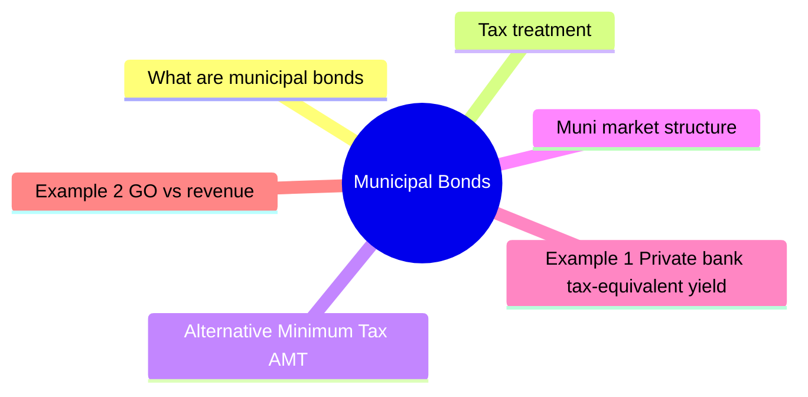

# Module 5: Municipal Bonds

Est. study time: 1.5h



## Learning Objectives
- Distinguish general obligation vs revenue bonds
- Understand tax-exempt status and tax-equivalent yield
- Describe muni market structure and participants
- Compare muni credit quality to corporate bonds

---

## Core Content

### What are municipal bonds?

Debt issued by states, cities, counties, and special districts.

Two main types:

| Type | Backing | Risk | Examples |
|------|---------|------|----------|
| **General Obligation (GO)** | Full faith & credit, taxing power | Lowest muni risk | State GO, city GO |
| **Revenue** | Specific revenue stream (tolls, fees, rents) | Higher than GO | Toll road, water, airport |

### Tax treatment

Key feature: interest exempt from federal income tax.

Why exempt? Constitutional doctrine of intergovernmental tax immunity (states/feds can't tax each other's debt). Also policy: lower borrowing cost for public infrastructure.

Also exempt from state/local tax if investor lives in issuing state.

Tax-equivalent yield (TEY):
```text
TEY = Tax-exempt yield / (1 - marginal tax rate)
```

Example: Muni yields 3.5%, investor in 37% federal bracket.
```text
TEY = 3.5% / (1 - 0.37) = 3.5% / 0.63 = 5.56%
```
Tax-equivalent yield ~5.56% — competitive with taxable bonds.

Question: At what tax bracket does muni become better than corporate of same risk? Answer: Breakeven bracket = 1 - (muni_yield / corporate_yield). If muni=3.5%, corporate=5%, breakeven=30%. Above 30%, muni wins after-tax.

### Alternative Minimum Tax (AMT)

Some munis subject to AMT (private activity bonds).
Tax-exempt for regular tax, but taxable under AMT.
Important for high-income clients subject to AMT.

### Muni market structure

- ~$4 trillion market
- Mostly retail and institutional buy-and-hold
- Less liquid than corporates
- Many small, infrequent issuers
- Trades OTC, often via electronic platforms (Electronic Municipal Market Access - EMMA)

### Credit quality

Historically high. Defaults rare vs corporates.

Muni 10-year cumulative default rate: ~0.1% for A-rated, ~0.5% for BBB-rated (vs corporate ~0.5% and ~2.5% respectively). GO defaults virtually zero for general-purpose states. Revenue bonds (healthcare, housing, industrial development) have higher default rates comparable to HY corporates.

Muni defaults concentrated in:
- Revenue bonds (especially healthcare, housing)
- Small issuers with weak economies
- Puerto Rico (sovereign-like, not US state bankruptcy)

Ratings approach differs: cash flow focus vs corporate balance sheet focus.

### Insured munis

Bond insurance (e.g., Assured Guaranty, Build America Mutual) wraps bond with insurer's credit.

AAA-rated insurer backs bond → bond rated AAA.

Insurance value eroded after 2008 (monoline insurers weakened).

### Build America Bonds (BABs)

2009-2010 program: taxable munis with federal subsidy.

Issued during financial crisis. Higher yields attracted institutional demand.

---

## Examples

### Example 1: Private bank tax-equivalent yield

Client in 32% bracket. Muni yields 4.2%.

TEY = 4.2% / (1 - 0.32) = 4.2% / 0.68 = 6.18%

Comparable corporate would need to yield >6.18% to be better after-tax.

### Example 2: GO vs revenue

City issues GO bond backed by property tax. Also issues revenue bond for airport.

Rating: GO = AA, airport revenue = A. Revenue bond higher yield due to lower security.

During pandemic: GO stable (property tax collected). Airport revenue fell sharply (travel dropped), spread widened.

---

## Common Misconception

**"All munis are tax-free."** No. Three exceptions:
- **Private activity bonds** (airports, stadiums, housing for private developers): tax-exempt for regular tax but **taxable under AMT**
- **Out-of-state munis**: federally exempt but taxed at state level unless investor lives in issuing state
- **Build America Bonds (BABs)**: taxable munis issued 2009-2010 with federal subsidy

**"Munis = safe."** GO bonds very low default risk. Revenue bonds vary: healthcare and housing have seen meaningful defaults. Puerto Rico (2017) showed sovereign-like risk — not covered by Chapter 9 municipal bankruptcy in normal way.

**"TEY makes munis always better."** Only for clients in high federal brackets AND subject to ordinary income tax on bond interest. Tax-deferred accounts (IRA, 401k) → munis' tax-exempt benefit wasted, corporate better.

---


## Key Takeaways
- GO bonds: full faith & credit. Revenue: specific project revenue
- Muni interest federally tax-exempt. TEY calculation for comparison
- Market less liquid than corporates. Mostly buy-and-hold
- Default rare for GO. Revenue bonds have more risk
- Bond insurance wraps credit but insurer risk matters
- Private bank clients: tax-exempt yield often beats taxable after-tax

---

## Feynman Explain
Explain tax-equivalent yield to a client. "Why would you accept 4% tax-free from a muni instead of 6% taxable from a corporate?" Use take-home pay analogy.

*Self-check: Can you explain why high-net-worth clients tilt portfolios toward munis? What tax bracket makes munis attractive?*


---

## Reframe
Critique tax-exempt munis: "Do munis benefit wealthy investors at public expense?" Consider: federal tax expenditure, market efficiency, and who holds munis. Write your answer.

---

## Think

> **Think**: Client in 37% federal bracket holds $1M in munis yielding 4.0% (TEY 6.35%). She just rolled $200K from a CD into her IRA. Her advisor recommends putting the IRA money into MORE munis to "stay consistent." What's the error, and what should the IRA buy instead?
>
> *Answer: Error: TEY assumes the income is taxed at the marginal rate. Inside an IRA, income is already tax-deferred (or tax-free for Roth). The muni tax-exemption is wasted. A 4% muni inside an IRA delivers 4% (the exemption has no value). A 6% taxable corporate inside the IRA also delivers 6% (the tax would be owed on withdrawal, but at then-current rates on the whole amount). For the IRA, choose the highest-yielding appropriate-risk taxable bond — typically investment-grade corporates or Treasuries. The advisor is treating the muni preference as an asset-class choice when it's really a tax-location choice.*

---

## Predict

> **Predict**: A new issue GO bond from a small city (population 50,000) with a weak tax base is rated A-. A revenue bond from the same city, backed by a recently-built parking garage, is also rated A-. The GO yields 3.8%; the revenue yields 4.5%. The state is in recession; the parking garage depends on commuter traffic into a nearby metro that is shedding jobs. Which bond is riskier in practice, and what signal might confirm your view?
>
> *Answer: The revenue bond is materially riskier in practice, despite identical ratings. The rating agencies often lag real-world deterioration. Signals to watch: declining parking utilization, falling lease rates, the city's monthly revenue reports on EMMA, and any rating watch action. The GO bond has the full taxing power of the city behind it; the revenue bond only has the cash flow of one asset in a weakening economy. The 70bp yield gap is a real compensation for real risk; the rating alone is misleading.*

---

## Spot the Mistake

> **Spot the Mistake**: A junior says: "Munis don't default — they never have, really. So the yield is basically free money for high-bracket investors."
>
> Two errors. Identify and correct each.
>
> *Answer: Error 1: Munis DO default, especially revenue bonds. Healthcare, housing, and industrial development revenue munis have defaulted at rates comparable to high-yield corporates. Puerto Rico's 2017 default was a multi-billion-dollar muni default. The "muni never defaults" myth applies to large GO issuers, not the whole market. Error 2: "Free money" ignores credit risk, liquidity risk, and the specific investor's tax situation. A muni yielding 3.5% with a 0.5% probability of 30% loss has expected credit loss ~15bp/year — small but real. A muni held in a tax-deferred account gives up that "tax-equivalent" premium entirely. The label "muni" is not a substitute for due diligence on issuer, type, and tax fit.*

---

## Cloze

Municipal bonds are issued by states, cities, and special districts. {General obligation} (GO) bonds are backed by the issuer's full taxing power, while {revenue} bonds are secured by a specific project revenue stream (tolls, fees, rents). Muni interest is federally tax-exempt, so the {tax-equivalent yield} (TEY = muni_yield / (1 - marginal_tax_rate)) is the apples-to-apples comparison to taxable corporates. {Private activity} bonds are tax-exempt for regular tax but taxable under the {AMT} — a concern for high-bracket clients. GO bonds have very low default rates; revenue bonds vary widely.

---

## Drill
Take the quiz.

Run: `./scripts/learn.sh quiz fixed-income 05-municipal-bonds`
