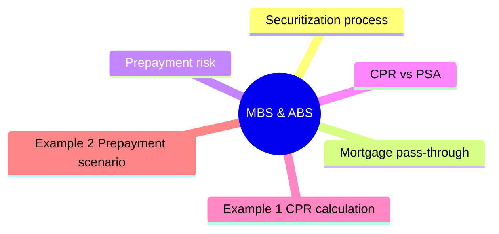

# Module 6: MBS & ABS

Est. study time: 2.5h



## Learning Objectives
- Explain mortgage pass-through mechanics
- Understand prepayment risk and CPR/PSA
- Describe CMO structure and tranches
- Distinguish ABS from MBS
- Analyze senior/subordinate structures

---

## Core Content

### Securitization process

Originator (bank) pools loans → sells to SPV → SPV issues securities.

Key players:
- **Originator**: originates mortgages/loans
- **SPV (Special Purpose Vehicle)**: bankruptcy-remote entity
- **Servicer**: collects payments, handles delinquencies
- **Trustee**: oversees cash flow distribution
- **Rating agency**: assigns credit ratings to tranches

### Mortgage pass-through

Agency MBS (Fannie Mae, Freddie Mac, Ginnie Mae):
- Ginnie Mae: explicit US government guarantee
- Fannie/Freddie: implicit guarantee (but now under conservatorship)
- Pass through monthly payments (interest + principal)

Monthly cash flow = scheduled principal + interest + prepayments.

### Prepayment risk

Borrowers can prepay mortgages anytime (US). This creates uncertainty.

Why US-only? Most countries have prepayment penalties or fixed-rate mortgages that don't prepay easily. US has non-recourse, no-penalty prepayment — unique globally.

Prepayment speed measures:
- **CPR** (Conditional Prepayment Rate): annualized prepayment rate
- **PSA** (Public Securities Association): benchmark curve
- **SMM** (Single Monthly Mortality): monthly prepayment rate

```text
SMM = 1 - (1 - CPR)^(1/12)
```

Question: What happens to MBS price when rates rise? Answer: Prepayment slows (extension risk) → average life lengthens → duration extends. MBS has negative convexity: rates rise → duration rises (bad), rates fall → duration falls (also bad).

### CPR vs PSA

100% PSA = prepayment ramps up from 0.2% CPR at month 1 to 6% CPR at month 30, then stays at 6%.

How likely are different prepayment speeds? In normal rate environment, 100-200% PSA typical. During refinancing boom (2020-2021), speeds hit 300-400% PSA as rates hit record lows. In rising-rate environment, speeds can fall to 50% PSA or lower.

150% PSA = 1.5x the benchmark.

Drivers of prepayment:
- **Refinancing incentive**: mortgage rates drop → borrowers refinance
- **Housing turnover**: home sales → loan payoff
- **Seasonality**: summer/spring higher
- **Burnout**: prepayment slows over time (rate-sensitive borrowers already left)

### CMO (Collateralized Mortgage Obligation)

CMO redistributes prepayment risk across tranches.

| Tranche | Priority | Prepayment risk | Average life |
|---------|----------|-----------------|--------------|
| **Sequential A** | First principal | Shortest | Shortest |
| **Sequential B** | After A | Medium | Medium |
| **Sequential C** | After B | Low | Long |
| **Z-Tranche (Accrual)** | Last | Lowest | Longest |

**IO (Interest Only)**: gets only interest. Price moves WITH rates (prepayment kills IO).
**PO (Principal Only)**: gets only principal. Price moves AGAINST rates (prepayment beneficial).

### Non-agency MBS

Private-label MBS (no government guarantee).

Credit enhancement:
- **Senior/subordinate structure**: senior tranches get paid first
- **Overcollateralization**: pool value > bonds issued
- **Excess spread**: interest from pool > bond coupons
- **Reserve accounts**: cash buffer for losses

### ABS overview

Asset-Backed Securities: non-mortgage collateral.

Common types:
| Type | Collateral | WAL | Prepayment |
|------|-----------|-----|------------|
| Credit card ABS | Receivables | 3-7yr | High, seasonal |
| Auto ABS | Car loans | 2-5yr | Moderate |
| Student loan ABS | Student debt | 5-15yr | Low |
| CLO | Leveraged loans | 5-12yr | Low (callable) |

### Cash flow waterfalls

Senior tranche gets paid first. Junior tranches absorb losses first.

Example:
1. Interest: pool cash → pay senior interest → pay mezzanine → pay subordinate
2. Principal: pool cash → pay senior principal → mezzanine → subordinate
3. Losses: absorbed by subordinate (first loss piece) → mezzanine → senior

---

## Examples

### Example 1: CPR calculation

MBS pool has SMM = 0.5% monthly. What is CPR?

CPR = 1 - (1 - 0.005)^12 = 1 - 0.994^12 = 1 - 0.9416 = 5.84%

### Example 2: Prepayment scenario

Rates drop 1%. MBS pool at 100% PSA (6% CPR) now likely moves to ~250% PSA (15% CPR).

Investor in pass-through gets principal back faster → must reinvest at lower rates (contraction risk).

CMO sequential A tranche gets hit first. Z-tranche unaffected until earlier tranches paid off.

### Example 3: Private bank context

Client holds agency MBS fund. Fed cuts rates → prepayments spike → fund duration shortens → yield declines.

Client asks: "Why did my MBS fund pay out so much principal this month?"

Answer: "Prepayments increased as homeowners refinance at lower rates. You received principal earlier — must reinvest at current lower yields."

---

## Common Misconception

**"Agency MBS = risk-free."** Credit risk near-zero (government backing), but prepayment risk is real and damaging. Negative convexity means MBS underperforms Treasuries in BOTH rallies (prepayment caps price gains) and selloffs (extension risk).

**"Higher coupon MBS = better."** No. Premium-coupon MBS have higher prepayment risk because borrowers refinance aggressively. Lower-coupon MBS offer more stable cash flows even if headline yield lower.

**"CMO tranches eliminate risk."** Tranches redistribute, not eliminate, prepayment risk. Z-tranche takes extreme extension risk; sequential A takes extreme contraction risk. Senior tranche has lower risk but capped upside.

**"ABS = corporate bonds."** No. ABS cash flows depend on collateral performance (defaults, prepayments, recoveries). Corporate has recourse to issuer; ABS limited to specific asset pool.

---


## Key Takeaways
- Agency MBS: government-guaranteed. Non-agency: credit tranching
- Prepayment risk measured by CPR/PSA. Driven by rates, seasonality, burnout
- CMO redistributes prepayment risk into tranches
- IO: bet on rates rising. PO: bet on rates falling
- ABS: diverse collateral. Senior/sub structure protects top tranches
- WAL not fixed — prepayment creates uncertainty

---

## Feynman Explain
Explain prepayment risk to a client: "Why does a mortgage bond lose value when rates fall?" Connect to what happened in 2020-2021 refinancing wave.

*Self-check: Can you explain why IO tranche price RISES when rates rise?*


---

## Reframe
Critique securitization: "Is securitization good or bad for financial stability?" Consider 2008 crisis versus benefits of credit access. Write your answer.

---

## Think

> **Think**: An MBS portfolio manager holds a seasoned 4.5% coupon MBS pass-through. Rates have just dropped 75bp. The manager complains "the MBS rally is half what I expected." What's happening and what tranche would have captured more of the move?
>
> *Answer: Negative convexity. As rates fall, prepayments accelerate, the average life shortens, and duration compresses — so price gains are CAPPED. The pass-through behaves more like a short-bond than its nominal duration suggests. To capture more upside in a rally, the manager should hold an Interest-Only (IO) strip, which benefits from slower prepayments (rates rising relative to scenario) and would have rallied more on the rate drop. Alternatively, hold a lower-coupon MBS where the prepayment cap is less binding. Higher-coupon MBS suffers the most negative convexity — exactly the manager's pain.*

---

## Predict

> **Predict**: An investor holds a Principal-Only (PO) strip of an agency MBS pool. The Fed signals two more rate cuts over the next 6 months. The pool is at 150% PSA today (well seasoned). Predict direction of (a) prepayment speed, (b) PO price, (c) PO yield.
>
> *Answer: (a) Prepays ACCELERATE toward 200-300% PSA as borrowers refinance into lower rates. (b) PO price RISES — faster prepayments return principal faster, and POs benefit from accelerated principal recovery (POs trade at discount and appreciate as the principal comes back sooner). (c) PO yield RISES because the same principal is recovered over a shorter window (higher annualized rate). POs are a "rate-cut bet" — long PO when you expect aggressive Fed easing.*

---

## Spot the Mistake

> **Spot the Mistake**: A junior says: "An AAA-rated senior tranche of a private-label MBS is the same risk as a Treasury — both are AAA, both have zero expected loss, both will pay back in full."
>
> Two errors. Identify each.
>
> *Answer: Error 1: AAA is a credit rating for expected loss, not a guarantee against extension / prepayment / liquidity risk. The senior tranche has near-zero expected credit loss in normal scenarios, but its WAL is uncertain, and during 2008 many AAA tranches traded at 20-30 cents on the dollar as the market priced model risk, not credit risk. The Treasury has none of these risks. Error 2: Liquidity is dramatically different. Treasuries settle T+1 in a deep, central-cleared market. Even AAA MBS tranches can become illiquid for weeks in stress, and bid-ask spreads can blow out 10x normal. The AAA label does not equal "Treasury-like" — the structural, prepayment, and liquidity risks are real and material.*

---

## Cloze

{Securitization} pools loans and issues tranched securities backed by those cash flows. Agency {MBS} (Fannie/Freddie/Ginnie) carry government or quasi-government credit guarantees. {Prepayment} risk is the uncertainty about when borrowers pay back principal early; it's measured by {CPR} (annualized) or {PSA} (Public Securities Association benchmark curve). {CMO} structures redistribute prepayment risk across sequential, Z, IO, and PO tranches. {IO} strips benefit when rates rise; {PO} strips benefit when rates fall. {ABS} extend the same model to non-mortgage collateral — credit cards, autos, student loans, CLOs.

---

## Drill
Take the quiz.

Run: `./scripts/learn.sh quiz fixed-income 06-mbs-and-abs`
