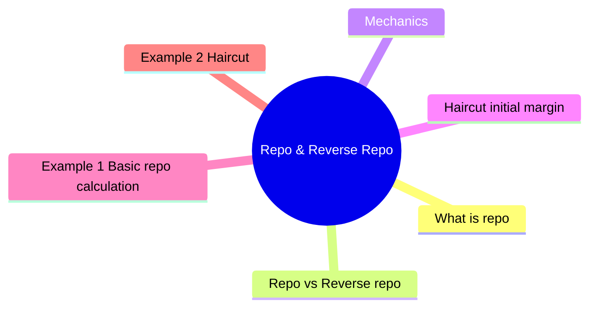

# Module 7: Repo & Reverse Repo

Est. study time: 2h



## Learning Objectives
- Explain repo mechanics and purpose
- Distinguish repo from reverse repo
- Understand haircut and margin
- Describe GC vs special repo
- Analyze repo market role in funding and leverage

---

## Core Content

### What is repo?

**Repurchase agreement**: sell security today with agreement to buy back at future date at higher price.

Economically: collateralized short-term loan.

```text
Day 1: Borrower sells bond → receives cash
Day T: Borrower repurchases bond → pays cash + interest
```

Interest = repo rate.

### Repo vs Reverse repo

| Party | Action |
|-------|--------|
| **Borrower** (in repo) | Sells bond today, repurchases later. Receives cash. Pays repo rate |
| **Lender** (in reverse repo) | Buys bond today, sells later. Lends cash. Earns repo rate |

They are the same trade viewed from opposite sides.

### Mechanics

```text
Accrued interest adjusted:
Start: Cash = Bond price + accrued interest
End: Cash_back = Start_cash × (1 + repo_rate × days/360)
```

Collateral: Treasuries (most common), agencies, MBS, corporates.

### Haircut (initial margin)

```text
Haircut = (Collateral value - Cash lent) / Collateral value
```

Protects lender from collateral price decline.

Why different haircuts by asset? Higher volatility → larger potential price gap between margin calls → more protection needed. Treasury barely moves intraday; HY bond can gap 5% on earnings miss.

| Collateral | Typical Haircut |
|------------|-----------------|
| Treasury | 0.5-2% |
| Agency MBS | 2-5% |
| IG corporate | 5-10% |
| HY corporate | 10-20% |
| Equities | 10-50% |

Higher volatility → higher haircut.

### GC vs Special repo

| Type | Collateral | Rate | Notes |
|------|------------|------|-------|
| **General Collateral (GC)** | Any Treasury | Lowest | Interbank funding |
| **Special** | Specific security | Below GC | Short-seller needs specific bond |
| **Fails** | None | Highest | Failed delivery penalty |

Special rate can go negative (short squeeze).

### Market participants

| Participant | Role |
|-------------|------|
| Money market funds | Lend cash (reverse repo) |
| Hedge funds | Borrow cash to lever, borrow bonds to short |
| Primary dealers | Intermediaries |
| Central bank (Fed RRP) | Set floor on overnight rates |
| Pension/insurance | Lend bonds for extra yield |

### Uses of repo

1. **Leverage**: hedge fund posts $10M cash, borrows $90M in repo → controls $100M bond position
2. **Short selling**: borrow specific bond to sell short (reverse repo)
3. **Inventory funding**: dealers fund bond inventory via repo
4. **Cash management**: money funds earn return on excess cash

### Tri-party repo

Intermediary (BNY Mellon / JPMorgan) handles collateral valuation, margin calls, settlement.

Reduces operational burden. Dominant form of US repo.

### Repo market stress

2008: haircuts spiked → repo lenders withdrew → forced selling → crisis amplified.

2019: repo rates spiked to 10% (reserves shortage, quarter-end constraints).

How likely? Repo stress events are rare but systemic — ~1-2 major events per decade. SOFR spiked above 5% only 3 times in 2020-2025. Quarter-end spikes more common (~monthly pattern of 10-50bp).

Secured Overnight Financing Rate (SOFR): benchmark replacing LIBOR.

Question: Repo is collateralized — why was it a problem in 2008? Answer: Collateral was MBS whose value crashed. Lenders demanded higher haircuts → forced selling → more price drops → higher haircuts. Liquidity spiral.

---

## Examples

### Example 1: Basic repo calculation

Dealer repo $100M Treasuries for 7 days at 4.5%.

Start cash = $100M (ignoring accrued for simplicity)

End cash = $100M × (1 + 0.045 × 7/360) = $100M × 1.000875 = $100,087,500

Repo interest = $87,500

### Example 2: Haircut

Hedge fund buys $100M corporate bonds. Posts $10M equity, borrows $90M in repo.

Haircut = (100M - 90M) / 100M = 10%

If bond price falls to $95M → margin call (equity < haircut × new collateral value).

### Example 3: Private bank context

Client's fund uses repo to lever MBS portfolio.

Treasury repo rate = 4.25%. Fund earns 5.50% on MBS.

Net carry = 5.50% - 4.25% = 1.25% on borrowed amount.

Leverage magnifies return: $10M equity + $40M repo = $50M MBS → net return = [50×5.5% - 40×4.25%] / 10 = [2.75 - 1.70] / 10 = 10.5% equity return (vs 5.5% unlevered).

But leverage magnifies losses too.

---

## Common Misconception

**"Repo is collateralized = no risk."** No. Risks remain:
- **Counterparty risk**: if collateral value crashes faster than haircut (2008 MBS)
- **Operational risk**: settlement fails (2019 repo spike from technical issues)
- **Liquidity/maturity mismatch**: borrowing short, lending long creates rollover risk
- **Rehypothecation**: collateral reused multiple times obscures true exposure

**"Reverse repo and repo are different."** Same trade, opposite sides. From borrower → repo. From lender → reverse repo. Never both at once on the same transaction.

**"Higher haircut = safer."** Higher haircut reduces lender loss but also means borrower must post more cash — limits leverage and may force selling in stress (pro-cyclical). Reasonable haircuts balance safety and market function.

---


## Key Takeaways
- Repo = collateralized short-term loan. Reverse repo = lending cash
- Haircut protects lender. Higher volatility → higher haircut
- GC: general funding. Special: specific security demand
- Repo enables leverage, short selling, dealer inventory funding
- Tri-party repo dominates (third-party agent)
- SOFR replaced LIBOR as overnight reference rate
- Repo stress = systemic risk (2008, 2019)

---

## Feynman Explain
Explain repo to a colleague: "How does a hedge fund buy $100M of bonds with only $10M?" Use mortgage analogy (house down payment = haircut).

*Self-check: Can you explain why special repo rates can go below GC?*


---

## Reframe
Critique repo market: "Is repo market stable or fragile?" Consider 2008 freeze and 2019 spike. What reforms helped? (CCP clearing, higher haircuts, Fed RRP facility.) Write your answer.

---

## Think

> **Think**: A hedge fund repo-finances $500M of investment-grade corporate bonds. Haircut is 5%. It posts $25M cash as margin. A credit event hits, the bonds gap down 8% overnight. What happens to the hedge fund by next morning, and what does the repo lender do?
>
> *Answer: The bonds are now worth $500M × (1 - 0.08) = $460M. The repo balance is still $475M ($500M × 95% lent). The hedge fund's equity in the position is $460M - $475M = -$15M — undercollateralized by $15M. The repo lender issues a margin call for the $15M shortfall. If the fund can't post $15M cash or additional collateral by the deadline, the lender liquidates the position. This is exactly the 2008 dynamic: price drops → margin calls → forced selling → more price drops → more margin calls. The hedge fund either has dry powder, hedges (credit default swaps), or faces termination. Repo amplifies both the upside (leverage) and the downside (margin spiral).*

---

## Predict

> **Predict**: A specific on-the-run 10-year Treasury is in high demand because a large bank needs it to deliver against a short position. Predict (a) the special repo rate vs the GC repo rate, (b) the direction it can move under extreme short squeezes, and (c) who benefits.
>
> *Answer: (a) Special repo rate is BELOW the GC rate, because the cash borrower is willing to pay extra (via lower rate) to obtain that specific bond. Normal: special rate 10-30bp below GC. (b) In extreme squeezes, special rate can go NEGATIVE — the bond lender pays the cash borrower for the privilege of getting the bond. (c) The short-squeezed party (the bank) bears the cost; intermediaries that can source the bond profit. Short squeezes in on-the-run Treasuries are rare but real — the Treasury market March 2020 dislocation briefly saw specials collapse.*

---

## Spot the Mistake

> **Spot the Mistake**: A junior says: "Reverse repo and repo are different products — I'll do a reverse repo to earn the repo rate on my cash, and my colleague will do a repo to borrow cash. We're using different markets."
>
> What's the conceptual error?
>
> *Answer: Repo and reverse repo are the SAME trade viewed from opposite sides. If the junior does a reverse repo (lending cash, receiving collateral), her colleague doing a "repo" (borrowing cash, posting collateral) is the EXACT same transaction from the other side. They are not two separate markets; they are two perspectives on one trade. Both legs settle on the same day at the same rate. Confusing the two is common; the fix is to anchor on cash flow direction. Cash out today = borrower = repo. Cash in today = lender = reverse repo. Pick a side and stick with the perspective.*

---

## Cloze

A {repurchase agreement} (repo) is economically a collateralized short-term loan: the borrower sells a security today and agrees to buy it back later at a higher price, with the price difference representing the {repo rate}. A {reverse repo} is the same trade viewed from the lender's side. The {haircut} (initial margin) protects the lender against collateral price decline and varies by asset volatility — Treasuries 0.5-2%, IG corporates 5-10%, equities 10-50%. {SOFR} (Secured Overnight Financing Rate) replaced LIBOR as the US repo benchmark. Repo enables leverage and short selling, but is a source of systemic risk through {margin spirals} in stress.

---

## Drill
Take the quiz.

Run: `./scripts/learn.sh quiz fixed-income 07-repo-and-reverse-repo`
