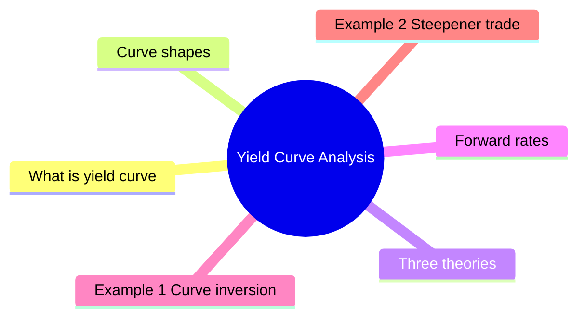

# Module 8: Yield Curve Analysis

Est. study time: 3h



## Learning Objectives
- Interpret yield curve shapes
- Explain expectations, liquidity preference, and market segmentation theories
- Calculate forward rates from spot rates
- Understand curve steepening/flattening
- Analyze curve as economic indicator

---

## Core Content

### What is yield curve?

Graph of yields vs maturity (usually Treasuries).

Normal shape: upward sloping (longer maturity = higher yield).

### Curve shapes

| Shape | Description | Signal |
|-------|-------------|--------|
| **Normal** | Upward sloping | Growth expected, term premium |
| **Flat** | Short = long yields | Transition phase |
| **Inverted** | Downward sloping | Recession expected (short > long) |
| **Humped** | Rise then fall | Mid-term uncertainty |

Inverted curve = strongest recession predictor (past 8 US recessions preceded by inversion).

How often does inversion happen? ~15% of months since 1960s. Typical inversion lasts 6-18 months. Lead time to recession: 6-24 months (average ~12 months). Not all inversions lead to recession (false positives: 1966, 1998 inverted briefly with no recession).

Question: If expectations theory alone explained curve, what shape would dominate? Answer: Flat (since expected future rates should be flat on average). Reality: upward-sloping most of time → term premium exists (liquidity preference).

### Three theories

**1. Expectations Theory**

Long-term yield = average of expected future short-term rates.

```text
(1 + y_2)^2 = (1 + y_1)(1 + E[f_1])
```

Implies forward rates = expected future spot rates.

Limitation: ignores term premium. Predicts flat curve on average — wrong.

**2. Liquidity Preference Theory**

Investors demand premium for holding longer-term bonds.

Forward rate = expected future rate + liquidity premium.

Explains normal upward slope. Term premium increases with maturity.

**3. Market Segmentation Theory**

Different investors prefer different maturities:
- Money market funds: short end
- Pension/insurance: long end
- Supply/demand within each segment determines rates

**Preferred Habitat**: variation — investors prefer certain maturities but will switch if premium is enough.

### Forward rates

Forward rate = rate for future period implied by spot curve.

2yr spot = 4%, 1yr spot = 3.5%. 1yr forward rate 1yr from now:

```text
(1.04)^2 = (1.035)(1 + f)
f = (1.04)^2 / 1.035 - 1 = 1.0816/1.035 - 1 = 4.50%
```

### Curve movements

| Movement | Description | Cause |
|----------|-------------|-------|
| **Parallel shift** | All yields change same amount | Broad rate move |
| **Steepening** | Long rates rise more or fall less than short | Growth expectations, inflation |
| **Flattening** | Short rates rise more or fall less than long | Tightening cycle |
| **Butterfly** | Curve curvature changes | Mid-term vs wings |

### Curve as economic indicator

- Inversion → recession 6-24 months later (reliable since 1960s)
- Steepening after inversion → recession imminent or recovery beginning
- Federal funds rate vs 10yr Treasury: most watched spread
- Curve steepness = proxy for growth + inflation expectations

### Swap curve

Interest rate swap curve complements Treasury curve.

- Treasuries: risk-free rate
- Swap curve: AA bank credit quality
- Swap spread = swap rate - Treasury rate (typically positive)

---

## Examples

### Example 1: Curve inversion

Jan 2023: 3-month T-Bill = 4.5%, 10yr Treasury = 3.5%.

Inversion = 4.5% - 3.5% = -100bp.

Signal: market expects economic slowdown → Fed will cut rates → long yields already falling in anticipation.

### Example 2: Steepener trade

Investor expects curve to steepen. Buys 30yr bond, shorts 2yr note.

If curve steepens: long bond price rises more or falls less than short position gains.

### Example 3: Private bank context

Client asks: "Should I extend duration now? Curve is flat."

Analysis: flat curve → little term premium. Extra yield for going 10yr vs 2yr is small. If recession comes, rates fall → longer bonds rally. Extension might pay off, but near-term volatility high.

---

## Common Misconception

**"Inverted curve = recession tomorrow."** No. Lead time is 6-24 months (average ~12). Curve can invert and re-steepen without recession (1966, 1998 false positives). Inversion raises recession probability, not certainty.

**"Expectations theory explains the curve."** No. Pure expectations theory predicts flat curve on average. Reality: persistent upward slope → term premium exists. Expectations component matters but liquidity premium dominates.

**"Steepener trade always works after inversion."** Curve dynamics depend on cause. If Fed tightening → steepener works as policy stalls. If recession already underway → curve bull-steepens (long yields fall less) but different trade.

**"Swap curve = Treasury curve + spread."** Not exactly. Swap curve embeds bank credit risk (AA) plus liquidity/balance sheet factors. Swap spread can go negative in stress (2011 USD swap spread briefly negative).

---


## Key Takeaways
- Normal = up. Inverted = down → recession signal
- Expectations theory: yield = avg of expected future rates
- Liquidity preference: term premium for longer bonds
- Segmentation: supply/demand in maturity silos
- Forward rates derived from spot curve
- Steepening/flattening = relative movement of short vs long
- Swap curve alternative benchmark

---

## Feynman Explain
Explain yield curve inversion to a client: "Why do long-term rates sometimes fall below short-term rates, and what does it mean?" Use simple economic story (growth expectations, Fed policy).

*Self-check: Can you explain why forward rates differ from expected future rates under liquidity preference theory?*


---

## Reframe
Critique yield curve as recession predictor: "Has inversion become less reliable?" Consider QE, global demand for Treasuries, structural low rates. Write your answer.

---

## Think

> **Think**: A client in 2006 hears the yield curve inverted in mid-2006. She asks: "Does this mean I should move to cash now?" The curve un-inverts in late 2007. The recession begins December 2007. Walk through what advice you would have given and what hindsight teaches about leading indicators.
>
> *Answer: An honest advisor would have said in mid-2006: "Inversion raises the probability of recession within 6-24 months, but it's not a sell signal by itself. The historical record is 8/8 US recessions preceded by inversion, but false positives exist (1966, 1998). Action items: tighten stop losses, review portfolio liquidity, consider raising cash allocation modestly, but DO NOT liquidate equity on the basis of one indicator." By late 2007 when the curve un-inverted, the recession was already imminent. The lesson: curve signals PROBABILITY, not TIMING. The 2007 inversion lasted 12+ months before recession started. Use inversion as one input to a multi-factor risk review, not a standalone trade trigger.*

---

## Predict

> **Predict**: Today the 2-year Treasury yields 4.50% and the 10-year Treasury yields 4.20% (inverted by 30bp). The Fed has signaled 100bp of cuts over the next 12 months. Predict direction of (a) the 2-year yield, (b) the 10-year yield, and (c) the curve shape over 12 months. Assume no recession surprise.
>
> *Answer: (a) 2-year yield FALLS substantially — it tracks the front-end policy expectations. 100bp of Fed cuts means new 2-year notes issued at lower rates; existing 2-year rallies toward new rate. (b) 10-year yield FALLS, but less than 2-year — the long end reflects growth/inflation expectations, not just policy. Typical: 10-year falls 30-50bp in easing cycles. (c) Curve UN-INVERTS and likely STEEPENS. The 2-year falls faster than the 10-year, so the spread normalizes. This is a "bull steepener" — both ends rally, but the front rallies more. The classic pattern following a Fed cutting cycle initiation.*

---

## Spot the Mistake

> **Spot the Mistake**: A junior says: "The 2-year yields 4% and the 10-year yields 4.5%. Under expectations theory, the market expects 2-year rates 2 years from now to be about 5%."
>
> Spot the calculation error and write the correct expected 2-year-2-years-forward rate.
>
> *Answer: The junior did linear arithmetic (4.5% - 4% = 0.5% added to 4% = 4.5%, then 4% + 0.5% × 4 ≈ 5%, but the actual math is geometric, not linear). Correct calculation: (1.045)^10 = (1.04)^2 × (1 + f)^8 → (1.045)^10 / (1.04)^2 = (1 + f)^8 → f = [(1.045)^10 / (1.04)^2]^(1/8) - 1 = [1.5529 / 1.0816]^(1/8) - 1 = [1.4357]^(0.125) - 1 ≈ 1.0464 - 1 = 4.64%. The market-implied 2-year rate starting in 2 years is ~4.64%, not 5%. Expectations theory uses compound interest, not simple interest. And: the 4.64% is just a break-even; liquidity preference theory says the actual expected rate is lower, with the 30bp gap being term premium.*

---

## Cloze

The Treasury {yield curve} plots yields against maturity. A {normal} curve slopes upward (term premium + growth expectations); an {inverted} curve slopes downward and has preceded every US recession since 1960. {Expectations theory} says long yields equal the average of expected future short rates; {liquidity preference theory} adds a term premium for holding longer maturities. {Forward rates} are derived from spot rates via compound interest, e.g. f = (1+y_n)^n / (1+y_m)^m - 1 for n>m. {Steepening} (long yields rise relative to short) and {flattening} (short yields rise relative to long) describe relative curve moves. The {swap curve} embeds AA bank credit and liquidity, not pure government risk.

---

## Drill
Take the quiz.

Run: `./scripts/learn.sh quiz fixed-income 08-yield-curve-analysis`
