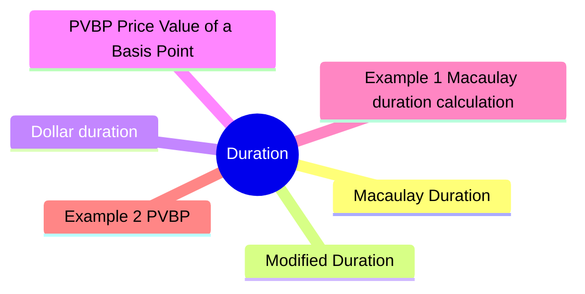

# Module 9: Duration

Est. study time: 3h



## Learning Objectives
- Calculate Macaulay duration
- Interpret modified duration as price sensitivity
- Calculate dollar duration and PVBP
- Understand key-rate duration for non-parallel shifts
- Measure portfolio duration

---

## Core Content

### Macaulay Duration

Weighted average time to receive cash flows (in years).

```text
Macaulay D = Σ [t × PV(CF_t)] / Σ PV(CF_t)
```

Each cash flow weighted by its present value contribution.

Higher coupon → lower duration. Longer maturity → higher duration.

Zero-coupon bond: Macaulay duration = maturity.

Question: Why use duration instead of just maturity? Answer: Maturity ignores coupon timing. Two 10yr bonds — one 6% coupon, one zero-coupon — have same maturity but very different rate sensitivity. Duration captures this.

### Modified Duration

Price sensitivity to yield changes.

Why Macaulay → Modified? Macaulay in years is intuitive but not directly useful for P&L. Modified D converts to % price change per 1% yield move — practical for risk reporting, limits, hedging.

```text
Modified D = Macaulay D / (1 + YTM / periods_per_year)
```

```text
Price change ≈ -Modified D × Δyield × Price
```

Example: Modified D = 5.6, yield +0.5% (50bp).
P/L ≈ -5.6 × 0.005 × Price = -2.8%

Good approximation for small changes.

### Dollar duration

Dollar price change per 100bp yield change.

```text
Dollar D = Modified D × Price
```

Used for hedging. Long bond → negative dollar duration (price falls when yield rises).

### PVBP (Price Value of a Basis Point)

Dollar price change per 1bp yield change.

```text
PVBP = Dollar duration × 0.0001 (per $1 face) or Modified D × Price × 0.0001
```

Also called DV01 (Dollar Value of 01).

### Duration determinants

| Factor | Higher duration when... |
|--------|------------------------|
| **Maturity** | Longer maturity |
| **Coupon** | Lower coupon |
| **Yield** | Lower yield |
| **Payment frequency** | Less frequent |

Longest duration: long-maturity zero-coupon bonds.

### Key-rate duration

Sensitivity to yield change at specific maturity point.

Portfolio may have different sensitivity to 2yr vs 10yr moves.

Key-rate durations for 2yr, 5yr, 10yr, 30yr.

Sum of key-rate durations = modified duration.

Used for:
- Barbell vs bullet analysis
- Curve steepener/flattener hedging
- Relative value trades

### Portfolio duration

Weighted average of individual bond durations.

```text
Portfolio D = Σ w_i × D_i
```

Limitation: assumes parallel shifts. Key-rate gives better picture.

### Limitations of duration

- **Linear approximation**: accurate for small moves only
- **Parallel shift assumption**: non-parallel shifts matter
- **Convexity ignored**: duration underestimates price rise, overestimates price fall
- **Spread duration**: corporate bonds have spread duration (sensitivity to credit spread)

---

## Examples

### Example 1: Macaulay duration calculation

2yr bond, 5% coupon annual, YTM 4%, face $1,000.

| Year | CF | PV @ 4% | PV × t |
|------|----|---------|--------|
| 1 | $50 | $48.08 | $48.08 |
| 2 | $1,050 | $970.87 | $1,941.74 |
| Total | | $1,018.95 | $1,989.82 |

Macaulay D = $1,989.82 / $1,018.95 = 1.95 years

Modified D = 1.95 / 1.04 = 1.88

If yield +1% → price ≈ -1.88 × 1% = -1.88% → new price ≈ $1,018.95 × 0.9812 = $999.80

### Example 2: PVBP

Bond price = $105, modified D = 4.5.

PVBP = 4.5 × $105 × 0.0001 = $0.04725 per $100 face.

For $1M face: PVBP = $0.04725 × 10,000 = $472.50 per bp.

Hedge: short Treasury futures. Notional needed = PVBP_portfolio / PVBP_futures.

### Example 3: Private bank context

Client holds $5M 10yr Treasuries, D = 8.5. Expects rates to rise 25bp.

Expected loss ≈ -8.5 × 0.0025 × $5M = -$106,250.

Advise: reduce duration (sell 10yr, buy 2yr) or hedge with futures/swap.

---

## Common Misconception

"Duration 5 = I get my money back in 5 years." No. Duration is weighted avg time of cash flows, not payback period. For coupon bond, duration < maturity because early coupons pull avg forward.

> **Predict**: Before reading deeper: what do you expect happens when macaulay duration interacts with modified duration in duration?
>
> *Answer: The system relies on macaulay duration to keep modified duration predictable — when both apply, the stricter rule wins.*
> **Think**: How does **Macaulay Duration** relate to **Modified Duration** within duration?
>
> *Answer: They address adjacent failure modes: macaulay duration governs the primary behavior, while modified duration constrains how far you can push it.*
> **Cloze**: {blank} governs how duration behaves when multiple modified duration concerns collide.
> **Cloze**: The rule that keeps macaulay duration correct under load is called {blank}.
> **Cloze**: In duration, dollar duration determines {blank}.
> **Spot the Mistake**: A developer treats macaulay duration as optional because "it works without it." Where is the mistake?
>
> *Answer: It works only until the assumptions behind macaulay duration are violated. The fix: treat it as part of the contract of duration, not an optimization.*


## Key Takeaways
- Macaulay D = weighted avg time to cash flows. Modified D = price sensitivity
- Dollar D / PVBP: hedging tools. 1bp = 0.01%
- Higher coupon → lower D. Longer maturity → higher D
- Key-rate D: sensitivity to specific maturities
- Portfolio D = weighted average (parallel shift assumption)
- Linear approximation only — breaks for large moves (need convexity)

---

## Feynman Explain
Explain duration to a colleague: "What does 'duration 7 years' really mean for a $1M bond position?" Connect to price change when rates move 1%.

*Self-check: Can you explain why a zero-coupon bond has higher duration than a coupon bond with same maturity?*


---

## Reframe
Critique duration as risk measure: "When does duration mislead?" Consider: bonds with embedded options (callable, MBS), very large rate moves, non-parallel curve shifts. Write your answer.

---

## Drill
Take the quiz.

Run: `./scripts/learn.sh quiz fixed-income 09-duration`
