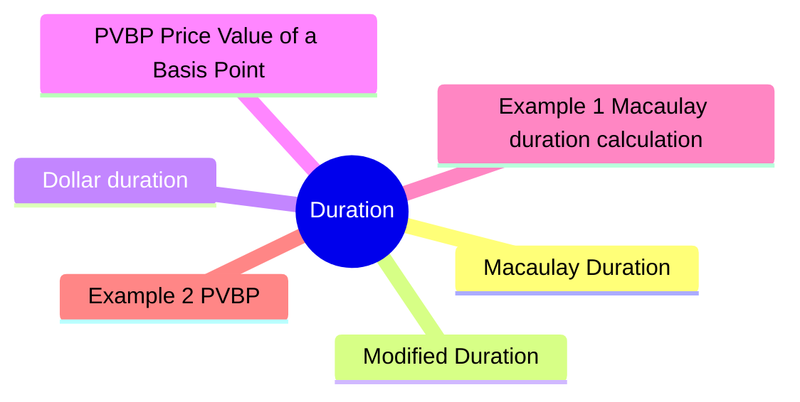

# Module 9: Duration

Est. study time: 3h



## Learning Objectives
- Calculate Macaulay duration
- Interpret modified duration as price sensitivity
- Calculate dollar duration and PVBP
- Understand key-rate duration for non-parallel shifts
- Measure portfolio duration

---

## Core Content

### Macaulay Duration

Weighted average time to receive cash flows (in years).

```text
Macaulay D = Σ [t × PV(CF_t)] / Σ PV(CF_t)
```

Each cash flow weighted by its present value contribution.

Higher coupon → lower duration. Longer maturity → higher duration.

Zero-coupon bond: Macaulay duration = maturity.

Question: Why use duration instead of just maturity? Answer: Maturity ignores coupon timing. Two 10yr bonds — one 6% coupon, one zero-coupon — have same maturity but very different rate sensitivity. Duration captures this.

### Modified Duration

Price sensitivity to yield changes.

Why Macaulay → Modified? Macaulay in years is intuitive but not directly useful for P&L. Modified D converts to % price change per 1% yield move — practical for risk reporting, limits, hedging.

```text
Modified D = Macaulay D / (1 + YTM / periods_per_year)
```

```text
Price change ≈ -Modified D × Δyield × Price
```

Example: Modified D = 5.6, yield +0.5% (50bp).
P/L ≈ -5.6 × 0.005 × Price = -2.8%

Good approximation for small changes.

### Dollar duration

Dollar price change per 100bp yield change.

```text
Dollar D = Modified D × Price
```

Used for hedging. Long bond → negative dollar duration (price falls when yield rises).

### PVBP (Price Value of a Basis Point)

Dollar price change per 1bp yield change.

```text
PVBP = Dollar duration × 0.0001 (per $1 face) or Modified D × Price × 0.0001
```

Also called DV01 (Dollar Value of 01).

### Duration determinants

| Factor | Higher duration when... |
|--------|------------------------|
| **Maturity** | Longer maturity |
| **Coupon** | Lower coupon |
| **Yield** | Lower yield |
| **Payment frequency** | Less frequent |

Longest duration: long-maturity zero-coupon bonds.

### Key-rate duration

Sensitivity to yield change at specific maturity point.

Portfolio may have different sensitivity to 2yr vs 10yr moves.

Key-rate durations for 2yr, 5yr, 10yr, 30yr.

Sum of key-rate durations = modified duration.

Used for:
- Barbell vs bullet analysis
- Curve steepener/flattener hedging
- Relative value trades

### Portfolio duration

Weighted average of individual bond durations.

```text
Portfolio D = Σ w_i × D_i
```

Limitation: assumes parallel shifts. Key-rate gives better picture.

### Limitations of duration

- **Linear approximation**: accurate for small moves only
- **Parallel shift assumption**: non-parallel shifts matter
- **Convexity ignored**: duration underestimates price rise, overestimates price fall
- **Spread duration**: corporate bonds have spread duration (sensitivity to credit spread)

---

## Examples

### Example 1: Macaulay duration calculation

2yr bond, 5% coupon annual, YTM 4%, face $1,000.

| Year | CF | PV @ 4% | PV × t |
|------|----|---------|--------|
| 1 | $50 | $48.08 | $48.08 |
| 2 | $1,050 | $970.87 | $1,941.74 |
| Total | | $1,018.95 | $1,989.82 |

Macaulay D = $1,989.82 / $1,018.95 = 1.95 years

Modified D = 1.95 / 1.04 = 1.88

If yield +1% → price ≈ -1.88 × 1% = -1.88% → new price ≈ $1,018.95 × 0.9812 = $999.80

### Example 2: PVBP

Bond price = $105, modified D = 4.5.

PVBP = 4.5 × $105 × 0.0001 = $0.04725 per $100 face.

For $1M face: PVBP = $0.04725 × 10,000 = $472.50 per bp.

Hedge: short Treasury futures. Notional needed = PVBP_portfolio / PVBP_futures.

### Example 3: Private bank context

Client holds $5M 10yr Treasuries, D = 8.5. Expects rates to rise 25bp.

Expected loss ≈ -8.5 × 0.0025 × $5M = -$106,250.

Advise: reduce duration (sell 10yr, buy 2yr) or hedge with futures/swap.

---

## Common Misconception

**"Duration 5 = I get money back in 5 years."** No. Duration = weighted average time of cash flows, NOT payback period. For coupon bonds, duration < maturity (early coupons pull avg forward). Zero-coupon bond duration = maturity only because all cash flow at one date.

**"Modified duration works for any rate move."** No. Linear approximation accurate only for small changes (< 50bp). For larger moves, convexity adjustment needed (Module 10). Underestimates price gains in rallies, overestimates losses in selloffs.

**"Portfolio duration = simple weighted avg."** Only for parallel yield curve shifts. If 2yr moves but 10yr doesn't, simple duration misleading. Key-rate duration or effective duration required.

**"Duration applies to bonds only."** Modified/convexity concepts apply to any fixed cash flow stream: loans, mortgages, swaps. Swap has duration too (zero coupon swap = par-par swap with duration zero, but fixed leg has duration).

---


## Key Takeaways
- Macaulay D = weighted avg time to cash flows. Modified D = price sensitivity
- Dollar D / PVBP: hedging tools. 1bp = 0.01%
- Higher coupon → lower D. Longer maturity → higher D
- Key-rate D: sensitivity to specific maturities
- Portfolio D = weighted average (parallel shift assumption)
- Linear approximation only — breaks for large moves (need convexity)

---

## Feynman Explain
Explain duration to a colleague: "What does 'duration 7 years' really mean for a $1M bond position?" Connect to price change when rates move 1%.

*Self-check: Can you explain why a zero-coupon bond has higher duration than a coupon bond with same maturity?*


---

## Reframe
Critique duration as risk measure: "When does duration mislead?" Consider: bonds with embedded options (callable, MBS), very large rate moves, non-parallel curve shifts. Write your answer.

---

## Think

> **Think**: A pension fund has a 7-year liability (payments due in 7 years for retirees). The CIO wants to "match" the duration. The portfolio holds a mix of 5-year (duration 4.5) and 15-year (duration 11) Treasuries. A junior suggests a 50/50 mix has duration (4.5 + 11)/2 = 7.75 — close enough. What's the error, and what should the CIO actually do?
>
> *Answer: The junior calculated the simple average, not the portfolio duration weighted by market value. The correct calc: if equal DOLLAR weight (50/50), portfolio duration = 0.5 × 4.5 + 0.5 × 11 = 7.75. That actually matches. But: (1) Macaulay duration measures cash flow timing, not interest rate sensitivity in isolation. For a 7-year bullet liability, a 7-year zero-coupon bond is the perfect match. (2) The simple average only works for parallel shifts. The 5-yr and 15-yr respond differently to curve reshaping (e.g., bear steepener). (3) The CIO should use key-rate duration or cash flow matching, not a duration number, to immunize a specific liability. The fix: a 7-year zero or a barbell whose combined PV-weighted key rates match the liability's cash flow profile.*

---

## Predict

> **Predict**: A bond fund holds a 10-year Treasury with modified duration 8.5, currently yielding 4.5%. The Fed signals 100bp of cuts over 12 months. Assuming the 10-year yield falls by 80bp (less than Fed funds because of term premium dynamics), predict the bond's price return over the period.
>
> *Answer: Price change ≈ -Modified D × Δyield = -8.5 × (-0.0080) = +6.8%. A 10-year Treasury with $1,000 face currently at par → new price ≈ $1,068. Return = 6.8% price gain + ~4.5% coupon income (less reinvestment drag) ≈ 11% total return. This is exactly the scenario where long-duration assets outperform — a classic "duration tailwind" in Fed cutting cycles. The flip side: if Fed INSTEAD hikes 100bp, the same fund loses ~8.5% before coupon. Duration is a double-edged sword.*

---

## Spot the Mistake

> **Spot the Mistake**: A junior says: "The bond has duration 7, so I'll get my money back in 7 years. That means in 7 years the bond returns face value, regardless of what happens to interest rates in the meantime."
>
> Two errors. Identify each.
>
> *Answer: Error 1: Duration is NOT payback period. It's the weighted average TIME of cash flows. For a 5-year bond with 8% coupon, duration is ~4 years — you get some money back before year 5. The 7-year number doesn't mean "principal arrives in 7 years"; it means the average cash flow timing is at year 7. Error 2: Duration has nothing to do with the bond returning face value at maturity. The bond returns face value at maturity BY CONTRACT (assuming no default), regardless of rate moves. What duration tells you is how MUCH the bond's PRICE changes if rates move before maturity. The junior has confused a price-sensitivity measure with a payback-period claim.*

---

## Cloze

{Macaulay duration} is the weighted-average time to receive a bond's cash flows, weighted by their present value. {Modified duration} = Macaulay D / (1 + YTM/k) and approximates the percentage price change for a 1% yield change. {Dollar duration} = Modified D × Price, and {PVBP} (or DV01) = Dollar duration × 0.0001, the dollar change per 1bp yield move. Duration increases with longer {maturity}, lower {coupon}, and lower yield. {Key-rate duration} decomposes total duration into sensitivity to specific maturity points, useful for non-parallel curve shifts. Duration is a {linear approximation} — accurate for small moves only; large moves need {convexity} adjustment.

---

## Drill
Take the quiz.

Run: `./scripts/learn.sh quiz fixed-income 09-duration`
