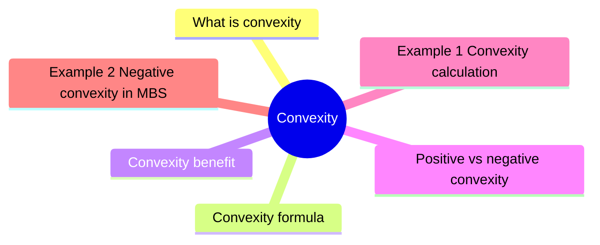

# Module 10: Convexity

Est. study time: 2h



## Learning Objectives
- Explain convexity and why it matters
- Calculate convexity adjustment
- Distinguish positive vs negative convexity
- Compare barbell vs bullet convexity
- Use convexity in portfolio management

---

## Core Content

### What is convexity?

Duration is linear approximation of price-yield curve.

Actual price-yield curve is convex (curved, not straight).

**Convexity** = curvature measure. Improves price change estimate.

Without convexity: `ΔP/P ≈ -D_mod × Δy`

With convexity: `ΔP/P ≈ -D_mod × Δy + 0.5 × Convexity × (Δy)^2`

### Convexity formula

```text
Convexity = [Σ t(t+1) × PV(CF_t)] / [P × (1+y)^2]
```

For semi-annual: divide by (1+y/2)^2 instead.

### Convexity benefit

Convexity always positive for straight bonds (no options):

- Rates fall → price rises MORE than duration predicts
- Rates rise → price falls LESS than duration predicts

Investors profit from convexity in volatile markets.

Why is this mechanical? Pull-to-par: as time passes, price-yield relationship becomes less curved (shorter maturity → less convex). This convergence is not driven by rates — pure math of discounting.

### Positive vs negative convexity

| Type | Description | Examples |
|------|-------------|----------|
| **Positive** | Price-yield curve bends upward. Good for holder | Straight bonds, Treasuries |
| **Negative** | Price-yield curve bends downward. Bad for holder | Callable bonds, MBS (prepayment) |

Callable bond: as rates fall, price capped at call price → negative convexity.

MBS: as rates fall, prepayment surges → price appreciation limited → negative convexity.

### Convexity adjustment

```text
Price change = -D × Δy + 0.5 × C × (Δy)^2
```

Example: D = 6.0, C = 50, Δy = -1% (rates fall 1%)

Duration only: +6.0%
With convexity: +6.0% + 0.5 × 50 × (0.01)^2 = +6.0% + 0.25% = +6.25%

For Δy = +1% (rates rise):
Duration only: -6.0%
With convexity: -6.0% + 0.25% = -5.75%

Convexity dampens loss in rising rates, boosts gain in falling rates.

### Barbell vs bullet

| Strategy | Composition | Convexity |
|----------|-------------|-----------|
| **Bullet** | Single intermediate maturity | Lower |
| **Barbell** | Short + long maturities | Higher (same duration) |

Barbell has higher convexity than bullet with same duration.

Investor pays for convexity (barbell yields slightly less).

### Why convexity matters

- Large rate moves: duration-only estimate inaccurate
- Volatile markets: convexity adds value (asymmetric price response)
- Portfolio hedging: convexity mismatch creates risk
- Negative convexity: embedded options hurt performance in rally

Question: How large must a rate move be for convexity to matter? Answer: For IG bonds (C=50-100), 100bp move adds ~0.25-0.5% to price estimate. Below 25bp, convexity adjustment <0.03% — negligible. Rule of thumb: convexity matters when |Δy| > 50bp.

---

## Examples

### Example 1: Convexity calculation

Bond price $105, D_mod = 5.0, C = 60. Yield changes from 5% to 4.5% (-50bp).

Duration effect: -5.0 × (-0.005) = +2.50%
Convexity effect: 0.5 × 60 × (0.005)^2 = 0.5 × 60 × 0.000025 = 0.00075 = 0.075%

Total estimate: +2.575%

Actual (exact): likely ~2.58%. Duration alone would say 2.50%.

### Example 2: Negative convexity in MBS

Agency MBS with D = 4.0. Rates fall 1%.

Positive convexity bond (Treasury): price change ≈ +4.0% + convexity boost.

MBS: rates fall → prepayment speeds → average life shortens → duration shortens → price gain capped at ~2.5%.

MBS has negative convexity: duration falls as rates fall, rises as rates rise.

### Example 3: Private bank context

Client holds callable corporate bond. Rates rally (fall 1%).

Duration says +6.0%. But bond is callable → negative convexity → price capped at call price → gains only ~4.5%.

Client disappointed: "My bond didn't rally as much as Treasuries."

Explain: "Bond is callable. Issuer can refinance at lower rate → price appreciation capped. You received higher yield initially but sacrificed upside."

---

## Common Misconception

**"Convexity always benefits bondholders."** True for straight (option-free) bonds. But:
- **You pay for convexity**: barbell yields less than bullet at same duration (~5-15bp depending on rates)
- **Negative convexity** (MBS, callables): hurts holders in rallies, helps in selloffs
- **Convexity timing**: positive convexity value realized only with rate volatility, not in stable environment

**"Higher convexity always better."** For long-term investors with rate uncertainty, yes. For liability-matching where rates stable, extra convexity may not justify yield sacrifice.

**"Convexity and duration are independent."** No. They're expansions of the same Taylor series. Duration = first derivative, convexity = second. Bond with high duration usually has high convexity.

**"Negative convexity always means loss."** No — only in rate rallies. In selloffs, negative convexity helps (price falls less than duration predicts).

---


## Key Takeaways
- Convexity corrects duration's linear approximation
- Positive convexity: gains > losses for same yield move. Good.
- Negative convexity: losses > gains. Bad. (Callable, MBS)
- Barbell > bullet convexity (at same duration)
- Convexity adjustment: +0.5 × C × (Δy)^2
- Negative convexity hurts most in rate rallies

---

## Feynman Explain
Explain convexity to a junior trader: "Why does a bond gain MORE when rates fall than it loses when rates rise?" Use graph of curvy line vs straight line.

*Self-check: Can you explain why MBS has negative convexity and how that affects performance in a rate rally?*


---

## Reframe
When is convexity unimportant? (Small rate moves, short maturity bonds, held to maturity.) When is it critical? (Large rate shocks, option-embedded bonds, levered portfolios.) Write your answer.

---

## Think

> **Think**: A pension fund is choosing between a 10-year bullet Treasury (D=8.5, C=72) and a barbell of 2-year + 30-year Treasuries (D=8.5, C=85). Both have the same duration. The bullet yields 4.40%; the barbell yields 4.30%. The CIO expects significant rate volatility over the next 5 years. Which should the fund pick and why?
>
> *Answer: The barbell, despite yielding 10bp less. The barbell has 13 units MORE convexity (85 vs 72). In a volatile environment, the convexity advantage compounds — every rate move, up or down, slightly favors the barbell. Over 5 years of typical 50-100bp annual rate swings, the convexity gain on $100M position could be $1-3M cumulative, vastly exceeding the static 10bp × $100M = $100K annual yield sacrifice. Plus, the short end provides liquidity and reinvestment optionality; the long end captures term premium. The trade-off: pay 10bp/yr for a convexity hedge against rate volatility. If volatility is LOW (Fed in steady state, no major events), the bullet wins by the 10bp/yr. The CIO's volatility forecast determines the choice.*

---

## Predict

> **Predict**: A 5-year municipal bond (D=4.5, C=30) and a comparable 5-year Treasury (D=4.5, C=35) both have the same duration. Predict which performs better in (a) a 100bp rally, (b) a 100bp selloff, and (c) a stable rate environment. Use only convexity and ignore credit.
>
> *Answer: (a) Rally: Treasury outperforms. D=4.5 + 0.5 × 35 × (0.01)^2 = +4.5% + 1.75% = +6.25%. Muni: +4.5% + 0.5 × 30 × (0.01)^2 = +4.5% + 1.5% = +6.0%. Treasury wins by 25bp. (b) Selloff: Treasury loses less. -4.5% + 1.75% = -2.75% vs muni -4.5% + 1.5% = -3.0%. Treasury wins by 25bp. (c) Stable rates: Treasury yields more (muni tax-equivalent aside), so Treasury wins again. The Treasury wins in all three scenarios because it has higher convexity (35 vs 30). Higher convexity is a free option in volatile environments; in stable environments, you just collect the higher Treasury coupon.*

---

## Spot the Mistake

> **Spot the Mistake**: A junior says: "A callable corporate bond has positive convexity, just like a Treasury. Convexity always helps bondholders."
>
> Identify the error and explain why callable bonds differ.
>
> *Answer: The error: callable bonds have NEGATIVE convexity in the region where the option is in-the-money (rates well below coupon). When rates fall, the issuer's option to call becomes valuable — they will call the bond and refinance at lower rates. The bondholder's upside is CAPPED at the call price. As rates fall further, the bond price approaches the call price asymptotically instead of rising further. The price-yield curve is concave (bent downward) in that region — negative convexity. A Treasury has no such cap; its price can rise indefinitely as rates fall. The junior has confused "option-free" with "option-embedded" bonds. Callable bondholders get higher coupon (compensation for giving up upside) but lose convexity protection.*

---

## Cloze

{Convexity} is the second-derivative measure of the price-yield curve, correcting duration's linear approximation. For option-free bonds, convexity is {positive}: price rises MORE than duration predicts in a rally, falls LESS in a selloff. The full price change estimate is ΔP/P ≈ -{Modified D × Δy} + {0.5 × C × (Δy)^2}. {Negative convexity} arises in callable bonds and MBS — the embedded option caps upside. {Barbell} portfolios (short + long maturities) have higher convexity than {bullet} portfolios (single intermediate maturity) at the same duration, but yield slightly less. Convexity matters for moves >{50}bp; for small moves it's negligible.

---

## Drill
Take the quiz.

Run: `./scripts/learn.sh quiz fixed-income 10-convexity`
