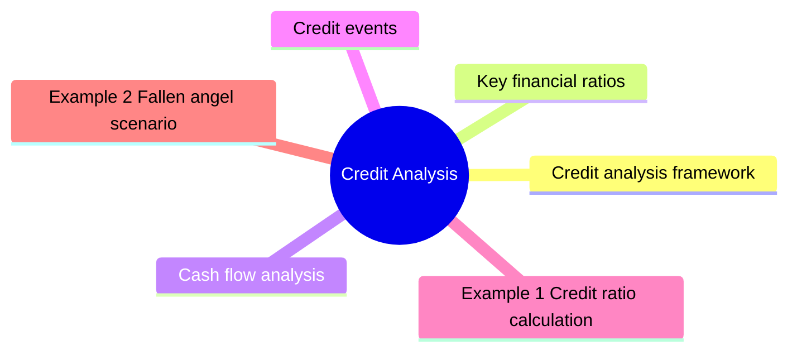

# Module 11: Credit Analysis

Est. study time: 2.5h

## Learning Objectives
- Analyze financial ratios for credit assessment
- Identify credit events and triggers
- Evaluate downgrade risk and fallen angels
- Understand recovery analysis
- Apply framework across IG and HY

---

## Core Content

### Credit analysis framework

**Four Cs of Credit:**
1. **Capacity**: ability to repay (cash flow)
2. **Collateral**: assets securing debt
3. **Covenants**: legal protections
4. **Character**: management quality, track record

### Key financial ratios

| Ratio | Formula | Investment grade | High yield |
|-------|---------|------------------|------------|
| **Debt/EBITDA** | Total debt / EBITDA | < 2.5x | 3-6x |
| **EBITDA/Interest** | EBITDA / interest expense | > 8x | 2-4x |
| **FFO/Debt** | Funds from ops / debt | > 30% | 10-20% |
| **FCF/Debt** | Free cash flow / debt | > 10% | 0-5% |

### Cash flow analysis

Three sources:
- **Operating CF**: core business cash generation (most important)
- **Investing CF**: capex, acquisitions (drain)
- **Financing CF**: debt issuance, equity, dividends

Credit analyst focuses on: EBITDA, FFO, FCF, capex, dividends.

### Credit events

| Event | Description | Impact |
|-------|-------------|--------|
| **Missed payment** | Coupon/principal not paid on time | Default if not cured |
| **Cross-default** | Default on one bond triggers default on all | Broad acceleration |
| **Covenant breach** | Violation of negative/affirmative covenant | Potential default |
| **Bankruptcy filing** | Chapter 11 (reorg) or Chapter 7 (liquidation) | Bondholder recovery process |
| **Distressed exchange** | Bond swap at terms worse than original | Technical default |

Question: Cross-default sounds harsh — does it apply automatically? Answer: Usually requires acceleration vote by bondholders. Not automatic. Gives creditors negotiating leverage.

### Downgrade risk

Rating migration matrix: probability of moving from one rating to another.

| From / To | AAA | AA | A | BBB | BB | B | Default |
|-----------|-----|----|---|-----|----|---|---------|
| **BBB** | 0% | 1% | 8% | 85% | 4% | 1% | 1% |
| **BB** | 0% | 0% | 1% | 10% | 78% | 8% | 3% |

**Fallen angel**: downgraded from IG to HY. Causes forced selling by IG mandates.

**Rising star**: upgraded from HY to IG. Price rally as new buyers enter.

### Sector analysis

Different industries have different credit metrics:

| Sector | EBITDA/Interest typical | Key risk |
|--------|------------------------|----------|
| Utilities | 3-5x | Regulation, capex |
| Technology | 10-30x | Disruption |
| Energy | 4-8x | Commodity price |
| Healthcare | 4-6x | Patent cliff, regulation |
| Retail | 3-5x | Competition, margins |
| Financials | N/A (different metrics) | Capital, NPLs |

Default rate varies by sector: utilities ~0.2%/yr, technology ~0.5%/yr, energy ~2-8%/yr (commodity cycle dependent), retail ~3-6%/yr (structural decline). Sector matters as much as rating.

### Recovery analysis

Value of collateral + cash flows in default.

Secured vs unsecured recovery waterfall.

Liquidation analysis vs going-concern valuation.

Recovery ratings: LGD (Loss Given Default) assessment.

---

## Examples

### Example 1: Credit ratio calculation

Company: Debt = $5B, EBITDA = $1.8B, Interest = $250M

Debt/EBITDA = $5B / $1.8B = 2.78x (OK for IG)
EBITDA/Interest = $1.8B / $250M = 7.2x (weak for IG, borderline)

Assessment: weak coverage. If EBITDA falls → coverage deteriorates → downgrade risk.

### Example 2: Fallen angel scenario

BBB-rated retailer. Earnings decline → Debt/EBITDA rises to 4.5x → S&P downgrades to BB+.

Price impact: bonds drop 5-15% as IG forced sellers exit.
Opportunity for HY funds to buy at discount.

### Example 3: Private bank context

Client holds $3M of BBB telecom bonds. Analyst reports showing leverage increasing due to spectrum auction spending.

Action: monitor covenant headroom. Consider hedging with CDS or reducing position before potential downgrade.

---

## Common Misconception

"Strong ratios = safe bond." Enron had healthy ratios pre-collapse. Ratios measure capacity, not character or accounting quality. Qualitative factors (management, competitive moat, accounting policies) matter as much.

> **Predict**: Before reading deeper: what do you expect happens when credit analysis interacts with cash flow in credit analysis?
>
> *Answer: The system relies on credit analysis to keep cash flow predictable — when both apply, the stricter rule wins.*
> **Think**: How does **Credit analysis framework** relate to **Key financial ratios** within credit analysis?
>
> *Answer: They address adjacent failure modes: credit analysis framework governs the primary behavior, while key financial ratios constrains how far you can push it.*
> **Cloze**: {blank} governs how credit analysis behaves when multiple cash flow concerns collide.
> **Cloze**: The rule that keeps credit analysis correct under load is called {blank}.
> **Cloze**: In credit analysis, credit events determines {blank}.
> **Spot the Mistake**: A developer treats credit analysis as optional because "it works without it." Where is the mistake?
>
> *Answer: It works only until the assumptions behind credit analysis are violated. The fix: treat it as part of the contract of credit analysis, not an optimization.*

## Key Takeaways
- Four Cs: Capacity, Collateral, Covenants, Character
- Key ratios: Debt/EBITDA, EBITDA/Interest, FFO/Debt
- Credit events: missed payment, cross-default, covenant breach
- Fallen angel: IG to HY → forced selling pressure
- Different sectors have different leverage norms
- Recovery analysis determines expected loss given default

---

## Feynman Explain
Explain credit analysis to a client: "How do you decide if a company can pay back its debt?" Use personal finance analogy (mortgage approval — income, existing debt, savings).

*Self-check: Can you explain why a fallen angel bond might be a good buying opportunity for HY investors?*

---

## Reframe
Critique reliance on credit ratios: "Do financial ratios predict default?" Consider: Enron had healthy ratios pre-collapse, accounting manipulation, and the role of qualitative factors. Write your answer.

---

## Drill
Take the quiz.

Run: `./scripts/learn.sh quiz fixed-income 11-credit-analysis`
