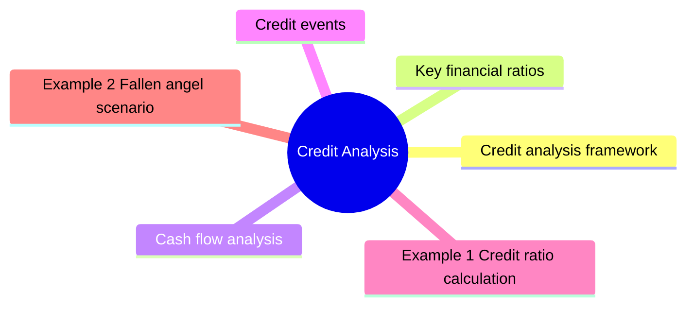

# Module 11: Credit Analysis

Est. study time: 2.5h

## Learning Objectives
- Analyze financial ratios for credit assessment
- Identify credit events and triggers
- Evaluate downgrade risk and fallen angels
- Understand recovery analysis
- Apply framework across IG and HY

---

## Core Content

### Credit analysis framework

**Four Cs of Credit:**
1. **Capacity**: ability to repay (cash flow)
2. **Collateral**: assets securing debt
3. **Covenants**: legal protections
4. **Character**: management quality, track record

### Key financial ratios

| Ratio | Formula | Investment grade | High yield |
|-------|---------|------------------|------------|
| **Debt/EBITDA** | Total debt / EBITDA | < 2.5x | 3-6x |
| **EBITDA/Interest** | EBITDA / interest expense | > 8x | 2-4x |
| **FFO/Debt** | Funds from ops / debt | > 30% | 10-20% |
| **FCF/Debt** | Free cash flow / debt | > 10% | 0-5% |

### Cash flow analysis

Three sources:
- **Operating CF**: core business cash generation (most important)
- **Investing CF**: capex, acquisitions (drain)
- **Financing CF**: debt issuance, equity, dividends

Credit analyst focuses on: EBITDA, FFO, FCF, capex, dividends.

### Credit events

| Event | Description | Impact |
|-------|-------------|--------|
| **Missed payment** | Coupon/principal not paid on time | Default if not cured |
| **Cross-default** | Default on one bond triggers default on all | Broad acceleration |
| **Covenant breach** | Violation of negative/affirmative covenant | Potential default |
| **Bankruptcy filing** | Chapter 11 (reorg) or Chapter 7 (liquidation) | Bondholder recovery process |
| **Distressed exchange** | Bond swap at terms worse than original | Technical default |

Question: Cross-default sounds harsh — does it apply automatically? Answer: Usually requires acceleration vote by bondholders. Not automatic. Gives creditors negotiating leverage.

### Downgrade risk

Rating migration matrix: probability of moving from one rating to another.

| From / To | AAA | AA | A | BBB | BB | B | Default |
|-----------|-----|----|---|-----|----|---|---------|
| **BBB** | 0% | 1% | 8% | 85% | 4% | 1% | 1% |
| **BB** | 0% | 0% | 1% | 10% | 78% | 8% | 3% |

**Fallen angel**: downgraded from IG to HY. Causes forced selling by IG mandates.

**Rising star**: upgraded from HY to IG. Price rally as new buyers enter.

### Sector analysis

Different industries have different credit metrics:

| Sector | EBITDA/Interest typical | Key risk |
|--------|------------------------|----------|
| Utilities | 3-5x | Regulation, capex |
| Technology | 10-30x | Disruption |
| Energy | 4-8x | Commodity price |
| Healthcare | 4-6x | Patent cliff, regulation |
| Retail | 3-5x | Competition, margins |
| Financials | N/A (different metrics) | Capital, NPLs |

Default rate varies by sector: utilities ~0.2%/yr, technology ~0.5%/yr, energy ~2-8%/yr (commodity cycle dependent), retail ~3-6%/yr (structural decline). Sector matters as much as rating.

### Recovery analysis

Value of collateral + cash flows in default.

Secured vs unsecured recovery waterfall.

Liquidation analysis vs going-concern valuation.

Recovery ratings: LGD (Loss Given Default) assessment.

---

## Examples

### Example 1: Credit ratio calculation

Company: Debt = $5B, EBITDA = $1.8B, Interest = $250M

Debt/EBITDA = $5B / $1.8B = 2.78x (OK for IG)
EBITDA/Interest = $1.8B / $250M = 7.2x (weak for IG, borderline)

Assessment: weak coverage. If EBITDA falls → coverage deteriorates → downgrade risk.

### Example 2: Fallen angel scenario

BBB-rated retailer. Earnings decline → Debt/EBITDA rises to 4.5x → S&P downgrades to BB+.

Price impact: bonds drop 5-15% as IG forced sellers exit.
Opportunity for HY funds to buy at discount.

### Example 3: Private bank context

Client holds $3M of BBB telecom bonds. Analyst reports showing leverage increasing due to spectrum auction spending.

Action: monitor covenant headroom. Consider hedging with CDS or reducing position before potential downgrade.

---

## Common Misconception

**"Strong ratios = safe bond."** No. Enron, WorldCom, Lehman all had healthy ratios pre-collapse. Ratios measure capacity but ignore:
- Accounting quality (revenue recognition, off-balance-sheet)
- Character/management (fraud risk)
- Liquidity (ratios backward-looking)
- Industry structure (cyclicality)

**"Lower Debt/EBITDA always better."** No — sector matters. Utilities run 5-6x normally; tech 1-2x. Compare within sector, not across.

**"Rating downgrade = default imminent."** No. Downgrade signals deterioration, not immediate default. Time from downgrade to default varies: investment grade can take years (often avoids default entirely); distressed credits already in default proceedings.

**"Cross-default applies automatically."** No. Usually requires bondholder vote to accelerate. Provides negotiating leverage, not automatic trigger.

---

## Key Takeaways
- Four Cs: Capacity, Collateral, Covenants, Character
- Key ratios: Debt/EBITDA, EBITDA/Interest, FFO/Debt
- Credit events: missed payment, cross-default, covenant breach
- Fallen angel: IG to HY → forced selling pressure
- Different sectors have different leverage norms
- Recovery analysis determines expected loss given default

---

## Feynman Explain
Explain credit analysis to a client: "How do you decide if a company can pay back its debt?" Use personal finance analogy (mortgage approval — income, existing debt, savings).

*Self-check: Can you explain why a fallen angel bond might be a good buying opportunity for HY investors?*

---

## Reframe
Critique reliance on credit ratios: "Do financial ratios predict default?" Consider: Enron had healthy ratios pre-collapse, accounting manipulation, and the role of qualitative factors. Write your answer.

---

## Think

> **Think**: A BBB-rated industrial company reports Debt/EBITDA of 3.0x, EBITDA/Interest of 6.0x. Ratios look fine for IG. The CFO recently changed accounting firms, the audit report is delayed, and there's a footnote about a "non-recurring" $400M gain that boosted EBITDA. What should the credit analyst investigate first, and what is the likely conclusion?
>
> *Answer: Investigate the $400M "non-recurring" gain. Is it truly one-time, or is it an aggressive revenue recognition play (channel-stuffing, bill-and-hold, securitization)? Adjust EBITDA DOWN by $400M → Debt/EBITDA jumps to 3.5-4.0x (borderline BB). Adjust interest UP if there's hidden debt. The audit delay plus accounting firm change is a classic red flag pattern — Enron changed auditors and "non-recurring" gains before collapse. Likely conclusion: this credit is borderline IG / rising star in reverse, and the rating is more aspirational than real. The analyst should model adjusted-credit metrics and prepare for potential downgrade.*

---

## Predict

> **Predict**: A BBB-rated utility is downgraded to BB+ (fallen angel). Pre-downgrade price: $98.50 (yield 5.20%). Predict (a) post-downgrade price, (b) why the price moves, and (c) the most likely buyer after the dust settles.
>
> *Answer: (a) Price likely drops to $90-94 (yield 5.80-6.30%), a 5-8% decline. (b) Forced selling: many IG-only mandates (insurance, pension, certain mutual funds) MUST sell HY-rated bonds. Index inclusion (e.g., IG bond index) drops the bond, triggering mechanical selling by index funds. This technical pressure is independent of fundamentals. (c) HY funds, distressed-debt funds, and crossover funds (those that can buy both IG and HY) accumulate at the discounted price. The classic "fallen angel play" is buying post-downgrade and waiting for either fundamentals to recover (rising star back to IG) or for the technical oversupply to clear.*

---

## Spot the Mistake

> **Spot the Mistake**: A junior says: "Company A has Debt/EBITDA of 2.5x and is rated A. Company B has Debt/EBITDA of 4.0x and is rated BB. The 1.5x leverage difference looks small — A should only yield slightly more than B."
>
> What's the error?
>
> *Answer: The junior is comparing leverage mechanically without understanding that Debt/EBITDA thresholds vary by sector and the jump from IG to HY is a regime change, not a linear one. A 4.0x leverage ratio in a regulated utility is normal; the same ratio in a cyclical industrial signals real stress. More importantly: the rating category itself triggers mandate-driven buying/selling, not just the underlying numbers. A-rated bonds trade in a completely different buyer base than BB-rated bonds, and the spread between A and BB is 100-200bp+ — not the small "1.5x leverage" difference the junior implies. Ratings are coarse buckets, but the market prices them as different asset classes.*

---

## Cloze

The Four {Cs} of credit are Capacity (cash flow to repay), Collateral (asset backing), Covenants (legal protections), and Character (management). Key financial ratios: {Debt/EBITDA} measures leverage; {EBITDA/Interest} measures coverage; {FFO/Debt} and {FCF/Debt} measure cash flow adequacy. {Credit events} include missed payment, cross-default, covenant breach, and bankruptcy. A {fallen angel} is a bond downgraded from IG to HY, triggering forced selling by IG-only mandates. {Recovery analysis} determines expected loss given default based on seniority, collateral, and reorganization value. Compare ratios within sector, not across — utilities run 5-6x normal leverage, tech 1-2x.

---

## Drill
Take the quiz.

Run: `./scripts/learn.sh quiz fixed-income 11-credit-analysis`
