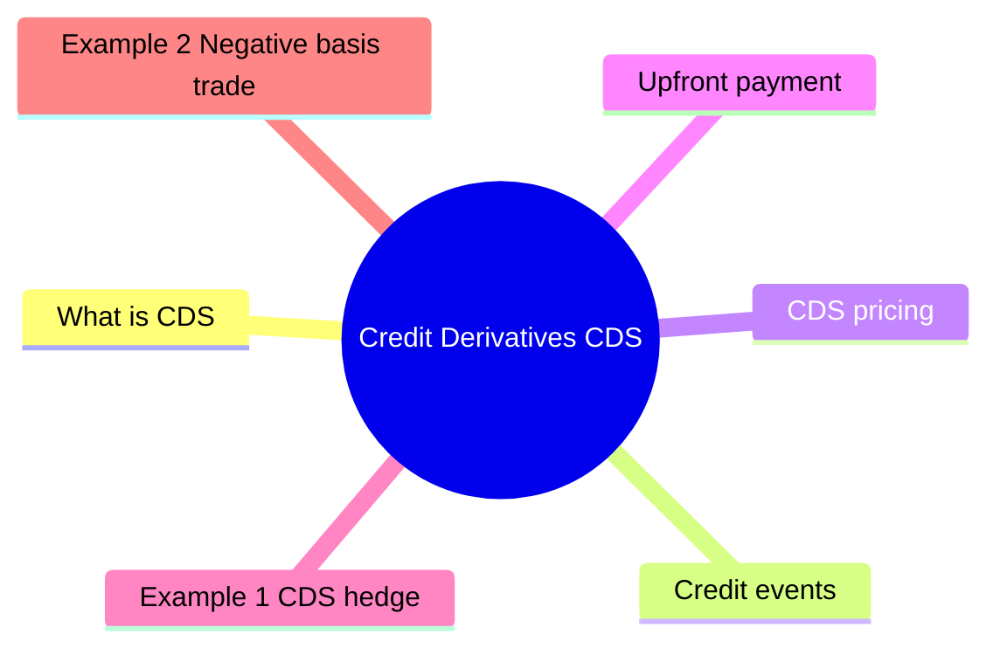

# Module 12: Credit Derivatives (CDS)

Est. study time: 2h



## Learning Objectives
- Explain CDS mechanics and terminology
- Understand CDS pricing and spread interpretation
- Describe CDS basis trade
- Understand CDS indices and standardized contracts

---

## Core Content

### What is CDS?

Credit Default Swap = insurance against default.

- **Protection buyer**: pays periodic premium (spread)
- **Protection seller**: makes payment if credit event occurs

Key difference from insurance: CDS can be bought without owning underlying bond ("naked CDS"). Insurance requires insurable interest.

Contract terms:
- **Reference entity**: company or sovereign
- **Notional**: amount protected
- **Maturity**: 1yr, 3yr, 5yr, 7yr, 10yr (5yr most liquid)
- **Coupon**: standard 100bp or 500bp
- **Upfront payment**: difference between standard coupon and market spread

### Credit events

ISDA (International Swaps and Derivatives Association) defines:

1. **Bankruptcy** (corporate)
2. **Failure to pay** (corporate + sovereign)
3. **Restructuring** (corporate)
4. **Obligation acceleration** (rare)
5. **Repudiation/Moratorium** (sovereign)

2009 "Big Bang" protocol: standardized auctions for settlement.

### CDS pricing

```text
CDS spread ≈ (1 - Recovery) × Probability of default
```

Example: Recovery = 40%, PD = 2% annually
CDS spread ≈ (1 - 0.40) × 2% = 1.2% = 120bp

Market CDS spread reflects market's view of credit risk.

Why standard coupons 100bp and 500bp? Standardization makes CDS tradeable like bonds. Instead of negotiating spread per trade, market quotes upfront payment to adjust — same efficiency as bond price vs coupon.

### Upfront payment

Standard coupons: 100bp (IG) or 500bp (HY).

If market spread > standard coupon → protection seller pays upfront (buyer pays less premium).

If market spread < standard coupon → protection buyer pays upfront.

Example: 5yr CDS at 180bp. Standard coupon = 100bp.
Buyer pays ≈ 80bp × duration as upfront.

### CDS indices

| Index | Region | Entities | Type |
|-------|--------|----------|------|
| **CDX.NA.IG** | North America | 125 | IG |
| **CDX.NA.HY** | North America | 100 | HY |
| **iTraxx Europe** | Europe | 125 | IG |
| **iTraxx Crossover** | Europe | 75 | HY |

Traded as single contract. Each series has fixed membership, rolls every 6 months.

### CDS basis

```text
Basis = CDS spread - Bond spread (over same reference rate)
```

| Basis | Meaning | Trade |
|-------|---------|-------|
| **Positive** | CDS > bond spread | Sell CDS, buy bond (cheap funding) |
| **Negative** | CDS < bond spread | Buy CDS, short bond |
| **Zero** | Fair value | No arb |

Negative basis common in stressed markets (CDS cheap vs cash).

### Uses of CDS

1. **Hedging credit exposure** without selling bond
2. **Short credit** (buy protection) when bond hard to borrow
3. **Synthetic long credit** (sell protection) for yield
4. **Basis trading** (cash vs synthetic arb)
5. **Portfolio management** (adjust credit exposure efficiently)

### Sovereign CDS

Same mechanics but credit events include:
- Failure to pay
- Moratorium/Repudiation
- Restructuring

Sovereign CDS spreads: Greece >1000bp (2012), Germany ~10bp.

---

## Examples

### Example 1: CDS hedge

Bank holds $10M of BBB corporate bonds. Wants to hedge credit risk.

Buys $10M CDS protection at 150bp.

Annual cost = $10M × 1.5% = $150,000

If bond defaults: bank loses on bond, but CDS pays out (par - recovery).

Net position: hedged.

### Example 2: Negative basis trade

Bond yields 200bp over LIBOR. CDS = 150bp.

Basis = -50bp.

Buy bond (earn 200bp), buy CDS (pay 150bp). Net = 50bp risk-free + carry.

Trade works if basis converges to zero.

### Example 3: Private bank context

Client's portfolio concentrated in banking sector. Comfort with bank credit but wants to dial down sector weight temporarily.

Instead of selling bonds (tax, transaction cost): buy CDS protection on bank index for 6 months.

Synthetic hedge. Remove when comfortable.

---

## Common Misconception

**"CDS = insurance, always pays out."** Not quite:
- **Protection seller can fail** (AIG 2008 — biggest US insurance bailout)
- **Auction determines recovery** — settlement via standardized ISDA auction may yield less than expected
- **Legal disputes over credit events** common (Greek CDS restructuring, Abengoa, Codere)
- **Counterparty risk matters**: cleared CDS at CCPs since 2009 reduces this
- **Settlement is not automatic**: requires credit event determination by Credit Derivatives Determinations Committee

**"Naked CDS = gambling."** Not necessarily. Used for hedging exposure when bond not owned, or taking directional view. Critics argue it increases default incentive (empty voter problem); defenders say adds liquidity and price discovery. Post-2008 some jurisdictions restrict naked sovereign CDS.

**"CDS spread = bond spread."** No. CDS reflects pure default risk, bond spread includes funding + liquidity + tax. Basis = CDS - bond spread usually positive but can flip negative in stress.

---


## Key Takeaways
- CDS = credit insurance. Protection buyer pays spread
- Standard coupons: 100bp (IG), 500bp (HY). Upfront payment for difference
- Credit events: bankruptcy, failure to pay, restructuring
- CDS spread ≈ (1-Recovery) × PD
- Indices: CDX (US), iTraxx (Europe)
- Basis = CDS spread - bond spread. Negative basis = cash cheap vs CDS
- CDS enables synthetic long/short credit exposure

---

## Feynman Explain
Explain CDS to a colleague: "How can you insure a bond against default?" Use car insurance analogy. Who pays premium, who receives payout.

*Self-check: Can you explain why CDS spread can differ from bond spread (basis) and what a negative basis means?*


---

## Reframe
Critique CDS market: "Are CDS speculators destabilizing?" Consider: AIG 2008, naked CDS (buying protection without owning bond), transparency reforms. Write your answer.

---

## Think

> **Think**: A pension fund holds $50M of BBB-rated bonds from a single issuer. The PM is worried about idiosyncratic default risk but doesn't want to sell (large tax event, plus the bonds have appreciated). The 5-year CDS on this name trades at 180bp. Walk through the hedge math: how much CDS does the fund need, what's the annual cost, and what's the residual risk the hedge doesn't cover?
>
> *Answer: Notional: $50M of bond exposure. 5-year CDS at 180bp: annual cost = $50M × 0.018 = $900,000/year. If a credit event occurs, the fund delivers the bond (or cash settles via ISDA auction) and receives par, so losses on the bond are offset by CDS payout. Residual risks: (a) basis risk — bond spread may not equal CDS spread exactly; if bond trades rich, the bond can lose more than the CDS pays. (b) Counterparty risk on the CDS seller (mitigated if cleared at a CCP). (c) Restructuring risk — old CDS paid out on restructuring, but post-2009 "Standard Western European Sovereign" or "No Restructuring" triggers can limit payout. (d) Carry drag of $900K/year. The hedge is a real cost, not free insurance.*

---

## Predict

> **Predict**: A high-yield index (CDX HY) currently trades at a spread of 450bp. The 1-year transition matrix suggests a 5% default probability with 35% recovery. An investor buys $10M of protection at 450bp. Predict (a) the expected payout, (b) the cost of the protection, and (c) whether the trade is "fair."
>
> *Answer: (a) Expected payout = $10M × 5% × (1 - 0.35) = $10M × 0.0325 = $325,000. (b) Annual cost = $10M × 0.045 = $450,000. (c) The trade is UNFAIR — paying $450K to expect $325K back. The 450bp spread prices more than expected loss; it includes risk premium (compensation for bearing tail risk) and liquidity premium. The protection buyer overpays in expectation but is protected against the fat tail — if defaults cluster, payout far exceeds the $325K expected. Protection buying is insurance, not arbitrage. Like home insurance: expected loss is small, premium is large, but the value is protection against catastrophe.*

---

## Spot the Mistake

> **Spot the Mistake**: A junior says: "CDS is the same as bond insurance, so I can buy CDS to hedge the credit risk on any bond I own, and the payout will be par if the issuer defaults."
>
> Two errors. Identify each.
>
> *Answer: Error 1: CDS is NOT bond insurance. Insurance is a regulated insurance product with state guarantee funds. CDS is an unregulated derivative with full counterparty risk — AIG 2008 demonstrated this. Post-2009, standardized CDS clear at CCPs, reducing but not eliminating counterparty risk. Error 2: Payout is not always par. Physical settlement requires delivering the bond (which the holder must have). Cash settlement uses an ISDA auction to determine recovery — and recovery is often far below par (typical 30-50% for senior unsecured). The "par" guarantee applies only if the bondholder physically delivers a bond worth par; in default, the bond is almost always worth less than par. Cash settlement is the norm and the payout = (100 - recovery price) × notional.*

---

## Cloze

A {credit default swap} (CDS) is a derivative contract where the protection buyer pays a periodic {spread} to the protection seller in exchange for a payout if a defined {credit event} (bankruptcy, failure to pay, restructuring) occurs on a reference entity. The CDS spread approximates {expected loss} = (1 - recovery) × probability of default. {Index} CDS (CDX in the US, iTraxx in Europe) trade on baskets of investment-grade or high-yield names. The {basis} = CDS spread - cash bond spread, which usually sits near zero but can dislocate in stress. Standard coupons are 100bp for IG and 500bp for HY, with an {upfront} payment for any spread above the standard.

---

## Drill
Take the quiz.

Run: `./scripts/learn.sh quiz fixed-income 12-credit-derivatives-cds`
