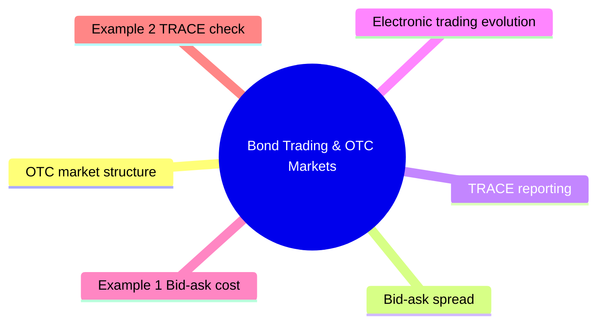

# Module 13: Bond Trading & OTC Markets

Est. study time: 2h

## Learning Objectives
- Explain OTC bond market structure
- Understand bid-ask spread and liquidity
- Interpret TRACE data
- Describe electronic trading evolution
- Analyze factors affecting liquidity

---

## Core Content

### OTC market structure

Bonds trade over-the-counter (OTC), not on exchanges.

Why OTC, not exchange? Bonds are heterogeneous — thousands of unique issues per issuer (different coupons, maturities, seniority, covenants). Exchange needs standardized product. Stocks: one ticker per company. Bonds: dozens per company.

Dealer vs customer trades. No centralized order book.

Market participants:
- **Primary dealers**: trade directly with Fed, make markets in Treasuries
- **Regional dealers**: focus on specific sectors
- **Institutional investors**: asset managers, insurance, pension funds
- **Hedge funds**: active traders, relative value
- **Retail**: through brokers, limited access

### Bid-ask spread

| Bond type | Typical bid-ask |
|-----------|-----------------|
| On-the-run Treasury | 0.5-1bp |
| Off-the-run Treasury | 1-5bp |
| Agency MBS | 2-5bp |
| IG corporate | 5-25bp |
| HY corporate | 25-100bp |
| Municipal | 10-100bp |

Determinants of spread:
- Liquidity (most important)
- Trade size
- Market conditions
- Time of day
- Dealer inventory

### TRACE reporting

Trade Reporting and Compliance Engine (FINRA).

Since 2002: corporate bond trades reported publicly.

Increased transparency significantly. Tightened spreads post-TRACE.

Data: price, volume, yield, trade date/time.

### Electronic trading evolution

| Era | Platform type | Examples |
|-----|--------------|----------|
| Pre-2000 | Phone/voice | Dealer calls |
| 2000-2010 | Dealer-to-client | MarketAxess, TradeWeb |
| 2010-2020 | All-to-all | Direct exchange protocols |
| 2020+ | Electronification + automation | Algos, portfolio trading |

Electronic share of IG corporate trading: ~40% (growing).

### Liquidity

Bond market liquidity: episodic, not constant.

**Good times**: tight spreads, easy execution.
**Stress times**: spreads blow out, dealers step back.

How likely are liquidity crises? Major episodes: 2008 (MBS/corporate freeze), 2020 (COVID dash-for-cash). Minor events every 2-3 years. IG corporate spreads widened ~200bp in 3 weeks during March 2020, then recovered after Fed intervention.

Liquidity providers: dealers (risk capital), electronic platforms (limit orders).

Liquidity measurement:
- **Bid-ask spread**: narrow = liquid
- **Trade volume**: high = liquid
- **Price impact**: small = liquid
- **Dealer quote depth**: deep = liquid

### Portfolio trading

Increasing trend: trade entire portfolio of bonds in single block.

Advantage: execution speed, lower overall cost.

Disadvantage: dealer charges premium for risk.

### Trading strategies

| Strategy | Description |
|----------|-------------|
| **Outright** | Buy or sell single bond |
| **Switch** | Sell one bond, buy another |
| **Butterfly** | Long one maturity, short two others |
| **Curve trade** | Position for steepening/flattening |
| **RV trade** | Relative value between similar bonds |

---

## Examples

### Example 1: Bid-ask cost

Client wants to buy $5M of a BBB-rated corporate bond.

Bid = 99.75, Ask = 100.25. Spread = 50bp.

Cost to buy then immediately sell: 50bp × $5M = $25,000.

Important consideration for private bank: hold period needed to overcome transaction cost.

### Example 2: TRACE check

Client sees bond priced at 98.50. Check TRACE for recent trades.

Last 10 trades: 98.25-98.75 range. Volume $1M-$5M.

Confirms 98.50 is fair price. Dealer not overcharging.

### Example 3: Liquidity in stress

March 2020: IG corporate bonds. Bid-ask spreads went from 10bp to 100bp+.

Dealers withdrew. Fed intervened (SMCCF) to restore liquidity.

Client trying to sell: could not get price without large concession.

---

## Common Misconception

**"Bonds trade like stocks — visible price, easy execution."** No. OTC market = negotiated prices, wide spreads for less liquid issues, liquidity that disappears in stress. TRACE shows executed trades but NOT live quotes. No centralized order book like equities.

**"Tighter bid-ask always better."** Tighter spreads reflect liquidity, not value. A 2bp spread on a distressed bond means nothing if the quote is "stale" or one-sided. Look at quote depth + recent trade frequency.

**"Electronic trading = better prices."** Generally yes for liquid IG, but not universally. Complex or illiquid bonds still benefit from voice trading where dealer can find natural counterparty. Platform growth ≠ liquidity for every bond.

**"TRACE shows everything."** No. TRACE covers executed trades. Pre-trade quotes (dealer indications) NOT shown. Large block trades reported with delay. Customer identity protected.

---

## Key Takeaways
- Bonds trade OTC. Dealer-intermediated.
- Bid-ask varies by bond type and market conditions
- TRACE increased transparency significantly
- Electronic trading growing (especially IG)
- Liquidity is episodic — fine in normal times, scarce in stress
- Portfolio trading gaining share
- Transaction costs matter for total return

---

## Feynman Explain
Explain OTC bond trading to a client: "Why can't I see the bond price on a screen like I can with stocks?" Compare to real estate market (dealer-to-dealer, phone-based, negotiated prices).

*Self-check: Can you explain why TRACE reporting improved market quality?*

---

## Reframe
Critique bond market structure: "Is OTC market structure better than exchange trading?" Consider: liquidity during stress, dealer balance sheet capacity, transparency, and client protection. Write your answer.

---

## Think

> **Think**: A client wants to sell $20M of off-the-run 7-year corporate bonds (CUSIP not held by typical institutional accounts). The dealer shows a bid 50bp below where the client thinks the bond is worth. The client pushes back: "TRACE shows comparable bonds trading at par." How do you explain the gap, and what should the client consider?
>
> *Answer: Three legitimate reasons for the wide quote. (1) Inventory: the dealer doesn't have a natural buyer lined up; to take $20M into inventory, they need to hedge and carry the position, which costs money and balance sheet. (2) Liquidity premium: an off-the-run issue has fewer natural buyers, so the dealer prices for the risk of being stuck. (3) Block size: $20M of a $500M issue is 4% of the entire deal — a real position that distorts the local supply-demand. The client should: (a) accept that TRACE prices are AVERAGES across many small trades, not a quote for a $20M block; (b) consider breaking the trade into smaller pieces (but more market impact); (c) consider RFQ to multiple dealers to compete; (d) evaluate the cost of waiting vs the cost of immediate execution. Liquidity has a price, and for off-the-run blocks, that price is real.*

---

## Predict

> **Predict**: A large asset manager announces a $500M IG corporate bond sale for portfolio rebalancing. Three dealers are competing via RFQ. Predict (a) the impact on the bond's secondary market price, (b) the typical haircut the client accepts vs the pre-trade mid, and (c) what happens to TRACE volume for the bond in the days following.
>
> *Answer: (a) Secondary market price DROPS on announcement as dealers pre-hedge and other holders try to exit ahead of the supply wave. Typical move: 10-30bp wider on the affected name and sector. (b) Trade haircut vs pre-trade mid: 30-100bp depending on issue liquidity and demand. For an off-the-run issue: 100-200bp. (c) TRACE volume SPIKES for the bond in the days following as the deal is digested. Volume then normalizes within 1-2 weeks. The cost of liquidity is paid in two places: the trade haircut and the post-announcement price drift. Skilled execution minimizes the second; the first is structural.*

---

## Spot the Mistake

> **Spot the Mistake**: A junior says: "TRACE shows all bond trades, so the bond market is just as transparent as the stock market."
>
> Two errors. Identify each.
>
> *Answer: Error 1: TRACE shows EXECUTED trades, not live quotes. The stock market shows live bid/ask; the bond market shows historical prints. A bond can trade at 99.5 on TRACE but the current offer might be 100.5 (or no offer at all). Transparency of executed trades ≠ transparency of executable prices. Error 2: Stock exchanges have a centralized order book visible to all; bond markets are decentralized with bilateral negotiation. The same bond can trade at different prices simultaneously with different dealers, depending on inventory and relationship. TRACE improves transparency AFTER the fact, but live OTC negotiation is opaque by design.*

---

## Cloze

Bonds trade {over-the-counter} (OTC) through dealer intermediation rather than on a centralized exchange. {Bid-ask} spreads compensate dealers for inventory risk and vary by issue liquidity and market conditions. {TRACE} (Trade Reporting and Compliance Engine) reports executed bond trades to improve post-trade transparency. Electronic trading platforms (MarketAxess, Tradeweb, Bloomberg) have grown share in {investment grade} markets; voice trading remains dominant for less liquid issues. {Liquidity} is episodic — adequate in normal times, scarce during stress when dealers pull back. Portfolio trading and all-to-all platforms attempt to address the {liquidity} gap.

---

## Drill
Take the quiz.

Run: `./scripts/learn.sh quiz fixed-income 13-bond-trading-and-otc-markets`
