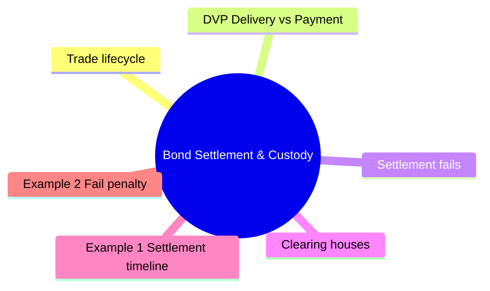

# Module 14: Bond Settlement & Custody

Est. study time: 2h



## Learning Objectives
- Explain DVP settlement model
- Understand settlement fails and penalties
- Describe clearing house role (FICC, NSCC, Euroclear)
- Contrast physical vs book-entry custody
- Understand tri-party repo custody

---

## Core Content

### Trade lifecycle

```text
Trade date (T) → Settlement date (T+1, T+2, T+3)
```

| Asset | Settlement | Standard |
|-------|-----------|----------|
| Treasuries | T+1 | Since May 2024 (was T+2) |
| Corporate bonds | T+1 | Since May 2024 (was T+2) |
| Muni bonds | T+1 | Since May 2024 (was T+2) |
| MBS | T+1 (specified pool) | |
| Repo | Same day (T+0) | |

### DVP (Delivery vs Payment)

Simultaneous exchange: bonds delivered ↔ cash paid.

Eliminates principal risk (one party delivers, other doesn't pay).

Why DVP instead of trust? Before DVP, settlement required trust or letters of credit. DVP makes settlement atomic — like an escrow. Fedwire Securities Service moves bonds and cash simultaneously.

DVP Model 1: gross settlement, trade-by-trade.
DVP Model 2: net cash, gross securities.
DVP Model 3: net securities, net cash.

### Settlement fails

Fail = seller fails to deliver bonds on settlement date.

Causes:
- Operational error (trade not matched)
- Short position (bond not located)
- Market disruption

Penalties:
- Treasury fails: charged at spread below Fed funds (since 2009)
- Corporate bonds: contractual, varies
- Fails in high-demand securities: special repo rates

Question: What happens if both sides fail simultaneously? Answer: "Link" or "daisy chain" fails cascade — one fail causes another. FICC netting reduces this. In 2020, Treasury fails briefly spiked to ~$1T before penalty regime kicked in.

### Clearing houses

| Entity | Role |
|--------|------|
| **FICC** (Fixed Income Clearing Corp) | Treasury, agency MBS clearing |
| **DTCC** | Corporate bond settlement |
| **Euroclear / Clearstream** | International bonds (Eurobonds) |
| **LCH** | Repo clearing, CDS clearing |

Clearing house becomes central counterparty (CCP) — guarantees trade completion.

### Book-entry vs physical

| Type | Description | Current status |
|------|-------------|----------------|
| **Physical certificate** | Paper bond | Obsolete (except some munis) |
| **Book-entry** | Electronic record at depository | Standard (Fedwire, DTC) |

Treasuries: book-entry at Fedwire Securities Service.
Corporate bonds: book-entry at DTC (Depository Trust Company).

### Custody

Custodian holds securities on behalf of client.

| Type | Examples | Services |
|------|----------|----------|
| **Global custodian** | BNY, State Street, JPMorgan | Settlement, safekeeping, FX, reporting |
| **Prime broker** | For hedge funds | Financing, leverage, securities lending |
| **Sub-custodian** | Local market agents | Access to foreign markets |

### Margin and collateral management

Variation margin: daily mark-to-market for derivatives.
Initial margin: upfront collateral for non-cleared derivatives.

Collateral transformation: convert available assets into required collateral type.

### Asset servicing

- Coupon collection
- Maturity redemption
- Corporate actions (tender, exchange, consent solicitation)
- Withholding tax processing

---

## Examples

### Example 1: Settlement timeline

Client buys $5M corporate bond on Monday.

Trade date: Monday
Settlement: Tuesday (T+1)

Client must have $5M + accrued in account by settlement.
If not: failed trade, penalties.

### Example 2: Fail penalty

Client sells $10M Treasury. Fails to deliver because bond on loan.

Penalty: shortfall × (fail rate) × days.

Fail rate = Fed funds - 3% (if Fed funds = 5.33%, fail rate = 2.33%).

$10M × 2.33% × 1/360 = $647 per day.

### Example 3: Private bank context

Client holds international bond portfolio across US, EU, Asia.

Custodian BNY handles:
- US bonds at DTC
- EU bonds at Euroclear
- Asian bonds via sub-custodian network

Client sees single aggregated statement. Underlying settlement happens in each market.

---

## Common Misconception

**"Settlement always completes on time."** No. Fails happen regularly:
- Treasury fail rates: ~2-4% of trades (normal)
- March 2020 spike: ~$1T fails briefly
- Penalties exist but often less than cost of buying in

**"DVP eliminates all settlement risk."** DVP eliminates principal risk (one party gets cash but not bonds). Does NOT eliminate:
- Operational risk (instructions lost, mismatched records)
- Systemic risk (clearing house default)
- Liquidity risk (cash tied up pending settlement)

**"Faster settlement always better."** T+1 reduces risk but increases operational burden. Cross-border trades (Asian markets closing before US opens) and error reconciliation harder. Smaller firms may lack automation.

**"Custodian = safe storage."** Custodians provide safekeeping but are not insurance against issuer default. Bonds can lose value regardless of where held. Some jurisdictions (foreign markets) have weaker custody protection than US.

---


## Key Takeaways
- DVP: simultaneous delivery vs payment. Eliminates principal risk
- T+1 settlement new standard for most bonds
- Fails: penalty costs for late delivery
- FICC clears Treasuries, agency MBS. DTC for corporate bonds
- Book-entry electronic — physical certificates obsolete
- Custodians provide safekeeping, settlement, income collection
- Collateral management essential for derivatives

---

## Feynman Explain
Explain settlement to a client: "You bought a bond today. When do you need to pay?" Use Amazon delivery analogy (order today, receive tomorrow + pay on delivery).

*Self-check: Can you explain why DVP eliminates principal risk but not operational risk?*


---

## Reframe
Critique T+1 settlement: "Is faster settlement always better?" Consider: operational burden, cross-border complexity, error reconciliation time, Asian market timing. Write your answer.

---

## Think

> **Think**: A private bank executes a $5M corporate bond purchase for a client at 11:00 AM on a Tuesday. Settlement is T+1. What does the operations team need to do in the next 24 hours, and what can go wrong?
>
> *Answer: Required steps: (1) Affirm trade details with the counterparty (CUSIP, par, price, settlement date). (2) Instruct the custodian (e.g., BNY) to receive the bonds at DTC. (3) Pre-position cash at the custodian for the dirty price. (4) DTC matches instructions and effects settlement early T+1. (5) Reconcile trade to confirm completion. Failure modes: (a) counterparty fails to deliver → fail-to-deliver, client doesn't get bonds, may need to buy-in. (b) Cash not pre-positioned → fail-to-receive, counterparty can charge penalties. (c) CUSIP or par mismatch → fails until corrected. (d) Cross-border trades add FX legs and cut-off time pressure. The 24-hour window is tight; any operational miss cascades into failed settlement and client complaints. This is why automation and straight-through processing (STP) are critical.*

---

## Predict

> **Predict**: A 30-year Treasury trades at 4:25% yield, par. The buyer is an insurance company with a long-duration liability. Settlement is T+1. Which of the following does the insurance company need to coordinate: (a) cash in the right account, (b) the bond delivered to the right custodian account, (c) the trade confirmed in its accounting system, (d) the trade reflected in regulatory reporting? Predict what's most likely to go wrong and why.
>
> *Answer: All four are required. (a) is most likely to fail because large insurance companies hold cash across multiple legal entities, accounts, and currencies — the right account for THIS specific CUSIP must be pre-funded. (b) Bond delivery is standardized via DTC and FICC; failures here are rare. (c) Accounting reconciliation often has batch processes that run overnight; same-day reflection is hard. (d) Regulatory reporting has tolerances (T+1, T+2) and rarely blocks settlement. The most common failure is CASH WIRING — the trade settles late because the cash didn't move fast enough. Pre-positioned liquidity and automated cash sweeps are the operational fix.*

---

## Spot the Mistake

> **Spot the Mistake**: A junior says: "Since DVP means both sides deliver simultaneously, there's zero risk in bond settlement."
>
> Two errors. Identify each.
>
> *Answer: Error 1: DVP eliminates PRINCIPAL risk (one party paying without receiving), but does NOT eliminate operational risk — instructions can be lost, mismatched, or delayed; systems can fail; cut-off times can be missed. DVP also doesn't eliminate counterparty risk BEFORE settlement (the period between trade and settlement where one side could default). Error 2: DVP doesn't eliminate systemic risk. If the central counterparty (FICC/DTCC) itself fails, both sides of every transaction are at risk. CCP risk is real, mitigated by margin, guarantee funds, and Fed backstops — but not zero. Settlement "risk" is a multi-dimensional concept; DVP is one piece of the solution.*

---

## Cloze

Bond settlement transfers {cash} and {bonds} between counterparties, typically on a T+{1} basis (effective May 2024, down from T+2). {DVP} (delivery versus payment) eliminates principal risk by ensuring the cash and bond legs settle simultaneously. {FICC} clears Treasury and agency MBS trades; {DTC} handles book-entry settlement for corporates and munis. The {Depository Trust Company} holds securities in book-entry form — physical certificates are obsolete. {Custodians} (BNY Mellon, State Street, JPMorgan) provide safekeeping, settlement, income collection, and reporting. {Fails} (failed settlements) carry penalty costs but are common (~2-4% of trades in normal markets).

---

## Drill
Take the quiz.

Run: `./scripts/learn.sh quiz fixed-income 14-bond-settlement-and-custody`
