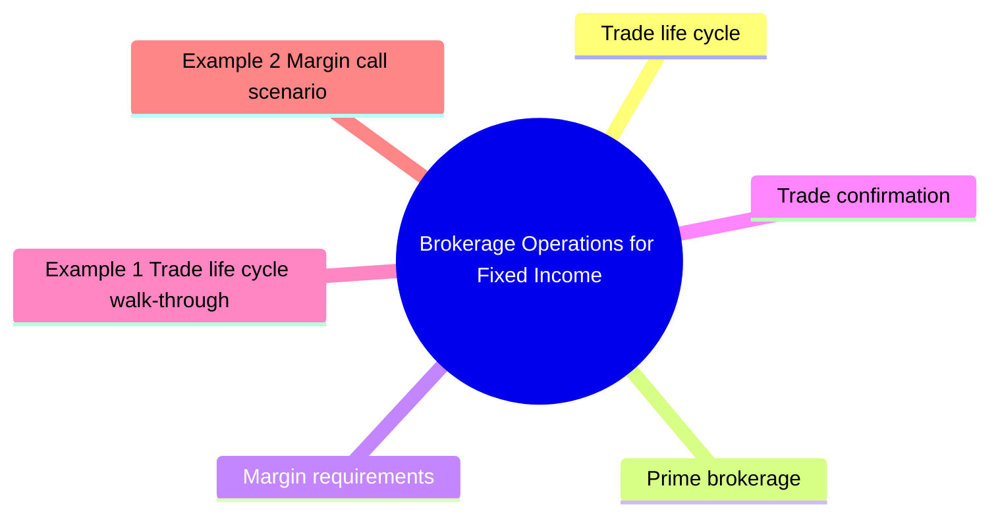

# Module 15: Brokerage Operations for Fixed Income

Est. study time: 2.5h



## Learning Objectives
- Describe trade life cycle end-to-end
- Understand prime brokerage services
- Explain margin requirements for bonds
- Analyze trade reporting obligations
- Understand operational risk in FI trading

---

## Core Content

### Trade life cycle

**Front office** → **Middle office** → **Back office**

| Phase | Description | Owner |
|-------|-------------|-------|
| **Trade execution** | Dealer quotes, client agrees | Trader / Sales |
| **Trade capture** | Enter trade into system | Trader |
| **Confirmation** | Match trade details with counterparty | Middle office |
| **Affirmation** | Both parties confirm terms | Middle office |
| **Settlement** | Exchange securities for cash | Back office |
| **Clearing** | CCP guarantees | Clearing house |

Question: Why separate confirmation and affirmation? They sound similar. Answer: Confirmation = match trade details (price, quantity, counterparty). Affirmation = both sides explicitly agree matched details correct. Two-step catch errors before settlement.

### Prime brokerage

Services for hedge funds and professional clients:

| Service | Description |
|---------|-------------|
| **Execution** | Access to dealer network |
| **Financing** | Borrow cash (repo) to lever positions |
| **Securities lending** | Borrow bonds for short selling |
| **Custody** | Hold assets, settle trades |
| **Margin** | Finance with leverage |
| **Reporting** | P&L, risk, position reports |
| **Capital introduction** | Connect with investors |

### Margin requirements

**Regulation T (Reg T)**: 50% initial margin for equities.

**Bonds**: lower margin (less volatile). Typically 2-10% for Treasuries, 10-30% for corporates.

**Portfolio margin**: risk-based margin using SPAN-like methodology.

Margin call calculation:
```text
Margin call = [Required margin % × Position value] - Existing equity
```

### Trade confirmation

**Voice trades** → confirmed electronically (Bloomberg, MarkitWire).

**Affirmation platforms**: DTCC CTM (Central Trade Manager), Bloomberg.

**SSI (Standard Settlement Instructions)**: pre-agreed settlement details per counterparty.

### Reporting obligations

| Regulation | Requirement |
|------------|-------------|
| **TRACE** | Corporate bond trade reporting (within 15 min) |
| **MSRB** | Muni bond trade reporting |
| **EMIR** (EU) | OTC derivative reporting |
| **Dodd-Frank** | Swap reporting to SDR |
| **MiFID II** | Transaction reporting, best execution |

### Operational risk

| Risk type | Example |
|-----------|---------|
| **Trade error** | Wrong bond, wrong quantity, wrong price |
| **Settlement fail** | Failed to deliver/receive |
| **Confirmation mismatch** | Disagreed trade details |
| **Fraud** | Unauthorized trading, false reporting |
| **Systems failure** | Trading platform outage |

Operational risk controls: dual authorization, reconciliation, STP (straight-through processing).

### Leverage and margin in practice

Hedge fund $100M equity, buys $500M bonds.

Leverage = $500M / $100M = 5x.

If bond price falls 3%:
- Loss = $15M (15% of equity)
- Equity drops to $85M
- Leverage rises to $485M / $85M = 5.7x
- Margin call: post more equity or reduce position

### Settlement Instruction management

Standing Settlement Instructions (SSI) stored for each counterparty.

Changes confirmed via SWIFT or secure messaging.

SSI fraud: criminals change settlement instructions → payment sent to wrong account.

---

## Examples

### Example 1: Trade life cycle walk-through

Monday 10am: PM buys $10M of 5yr Treasury at yield 4.05%.
- Front office: trade executed via MarketAxess
- Middle office: trade matched on FICC
- Back office: settlement Tuesday (T+1) via Fedwire

### Example 2: Margin call scenario

Client buys $20M HY bonds on margin. 20% maintenance margin.

Equity required = $20M × 20% = $4M.

Client posts $5M equity. Leverage = 4x.

Bonds fall 5% → position = $19M. Equity falls to $5M - $1M = $4M.

Margin ratio = $4M / $19M = 21% (above 20%, OK but close).

Further 2% drop → position = $18.62M. Equity = $4M - $0.38M = $3.62M. Margin = 19.4%. Margin call.

### Example 3: Private bank reporting

Client receives monthly statement:
- Position listing (ISIN, description, quantity, price, market value)
- Income received (coupons, maturities)
- Transactions (buys, sells, maturities)
- Cash balance
- Margin utilization (if leveraged)
- Performance (total return, duration, yield)

---

## Common Misconception

**"STP eliminates operational risk."** STP reduces manual errors but introduces new risks:
- System outage stops all processing
- Bad auto-matching rules propagate errors at scale
- Cyber risk: single point of failure
- Hybrid model (auto-STP + human exception queue) safer

**"Prime brokerage leverage is just financing."** Includes financing PLUS operational dependencies (single counterparty for custody, financing, securities lending). Archegos 2021 showed concentrated PB exposure creates systemic risk.

**"Margin calls are rare."** Common during volatility spikes. March 2020 saw widespread margin calls across prime brokerage. Counterparties failed to meet, forcing forced sales.

**"Operational risk = trade errors."** Wider: includes fraud (rogue trader), cyber (ransomware), technology (platform outage), regulatory (reporting breach), and process (settlement fail). FATF/regulators treat this as distinct risk category with capital requirements under Basel framework.

---


## Key Takeaways
- Trade life cycle: execution → confirmation → settlement
- Prime brokerage: financing, leverage, securities lending
- Bond margin lower than equities (2-10% Treasuries, 10-30% HY)
- TRACE/MSRB: mandatory trade reporting
- Operational risk: trade errors, settlement fails, SSI fraud
- Leverage amplifies returns and risk — margin calls when prices fall
- STP (straight-through processing) reduces operational risk

---

## Feynman Explain
Explain prime brokerage to a client: "How does a hedge fund get leverage to buy $500M of bonds with only $100M?" Use mortgage analogy — cash down payment = margin, loan = repo financing.

*Self-check: Can you explain why operational risk is higher in OTC bond trading vs exchange-traded equities?*


---

## Reframe
Critique prime brokerage leverage: "Do prime brokers contribute to systemic risk?" Consider: LTCM 1998, Archegos 2021, collateral fire sales. What regulations address this? Write your answer.

---

## Think

> **Think**: A hedge fund prime-brokered at a major dealer has $5B in long equity exposure financed $3B via repo. The fund's largest single position drops 25% in two days. Walk through what happens to (a) the fund's equity, (b) the prime broker's exposure, and (c) the broader system. Use the Archegos 2021 template.
>
> *Answer: (a) Fund equity: $5B - $3B = $2B starting equity. After 25% drop: $3.75B position - $3B loan = $0.75B equity. 62% drawdown in two days. (b) Prime broker exposure: $3B loan is now undercollateralized by $0.25B (position $3.75B vs loan $3B → still $0.75B of equity). The PB issues a margin call for the full equity shortfall. (c) If multiple PBs face similar calls, forced selling by all of them at once cascades: prices fall further, more margin calls, more forced selling. Archegos collapsed in days because it had concentrated exposure in a few names financed across multiple PBs that did not know about each other's positions — total exposure ~$36B across 5 PBs, with $20B+ in losses. The lesson: cross-PB exposure aggregation is a real systemic risk, and regulators now require PBs to share large exposure data.*

---

## Predict

> **Predict**: A fund's prime broker sets a maintenance margin requirement of 25% on $100M of HY corporate bonds financed via repo. The fund borrows $70M (70% loan-to-value). The HY market drops 5% in a week. Predict (a) the new loan-to-value ratio, (b) whether a margin call occurs, and (c) what the fund must do.
>
> *Answer: (a) New LTV = $70M / ($100M × 0.95) = $70M / $95M = 73.7% (vs 70% starting). (b) Equity = $95M - $70M = $25M. Margin ratio = $25M / $95M = 26.3% — still above 25% requirement, so NO margin call YET. (c) The fund is on a hair trigger — a further 1.5% drop to $93.5M market value gives $23.5M equity / $93.5M = 25.1%, still barely above. A 2% drop gives 24.7% → margin call. The fund should (1) pre-position cash to meet a likely call, (2) deleverage voluntarily to a safer LTV (say 60%), or (3) buy protection via CDS to hedge the credit exposure. Ignoring the warning and hoping for a bounce is the classic path to forced liquidation.*

---

## Spot the Mistake

> **Spot the Mistake**: A junior says: "Straight-through processing eliminates operational risk, so we don't need manual exception handling for bond trades."
>
> Two errors. Identify each.
>
> *Answer: Error 1: STP REDUCES manual handling but does not eliminate it. Exception queues are normal — CUSIP mismatches, settlement instructions with missing fields, counterparty data quality issues. STP handles ~85-90% of trades; the remaining 10-15% require human judgment. Removing exception handling means errors propagate unchecked through the auto-matching system. Error 2: STP introduces NEW operational risks that don't exist in manual processing. A system outage stops ALL processing, not just one trade. A bad auto-matching rule propagates errors at scale. Cyber risk creates a single point of failure. STP plus human exception handling is safer than STP alone. The Archegos 2021 collapse showed that even automated systems fail when aggregated exposure is hidden across multiple prime brokers.*

---

## Cloze

The bond {trade life cycle} runs from execution to confirmation to settlement, ideally via {straight-through processing} (STP) with no manual intervention. {Prime brokerage} provides hedge funds with financing, leverage, securities lending, and operational services in bundled relationships. Bond margin requirements vary by asset: {Treasuries} 2-10%, IG corporates 5-15%, {HY} corporates 10-30%. {TRACE} and MSRB mandate trade reporting for transparency. {Operational risk} includes trade errors, settlement fails, fraud, cyber, technology outages, and regulatory breaches — a distinct risk category with its own capital treatment under Basel. Margin calls trigger when loan-to-value exceeds thresholds; forced selling in stress can cascade systemically.

---

## Drill
Take the quiz.

Run: `./scripts/learn.sh quiz fixed-income 15-brokerage-operations-for-fixed-income`
