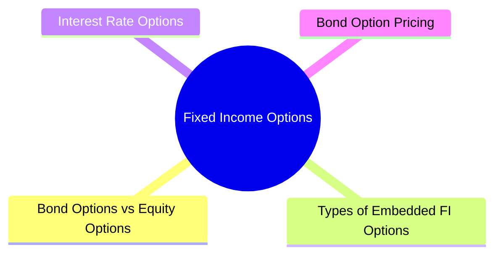

# Module 16: Fixed Income Options



## Core Content

### Bond Options vs Equity Options

| Feature | FI Options | Equity Options |
|---------|-----------|----------------|
| Underlying | Bond price, yield, or interest rate | Stock price |
| Exercise style | Mostly American (callable bonds) | American or European |
| Volatility | Changes with time to maturity | Relatively constant |
| Delivery | Physical bond or cash settlement | Shares or cash |
| Liquidity | OTC, less liquid | Exchange-traded, more liquid |

### Types of Embedded FI Options

**Callable Bond**: Issuer right to redeem before maturity at call price
- Issuer exercises when rates fall (refinance cheaper)
- Investor receives call premium + principal
- Negative convexity near call date

Question: Why would any investor buy a callable bond if upside is capped? Answer: Higher coupon vs non-callable. Callable bond yield = non-callable yield + option premium. Investor gets paid for taking call risk.

**Putable Bond**: Investor right to sell back before maturity at par
- Investor exercises when rates rise (reinvest higher)
- Puts a floor on bond price

**Convertible Bond**: Investor right to convert bond into equity shares
- Conversion ratio: shares per bond
- Conversion price: par / conversion ratio
- Conversion value: stock price × conversion ratio
- Parity: bond price relative to conversion value

**Sinkable Bond**: Mandatory partial redemption via sinking fund
- Can have embedded option to accelerate payments
- Reduces credit risk over time

### Interest Rate Options

| Option | Description | Payoff |
|--------|-------------|--------|
| Cap | Call on interest rate (ceiling on floating rate) | max(rate - strike, 0) × notional × period |
| Floor | Put on interest rate (floor on floating rate) | max(strike - rate, 0) × notional × period |
| Collar | Cap + Floor combined | Caps cost + sets minimum |
| Swaption | Option to enter an interest rate swap | Payer swaption (pay fixed) / Receiver swaption (receive fixed) |

### Bond Option Pricing

**Key variables**:
- Current bond price / yield
- Strike price / yield
- Time to expiration
- Risk-free rate
- Yield volatility
- Coupon payments during option life

**Black Model for bond options**:
```text
Call = B × N(d1) - K × e^(-rT) × N(d2)
Put = K × e^(-rT) × N(-d2) - B × N(-d1)
```

Where B = forward bond price, K = strike, r = risk-free rate, T = time

**Limitations**:
- Bond price converges to par at maturity (pull-to-par)
- Yield volatility not constant over time
- Negative convexity distorts pricing near call dates

### Yield-Based vs Price-Based Options

| Metric | Yield-Based | Price-Based |
|--------|-------------|-------------|
| Underlying | Yield to maturity | Dollar price |
| Strike | Yield level | Price level |
| Sensitivity | DV01-based | Duration-based |
| Convention | Used for caps/floors/swaptions | Used for bond options |

### Private Bank Context

High-net-worth clients use FI options for:
- **Portfolio protection**: Buying put options or swaptions to hedge rising rates
- **Yield enhancement**: Writing covered calls on bond positions (risk: bond called away)
- **Structured products**: Capital-guaranteed notes using zero-coupon bonds + options
- **Mortgage hedge**: Using caps to limit floating-rate mortgage costs for private banking real estate lending

Private banks structure bespoke OTC options for clients, including:
- Range accrual notes: Coupon paid only when reference rate stays within range
- Callable / putable structured notes: Customized strike and tenor
- Yield enhancement via option writing against bond portfolios

## Common Misconception

**"Callable bond = higher yield = always better."** Higher coupon compensates for capped upside. In rate rallies, callable underperforms non-callable. Decision: accept call risk for higher income vs avoid call risk at lower yield.

**"Putable bond is always safe."** No. The put is valuable to investor but issuer charges for it via lower coupon. Also, issuer credit risk matters — if issuer distressed, put may not be honored (though indenture usually protects).

**"Cap and floor are independent."** Often combined as collar. Cap costs premium, floor generates premium. Net collar cost depends on strikes chosen. Not free protection.

**"Black model = accurate pricing."** No. Black assumes constant volatility, lognormal distribution. Real yield distributions have fatter tails and volatility smiles. Use SABR or other models for swaptions/caps in practice.

---


## Key Takeaways

- Embedded options fundamentally change bond price-yield relationship
- Callable bonds = long bond + short call option → negative convexity
- Putable bonds = long bond + long put option → price floor
- Interest rate caps/floors/floors are OTC options on floating rates
- Black model used for pricing despite limitations
- Private banks use FI options for protection, yield enhancement, structured products

## Feynman Explain

Explain how callable bonds differ from straight bonds in terms of price behavior when interest rates fall. Why does the call option become valuable to the issuer when rates decline? What happens to the bond's price sensitivity near the call date?

## Reframe

Some investors avoid callable bonds because of reinvestment risk during falling rate environments. Yet callable bonds typically offer higher coupons than comparable non-callable bonds. Under what market conditions does the additional coupon adequately compensate for the call risk? When does it not?

## Think

> **Think**: A 10-year, 5% coupon callable bond (callable in 2 years at par) trades at 102. A non-callable 10-year, 4% coupon bond trades at 99. The yield difference is 100bp. A client asks "why would anyone buy the non-callable? The callable has higher yield." Walk through the trade-off.
>
> *Answer: The callable bond is the non-callable bond PLUS a short call option the issuer holds. The 100bp extra yield is compensation for giving up the price appreciation if rates fall below 2.5% (the breakeven for the issuer to call). If rates rally to 3%, the callable bond prices near 100 (capped at par because the issuer will call). The non-callable bond might rally to 105. The 100bp extra coupon over 10 years = roughly $50 in extra income per $100 of face, but the bondholder LOSES the $5 price appreciation on a rally. In a flat or rising rate environment, the callable wins. In a falling rate environment, the non-callable wins. The callable is a bet that rates stay flat or rise; the non-callable is a bet that rates rally. The 100bp is the option premium the issuer pays for the right to call.*

---

## Predict

> **Predict**: A corporate treasurer has $100M of floating-rate debt indexed to 3-month LIBOR (now SOFR). The treasurer is worried rates will rise. Compare two hedges: (a) buy a 2-year interest rate cap at 4.5% strike for 80bp premium, (b) buy a 2-year interest rate collar (buy 4.5% cap, sell 3.0% floor) for net 30bp cost. Predict the cost and protection profile of each.
>
> *Answer: (a) Cap cost: $100M × 0.80% × 2 years = $1.6M paid up front (or amortized). Full protection above 4.5% — if SOFR hits 5.5%, the treasurer receives 1% on $100M = $1M/year of compensation. No protection if rates fall (still benefits from low rates). (b) Collar cost: $100M × 0.30% × 2 = $0.6M. Net protection: above 4.5% AND below 3.0%. The treasurer SOLD the 3.0% floor, so if SOFR drops to 2%, they PAY 1% on the notional — give up some downside. The collar is cheaper but limits both upside (no benefit below 3%) and locks in cost (~3.0% to 4.5% is the "no man's land" of zero net cash flow). For a treasurer hedging against rate spikes while willing to give up some rate-decline benefit, the collar is cost-effective. For pure protection, the standalone cap.*

---

## Spot the Mistake

> **Spot the Mistake**: A junior says: "Black's model prices options correctly because it assumes lognormal returns, which is what the market assumes."
>
> Two errors. Identify each.
>
> *Answer: Error 1: The market does NOT assume lognormal returns. Implied volatility smiles (different strikes → different implied vols) prove that the market prices fatter tails than lognormal would predict. Out-of-the-money options trade at higher implied vol, indicating tail risk. Black is a CONVENIENT model, not a true one. Error 2: Black assumes constant volatility over the option's life. In reality, volatility is stochastic and mean-reverts. SABR (Stochastic Alpha Beta Rho) and other models capture these dynamics. The Black model is fine for quick pricing or simple book valuation; for swaptions, structured products, and risk management, professionals use SABR, Heston, or local-volatility models. The "Black price" is a starting point, not the answer.*

---

## Cloze

Embedded options in bonds change the {price-yield} relationship. A {callable} bond is a straight bond plus a short call option held by the issuer, creating {negative convexity} as rates fall. A {putable} bond gives the holder the right to sell back at par, providing a price floor. Interest rate {caps} and {floors} are OTC options on floating rates — caps protect borrowers from rate rises, floors protect lenders from rate falls. {Black's model} prices European-style options on forwards assuming lognormal returns and constant volatility; market practice uses SABR for more accuracy. Private banks use FI options for {hedging}, yield enhancement, and structured products.

---

## Drill

Answer the quiz questions for this module to test your understanding of FI options.
