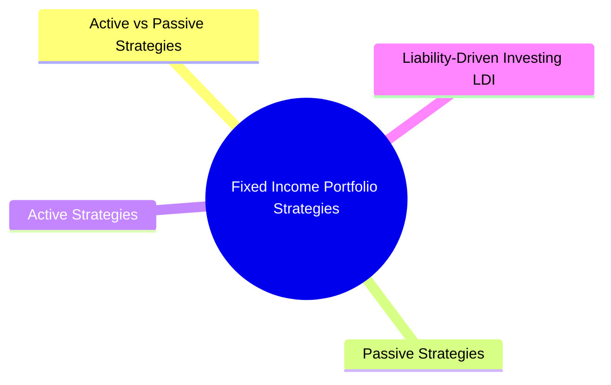

# Module 17: Fixed Income Portfolio Strategies

## Core Content

### Active vs Passive Strategies

| Strategy | Approach | Goal | Example |
|----------|----------|------|---------|
| Passive | Buy and hold / index replication | Match benchmark, minimize tracking error | Replicate Bloomberg Aggregate Bond Index |
| Active | Tactical duration / credit / sector tilts | Beat benchmark | Overweight 10yr if rates expected to fall |
| Enhanced indexing | Minor active tilts around passive core | +25-50bps over index | Slight overweight to corporate bonds |
| Liability-driven (LDI) | Match asset cash flows to liabilities | Fund known future obligations | Pension fund matching duration to liabilities |

### Passive Strategies

**Buy and Hold**: Purchase bonds, hold to maturity
- No transaction costs after initial purchase
- Reinvestment risk on coupons
- Credit migration risk
- Best for: insurance companies, pension funds with known liabilities

**Indexing**: Replicate bond index returns
- Full replication: buy all securities (impractical for broad indices)
- Stratified sampling: bucket by sector/duration/credit, buy representative bonds
- Optimization-based: minimize tracking error given constraints

**Challenges with bond indexing**:
- Thousands of securities in broad indices
- Many bonds illiquid or hard to source
- Bonds mature and fall out of index (turnover)
- Index composition changes monthly
- Tracking error inevitable

### Active Strategies

| Strategy | Description | Rate View |
|----------|-------------|-----------|
| Duration tilting | Over/underweight portfolio duration vs benchmark | Bullish = long duration; bearish = short duration |
| Yield curve positioning | Bullet / barbell / ladder relative to benchmark | Steepener / flattener / butterfly |
| Sector rotation | Overweight sectors expected to outperform | Cyclical vs defensive |
| Credit allocation | Over/underweight credit quality buckets | Risk-on vs risk-off |
| Security selection | Pick individual bonds with mispriced risk | Bottom-up credit analysis |

Question: Which strategy wins in steepening, flattening, and stable environments? Answer: Bullet wins steepening (concentrated at long end benefits from rising long rates). Barbell wins flattening (short end stable, long end rallies). Ladder wins stable (constant reinvestment, no timing risk).

**Bullet Strategy**: Concentrate maturities in single range
- Used when curve expected to steepen
- Reduces reinvestment risk horizon

**Barbell Strategy**: Concentrate in short + long maturities, skip intermediate
- Used when curve expected to flatten
- Higher convexity than bullet with same duration
- More liquidity from short end

**Ladder Strategy**: Equal weights across evenly spaced maturities
- Natural diversification
- Constant reinvestment at current rates
- Low maintenance, predictable cash flows

### Liability-Driven Investing (LDI)

**Core concept**: Manage assets relative to liability value, not index

**Key metrics**:
- **Funding ratio**: Assets / Present value of liabilities
- **Surplus**: Assets - PV(liabilities)
- **Duration gap**: Asset duration - Liability duration

**Strategies**:
- Cash flow matching: Buy bonds matching liability payment schedule exactly
- Duration matching: Match asset/liability duration (immunization)
- Convexity matching: Also match second derivative for larger rate moves
- Swaps/derivatives: Use interest rate swaps to adjust duration without buying/selling bonds

**Immunization**: Set portfolio duration = liability horizon, ensure PV of assets = PV of liabilities
- Requires rebalancing as time passes and duration drifts
- Works best for parallel yield curve shifts

### Bond Portfolio Risk Management

| Risk | Source | Management |
|------|--------|------------|
| Interest rate | Yield curve movements | Duration/convexity hedging with futures/swaps |
| Credit spread | Widening/narrowing of spreads | CDS hedging, diversification |
| Default | Issuer bankruptcy | Diversification, credit analysis |
| Reinvestment | Coupon reinvested at lower rates | Cash flow matching, ladder |
| Liquidity | Unable to sell at fair price | Hold liquid securities, line of credit |
| Prepayment | MBS called early | Prepayment models, PO/IO tranches |
| Currency (if global) | FX rate changes | FX forwards, currency hedged ETFs |

### Yield Enhancement Strategies

- **Carry trade**: Borrow short-term, lend long-term (positive carry if curve upward sloping)
- **Credit barbell**: Short IG + long HY to increase yield while managing duration
- **Emerging market debt**: Higher yields with currency risk
- **Leverage**: Repo borrowing to finance additional bond purchases
- **Option writing**: Sell covered calls on bond positions or write swaptions

### Private Bank Context

Wealth management clients invest in bond portfolios for:
- **Income generation**: Regular coupon payments for spending needs
- **Capital preservation**: High-quality bonds as safe haven
- **Diversification**: Low correlation with equities
- **Legacy planning**: Long-dated bonds for estate planning

Portfolio construction considerations for HNW clients:
- Tax-efficient bond placement (munis in taxable accounts, corporates in tax-deferred)
- Customized bond ladders for predictable cash flows
- Direct bond ownership vs bond funds/ETFs (fee efficiency)
- ESG/sustainable bond integration per client preferences
- Duration management aligned with spending horizon

## Common Misconception

**"Immunization eliminates interest rate risk."** Only for parallel shifts. Non-parallel shifts (steepening/flattening) break immunization. Need convexity matching or key-rate duration hedging for true rate risk elimination.

**"Active bond management always beats passive."** No. After fees, most active managers trail passive over long periods in IG space. HY and EM active managers can outperform due to illiquidity + research edge.

**"Bullet beats barbell always."** Bullet has lower convexity (worse in large moves). Barbell has higher convexity (better in volatile markets). Choice depends on view.

**"Laddered portfolio = no reinvestment risk."** Reinvestment still happens on each rung's maturity. Ladder spreads risk but doesn't eliminate it.

---

## Key Takeaways

- Passive strategies (buy & hold, indexing) minimize cost and tracking error
- Active strategies (duration tilting, curve positioning, sector rotation) seek alpha
- Barbell has higher convexity than bullet at same duration
- LDI aligns assets with liabilities for pension funds/insurance
- Private bank clients prioritize income, preservation, and tax efficiency

## Feynman Explain

Explain the difference between a bullet, barbell, and ladder bond portfolio strategy. When would each be preferred in terms of yield curve expectations?

## Reframe

Critics argue that active bond management rarely beats passive indexing after fees, given bond markets are more efficient than equity markets. Yet sophisticated investors still allocate to active bond managers. What specific market inefficiencies in fixed income (vs equities) could skilled managers exploit? Consider liquidity, institutional constraints, and segmentation.

## Think

> **Think**: A pension fund has a 15-year liability stream (paying retirees $50M/yr starting in year 6). The assets are currently in a bond index with effective duration of 7 years. Rates just dropped 50bp. Asset value jumped but liability PV jumped MORE (liabilities are longer-dated). What single rebalancing trade would restore immunization?
>
> *Answer: Buy duration. The asset duration (7) is now below the liability duration (more than 7 because liabilities are longer-dated and rates fell, lengthening liability duration). To re-immunize, the fund needs to extend asset duration toward 15. Practical: sell short-dated bonds, buy 15-20yr zeros or use interest rate swap paying fixed/receiving floating to synthetically add duration. After the rebalance, asset duration ≈ liability duration, so a parallel shift leaves the funding ratio unchanged. This is "duration matching" — the cornerstone of LDI.*

---

## Predict

> **Predict**: Two pension funds both have $1B in assets and $1.2B in liabilities (underfunded by $200M). Fund A holds a barbell portfolio (short + long maturities); Fund B holds a bullet portfolio (concentrated at 10yr). Rates just rose 100bp. Predict the impact on each fund's funding ratio.
>
> *Answer: Fund A (barbell) suffers LESS. Barbell has higher convexity than bullet at the same duration — in a 100bp selloff, the barbell's long end loses less (asymptote toward duration-only behavior) and short end is barely affected. The bullet's concentrated 10yr holdings get hit harder. For a given duration, barbell has positive convexity advantage. Both funds are underfunded and the funding ratio falls for both, but Fund A's funding ratio falls by less. This is why pension funds often run barbells in rising-rate environments: the convexity acts as a partial hedge.*

---

## Spot the Mistake

> **Spot the Mistake**: A junior says: "We immunized the portfolio — duration matches liabilities, so we're safe from interest rate moves. No need to rebalance for years."
>
> What's missing from the immunization setup?
>
> *Answer: Immunization requires CONTINUOUS rebalancing. As time passes, asset duration falls (each year, the duration of a bond declines by ~1 year; shorter-dated bonds mature and roll down the curve). Liability duration also shifts but typically less predictably. Without rebalancing, asset duration drifts below liability duration, and the portfolio becomes under-hedged. Standard practice: rebalance quarterly or when duration gap exceeds 0.25 years. The rebalancing frequency matters for total return — too frequent = high transaction costs, too infrequent = larger tracking error to liabilities. A second omission: immunization only works for parallel shifts. Steepeners, flatteners, and curve shocks break it. The full answer is "duration match + rebalance + convexity hedge for non-parallel risk."*

---

## Cloze

{Passive} strategies minimize cost and tracking error via buy-and-hold or index replication; {active} strategies seek alpha through duration tilting, yield curve positioning, sector rotation, and security selection. A {bullet} portfolio concentrates maturities in one range; a {barbell} holds short and long ends and skips intermediates; a {ladder} spreads holdings evenly across maturities. Barbell has higher {convexity} than bullet at the same duration, giving it an edge in volatile markets. {LDI} (Liability-Driven Investing) matches asset cash flows and duration to pension/insurance obligations; {immunization} sets asset duration equal to liability duration and requires continuous {rebalancing} as durations drift.

---

## Drill

Answer the quiz questions for this module to test your understanding of FI portfolio strategies.
