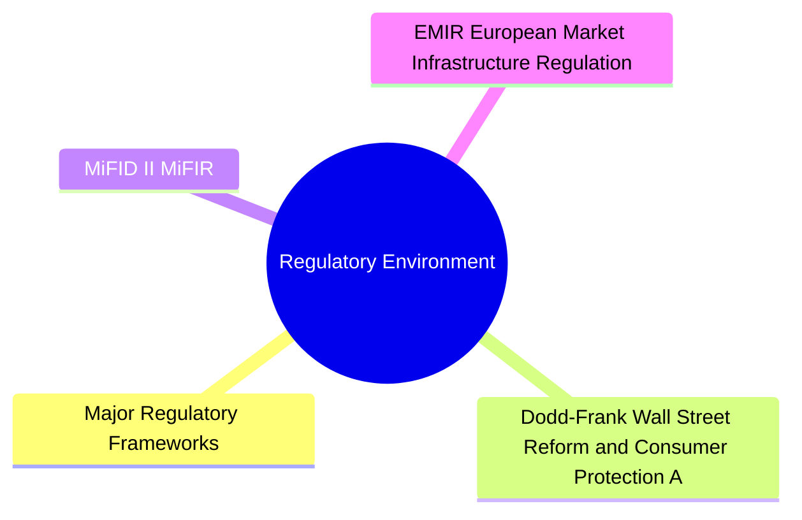

# Module 18: Regulatory Environment

## Core Content

### Major Regulatory Frameworks

| Regulation | Jurisdiction | Key Impact on FI Markets |
|-----------|-------------|--------------------------|
| Dodd-Frank Act (2010) | US | Mandatory clearing, swap execution facilities (SEFs), trade reporting |
| MiFID II / MiFIR (2018) | EU | Pre/post-trade transparency, systematic internalisers, best execution |
| EMIR (2012) | EU | Derivatives clearing, risk mitigation, reporting to trade repositories |
| Basel III | Global | Bank capital/liquidity requirements, leverage ratio, NSFR/LCR |
| SEC Rule 2a-7 | US | Money market fund reform, floating NAV, liquidity fees/redemption gates |

### Dodd-Frank Wall Street Reform and Consumer Protection Act

**Title VII — Wall Street Transparency and Accountability**:
- **Clearing mandate**: Standardized OTC derivatives must clear through CCPs
- **Swap Execution Facilities (SEFs)**: Electronic platforms for swap trading
- **Trade reporting**: All swaps reported to swap data repositories (SDRs)
- **Margin requirements**: Non-cleared swaps subject to initial and variation margin
- **Real-time price transparency**: Pre/post-trade transparency for swaps

**Impact on FI markets**:
- CDS trading moved from voice to electronic (SEFs)
- Bilateral margin calls increased collateral demand
- Higher costs for bespoke/uncleared derivatives
- Reduced liquidity in some exotic products

### MiFID II / MiFIR

**Transparency requirements**:
| Bond Type | Pre-Trade | Post-Trade |
|-----------|-----------|------------|
| Government bonds | Firm quotes for specific sizes | Within 15 min (delayed for large) |
| Corporate bonds | Indicative quotes | Within 15 min |
| Structured products | Limited transparency | End of day |

**Key concepts**:
- **Systematic Internaliser (SI)**: Firm that deals on own account, organized, frequent, systematic — must provide firm quotes
- **Best execution**: Firms must take all sufficient steps to obtain best possible result
- **Double volume cap**: Limits on trading under waiver from pre-trade transparency
- **Bond liquidity assessments**: Periodic review of liquidity tiers for deferral eligibility

### EMIR (European Market Infrastructure Regulation)

- **Clearing obligation**: Standardized OTC derivatives cleared through CCPs
- **Reporting**: All derivatives reported to trade repositories
- **Risk mitigation**: Timely confirmation, portfolio reconciliation, dispute resolution
- **Bilateral margin**: Non-cleared derivatives subject to variation margin + initial margin
- **LEI requirement**: Legal Entity Identifier for all counterparties

### Basel III — Bank Capital and Liquidity

Why Basel III? Pre-2008 banks held too little capital vs risk. A $100B trading book needed only ~$1B capital. When markets crashed, losses exceeded capital → bailouts. Basel III raised capital requirements by 3-5x for trading books.

**Capital requirements for bond inventory**:
| Metric | Requirement | Impact |
|--------|-------------|--------|
| Leverage Ratio (LR) | 3% Tier 1 / exposure | Limits balance sheet for bond inventory |
| Liquidity Coverage Ratio (LCR) | HQLA ≥ 30-day net cash outflows | Bank demand for high-quality bonds |
| Net Stable Funding Ratio (NSFR) | Available stable funding ≥ Required stable funding | Penalty for long-dated bond holdings with short-term funding |
| Supplementary Leverage Ratio (SLR) | Enhanced leverage ratio for GSIBs | Constrains repo and securities lending |

**Consequences for FI markets**:
- Reduced dealer balance sheet capacity → higher bid-ask spreads
- LCR created structural demand for Treasuries (HQLA)
- NSFR disincentivizes long-dated bond financing with short-term repo
- Repo market affected by leverage ratio constraints (especially at quarter-end)

### SEC Money Market Fund Reform

**Rule 2a-7 changes (2014/2023)**:
- Prime institutional MMFs must have floating NAV (not constant $1)
- Liquidity fees (up to 2%) and redemption gates can be imposed
- Increased minimum liquidity requirements (30% weekly liquid assets)
- 2023 amendment: Swing pricing mandatory for prime institutional MMFs

**Impact**: Shift from prime MMFs to government MMFs, affecting repo and short-term credit markets

### Market Oversight Bodies

| Body | Jurisdiction | Role in FI Markets |
|------|-------------|-------------------|
| SEC | US | Securities regulation, bond market structure, disclosure |
| FINRA | US | Self-regulatory, TRACE reporting, exam/enforcement |
| MSRB | US | Municipal securities rulemaking |
| CFTC | US | Derivatives (swaps, futures) oversight |
| ESMA | EU | Securities markets regulator, MiFID II enforcement |
| ECB | EU | Monetary policy, bond purchases (PEPP, PSPP) |
| BOE/FCA | UK | Prudential regulation / conduct authority |
| IOSCO | Global | International standards coordination |

### Basel Endgame (US Proposal, 2023)

**Proposed changes**:
- Higher risk weights for trading book (FRTB — Fundamental Review of the Trading Book)
- Increased operational risk capital
- Revised credit valuation adjustment (CVA) framework
- Binding leverage ratio constraint for largest banks

**Potential market impact**:
- Further reduced dealer bond inventory capacity
- Higher costs for securitization exposures
- Incentive for banks to exit certain FI businesses (commo, some structured products)

### Regulatory Reporting for Private Banks

**When advising clients on FI positions**:
- **FATCA**: Reporting US securities held by foreign clients
- **CRS (Common Reporting Standard)**: Automatic exchange of client account information
- **EMIR reporting**: Derivative transaction reporting obligation
- **MiFID II**: Client categorization (retail/professional/eligible counterparty), suitability, reporting
- **Dodd-Frank**: Swap dealer registration if crossing certain thresholds

### Private Bank Context

Regulatory compliance affects private banking bond operations:
- Client suitability assessment before bond recommendations
- Best execution obligations on fixed income trades
- Reporting of derivative positions (EMIR, Dodd-Frank)
- FATCA/CRS compliance for cross-border bond holdings
- Know-your-customer (KYC) documentation for bond account opening
- Capital charges on structured note inventory
- Liquidation of client US bond holdings must comply with US/EU cross-border rules (e.g., reverse solicitation)

## Common Misconception

**"More regulation = safer markets."** Regulation reduces systemic risk but creates unintended consequences. Basel III → less dealer inventory → wider bid-ask spreads → lower liquidity for clients in stress. Trade-off between stability and market function.

**"Regulations are global and consistent."** No. US (Dodd-Frank), EU (MiFID II/EMIR), UK (post-Brexit onshoring), Asia (different frameworks). Cross-border bond trading requires navigating multiple regimes.

**"Capital requirements only affect banks."** Cascade to clients: less dealer capacity → wider spreads → higher client trading costs → smaller trade sizes feasible. End investors pay.

**"Reporting obligations are just compliance cost."** Post-2008 transparency (TRACE, SDR, MiFIR) actually improved market quality — tighter spreads, better price discovery. Some regulation generates positive externalities.

---

## Key Takeaways

- Dodd-Frank pushed OTC derivatives to central clearing and SEF trading
- MiFID II increased bond market transparency with pre/post-trade requirements
- Basel III constraints reduce dealer balance sheet capacity, affecting liquidity
- MMF reform shifted money market assets from prime to government funds
- Banks face increasing capital charges for bond inventory and derivatives
- Private banks must navigate cross-border reporting and suitability rules

## Feynman Explain

Explain how Basel III's Liquidity Coverage Ratio (LCR) created a structural increase in demand for government bonds. Why do banks hold more Treasuries now than before 2008? Trace the mechanism from regulation to market impact.

## Reframe

Regulatory costs reduce market liquidity, yet regulations exist because of market failures exposed by the 2008 crisis. Is the optimal regulatory regime the one that maximizes market liquidity, or the one that ensures financial stability even at a cost to liquidity? Consider the trade-off between dealer capacity and systemic risk reduction.

## Think

> **Think**: A global bank holds $50B of high-quality liquid assets (HQLA) — mostly Treasuries and agency MBS. Its LCR is 110%, comfortably above the 100% minimum. Then the Fed raises rates 200bp. Treasuries fall 10% in price. The HQLA value falls to ~$45B. What happens to the LCR, and what should the bank do?
>
> *Answer: LCR = HQLA / 30-day net cash outflows. If HQLA falls 10% and outflows unchanged, LCR drops from 110% to ~99% — below the 100% regulatory minimum. The bank is now non-compliant. Options: (1) sell less liquid assets and buy more HQLA, (2) reduce short-term funding (cut off wholesale funding sources), (3) use repo to monetize HQLA, (4) negotiate with regulator. None are free — selling illiquid assets at fire-sale prices is exactly what LCR was supposed to prevent. This dynamic shows why LCR creates procyclicality: in stress, banks hoard HQLA rather than lend, tightening credit conditions further. The regulation reduces individual bank risk but can amplify system stress.*

---

## Predict

> **Predict**: MiFID II enforces pre-trade transparency for corporate bonds via Systematic Internalisers (SIs). What is the predicted effect on (a) corporate bond bid-ask spreads, (b) dealer inventory, and (c) trade size distribution? Direction only.
>
> *Answer: (a) Spreads TIGHTEN for liquid large issues because SI quotes are firm and visible — competition forces tighter quotes. Less-liquid issues see WIDENING spreads because SIs avoid posting firm quotes in illiquid names (regulatory capital cost too high). (b) Dealer inventory FALLS in less-liquid bonds because SIs avoid the risk. Inventory concentrates in benchmark liquid names. (c) Trade size distribution shifts: more small trades in liquid names (SIs quote up to standard market size), fewer large block trades (no one wants to commit capital to large illiquid positions under transparency). Observed: 2018-2020 post-MiFID II saw exactly this pattern — small trade share rose, large block share fell, and some less-liquid bond classes became genuinely hard to trade.*

---

## Spot the Mistake

> **Spot the Mistake**: A junior compliance officer says: "Post-trade transparency under MiFIR means all bond trades are reported in real time to the public, so we have full price discovery for every bond."
>
> What's missing?
>
> *Answer: Three omissions. (1) DEFERRED publication: MiFIR allows post-trade reporting deferrals for large trades and illiquid bonds — from 15 minutes to several days — to protect liquidity providers. Not "real time" for most large trades. (2) SIZE OMISSION: many deferral regimes allow publication without trade size, to discourage reverse-engineering of large positions. (3) SYSTEMATIC INTERNALISER waivers and reference price waivers mean many SI trades never hit the public tape. The practical effect: post-trade transparency improved the data but is far from a complete feed. A junior assuming full visibility into all bond trading would be surprised by how much still happens off-screen.*

---

## Cloze

{Dodd-Frank} (2010) mandated central clearing of standardized OTC derivatives, electronic trading on Swap Execution Facilities (SEFs), and swap data repository reporting. {MiFID II / MiFIR} (EU, 2018) imposed pre- and post-trade transparency, defined {Systematic Internaliser} obligations, and codified best execution. {EMIR} (2012) required EU derivatives clearing, reporting to trade repositories, and bilateral margin for non-cleared trades. {Basel III} raised bank capital and liquidity requirements, including the {LCR} (Liquidity Coverage Ratio) and {NSFR} (Net Stable Funding Ratio), reducing dealer bond inventory capacity. {SEC Rule 2a-7} reformed money market funds with floating NAV, liquidity fees, and swing pricing. Cross-border rules like {FATCA} and {CRS} require reporting of client securities holdings.

---

## Drill

Answer the quiz questions for this module to test your understanding of regulatory environment.
