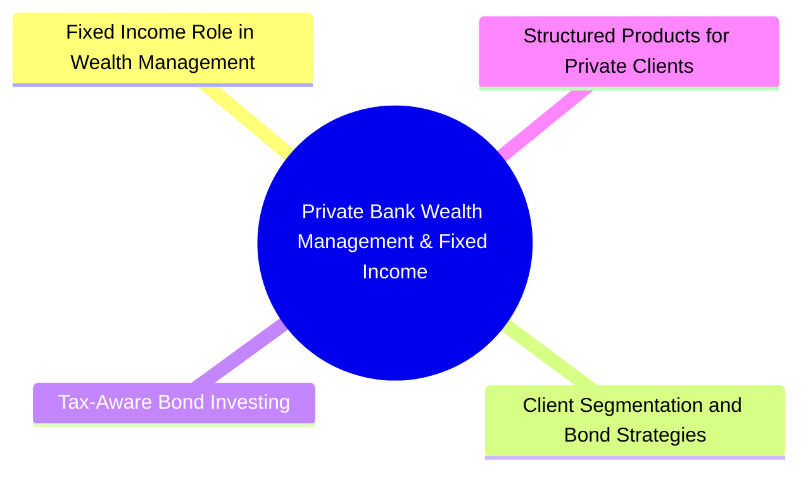

# Module 19: Private Bank Wealth Management & Fixed Income



## Core Content

### Fixed Income Role in Wealth Management

| Client Need | Fixed Income Solution | Typical Allocation |
|-------------|----------------------|-------------------|
| Capital preservation | Short-duration Treasuries, agency MBS | 20-40% |
| Income generation | Corporate bonds, munis, preferreds | 15-30% |
| Portfolio diversification | Multi-sector bond exposure | 10-25% |
| Liability matching | Duration-matched bonds | Varies by situation |
| Tax efficiency | Municipal bonds, tax-advantaged structures | HNW: 20-50% of FI allocation |
| Inflation protection | TIPS, floating-rate notes | 5-15% |
| Growth | High-yield bonds, EM debt, convertible bonds | 5-15% |

### Client Segmentation and Bond Strategies

**Mass Affluent ($250k-$1M)**:
- Primarily bond funds/ETFs (efficient access, diversification)
- Limited direct bond holdings (typically Treasuries via brokerage)
- Focus: simplicity, low cost, tax efficiency

**High Net Worth ($1M-$30M)**:
- Mix of direct bonds and funds/ETFs
- Customized municipal bond ladders
- Individual corporate bonds held to maturity
- Separate managed accounts (SMAs) with bond managers
- Structured notes for tailored risk/return

**Ultra High Net Worth ($30M+)**:
- Direct bond portfolios with dedicated managers
- Private placements (Rule 144A bonds)
- Bespoke structured products
- Family office manages bond allocation in-house
- Direct participation in bond syndications
- Collateralized lending against bond portfolios

Question: Why do UHNW clients hold bonds directly instead of funds? Answer: Control over maturity (avoid forced selling), tax-loss harvesting at individual bond level, customization of cash flows, and no management fees.

### Tax-Aware Bond Investing

| Bond Type | Federal Tax | State/Local Tax | Best Account Location |
|-----------|-------------|-----------------|----------------------|
| Treasuries | Taxable | Exempt state/local | Taxable account |
| Agency bonds | Taxable | Taxable | Tax-deferred (IRA) |
| Municipal bonds (in-state) | Tax-exempt | Tax-exempt | Taxable account |
| Municipal bonds (out-of-state) | Tax-exempt | Taxable in-state | Taxable account |
| Corporate bonds | Taxable | Taxable | Tax-deferred (IRA) |
| TIPS | Taxable (phantom income) | Exempt state/local | Tax-deferred if possible |
| High-yield bonds | Taxable | Taxable | Tax-deferred (IRA) |

**Tax-equivalent yield**:
```text
TEY = Municipal Yield / (1 - Federal Tax Rate - State Tax Rate)
```

**Tax-loss harvesting**: Sell bonds at loss to offset gains, replace with similar (not substantially identical) bonds
- Must avoid wash sale rule (30-day window)
- More opportunities in volatile bond markets
- Municipal bond swaps common for tax-loss harvesting

### Structured Products for Private Clients

| Product | Description | FI Link |
|---------|-------------|---------|
| Principal-protected note | Zero-coupon bond + call option on equity/index | Zeros provide principal protection |
| Yield enhancement note | Sell put option + bond, higher coupon if not called | Option premium boosts yield |
| Reverse convertible | High coupon but risk of receiving stock if below barrier | Credit + equity linked |
| Autocallable note | Calls automatically if underlying above trigger | Path-dependent structured coupon |
| Fixed-to-floating note | Fixed coupon period then floats | Rate view expression |

**Risks**: Issuer credit risk, limited liquidity, complexity/transparency, early call risk

### Private Banking Bond Advisory Services

| Service | Description |
|---------|-------------|
| Investment policy statement (IPS) | Define bond allocation, duration range, credit quality limits |
| Liability-driven advice | Structure bond portfolio around client spending/liability needs |
| Credit research | Independent analysis of issuer credit quality |
| Trade execution | Access to primary and secondary bond markets |
| Portfolio reporting | Performance, risk analytics, tax lot reporting |
| ESG integration | Screen bond portfolios for environmental/social/governance factors |
| Collateral management | Use bond portfolio as collateral for lending facilities |

### Bond Portfolio Lending (Securities-Based Lending)

**Mechanism**: Borrow against bond portfolio at preferential rates
- Loan-to-value varies by bond type: Treasuries 90-95%, munis 75-85%, corporates 60-80%, HY 50-60%
- Interest rate typically SOFR + spread
- No forced liquidation unless collateral falls below LTV threshold
- Used for: liquidity without selling bonds, bridge financing, avoiding tax events on sale

**Margin loan vs bond portfolio loan**:
| Feature | Margin Loan (Brokerage) | Bond Portfolio Loan (Private Bank) |
|---------|----------------------|------------------------------------|
| Rate | Higher (broker call rate +) | Lower (SOFR + small spread) |
| LTV | Reg T: 50% for stocks, higher for bonds | Customized per bond type |
| Purpose | Trading | Liquidity, real estate, business |
| Recourse | Recourse | Can be non-recourse |

### Private Client Bond Portfolio Construction

**Step-by-step process**:
1. **Goals and constraints**: Income need, time horizon, tax situation, risk tolerance
2. **Asset allocation**: Determine FI % of total portfolio
3. **Benchmark selection**: Choose reference index (e.g., Bloomberg US Agg, custom benchmark)
4. **Duration positioning**: Align with rate view and liability horizon
5. **Sector allocation**: Treasuries, agencies, corporates, munis, securitized
6. **Credit quality**: Investment grade vs high yield allocation
7. **Security selection**: Direct bonds or funds, individual credit analysis
8. **Implementation**: Build position sizes, stagger purchases, manage liquidity
9. **Monitoring**: Rebalance, credit surveillance, tax-loss harvesting

### Key Considerations for Private Bankers

- **Concentrated positions**: Client may hold large single-stock or company bond position — need diversification
- **Legacy holdings**: Bonds inherited or held for decades with low cost basis
- **Business owner bonds**: Owner-issued debt or guaranteed obligations
- **Multi-jurisdiction**: Clients with residency in multiple countries face cross-border tax/reg issues
- **Art/collectibles as collateral**: Alternative asset-backed lending within bond portfolio context
- **Inheritance planning**: Step-up in cost basis for bonds held at death, bond gifts to family

## Common Misconception

**"Bonds = safe, stocks = risky for all clients."** For long-horizon clients, stocks may be safer (inflation protection, growth). Bonds can be riskier in real terms when yields below inflation. Risk situational — depends on goals, not asset class label.

**"More yield = better investment for HNW clients."** No. After-tax, risk-adjusted returns matter. A 7% HY bond in taxable account for 37% bracket client may yield less than 4% muni. Always calculate TEY + risk-adjusted total return.

**"Direct bonds always better than bond funds."** Depends. Funds offer diversification, liquidity, professional management, low minimums. Direct bonds offer customization, tax-lot control, no fees. Cost-benefit depends on portfolio size and complexity.

**"Structured products = exotic bets."** Range accrual notes, autocallables, reverse convertibles are common HNW tools. Not exotic per se but complex. Mis-sold when client doesn't understand embedded derivatives.

---


## Key Takeaways

- Bond allocation varies by wealth tier: mass affluent use funds, UHNW use direct holdings
- Tax-efficient bond placement critical for private client returns
- Municipal bonds essential for high-tax-bracket clients
- Securities-based lending against bond portfolio provides cheap liquidity
- Structured products deliver customized risk/return but carry issuer and complexity risk
- Private bank bond advisory spans IPS, execution, credit research, reporting

## Feynman Explain

Explain why a high-net-worth client in a high-tax state (e.g., California, New York) would prefer in-state municipal bonds over Treasuries or corporate bonds. Walk through the tax-equivalent yield calculation and account location strategy.

## Reframe

Some advisors argue that ultra-high-net-worth clients should avoid bonds entirely for growth-oriented assets, claiming bond returns are too low to meaningfully impact portfolio outcomes for large wealth bases. Under what conditions does this argument break down? Consider spending needs, volatility management, and the client's definition of wealth preservation.

## Think

> **Think**: A client in the 37% federal bracket + 13% California state bracket has $5M to invest. Option A: buy a 4.5% in-state municipal bond (fully state and federal tax-exempt). Option B: buy a 5.0% corporate bond. Which wins, and what other factors might flip the decision?
>
> *Answer: TEY for the muni = 4.5% / (1 - 0.37 - 0.13) = 4.5% / 0.50 = 9.0%. The corporate bond's taxable 5.0% is worth only 5.0% × (1 - 0.50) = 2.5% after-tax. The muni wins by a wide margin (9% vs 2.5% after-tax). But factors that could flip the decision: (1) credit risk — if the muni is BBB- and the corporate is AAA, the risk-adjusted comparison favors the corporate; (2) call risk — munis are more likely to be called when rates fall; (3) liquidity — corporate bonds are more liquid; (4) diversification — adding too many munis concentrates geographic risk; (5) account location — if this $5M is in an IRA, the muni tax benefit is wasted (already tax-deferred), and the corporate is the better choice. Tax efficiency requires evaluating the full picture, not just the headline yield.*

---

## Predict

> **Predict**: A mass-affluent client with $300k asks: "Should I buy a single 5-year corporate bond for $50k, or put it in a bond fund?" Predict the answer with three supporting reasons.
>
> *Answer: Bond fund. Three reasons: (1) DIVERSIFICATION — one bond has idiosyncratic risk (a single credit event wipes out 100% of the position); a fund holds hundreds. (2) LIQUIDITY — funds can be sold any business day at NAV; the individual $50k corporate bond may have no bid for days in stress. (3) PROFESSIONAL MANAGEMENT — fund manager handles credit selection, duration management, and rebalancing; the client likely lacks the time or expertise. The exception: at much higher wealth ($1M+ in fixed income), direct bonds become efficient because fees on $1M+ at 0.3% management fee ($3,000/year) exceed the value of professional management, and the client can afford 20+ individual bonds for diversification. Below $1M, funds dominate on a fee-adjusted basis.*

---

## Spot the Mistake

> **Spot the Mistake**: An advisor tells a client: "Let's put $1M of munis into your IRA — the income will be completely tax-free."
>
> What's the conceptual error?
>
> *Answer: The advisor misunderstands the value of muni tax-exemption in a tax-deferred account. Inside an IRA, all income is already tax-deferred until withdrawal. The muni's tax-exempt status is wasted — it doesn't add a second layer of exemption. Worse, the client gives up higher-yielding taxable options (corporate bonds, Treasuries) for a lower-yielding muni. The optimal placement is INVERSE: taxable bonds in the IRA, munis in the taxable account where the exemption is valuable. The advisor's mistake: tax treatment should drive ASSET LOCATION across account types, not asset selection within an account. This is "asset location" not "asset allocation" — and confusing the two costs the client real money over decades.*

---

## Cloze

Private banking bond strategies differ by client segment: {mass affluent} use bond funds and ETFs for diversification and simplicity; {high net worth} clients mix direct bonds with funds, often building customized muni ladders; {ultra high net worth} clients access direct bonds, private placements, and bespoke structured products. {Tax-equivalent yield} (TEY) compares muni yields to taxable alternatives by grossing up for the tax bracket: TEY = muni_yield / (1 - tax_rate). {Asset location} — placing tax-inefficient assets in tax-deferred accounts and tax-efficient assets in taxable accounts — is critical for HNW after-tax returns. {Securities-based lending} against bond portfolios provides cheap liquidity at SOFR + spread with LTVs of 50-95% depending on collateral quality.

---

## Drill

Answer the quiz questions for this module to test your understanding of private bank WM and fixed income.
