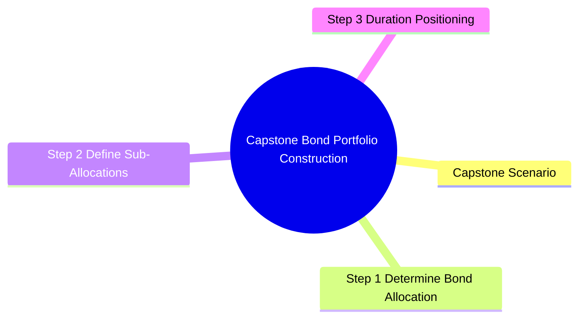

# Module 20: Capstone — Bond Portfolio Construction

## Core Content

**Note**: This capstone module synthesizes all prior modules into a portfolio construction exercise. No new concepts — application and integration of knowledge.

### Capstone Scenario

**Client profile**: Private banking client, age 55, $15M investable assets
- **Goal**: Generate $400,000 annual pre-tax income, preserve capital for retirement at 62
- **Risk tolerance**: Moderate (willing to tolerate 5-8% annual volatility in bond portfolio)
- **Tax rate**: 43.4% federal (including NIIT) + 5% state = 48.4% marginal
- **Time horizon**: 7 years to retirement, 30+ year retirement
- **Existing assets**: $5M in equities (diversified), $3M in real estate, $2M in cash
- **Constraints**: Needs liquidity for possible real estate investment in 2-3 years ($1M)
- **Preferences**: ESG-conscious, wants tax efficiency

### Step 1: Determine Bond Allocation

**Total portfolio**: $15M
**Current cash**: $2M (excess liquidity)
**Target FI allocation**: 30-40% of total portfolio ($4.5M-$6M)
**Decision**: $5M bond portfolio (33% of total, within moderate risk profile)

### Step 2: Define Sub-Allocations

| Segment | Allocation | Amount | Rationale |
|---------|-----------|--------|-----------|
| Treasuries (1-5yr) | 15% | $750K | Liquidity buffer, safety |
| Municipal bonds (in-state, ladder 1-10yr) | 35% | $1.75M | Tax-free income, diversification |
| Corporate IG (5-10yr) | 20% | $1M | Yield enhancement |
| Agency MBS | 10% | $500K | Spread product, diversification |
| TIPS (5-10yr) | 10% | $500K | Inflation protection |
| High-yield (short duration 1-3yr) | 5% | $250K | Yield pickup, limited rate risk |
| Cash equivalents (T-bills, MMF) | 5% | $250K | Dry powder for opportunity |

### Step 3: Duration Positioning

Question: Why short duration if rates may rise only 50-75bp? Answer: Duration 4.5 → 75bp rise → -3.4% loss. For $5M portfolio, -$170K. Short duration tilts reduce to ~-$100K. Small rate views → large P&L through duration leverage.

**Rate view**: Moderately bearish (yields may rise 50-75bps over next 12 months)
**Strategy**: Short-to-intermediate duration bias

| Metric | Portfolio Target | vs Benchmark (Bloomberg Agg) |
|--------|-----------------|------------------------------|
| Effective duration | 4.5 years | 1.5 years short |
| Average maturity | 6 years | 2 years short |
| Convexity | 0.40 | Slightly positive |

**Implementation**: Weight short-dated munis/Treasuries, avoid long corporates

### Step 4: Income Projection

| Segment | Yield (est.) | Annual Income |
|---------|-------------|--------------|
| Treasuries | 4.5% | $33,750 |
| Munis (tax-equiv 5.2%, actual 2.7%) | 2.7% (tax-free) | $47,250 |
| Corporate IG | 5.2% | $52,000 |
| Agency MBS | 5.0% | $25,000 |
| TIPS | 4.3% (real yield 1.8% + inflation) | $21,500 |
| High-yield | 7.5% | $18,750 |
| Cash equivalents | 5.0% | $12,500 |
| **Total** | | **$210,750 pre-tax** |
| Plus tax savings from munis (vs taxable equivalent) | | ~$44,000 |
| **Adjusted income including tax benefit** | | **~$255,000** |

Gap to $400K target: remaining income from equity dividends, real estate cash flow

### Step 5: Risk Management

| Risk | Mitigation |
|------|-----------|
| Interest rate rise | Short duration tilt, floating rate allocation |
| Credit downgrade | Diversification across 30+ issuers, IG focus |
| Default | Maximum 3% per issuer, avoid concentrated names |
| Reinvestment risk | Ladder structure provides rolling reinvestment |
| Inflation | TIPS allocation, some floating rate |
| Liquidity | Treasury/Cash buffer for real estate needs |
| Call risk | Avoid callable agency bonds, select make-whole corporates |
| Prepayment | Agency MBS allocation limited to 10% |

### Step 6: Implementation Plan

| Phase | Action | Timing |
|-------|--------|--------|
| 1 | Deploy $250K cash into T-bills | Immediate |
| 2 | Build muni ladder: $175K/year across 1-10yr | Over 2 months |
| 3 | Select 5-8 corporate IG bonds | Over 3 months |
| 4 | Add agency MBS via specified pools | Over 1 month |
| 5 | Place TIPS auction orders | Next 3 auctions |
| 6 | High-yield via short-duration ETF | Immediate |
| 7 | Rebalance duration to target | After all positions |

### Step 7: Monitoring and Rebalancing

| Frequency | Action |
|-----------|--------|
| Monthly | Performance vs benchmark, income tracking |
| Quarterly | Credit review of each holding, rating changes |
| Semi-annual | Duration rebalancing, sector allocation check |
| Annual | IPS review, rebalance to targets |
| Event-driven | Significant yield curve moves, credit events, client life changes |

### Portfolio Performance Metrics

| Metric | Target | Measurement |
|--------|--------|-------------|
| Total return vs benchmark | Within 50bps (moderate active risk) | Bloomberg Agg + custom muni index |
| Income stability | Within 10% of projection | Actual vs projected coupon income |
| Credit quality | Average A or higher | S&P/Moody's weighted average |
| Tax efficiency ratio | >90% | Taxable-equivalent return / actual return |
| Tracking error | <100bps | Annualized standard deviation of excess returns |
| Worst drawdown | <8% | Peak-to-trough in value |

### Private Bank Platform Resources

**For executing this portfolio**:
- **Bond trading desk**: Access primary and secondary markets
- **Credit research team**: Independent analysis on each issuer
- **Tax advisory**: Municipal bond selection for state tax optimization
- **Reporting**: Consolidated view across all holdings
- **Collateral lending**: Securities-based lending against portfolio
- **Estate planning**: Bond titling for trust/estate purposes
- **Alternative investments**: If higher yield needed, private credit allocation

### Key Portfolio Construction Lessons

1. **Start with client goals, not market views**: IPS before strategy
2. **Tax efficiency matters more than yield**: For taxable clients, after-tax return is what counts
3. **Duration positioning dominates returns**: Gets ~90% of bond portfolio variation
4. **Credit diversification over concentration**: Single-name default risk
5. **Liquidity is a feature, not a constraint**: Proper liquidity buffer avoids forced selling
6. **Ladder for income, barbell for convexity**: Strategy choice driven by client needs
7. **Monitor drawdown, not just yield**: Capital preservation is paramount for private clients
8. **Bonds are not risk-free**: Understand all risks (rate, credit, liquidity, inflation, reinvestment, prepayment)

## Common Misconception

**"Capstone is just applying prior modules."** True, but integration exposes conflicts: tax efficiency vs yield, duration vs income, liquidity vs return. Real portfolios require trade-offs, not textbook solutions.

**"IPS is just a formality."** Most common mistake. Without clear IPS, ad-hoc decisions dominate (market timing, chasing yield). IPS guides rebalancing discipline and prevents emotional responses.

**"Diversification = low return."** Diversification reduces UNCOMPENSATED risk (idiosyncratic). Keeps expected return similar with lower volatility. Mod 17 lesson: tax-efficient diversification can match concentrated portfolios after-tax.

**"Bond portfolios are static."** No. Active management required: rebalancing, tax-loss harvesting, credit monitoring, ladder rolling. Stale portfolios accumulate risks and miss opportunities.

---

## Key Takeaways

- Bond portfolio construction integrates all prior modules: pricing, duration, convexity, credit, tax, regulation
- Client-first approach: IPS guides all decisions
- Tax efficiency, income stability, capital preservation — private bank bond priorities
- Duration positioning is the dominant performance driver
- Proper risk management prevents forced selling at inopportune times
- Portfolio requires ongoing monitoring and periodic rebalancing

## Feynman Explain

Walk through the entire bond portfolio construction process for a HNW client from start to finish. Explain why each step matters and how a change in any assumption (e.g., higher inflation, lower tax rates, earlier retirement) would cascade through the construction process.

## Reframe

The case against bonds in private client portfolios: "With yields barely above inflation after tax, why bother? Clients would be better served by a diversified equity portfolio and cash buffer." Construct the counter-argument using wealth management principles: sequence-of-returns risk, spending needs, and capital preservation. Where is the critic right, and where are they wrong?

## Think

> **Think**: The capstone portfolio for a 55-year-old HNW client projects $255k of after-tax income from $5M in bonds, against a $400k annual need. The remaining $145k is supposed to come from equity dividends and real estate cash flow. But the client just told you: "I'm considering moving up retirement to age 58, not 62." How does this change the bond portfolio construction, and what's the most important adjustment?
>
> *Answer: Retirement at 58 means the bond portfolio must support an extra 4 years of liability before Social Security / pension kicks in. Most critical adjustment: INCREASE the muni ladder allocation (most reliable, tax-efficient cash flows) and SHIFT duration shorter on the taxable side (less rate risk on the bond portion that must be there in 3 years). The $1M liquidity buffer for the real estate investment becomes lower priority than income stability. Sell some long-dated corporate IG and buy shorter-dated munis. Add TIPS only for the portion covering post-55 inflation. Net: trading yield for certainty of cash flow when liabilities are about to accelerate. The "rate view" matters less than the "liability view" once retirement is near.*

---

## Predict

> **Predict**: A year into the bond portfolio, rates fall 100bp (bullish surprise). Predict (a) the mark-to-market impact on the portfolio, (b) the impact on forward income, and (c) the optimal rebalancing action. Use effective duration 4.5 and portfolio value $5M.
>
> *Answer: (a) MTM gain ≈ duration × yield drop × portfolio = 4.5 × 0.01 × $5M = +$225,000. (b) Forward income FALLS — coupons don't change, but as bonds mature, they reinvest at lower rates; the muni ladder loses 2-3% of forward income, corporates lose 1-2%. (c) Optimal: TRIM duration. The 100bp rally was a windfall; take some chips off the table by selling some long-duration bonds at the high price and locking in yields on shorter-dated issues. Buy more HY and TIPS (yields relatively attractive after the rally). Don't rebalance into more duration — the rally is unlikely to extend, and the income shortfall is the bigger long-term risk. The "right" rebalance is the opposite of the natural instinct (which is to chase the rally).*

---

## Spot the Mistake

> **Spot the Mistake**: After a strong bond rally, an advisor tells the client: "Your portfolio is up $225k this year. Let's take some profits and rotate into higher-yielding bonds to lock in income."
>
> What's the conceptual error?
>
> *Answer: The advisor is doing two things at once, and the second contradicts the first. "Take profits" by SELLING bonds means REDUCING income (unless you rotate into higher-yielding bonds, which adds risk). "Rotate into higher-yielding" usually means longer duration or lower credit quality — both of which INCREASE the portfolio's risk profile at exactly the wrong time (yields fell, valuations stretched, default cycle may be late). The right move: take SOME profits to rebalance duration back to target (selling the bonds that rallied most), but do NOT reach for yield. Stay in high-quality issues. If the client needs more income, the answer is "save more" or "rebalance the equity allocation," not "reach for credit risk in the bond book." The advisor has conflated "harvesting gains" with "yield maximization" — they are different goals.*

---

## Cloze

The capstone bond portfolio construction process flows: {Investment Policy Statement} (IPS) → asset allocation → sub-allocations → duration positioning → income projection → risk management → implementation → ongoing monitoring. {Asset allocation} sets the bond share (e.g., 33% of $15M = $5M); {sub-allocations} split across Treasuries, munis, corporates, MBS, TIPS, HY, cash. {Duration} is the dominant performance driver — small duration tilts create large P&L swings (4.5 × 75bp = 3.4% MTM on $5M). {Tax efficiency} via muni allocation and asset location can add 50-100bp of after-tax return. Active {monitoring} and rebalancing are required — bond portfolios are not static.

---

## Drill

Answer the quiz questions for this module. These questions integrate concepts across all modules and require multi-step reasoning.
