# Module 1: Schema & Type System

Est. study time: 2h
Language: en

## Learning Objectives
- Write GraphQL schemas using SDL with all type system constructs
- Distinguish object, interface, union, enum, input, and scalar types
- Apply type modifiers (!, []) and custom directives

---

## Core Content

### SDL: Schema Definition Language

GraphQL defines its API contract via SDL — a declarative language independent of any programming language. The schema is the single source of truth.

```graphql
schema {
  query: Query
  mutation: Mutation
  subscription: Subscription
}
```

Every schema must have a `query` root type. `mutation` and `subscription` are optional.

> **Think**: Why does GraphQL require a single `query` root type rather than supporting arbitrary entry points like REST endpoints?
>
> *Answer: A single root type forces all data access through one contract, enabling the client to request exactly what it needs in one round trip. REST scatters entry points across URLs; GraphQL centralizes them in the type system.*

---

### Scalar Types

Built-in scalars:
- `String`, `Int`, `Float`, `Boolean`, `ID` (serialized as String, but indicates identity, not human-readable)

Custom scalars — for domain-specific values:

```graphql
scalar DateTime
scalar JSON
scalar URL

# With specification URL (validates behavior):
scalar PhoneNumber @specifiedBy(url: "https://www.itu.int/rec/T-REC-E.164")
```

> **Think**: When should you create a custom scalar vs using a String with validation in resolvers?
>
> *Answer: Custom scalars when the type is reused across multiple fields and has well-defined serialization/parsing rules. Use String + resolver validation for one-off cases. Custom scalars make the schema self-documenting and enable tooling (codegen, validation) at the type level.*

---

### Object Types

Core building block. Fields map to data:

```graphql
type User {
  id: ID!
  name: String!
  email: String
  posts: [Post!]!
  profileUrl: URL
}
```

Type modifiers:
- `!` — non-null (field always returns value)
- `[Type]` — nullable list
- `[Type!]` — list is nullable, elements are non-null
- `[Type]!` — list is non-null, elements nullable
- `[Type!]!` — both non-null

> **Think**: Why consider `[Type!]!` over `[Type]` as the default list shape?
>
> *Answer: `[Type!]!` communicates "this field always returns a list, and every element is guaranteed valid." Simplifies client null-checking. Use nullable variants only when null carries semantic meaning (e.g., "access denied" → null list, or "some elements failed validation" → null elements).*

---

### Enums

Finite set of allowed values. More type-safe than strings:

```graphql
enum PostStatus {
  DRAFT
  PUBLISHED
  ARCHIVED
}
```

GraphQL enums are serialized as strings. In codegen, they become native enum types.

---

### Interfaces

Abstract type defining shared fields. Objects implement interfaces:

```graphql
interface Node {
  id: ID!
  createdAt: DateTime!
}

type User implements Node {
  id: ID!
  createdAt: DateTime!
  name: String!
  email: String
}

type Post implements Node {
  id: ID!
  createdAt: DateTime!
  title: String!
  body: String!
}
```

Queries on interface fields can use inline fragments to access type-specific fields:

```graphql
query {
  nodes {
    id
    createdAt
    ... on User { name }
    ... on Post { title }
  }
}
```

---

### Unions

Like interfaces but no shared fields. Useful when types have nothing in common:

```graphql
union SearchResult = User | Post | Comment

type Query {
  search(term: String!): [SearchResult!]!
}
```

Clients must use inline fragments to access any fields:

```graphql
query {
  search(term: "graphql") {
    ... on User { id name }
    ... on Post { id title body }
    ... on Comment { id text }
  }
}
```

> **Question**: Interface vs Union — when to choose which?
>
> *Answer: Interface when types share common fields and you want to query them without fragments. Union when types are semantically grouped but structurally unrelated. Interface is "is-a" relationship; union is "could-be-any-of" relationship.*

---

### Input Types

Arguments in GraphQL accept individual scalars, but for complex operations use `input`:

```graphql
input CreateUserInput {
  name: String!
  email: String!
  avatarUrl: URL
  role: UserRole = USER  # default value
}

type Mutation {
  createUser(input: CreateUserInput!): User!
}
```

Rules:
- Input types cannot have arguments
- Input types cannot reference object types (or other input types? they can nest)
- Input types can reference other input types (nested inputs)
- Input types must be used as argument types only

---

### Directives

Built-in directives:

```graphql
@deprecated(reason: String)
@specifiedBy(url: String!)
@skip(if: Boolean!)
@include(if: Boolean!)
@oneOf  # GraphQL spec 2024 — exactly one field must be set
```

Custom directives (server-side):

```graphql
directive @auth(requires: Role!) on OBJECT | FIELD_DEFINITION
directive @rateLimit(max: Int!, window: Int!) on FIELD_DEFINITION
directive @upper on FIELD_DEFINITION

type Query {
  adminDashboard: Dashboard @auth(requires: ADMIN)
  publicData: String
}
```

> **Think**: What's the tradeoff of using custom directives vs resolver middleware?
>
> *Answer: Directives make schema self-documenting — the auth requirement is visible in SDL. Middleware keeps resolvers clean but hides cross-cutting concerns. Directives couple behavior to the schema layer, so changing behavior requires schema change. Middleware can be toggled per-environment. Prefer directives for schema-intrinsic concerns (auth, validation), middleware for operational concerns (logging, metrics).*
  
---

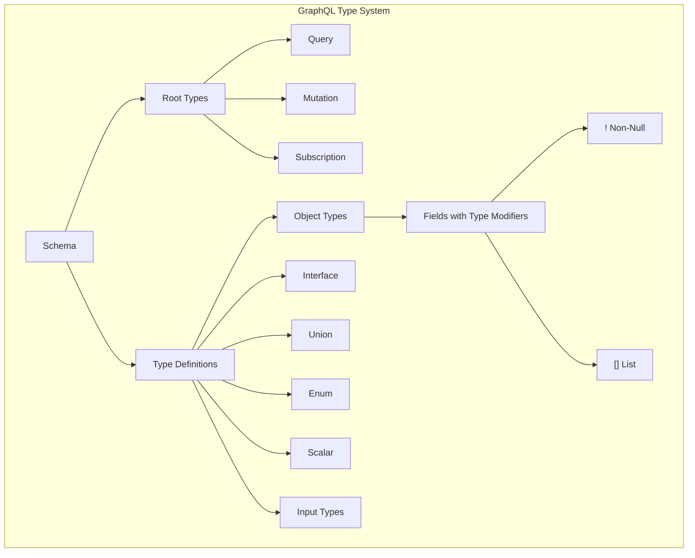
```mermaid
graph TD
  subgraph GraphQL Type System
    A[Schema] --> B[Root Types]
    A --> C[Type Definitions]
    B --> D[Query]
    B --> E[Mutation]
    B --> F[Subscription]
    C --> G[Object Types]
    C --> H[Interface]
    C --> I[Union]
    C --> J[Enum]
    C --> K[Scalar]
    C --> L[Input Types]
    G --> M[Fields with Type Modifiers]
    M --> N["!" Non-Null]
    M --> O["[]" List]
  end
```

### Why This Matters

The type system is GraphQL's superpower. Every tool — codegen, validation, introspection, client cache, federation — depends on the schema being precise. A sloppy schema (overuse of String, missing non-null, wrong interface hierarchy) causes cascading problems: fragile clients, broken caching, confused teams.

---

## Examples

### Example 1: E-commerce Schema Skeleton

```graphql
scalar DateTime
scalar JSON

enum ProductStatus {
  ACTIVE
  DISCONTINUED
  OUT_OF_STOCK
}

interface Node {
  id: ID!
  createdAt: DateTime!
}

type Product implements Node {
  id: ID!
  createdAt: DateTime!
  name: String!
  price: Float!
  status: ProductStatus!
  variants: [ProductVariant!]!
}

type ProductVariant implements Node {
  id: ID!
  createdAt: DateTime!
  sku: String!
  attributes: JSON!
  stock: Int!
}

union CatalogItem = Product | ProductVariant

input ProductFilter {
  status: ProductStatus
  minPrice: Float
  maxPrice: Float
  search: String
}

type Query {
  products(filter: ProductFilter): [Product!]!
  catalogItems(ids: [ID!]!): [CatalogItem!]!
}
```

---

## Key Takeaways
- Schema is the single source of truth, defined in SDL
- Six type kinds: scalar, object, enum, interface, union, input
- Type modifiers express nullability and list constraints
- Interfaces share fields; unions group unrelated types
- Input types are the only way to pass complex arguments
- Directives annotate schema elements for runtime behavior
- Precision in schema design prevents downstream problems

---

## Common Misconception

**"Non-null everywhere is better — fewer null checks."**

Wrong. Non-null breaks at the field level, but null propagates up through non-null parents. If `User.email` is `String!` but the DB returns null, GraphQL nulls the entire `User` object, not just email. The null-bubble rule: a non-null field that resolves to null causes its parent to become null. Use `!` confidently for fields that are truly guaranteed, but prefer nullable for fields that could fail (external API calls, optional data).

---

## Feynman Explain
Explain GraphQL's type system to a backend developer who knows REST. Focus on: why SDL exists, what problem interfaces solve that REST doesn't have, and why non-null has a dangerous edge case. Use 3 sentences max per concept.


---

## Reframe
Critique: GraphQL's type system is verbose compared to TypeScript or Protobuf. Does requiring both server and client to define types create duplication? What scenarios justify this overhead?

---

## Drill
Take the quiz. MCQs test different angles — recall, application, scenario.

Run: `learn.sh quiz graphql-deep-dive 1`

## Quiz: 01-schema-type-system


## Quiz: 01-schema-type-system

(quiz parse error: 'str' object has no attribute 'get')


---

# Module 2: Resolvers Deep Dive

Est. study time: 2h
Language: en

## Learning Objectives
- Implement GraphQL resolvers with correct signature (parent, args, context, info)
- Design context objects for auth, data sources, and DI
- Apply middleware patterns: auth, logging, error handling
- Distinguish default vs custom resolvers and resolver chains

---

## Core Content

### Resolver Signature

Every field in GraphQL resolves via a function with four arguments:

```typescript
(parent: TParent, args: TArgs, context: TContext, info: GraphQLResolveInfo) => TReturn
```

| Arg | Purpose | Mutability |
|-----|---------|------------|
| `parent` | Return value of parent field's resolver | Read-only |
| `args` | Arguments passed to the field in the query | Read-only |
| `context` | Shared object across all resolvers in one request | Mutable (per-request) |
| `info` | AST, schema, path, return type — **rarely needed** | Read-only |

```typescript
const resolvers = {
  Query: {
    user: (_, args: { id: string }, context: AppContext) => {
      return context.dataSources.users.getById(args.id)
    }
  },
  User: {
    posts: (user: User, _, context: AppContext) => {
      return context.dataSources.posts.getByUserId(user.id)
    }
  }
}
```

> **Think**: Why pass `parent` instead of making resolvers emit nested structures?
>
> *Answer: Resolvers are lazy — each field resolves independently. `parent` connects the chain but each resolver can fetch data from different sources (DB, API, cache). If resolvers emitted pre-nested data, you'd lose this flexibility and couple field resolution to data shape.*

---

### Default Resolver

If you omit a resolver for a field, GraphQL uses the default: it reads `parent[fieldName]`. This means for simple cases:

```graphql
type User { id: ID! name: String! email: String }
```

With data `{ id: "1", name: "Alice", email: "a@b.com" }`, you only need resolvers for fields that require computation:

```typescript
// Only these resolvers needed — id, name, email use default
const resolvers = {
  Query: { user: (_, args) => db.users.find(args.id) }
}
```

> **Think**: When would you write a resolver that just does `parent.fieldName`?
>
> *Answer: Never — default does it. Only write resolvers for computed fields, async data fetching, or fields whose name differs from the data key.*

---

### Context Object

Single object created per request, shared across all resolvers. Typical pattern:

```typescript
import { createServer } from 'node:http'

const server = createServer((req, res) => {
  const context = {
    currentUser: await authenticate(req.headers.authorization),
    dataSources: {
      users: new UserDataSource(db),
      posts: new PostDataSource(db),
    },
    cache: perRequestCache
  }
  // Pass context to GraphQL execution
})
```

Context is NOT the place for:
- Request-scoped caches that persist across requests (use global cache like Redis)
- Database connections (those are long-lived, inject via DI at startup)
- Heavy objects serialized per-request

> **Think**: Why should database connections NOT go in context?
>
> *Answer: DB connections are typically connection-pooled and long-lived. Creating or passing them per-request wastes resources. Inject DB pool at server startup, reference from context via a lightweight data source wrapper.*

---

### Resolver Middleware via Custom Directives

Directives wrap resolver execution. A custom `@auth` directive:

```typescript
class AuthDirective extends SchemaDirectiveVisitor {
  visitFieldDefinition(field) {
    const originalResolve = field.resolve
    const { role } = this.args

    field.resolve = async (parent, args, ctx, info) => {
      if (!ctx.currentUser) throw new AuthenticationError('not logged in')
      if (role && ctx.currentUser.role !== role) throw new ForbiddenError('insufficient role')
      return originalResolve.call(this, parent, args, ctx, info)
    }
  }
}
```

Alternative: functional middleware wrapping resolver map:

```typescript
const withAuth = (resolver, role) => (parent, args, ctx, info) => {
  if (!ctx.currentUser) throw new AuthenticationError()
  if (role && ctx.currentUser.role !== role) throw new ForbiddenError()
  return resolver(parent, args, ctx, info)
}

const resolvers = {
  Query: {
    adminDashboard: withAuth(adminDashboardResolver, 'ADMIN')
  }
}
```

---

### Error Propagation

Errors thrown in resolvers appear in `errors[]` array. The associated field's data becomes null (or bubbles up if non-null).

```typescript
const resolvers = {
  Query: {
    fragileData: async () => {
      const data = await unreliableAPI()  // might throw
      return data
    }
  }
}
// Response: { data: { fragileData: null }, errors: [{ message: "...", path: ["fragileData"] }] }
```

Custom errors for rich information:

```typescript
import { GraphQLError } from 'graphql'

throw new GraphQLError('Product not found', {
  extensions: { code: 'NOT_FOUND', productId, httpStatus: 404 }
})
```

> **Think**: Should you catch all errors to prevent internal details leaking?
>
> *Answer: Yes — wrap resolvers with a top-level try/catch that converts unexpected errors to generic `INTERNAL_SERVER_ERROR` while logging the original. Never expose stack traces or DB internals in production errors.*

---

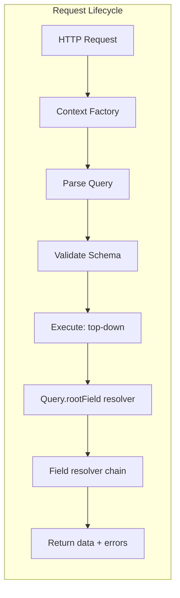
```mermaid
graph LR
  subgraph Request Lifecycle
    A[HTTP Request] --> B[Context Factory]
    B --> C[Parse Query]
    C --> D[Validate Schema]
    D --> E[Execute: top-down]
    E --> F[Query.rootField resolver]
    F --> G[Field resolver chain]
    G --> H[Return data + errors]
  end
```

### Resolver Chain Walkthrough

Query: `{ user(id: "1") { name posts { title } } }`

Execution order (not parallel — each level waits for parent):

1. `Query.user` resolves → returns User object `{ id: "1", name: "Alice" }`
2. `User.name` → default resolver reads `parent.name` → `"Alice"`
3. `User.posts` → custom resolver calls `db.posts.byUserId("1")` → returns posts array
4. `Post.title` → default resolver for each post → resolves titles

Step 3 is where performance matters: if you query 10 users, `User.posts` runs 10 times → N+1 problem (addressed in Module 6).

---

### Info Object (Advanced)

Fourth argument `info` gives raw query AST. Rarely needed, but powerful:

```typescript
// Only select DB columns the client requested
const resolvers = {
  User: {
    email: (user, _, ctx, info) => {
      // info.fieldNodes[0].selectionSet.selections...
      // Could optimize: only query email from DB if requested
      return user.email
    }
  }
}
```

**Warning**: Parsing `info` is complex, version-dependent, and easy to get wrong. Prefer DataLoader + batching over `info` optimization. Only reach for `info` when building generic tools (ORM integration, monitoring).

---

### Why This Matters

Resolvers are where schema meets data. Bad resolver patterns cause N+1 queries, security holes (missing auth checks), leaky errors, and unmaintainable code. Mastering resolver architecture is the difference between a GraphQL API that's "working" and one that's production-grade.

---

## Examples

### Example 1: Complete Resolver Setup with Auth + DataSources

```typescript
interface AppContext {
  currentUser: User | null
  dataSources: DataSources
}

const resolvers = {
  Query: {
    me: (_, __, ctx) => {
      if (!ctx.currentUser) throw new AuthenticationError()
      return ctx.currentUser
    },
    post: (_, { id }: { id: string }, ctx) => {
      return ctx.dataSources.posts.getById(id)
    }
  },
  Post: {
    author: (post, _, ctx) => {
      return ctx.dataSources.users.getById(post.authorId)
    },
    comments: (post, _, ctx) => {
      return ctx.dataSources.comments.getByPostId(post.id)
    }
  },
  User: {
    fullName: (user) => `${user.firstName} ${user.lastName}`,  // computed field
  }
}
```

---

## Key Takeaways
- Resolver signature: `(parent, args, context, info) => data`
- Default resolver reads `parent[fieldName]` — write resolvers only for computed/async fields
- Context is per-request; use for auth, data sources, lightweight caches
- Directives and wrapper functions implement middleware patterns
- Errors in resolvers → `errors[]` array + nullified field
- Never parse `info` unless building generic infrastructure

---

## Common Misconception

**"Resolvers should return the exact shape the client queried."**

Wrong. Resolvers return the object, GraphQL engine selects fields client asked for. Your resolver for `User.posts` should return the full posts array (or a loader promise). The engine handles field selection. Trying to pre-shape responses leads to brittle resolvers and wasted effort.

---

## Feynman Explain
Explain resolver chain to a junior developer: how Query.user → User.posts → Post.title connects, what the default resolver does, and why each resolver runs independently.

---

## Reframe
Would GraphQL be simpler without the `parent` argument — e.g., all resolvers receive flat args? What problems would that cause for nested data fetching?

---

## Drill
Take the quiz.

Run: `learn.sh quiz graphql-deep-dive 2`

## Quiz: 02-resolvers-deep-dive


## Quiz: 02-resolvers-deep-dive

(quiz parse error: 'str' object has no attribute 'get')


---

# Module 3: Queries

Est. study time: 2h
Language: en

## Learning Objectives
- Write queries with fields, arguments, variables, aliases, and fragments
- Use directives (@include, @skip) for conditional selection
- Apply inline fragments for polymorphic types (interface/union)

---

## Core Content

### Field Selection

Client requests exactly the fields needed. Shape of query = shape of response:

```graphql
query {
  user(id: "1") {
    name
    email
    posts {
      title
    }
  }
}

# Response:
{
  "data": {
    "user": {
      "name": "Alice",
      "email": "alice@example.com",
      "posts": [
        { "title": "GraphQL 101" },
        { "title": "Advanced Patterns" }
      ]
    }
  }
}
```

> **Think**: Why does the response mirror the query shape rather than using a flat structure?
>
> *Answer: Predictability. Client knows exactly where each field appears. No post-processing needed to navigate nested JSON. REST often requires multiple traversals or normalization.*

---

### Arguments

Every field can accept arguments — not just root fields:

```graphql
query {
  user(id: "1") {
    name
    avatar(width: 200, height: 200, format: WEBP)
    posts(first: 5, sort: RECENT) {
      title
    }
  }
}
```

**Key distinction**: REST puts arguments in URL path/query/body. GraphQL puts arguments on any field. This enables rich filtering at every level of the graph.

---

### Variables

Queries can be parameterized. Separates query text from runtime values:

```graphql
query GetUser($userId: ID!, $postLimit: Int) {
  user(id: $userId) {
    name
    posts(first: $postLimit) {
      title
    }
  }
}
```

Variable rules:
- Declared with `$name: Type` after operation keyword
- Can have defaults: `$limit: Int = 10`
- Must match schema argument type
- Cannot be used in `@skip`/`@include` conditions (they take `Boolean!` variables — actually they can)

> **Think**: Why use variables instead of string interpolation?
>
> *Answer: Variables are type-checked against the schema, cached separately from query text (persisted queries), and prevent injection attacks. String interpolation breaks caching and type safety.*

---

### Aliases

Rename fields in response. Essential for requesting the same field with different arguments:

```graphql
query {
  alice: user(id: "1") { name }
  bob: user(id: "2") { name }
}

# Response:
{
  "data": {
    "alice": { "name": "Alice" },
    "bob": { "name": "Bob" }
  }
}
```

Without aliases, you cannot query the same field twice at the same level.

---

### Fragments

Reusable selection sets. Avoid repeating fields:

```graphql
fragment UserFields on User {
  id
  name
  email
  avatar
}

query {
  user(id: "1") {
    ...UserFields
    posts { title }
  }
}
```

Fragments can spread into other fragments and include directives.

---

### Inline Fragments

For interfaces and unions — access type-specific fields:

```graphql
query {
  search(term: "graphql") {
    ... on User { name email }
    ... on Post { title body }
    ... on Comment { text }
  }
}
```

Also used for type conditions without defining a named fragment.

---

### Directives @skip and @include

Conditionally include/exclude fields at runtime:

```graphql
query UserProfile($showEmail: Boolean!, $hideAvatar: Boolean!) {
  user(id: "1") {
    name
    email @include(if: $showEmail)
    avatar @skip(if: $hideAvatar)
  }
}
```

> **Think**: Can @skip and @include be used on the same field?
>
> *Answer: No — behavior is undefined if both applied. Use one or the other.*

---

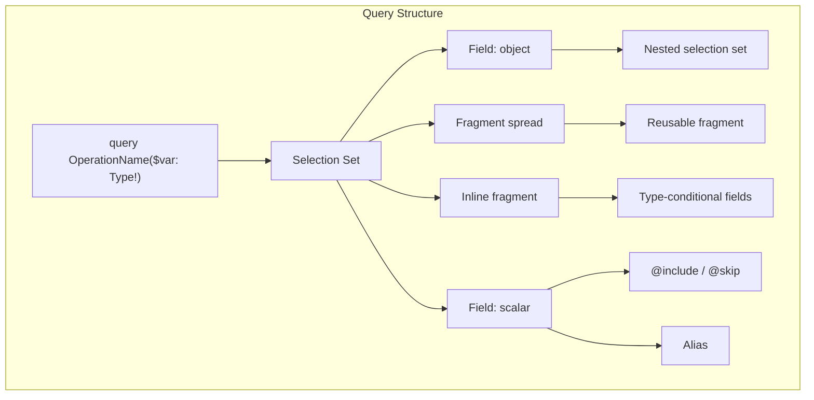
```mermaid
graph TD
  subgraph Query Structure
    A["query OperationName($var: Type!)"] --> B[Selection Set]
    B --> C[Field: scalar]
    B --> D[Field: object]
    B --> E[Fragment spread]
    B --> F[Inline fragment]
    D --> G[Nested selection set]
    E --> H[Reusable fragment]
    F --> I[Type-conditional fields]
    C --> J["@include / @skip"]
    C --> K[Alias]
  end
```

### Operation Types and Name

Three operation types: `query`, `mutation`, `subscription`. Operation name:

```graphql
# ❌ Anonymous — harder to debug, no caching
query { user(id: "1") { name } }

# ✅ Named — better logs, persisted queries, devtools
query GetUser { user(id: "1") { name } }
```

> **Think**: When is anonymous query acceptable?
>
> *Answer: Only in GraphiQL/exploratory context or one-shot scripts. Production code always names operations for monitoring, persisted queries, and cache keying.*

---

### Top-Level Fields vs Nested

Root Query fields are entry points. Nested fields traverse the graph. Every query must start at a root field:

```graphql
type Query {
  me: User
  user(id: ID!): User
  users(filter: UserFilter): [User!]!
  search(term: String!): [SearchResult!]!
}
```

No other way to enter the graph — this centralization is deliberate.

---

### Why This Matters

Query structure is the client contract. Poorly designed queries cause over-fetching, under-fetching, and waterfall requests. Mastering fields, arguments, fragments, and variables lets you write efficient, reusable queries that minimize data transfer and maximize cache hit rates.

---

## Examples

### Example 1: Paginated Profile with Conditional Display

```graphql
query ProfilePage($userId: ID!, $showDrafts: Boolean!, $limit: Int = 10) {
  user(id: $userId) {
    ...UserFields
    posts(first: $limit, status: PUBLISHED) {
      ...PostFields
    }
    drafts: posts(first: $limit, status: DRAFT) @include(if: $showDrafts) {
      ...PostFields
    }
  }
}

fragment UserFields on User {
  id name avatar email
}

fragment PostFields on Post {
  id title createdAt
}
```

---

## Key Takeaways
- Query shape mirrors response shape — predictable
- Arguments on any field enable rich filtering at every level
- Variables: type-safe, cacheable, injection-proof
- Aliases: same field, different args in one query
- Fragments: reusable selection sets reduce duplication
- @include/@skip: runtime field visibility control
- Inline fragments: access interface/union-specific fields
- Always name operations in production

---

## Common Misconception

**"Fragments are just a client-side convenience — the server treats them the same as inlined fields."**

Actually true — fragments are expanded client-side by GraphQL execution. No server performance difference. But fragments DRY up your queries and make cache normalization work (Apollo's cache uses `__typename` + `id` from fragment spreads to identify entities).

---

## Feynman Explain
Explain to a mobile developer: how a GraphQL query guarantees they never over-fetch or under-fetch data. Show one query vs equivalent REST calls.

---

## Drill
Take the quiz.

Run: `learn.sh quiz graphql-deep-dive 3`

## Quiz: 03-queries


## Quiz: 03-queries

(quiz parse error: 'str' object has no attribute 'get')


---

# Module 4: Mutations

Est. study time: 2h
Language: en

## Learning Objectives
- Design mutation inputs and payloads following best practices
- Implement error handling patterns including partial success
- Ensure idempotency for safe retry behavior

---

## Core Content

### Mutation vs Query

Mutations are write operations. Key differences from queries:

| Aspect | Query | Mutation |
|--------|-------|----------|
| Semantics | Read | Write |
| Execution | Parallel | Series (strict order) |
| HTTP method | GET | POST |
| Caching | Yes (CDN, client) | No |
| Side effects | None | Allowed |

> **Think**: Why does GraphQL execute mutations serially?
>
> *Answer: Mutations may have side effects and dependencies. `mutation { createOrder createPayment sendEmail }` — payment depends on order ID, email depends on both. Serial execution guarantees deterministic ordering. Parallel mutation execution could cause race conditions.*

---

### Input Types

Complex mutation arguments use `input` types:

```graphql
input CreateUserInput {
  name: String!
  email: String!
  role: UserRole = USER
  avatar: Upload
}

type Mutation {
  createUser(input: CreateUserInput!): User!
}
```

Best practices:
- One input type per mutation (not shared across mutations unless fields truly identical)
- Use default values where sensible
- `input` types cannot be interfaces or unions — use `@oneOf` directive (GraphQL spec 2024+) for mutually exclusive fields:

```graphql
input ContactInput @oneOf {
  email: String
  phone: String
}
# Exactly one must be set — validated at schema level
```

---

### Payload Design

Return the created/updated entity directly, OR use a payload type for richer responses:

```graphql
# Simple return
type Mutation {
  createUser(input: CreateUserInput!): User!
}

# Payload pattern — recommended for complex mutations
type CreateUserPayload {
  user: User
  query: Query  # enables chaining
  errors: [UserError!]
}

type UserError {
  field: String!
  message: String!
}

type Mutation {
  createUser(input: CreateUserInput!): CreateUserPayload!
}
```

> **Think**: Why return payload type instead of the entity directly?
>
> *Answer: Payload enables: (1) returning multiple entities, (2) including errors with field-level granularity, (3) embedding a `query` root for chaining, (4) future extensibility without breaking changes. Direct entity return couples mutation output to a single type.*

---

### Error Handling Patterns

Three-tier error model:

**1. Top-level GraphQL errors** — unexpected failures, auth failures, rate limits:

```graphql
{
  "data": { "createUser": null },
  "errors": [{ "message": "Database unavailable", "extensions": { "code": "DB_DOWN" } }]
}
```

**2. Field-level errors in payload** — validation, business logic:

```graphql
type CreateUserPayload {
  user: User
  errors: [UserError!]
}

# Response:
{
  "data": {
    "createUser": {
      "user": null,
      "errors": [
        { "field": "email", "message": "Already taken" },
        { "field": "name", "message": "Too short (min 2 chars)" }
      ]
    }
  }
}
```

**3. Partial success** — some operations succeed, others fail:

```graphql
type BatchCreateUserPayload {
  users: [User!]
  errors: [UserError!]
}
# 2 succeeded, 1 failed
```

> **Think**: When to use GraphQL errors vs payload errors?
>
> *Answer: GraphQL errors for system-level failures (auth, server error, rate limit). Payload errors for business logic failures (validation, duplicate, insufficient funds). GraphQL errors abort the field; payload errors coexist with partial data.*

---

### Idempotency

Mutations should be idempotent for safe retries:

```graphql
input CreateOrderInput {
  idempotencyKey: ID!
  items: [OrderItemInput!]!
}
```

Implementation pattern:

```typescript
const resolvers = {
  Mutation: {
    createOrder: async (_, { input }, { dataSources }) => {
      const existing = await dataSources.orders.findByIdempotencyKey(input.idempotencyKey)
      if (existing) return existing  // Return cached result
      const order = await dataSources.orders.create(input)
      return order
    }
  }
}
```

Idempotency is critical for payment, order, and any mutation with side effects.

---

### Mutation Ordering

Top-level mutation fields execute sequentially. Nested fields within a mutation resolver execute per normal resolver chain (parallel where independent):

```graphql
mutation {
  step1: doSomething(input: { ... })
  step2: doSomethingElse(input: { ... })
}
# step1 completes before step2 starts
```

---

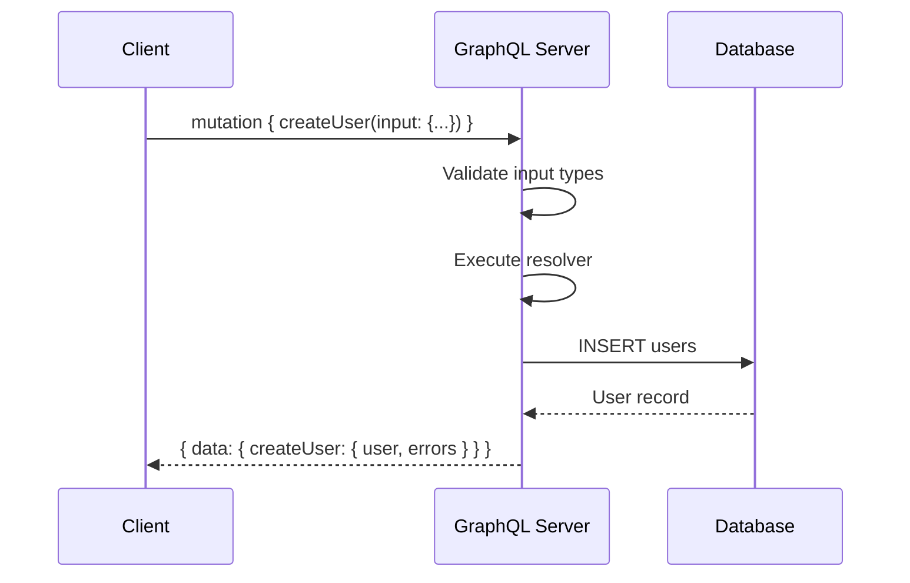
```mermaid
sequenceDiagram
    participant C as Client
    participant G as GraphQL Server
    participant DB as Database
    C->>G: mutation { createUser(input: {...}) }
    G->>G: Validate input types
    G->>G: Execute resolver
    G->>DB: INSERT users
    DB-->>G: User record
    G-->>C: { data: { createUser: { user, errors } } }
```

### Why This Matters

Mutations are the most error-prone part of any API. Poor mutation design causes data corruption, non-retryable failures, confusing error responses, and breaking changes. Well-designed mutations with input types, payloads, explicit errors, and idempotency make APIs robust and self-documenting.

---

## Examples

### Example 1: Complete Mutation with Payload and Errors

```graphql
input UpdateProfileInput {
  name: String
  avatar: Upload
  bio: String
}

type UpdateProfileError {
  field: String!
  message: String!
  code: String!
}

type UpdateProfilePayload {
  user: User
  errors: [UpdateProfileError!]
}

type Mutation {
  updateProfile(input: UpdateProfileInput!): UpdateProfilePayload!
}
```

---

## Key Takeaways
- Mutations execute serially; queries execute in parallel
- Use `input` types for complex arguments — one input per mutation
- Payload types enable error + data + chaining in one response
- Three error tiers: system (GraphQL errors), validation (payload errors), partial success
- Idempotency keys prevent duplicate processing on retry
- Always name mutations with action verbs: `createUser`, `updateProfile`, `deletePost`

---

## Common Misconception

**"Mutations should return only the mutated entity."**

Limiting. Payload pattern lets you return errors alongside data, include a `query` field for subsequent queries, and add fields later without breaking changes. Direct entity return is fine for simple cases but payload scales better.

---

## Feynman Explain
Explain to a product manager why `updateProfile` might return both `user` and `errors` in the same response, not just a 200 or 400 status code.

---

## Reframe
Critique: Should mutations ever return the full `Query` type for chaining? Under what conditions does this add value vs bloat?

---

## Drill
Take the quiz.

Run: `learn.sh quiz graphql-deep-dive 4`

## Quiz: 04-mutations


## Quiz: 04-mutations

(quiz parse error: 'str' object has no attribute 'get')


---

# Module 5: Subscriptions

Est. study time: 2.5h
Language: en

## Learning Objectives
- Implement subscription resolvers using async iterators and pub/sub patterns
- Distinguish WebSocket (graphql-ws) and Server-Sent Events transport
- Handle auth, back-pressure, and event sourcing in subscriptions

---

## Core Content

### Real-Time GraphQL

Subscriptions enable server-to-client push. Client sends subscription query, server streams events as data changes. Unlike queries (request-response) and mutations (write-then-read), subscriptions maintain persistent connection.

```graphql
type Subscription {
  postCreated: Post!
  postUpdated(postId: ID!): Post
  notificationReceived: Notification!
}
```

Client subscribes:

```graphql
subscription OnPostCreated {
  postCreated {
    id
    title
    author { name }
  }
}
```

Server pushes each new Post as created.

> **Think**: When would you choose subscription over polling?
>
> *Answer: Subscriptions for latency-sensitive updates where data changes unpredictably (chat, notifications, live prices). Polling for predictable intervals where near-real-time is acceptable (dashboard metrics every 30s). Subscriptions waste resources if events are frequent and client can't keep up.*

---

### Transport: WebSocket

WebSocket is bidirectional, persistent TCP connection. Two common protocols:

**subscriptions-transport-ws** (legacy, Apollo):

```text
Client → Server: {"type":"connection_init","payload":{...}}
Server → Client: {"type":"connection_ack"}
Client → Server: {"type":"start","id":"1","payload":{"query":"subscription {...}"}}
Server → Client: {"type":"data","id":"1","payload":{"data":{...}}}
Server → Client: {"type":"complete","id":"1"}
```

**graphql-ws** (modern, recommended):

```text
Client → Server: {"type":"subscribe","id":"1","payload":{"query":"subscription {...}"}}
Server → Client: {"type":"next","id":"1","payload":{"data":{...}}}
Server → Client: {"type":"complete","id":"1"}
```

Key difference: graphql-ws removes handshake as mandatory first message. `connection_init` becomes optional, sent only when auth needed. Fewer round trips.

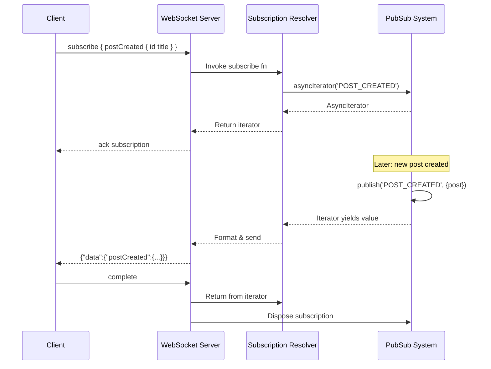
```mermaid
sequenceDiagram
    participant Client
    participant WS as WebSocket Server
    participant Resolver as Subscription Resolver
    participant PS as PubSub System
    
    Client->>WS: subscribe { postCreated { id title } }
    WS->>Resolver: Invoke subscribe fn
    Resolver->>PS: asyncIterator('POST_CREATED')
    PS-->>Resolver: AsyncIterator
    Resolver-->>WS: Return iterator
    WS-->>Client: ack subscription
    
    Note over PS: Later: new post created
    PS->>PS: publish('POST_CREATED', {post})
    PS-->>Resolver: Iterator yields value
    Resolver-->>WS: Format & send
    WS-->>Client: {"data":{"postCreated":{...}}}
    
    Client->>WS: complete
    WS->>Resolver: Return from iterator
    WS->>PS: Dispose subscription
```

---

### Subscription Resolver Pattern

GraphQL subscriptions use `subscribe` function (returns async iterable) and `resolve` function (shapes each event):

```javascript
const resolvers = {
  Subscription: {
    postCreated: {
      subscribe: (_, args, { pubsub }) =>
        pubsub.asyncIterator(['POST_CREATED']),
      resolve: (payload) => payload.postCreated,
    },
    postUpdated: {
      subscribe: (_, { postId }, { pubsub }) =>
        pubsub.asyncIterator([`POST_UPDATED_${postId}`]),
      resolve: (payload, { postId }) =>
        payload.postUpdated.postId === postId ? payload.postUpdated : null,
    },
  },
}
```

Filtered subscriptions — resolver returns `null` to skip event for client:

```javascript
subscribe: (_, { severity }, { pubsub }) =>
  pubsub.asyncIterator(['LOG_EVENT']),
resolve: (payload, { severity }) =>
  payload.logEvent.severity >= severity ? payload.logEvent : null,
```

> **Think**: Why does filtering happen in resolve, not subscribe?
>
> *Answer: subscribe returns a fixed async iterator per subscription channel. Filtering in resolve lets the server push once to all subscribers on same channel, then each subscriber's resolve determines if event passes. More efficient than per-subscriber iterators.*

---

### Pub/Sub Implementations

In-memory (development only):

```javascript
class InMemoryPubSub {
  constructor() {
    this.subscribers = {}
  }
  publish(triggerName, payload) {
    this.subscribers[triggerName]?.forEach(fn => fn(payload))
  }
  asyncIterator(triggers) {
    const pullQueue = []
    const pushQueue = []
    // implementation: event buffer + async generator
    return {
      next() {
        // pull from pushQueue or await new event
      }
    }
  }
}
```

Production: Redis, Kafka, RabbitMQ, NATS. Pub/sub decouples mutation resolvers (publishers) from subscription resolvers (consumers). Across processes, Redis PubSub or Kafka topics relay events.

---

### Event Sourcing Integration

Subscription events often come from event-sourced systems. Mutation → domain event → subscription:

```javascript
const mutationResolvers = {
  Mutation: {
    createPost: async (_, { input }, { db, pubsub }) => {
      const post = await db.posts.create(input)
      await pubsub.publish('POST_CREATED', { postCreated: post })
      // Also publish to event store
      await eventStore.append('PostCreated', post)
      return post
    },
  },
}
```

Event sourcing guarantees: events are durable, replayable, ordered. Subscriptions consume live events; event store provides audit trail.

---

### Back-Pressure Handling

Client consumes slower than server produces → back-pressure. Mitigation strategies:

1. **Buffer with bounded size**: Drop oldest when full (ring buffer)
2. **Client ack protocol**: Server waits for client acknowledgement before next event
3. **Rate limiting**: Throttle events per-subscriber
4. **Client disconnect**: Close slow consumer

```javascript
// Bounded buffer example
const MAX_BUFFER = 100
const buffer = []

function onEvent(event) {
  if (buffer.length >= MAX_BUFFER) {
    buffer.shift() // drop oldest
  }
  buffer.push(event)
  processBuffer()
}
```

> **Think**: What happens when subscription client disconnects mid-stream?
>
> *Answer: Server calls `return()` on async iterator, which disposes the subscription in pub/sub. Cleanup handlers run. Client reconnects — sends new subscribe. Server may replay last N events (at-least-once) or start fresh (at-most-once), depending on design.*

---

### Auth in Subscriptions

WebSocket auth happens at connection time via `connection_init` payload:

```javascript
// graphql-ws server setup
const server = createServer({
  onConnect: (ctx) => {
    const { token } = ctx.connectionParams || {}
    if (!token) throw new Error('Auth required')
    const user = verifyToken(token)
    ctx.session = { user }
  },
  context: (ctx) => ({
    user: ctx.session?.user,
  }),
})
```

Per-subscription auth — validate in subscribe resolver:

```javascript
subscribe: (_, args, { user }) => {
  if (!user) throw new Error('Not authenticated')
  if (!user.roles.includes('EDITOR')) throw new Error('Not authorized')
  return pubsub.asyncIterator(['POST_CREATED'])
},
```

> **Think**: Why auth at connection level vs per-subscription level?
>
> *Answer: Connection-level auth validates once per WebSocket session — efficient for multiple subscriptions. Per-subscription auth enables fine-grained control (user can subscribe to public events but not admin events). Use both: connection-level for base identity, per-subscription for authorization.*

---

### graphql-over-sse (Server-Sent Events)

SSE is HTTP-based, unidirectional (server→client). Simpler than WebSocket, works over HTTP/2, no upgrade required:

```graphql
# Client request (POST):
{
  "query": "subscription { notificationReceived { message } }"
}

# Server response (text/event-stream):
event: next
data: {"data":{"notificationReceived":{"message":"New message"}}}

event: next
data: {"data":{"notificationReceived":{"message":"Another one"}}}

event: complete
```

When to choose SSE over WebSocket:

| Factor | WebSocket | SSE |
|--------|-----------|-----|
| Bidirectional | Yes | No (client→server uses regular HTTP) |
| HTTP/2 native | No (upgrade) | Yes |
| Auto-reconnect | Manual | Built-in (EventSource API) |
| Binary support | Yes | Text only (SSE) |
| Browser support | Full | Full (except IE) |
| Multiplexing | Single connection, channels via protocol | Per-connection per stream |

GraphQL over SSE spec (graphql-sse library) defines protocol for SSE-based subscriptions.

---

### Why This Matters

Subscriptions enable real-time features that differentiate modern apps: live chat, collaborative editing, price tickers, notification streams. Choosing wrong transport (WebSocket for simple one-way notifications) wastes complexity. Understanding async iterator pattern, back-pressure, and auth model prevents production issues.

---

## Examples

### Example 1: Chat Subscription

```graphql
type Subscription {
  messageReceived(roomId: ID!): Message!
  typingIndicator(roomId: ID!): TypingUser
}

type Mutation {
  sendMessage(roomId: ID!, text: String!): Message!
  typing(roomId: ID!, isTyping: Boolean!): Boolean!
}
```

```javascript
// Resolver
const resolvers = {
  Subscription: {
    messageReceived: {
      subscribe: (_, { roomId }, { pubsub }) =>
        pubsub.asyncIterator([`MESSAGE_${roomId}`]),
      resolve: (payload) => payload.messageReceived,
    },
  },
  Mutation: {
    sendMessage: async (_, { roomId, text }, { pubsub, user }) => {
      const message = { id: uuid(), roomId, text, author: user, timestamp: Date.now() }
      await pubsub.publish(`MESSAGE_${roomId}`, { messageReceived: message })
      return message
    },
  },
}
```

---

### Example 2: GraphQL over SSE Setup

```javascript
import { createHandler } from 'graphql-sse'

const handler = createHandler({
  schema,
  context: async (req) => ({
    user: await authenticate(req),
  }),
})

// Express integration
app.use('/graphql/stream', (req, res) => {
  if (req.method === 'POST' && req.query?.query) {
    handler(req, res)
  }
})
```

Client side:

```javascript
const eventSource = new EventSource('/graphql/stream?query=subscription{...}')

eventSource.addEventListener('next', ({ data }) => {
  const parsed = JSON.parse(data)
  console.log(parsed.data.notificationReceived)
})
```

---

## Key Takeaways
- Subscriptions use async iterators — server pushes, client consumes
- graphql-ws is modern WebSocket protocol (simpler handshake than legacy)
- Pub/sub decouples mutation publish from subscription consume
- Filtered subscriptions filter in resolve, not subscribe
- Back-pressure strategies: bounded buffer, rate limiting, client ack
- Connection-level auth for base identity; per-subscription for authorization
- SSE is simpler than WebSocket for server→client only streams
- graphql-over-sse works over HTTP/2 without upgrade

---

## Common Misconception

**"WebSocket is always better for real-time than SSE."**

WebSocket is overused. Many apps only need server→client push (not bidirectional). SSE works over HTTP/2 (multiplexed), has built-in reconnect, simpler infrastructure (no WebSocket load balancer config), and lower overhead when client never sends data after subscribe. Use WebSocket when client needs to send data through the same connection (chat typing indicators, collaborative editing ops).

---

## Feynman Explain
Explain GraphQL subscriptions to a backend developer who knows WebSockets but not GraphQL. Cover: async iterator pattern, pub/sub decoupling, and why filtered subscriptions use resolve not subscribe. 3 sentences max each.

---

## Reframe
Critique: Subscriptions add significant complexity over polling — WebSocket infrastructure, connection management, back-pressure, auth lifecycle. When does the real-time benefit justify this cost? When does polling + short cache TTL win?

---

## Drill
Take the quiz.

Run: `learn.sh quiz graphql-deep-dive 5`

## Quiz: 05-subscriptions


## Quiz: 05-subscriptions

(quiz parse error: 'str' object has no attribute 'get')


---

# Module 6: N+1 & DataLoader

Est. study time: 2.5h
Language: en

## Learning Objectives
- Diagnose N+1 problem in GraphQL resolver chains
- Implement DataLoader with batch functions and per-request cache
- Apply cache key strategies, priming, and avoid common pitfalls

---

## Core Content

### The N+1 Problem

Classic pattern: 10 users, each has posts. Naive resolver fetches users (1 query), then for each user fetches posts (N queries). Total: 1 + N = 11 DB queries where 1 suffices.

```javascript
// ❌ N+1 — one query per user
const resolvers = {
  Query: {
    users: async (_, args, { db }) => {
      return db.users.findAll() // 1 query
    },
  },
  User: {
    posts: async (user, args, { db }) => {
      return db.posts.findByUserId(user.id) // N queries!
    },
  },
}
```

Client query triggers N+1:

```graphql
query {
  users {
    name
    posts { title }  # triggers per-user posts fetch
  }
}
```

Result: 1 `SELECT * FROM users` + 10 `SELECT * FROM posts WHERE user_id = ?`.

> **Think**: Is N+1 always 10 users? Could it be 100? 1000?
>
> *Answer: N is whatever pagination/page size the client requests. A dashboard querying 50 users × 3 nested relations = 1 + 150 queries. Multiply by concurrent users. N+1 scales destructively.*

---

### DataLoader: Batch + Cache

DataLoader solves N+1 via two mechanisms:

1. **Batch function**: Collects all keys across resolver calls, executes one batched query
2. **Per-request cache**: Deduplicates same key requests

```javascript
import DataLoader from 'dataloader'

// Batch function — receives array of keys, returns array of values SAME ORDER
const batchUsers = async (ids) => {
  const users = await db.users.findByIds(ids) // WHERE id IN (...)
  return ids.map(id => users.find(u => u.id === id) || null)
}

// Create loader per request
const userLoader = new DataLoader(batchUsers)

// In resolver:
const resolvers = {
  User: {
    posts: async (user, args, { postLoader }) => {
      return postLoader.load(user.id)
    },
  },
}
```

Now: 1 query for users + 1 batched query for posts = 2 total (regardless of N).

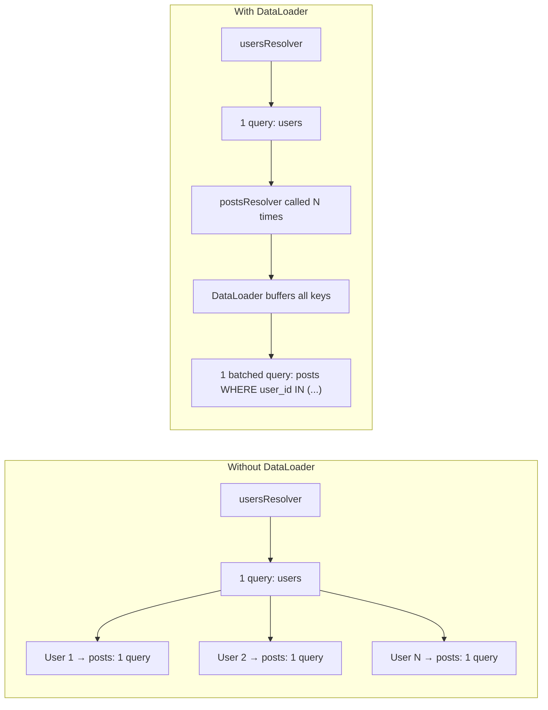
```mermaid
graph LR
    subgraph Without DataLoader
      A[usersResolver] --> B[1 query: users]
      B --> C1[User 1 → posts: 1 query]
      B --> C2[User 2 → posts: 1 query]
      B --> C3[User N → posts: 1 query]
    end
    
    subgraph With DataLoader
      D[usersResolver] --> E[1 query: users]
      E --> F[postsResolver called N times]
      F --> G[DataLoader buffers all keys]
      G --> H["1 batched query: posts WHERE user_id IN (...)"]
    end
```

---

### Batch Function Rules

1. **Must return array same length as keys** — position i corresponds to keys[i]
2. **Must not throw** — return `Error` instance for individual failures instead
3. **Can return Promise** — batch may be async
4. **Batched by event loop tick** — all `load()` calls in same tick batch together

```javascript
// Correct batch function
const batchPosts = async (userIds) => {
  const posts = await db.posts.findByUserIds(userIds)
  // Group posts by userId
  const grouped = userIds.map(id =>
    posts.filter(p => p.userId === id)
  )
  return grouped
}

const postLoader = new DataLoader(batchPosts)

// ⚠️ Wrong: returning in wrong order
const wrongBatch = async (ids) => {
  const users = await db.users.findByIds(ids)
  return users  // DB may return in different order!
}
```

> **Think**: Why does DataLoader enforce same-order requirement?
>
> *Answer: Parallel resolver calls don't know which key maps to which call site. DataLoader tracks order via load() call sequence. If batch returns mismatched order, every resolver gets wrong data — silent data corruption.*

---

### Cache Key Strategies

DataLoader uses **identity** keys by default (Map-key equality). Customize via `options.cacheKeyFn`:

```javascript
// Object keys — need custom cache key
const loader = new DataLoader(batchFn, {
  cacheKeyFn: (key) => key.id,  // extract primitive
})

// Case-insensitive keys
const loader = new DataLoader(batchFn, {
  cacheKeyFn: (key) => key.toLowerCase(),
})
```

Primitive keys (string, number) are simpler. Object keys require stable serialization for cache dedup.

Cache scope: **per request**. New DataLoader created per HTTP request/GraphQL execution:

```javascript
// Apollo context factory — fresh loaders per request
const context = ({ req }) => ({
  userLoader: new DataLoader(batchUsers),
  postLoader: new DataLoader(batchPosts),
  commentLoader: new DataLoader(batchComments),
})
```

> **Think**: Why per-request cache instead of global?
>
> *Answer: Global cache leaks data between users (user A sees user B's stale data). Per-request cache is ephemeral — lives for one request, dies after. Also prevents memory leaks from accumulating keys across requests.*

---

### Cache Priming

Pre-populate cache with known data — prevents redundant loads:

```javascript
async function getTeam(teamId, { userLoader }) {
  const team = await db.teams.findById(teamId)

  // We already fetched these users in the team query
  // Prime the loader so resolver calls don't re-fetch
  team.members.forEach(user => {
    userLoader.prime(user.id, user)
  })

  return team
}
```

Without priming: query team → resolver loads team members → each member triggers `User.name` via userLoader → hits DB again. Priming avoids this.

---

### DataLoader in Resolver Chains (Nested N+1)

N+1 compounds across depth:

```graphql
query {
  teams {
    name
    members {
      name
      posts {
        title
        comments { text }
      }
    }
  }
}
```

Each level needs its own DataLoader. Chain:

1. `teams` → teamLoader (1 query)
2. `members` → userLoader (1 batched query)
3. `posts` → postLoader (1 batched query)
4. `comments` → commentLoader (1 batched query)

Total: 4 queries (without DataLoader: 1 + T + T×M + T×M×P).

```javascript
// Each level loads via batch
const resolvers = {
  Team: {
    members: (team, _, { userLoader }) =>
      userLoader.loadMany(team.memberIds),
  },
  User: {
    posts: (user, _, { postLoader }) =>
      postLoader.loadMany(user.postIds),
  },
  Post: {
    comments: (post, _, { commentLoader }) =>
      commentLoader.loadMany(post.commentIds),
  },
}
```

---

### Manual Batching vs DataLoader

Manual batching — collect keys, resolve at end of tick:

```javascript
const pendingKeys = new Set()
const results = {}

function loadUser(id) {
  pendingKeys.add(id)
  process.nextTick(async () => {
    const users = await db.users.findByIds([...pendingKeys])
    users.forEach(u => { results[u.id] = u })
    pendingKeys.clear()
  })
  return results[id]  // ❌ returns undefined — no sync return
}
```

DataLoader handles: batching schedule, ordering, caching, error mapping, loading states. Manual batching is fragile — subtle ordering bugs, race conditions, no cache dedup.

> **Think**: Could you solve N+1 with JOINs instead of DataLoader?
>
> *Answer: JOINs work for simple cases (1 level deep). But GraphQL queries are dynamic — client may skip nested fields. JOIN-based resolvers always join even when not needed. DataLoader lazy-batches: only loads what client requests. Also, JOINs don't compose well across microservices, while DataLoader works across service boundaries.*

---

### Common Pitfalls

**Pitfall 1: Cross-request caching**

```javascript
// ❌ Global — cache persists across users, leaks data
const userLoader = new DataLoader(batchUsers)

// ✅ Per-request
const context = () => ({
  userLoader: new DataLoader(batchUsers),
})
```

**Pitfall 2: Cache invalidation — mutations**

DataLoader cache is write-once. After mutation, cache holds stale value:

```javascript
// ❌ Cache still returns old user
async function updateUser(_, { id, name }, { userLoader }) {
  const user = await db.users.update(id, { name })
  return user  // userLoader.load(id) still returns old value!
}

// ✅ Clear after mutation
async function updateUser(_, { id, name }, { userLoader }) {
  const user = await db.users.update(id, { name })
  userLoader.clear(id)  // next load() fetches fresh
  return user
}
```

**Pitfall 3: Not loading enough — loadMany vs load**

```javascript
// ❌ Sequential — each await stamps a new tick
for (const id of ids) {
  const post = await postLoader.load(id)  // new batch per tick!
}

// ✅ Batching — collect all keys
const posts = await postLoader.loadMany(ids)
```

**Pitfall 4: Circular dependencies**

Type A loader loads type B which loads type A. Resolver never resolves. Use field-level loaders or break cycle with data joins.

---

### Why This Matters

N+1 is the #1 performance bug in GraphQL. Naive resolver code that works fine in development becomes a production disaster when clients query deeply nested data. DataLoader is the standard solution — used by Apollo, Relay, GraphQL Yoga, and most server frameworks. Understanding batch functions, cache scope, and priming makes the difference between a smooth 10ms response and a 10-second one.

---

## Examples

### Example 1: Full DataLoader Setup

```javascript
// batch-fns.js
const batchUsers = async (ids) => {
  const users = await db.select('users').whereIn('id', ids)
  return ids.map(id => users.find(u => u.id === id) || null)
}

const batchPostsByUserIds = async (userIds) => {
  const posts = await db.select('posts').whereIn('user_id', userIds)
  return userIds.map(id => posts.filter(p => p.userId === id))
}

// context.js
const createLoaders = () => ({
  userLoader: new DataLoader(batchUsers),
  postLoader: new DataLoader(batchPostsByUserIds),
})

// resolvers.js
const resolvers = {
  Query: {
    users: (_, args, { userLoader }) => userLoader.loadMany(args.ids),
  },
  User: {
    posts: (user, _, { postLoader }) => postLoader.load(user.id),
  },
}
```

---

### Example 2: Cache Priming with JOIN

```javascript
async function getUserWithPosts(userId, { userLoader, postLoader }) {
  // Single JOIN query — get both user and posts
  const rows = await db.raw(`
    SELECT u.*, p.id as post_id, p.title, p.body
    FROM users u
    LEFT JOIN posts p ON p.user_id = u.id
    WHERE u.id = ?
  `, [userId])

  if (rows.length === 0) return null

  const user = { id: rows[0].id, name: rows[0].name }
  const posts = rows
    .filter(r => r.post_id)
    .map(r => ({ id: r.post_id, title: r.title, body: r.body }))

  // Prime both caches
  userLoader.prime(userId, user)
  postLoader.prime(userId, posts)

  return { user, posts }
}
```

---

## Key Takeaways
- N+1: resolver fetches parent, then per-child query — 1+N DB calls
- DataLoader batches by event-loop tick: group keys, one query
- Batch function must return array same length and order as keys
- Cache per-request only — never global/shared across requests
- Cache priming avoids redundant fetches for already-known data
- Nested resolvers need their own DataLoader per level
- Use loadMany() not looped load() for arrays
- Clear cache after mutations to prevent stale reads

---

## Common Misconception

**"DataLoader is only for database batching — I don't need it if my ORM already batches."**

ORMs batch identical queries within one request context, but they don't understand GraphQL resolver execution. DataLoader's per-tick batching is key: all `load()` calls in one event-loop tick coalesce into one batched call regardless of which resolver made them. ORM-level batching typically requires explicit configuration and doesn't compose across resolver chains. Also, DataLoader's cache is smarter — it deduplicates by key within the same request.

---

## Feynman Explain
Explain N+1 and DataLoader to a backend developer who knows SQL joins but is new to GraphQL. Focus on: why N+1 happens in resolvers (not in REST), how DataLoader's event-loop batching works, and why per-request cache matters for correctness.

---

## Reframe
Critique: DataLoader adds another abstraction layer between resolvers and data access. For simple schemas (flat, few relations), is the complexity worth it? When does DataLoader become essential vs premature optimization?

---

## Drill
Take the quiz.

Run: `learn.sh quiz graphql-deep-dive 6`

## Quiz: 06-n-plus-1-dataloader


## Quiz: 06-n-plus-1-dataloader

(quiz parse error: 'str' object has no attribute 'get')


---

# Module 7: Query Cost Analysis

Est. study time: 2h
Language: en

## Learning Objectives
- Implement depth limiting and complexity scoring to protect GraphQL APIs
- Design rate limiting strategies based on query cost budgets
- Evaluate persisted queries vs cost analysis for production APIs

---

## Core Content

### Depth Limiting

Deeply nested queries can overwhelm servers. Without limits, a client can craft:

```graphql
query {
  user(id: "1") {
    posts { comments { author { posts { comments { author { posts { ... } } } } } } }
  }
}
```

Depth limiting rejects queries exceeding a configured max depth (e.g., 7 levels).

```typescript
import depthLimit from 'graphql-depth-limit'

const server = new ApolloServer({
  schema,
  validationRules: [depthLimit(7)]
})
// Query above with 10 levels → rejected with validation error
```

> **Think**: Why are flat queries cheaper than deeply nested ones?
>
> *Answer: Each nesting level multiplies potential data — depth d with branching factor b produces b^d potential nodes. Depth 4 at branch 10 = 10,000 nodes. Depth 7 = 10 million. Depth limiting caps worst-case exponential blowup.*

---

### Complexity Scoring

Depth alone is insufficient. A single shallow field may trigger expensive DB joins or external API calls. Complexity scoring assigns weights to fields:

```graphql
# Schema weights (declared via directive)
type Query {
  users(limit: Int): [User!]! @complexity(value: 5, multipliers: ["limit"])
  user(id: ID!): User @complexity(value: 1)
}

type User {
  posts: [Post!]! @complexity(value: 3)
  avatar: String @complexity(value: 1)
}
```

Computation: `total = Σ (fieldWeight × multiplierArg)`.

With limit=50: `users.complexity = 5 × 50 = 250`. Plus nested fields.

```typescript
import { createComplexityRule, simpleEstimator, fieldExtensionsEstimator } from 'graphql-query-complexity'

const rule = createComplexityRule({
  estimators: [
    fieldExtensionsEstimator(),
    simpleEstimator({ defaultComplexity: 1 })
  ],
  maximumComplexity: 1000
})
```

> **Think**: What multiplier value would you assign to a field that accepts `first`/`last` but not `limit`?
>
> *Answer: Use `first` or `last` as multiplier. The pagination argument directly controls how many items are returned, so it is the natural multiplier. Set `multipliers: ["first", "last"]`.*

---

### Rate Limiting Based on Cost Budget

Cost analysis feeds into rate limiting. Each client/api key gets a cost budget (e.g., 10,000 cost units per minute):

| Client | Budget | Query cost | Remaining |
|--------|--------|------------|-----------|
| Mobile app | 5,000/min | 50 | 4,950 |
| Dashboard | 20,000/min | 800 | 19,200 |
| Public API key | 1,000/min | 30 | 970 |

Implementation: compute query cost → deduct from token bucket → reject if insufficient.

```typescript
const costBudget = new Map<string, { tokens: number; resetAt: number }>()

function checkRateLimit(apiKey: string, queryCost: number): boolean {
  const bucket = costBudget.get(apiKey)
  if (!bucket || Date.now() > bucket.resetAt) {
    costBudget.set(apiKey, { tokens: 10000, resetAt: Date.now() + 60000 })
    return true
  }
  if (bucket.tokens < queryCost) return false
  bucket.tokens -= queryCost
  return true
}
```

---

### Query Timeouts vs Cost Analysis

Timeouts and cost analysis solve different problems:

| Mechanism | Protects against | Granularity | Downside |
|-----------|------------------|-------------|----------|
| Timeout | Runaway queries (wall clock) | Per-request | Kills after work done |
| Cost analysis | Complex queries before execution | Per-field | Overhead of computation |
| Depth limit | Deeply nested queries | Schema-level | Coarse — misses expensive shallow queries |

Cost analysis is proactive (reject before execution). Timeouts are reactive (kill during execution). Use both.

> **Think**: Which attacks can cost analysis catch that timeouts cannot?
>
> *Answer: A query that hits DB causing lock contention but returns quickly. Timeout would pass; cost analysis can flag expensive DB joins or cross-service calls before they execute.*

---

### Persisted Queries as Alternative

Persisted queries (PQ) replace runtime cost analysis with an allowlist approach:

1. Developer registers query at build time → gets hash (e.g., `sha256`)
2. Client sends hash instead of full query text
3. Server looks up hash → executes only approved queries

```graphql
# Instead of sending full query:
# Client sends: { "query": "query { user(id: \"1\") { name } }" }
# Client sends: { "extensions": { "persistedQuery": { "sha256Hash": "hash...", "version": 1 } } }
```

Benefits:
- No cost analysis runtime overhead
- No arbitrary queries — only approved patterns
- Smaller network payload (hash vs full query text)

Tradeoffs:
- Requires build-time registration pipeline
- Harder for ad-hoc queries (GraphiQL, debugging)
- Schema changes may invalidate persisted hashes

---

### Bypassing Cost Analysis for Trusted Clients

Internal services and admin tools may need unrestricted access. Strategies:

- **Header-based bypass**: `X-Client-Type: internal` → skip cost analysis
- **API key tiers**: `role: ADMIN` → higher or uncapped budget
- **Schema-level:** `@trusted` directive marks fields excluded from cost analysis

```graphql
directive @trusted on FIELD_DEFINITION

type Query {
  adminDashboard: Dashboard @trusted
  publicUser(id: ID!): User
}
```

Trusted client exemption must be auditable. Log whenever bypass triggers.

---

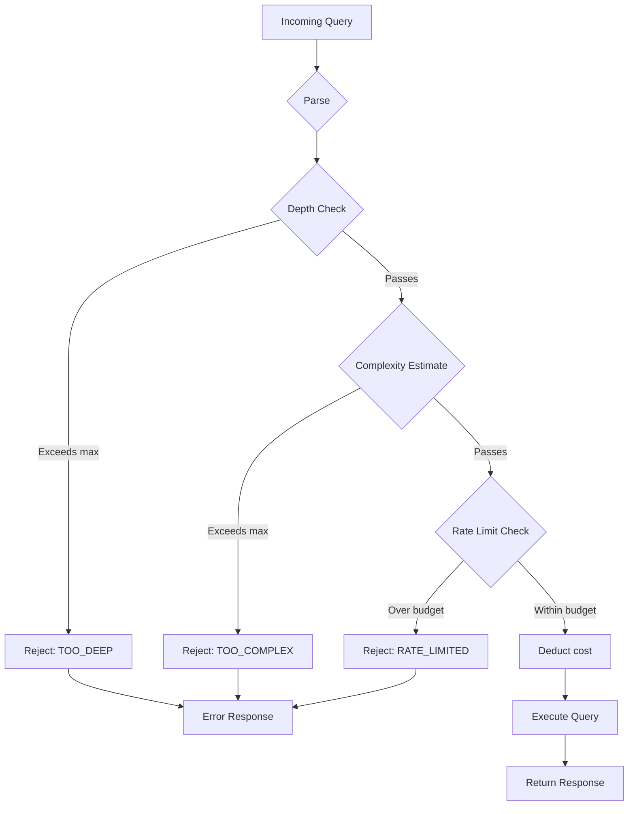
```mermaid
graph TD
  A[Incoming Query] --> B{Parse}
  B --> C{Depth Check}
  C -->|Exceeds max| D[Reject: TOO_DEEP]
  C -->|Passes| E{Complexity Estimate}
  E -->|Exceeds max| F[Reject: TOO_COMPLEX]
  E -->|Passes| G{Rate Limit Check}
  G -->|Over budget| H[Reject: RATE_LIMITED]
  G -->|Within budget| I[Deduct cost]
  I --> J[Execute Query]
  J --> K[Return Response]
  D --> L[Error Response]
  F --> L
  H --> L
```

### Why This Matters

Without cost analysis, a single malicious or miswritten query can bring down your GraphQL server. Depth limiting, complexity scoring, and rate limiting form a defense-in-depth strategy. Choosing between cost analysis and persisted queries depends on your API's access pattern — public APIs lean toward cost analysis, first-party SPAs toward persisted queries.

---

## Examples

### Example 1: Cost Analysis for a Social Media API

```graphql
# Schema with complexity annotations
type Query {
  feed(first: Int!): [Post!]! @complexity(value: 5, multipliers: ["first"])
  user(id: ID!): User @complexity(value: 2)
  search(term: String!, limit: Int): [SearchResult!]! @complexity(value: 3, multipliers: ["limit"])
}

type Post {
  comments(first: Int = 10): [Comment!]! @complexity(value: 2, multipliers: ["first"])
  likes: [Like!]! @complexity(value: 1)
  author: User @complexity(value: 2)
}

type User {
  posts(first: Int): [Post!]! @complexity(value: 3, multipliers: ["first"])
}
```

Query `{ feed(first: 50) { comments(first: 5) { text } author { name } } }` cost:
- `feed`: 5 × 50 = 250
- `comments`: 2 × 5 = 10 (× 50 feed items) = 500
- `author`: 2 (× 50 feed items) = 100
- Total: 850 / 1000 budget

---

### Example 2: Persisted Query Registration Pipeline

```typescript
// Build-time script: extract all queries from client source
// Hash each, store in persisted-query-manifest.json
import { globby } from 'globby'
import { createHash } from 'node:crypto'

const files = await globby('src/**/*.{ts,tsx,gql}')
const queries: Record<string, string> = {}

for (const file of files) {
  const content = await fs.readFile(file, 'utf-8')
  const hash = createHash('sha256').update(content).digest('hex')
  queries[hash] = content
}

await fs.writeFile('persisted-query-manifest.json', JSON.stringify(queries))
// Server loads manifest at startup, matches hash → query
```

---

## Key Takeaways
- Depth limiting caps exponential blowup from deeply nested queries
- Complexity scoring assigns weights + multipliers for granular cost per query
- Rate limiting based on cost budget protects shared server resources
- Timeouts are reactive; cost analysis is proactive — use both
- Persisted queries replace cost analysis with an allowlist approach
- Trusted clients can bypass with header/api-key/schema-level controls
- graphql-query-complexity and graphql-depth-limit are standard Node.js tools

---

## Common Misconception

**"Cost analysis replaces the need for query timeouts."**

No. Cost analysis prevents overly complex queries from executing. But a simple query can still hang due to DB lock or external API timeout. Timeouts are the last line of defense. Cost analysis + timeouts = defense in depth.

---

## Feynman Explain
Explain to a DevOps engineer why a query that selects only 3 fields can still crash the server. Cover: depth, complexity multipliers, N+1 traps, and why query text size is not the risk metric.

---

## Reframe
Critique: Persisted queries make GraphQL feel more like REST endpoints — fixed query shapes, registration pipeline. Does this defeat the flexibility benefit of GraphQL? When is the flexibility-cost tradeoff worth it?

---

## Drill
Take the quiz.

Run: `learn.sh quiz graphql-deep-dive 7`

## Quiz: 07-query-cost-analysis


## Quiz: 07-query-cost-analysis

(quiz parse error: 'str' object has no attribute 'get')


---

# Module 8: Connection Pattern

Est. study time: 2h
Language: en

## Learning Objectives
- Implement Relay Connection spec for cursor-based pagination
- Distinguish cursor pagination from offset pagination with tradeoffs
- Handle backward pagination, total count, and federation scenarios

---

## Core Content

### Cursor vs Offset Pagination

Offset pagination (e.g., `?page=3&limit=10`) is simple but has fundamental flaws:

| Concern | Offset | Cursor |
|---------|--------|--------|
| Stability | Items inserted/deleted shift pages | Cursor points to specific item |
| Consistency | Same item may appear on multiple pages | No duplicates |
| Performance | `OFFSET` scans skipped rows | `WHERE cursor > X` uses index |
| Real-time | Stale quickly with writes | Stable cursor references |

```graphql
# Offset — fragile
query {
  users(page: 3, limit: 10) { id name }
}

# Cursor — stable
query {
  users(first: 10, after: "YXJyYXljb25uZWN0aW9uOjI=") { edges { node { id name } } }
}
```

> **Think**: Under what conditions does offset pagination perform acceptably?
>
> *Answer: Small, static datasets (e.g., enum values, configuration). Or when the UI only supports "next page" forward navigation (no deep page numbers). For real-time feeds or large datasets, cursor pagination is necessary.*

---

### Relay Connection Spec

The Relay Connection spec defines a standard shape for paginated lists:

```graphql
type Query {
  users(first: Int, after: String, last: Int, before: String): UserConnection
}

type UserConnection {
  edges: [UserEdge!]!
  pageInfo: PageInfo!
}

type UserEdge {
  node: User!
  cursor: String!
}

type PageInfo {
  hasNextPage: Boolean!
  hasPreviousPage: Boolean!
  startCursor: String
  endCursor: String
}
```

Components:
- **Connection** — wraps the paginated list with edges + pageInfo
- **Edge** — pairs each item (node) with its cursor
- **Node** — the actual entity
- **PageInfo** — navigation metadata

Arguments:
- `first` — fetch N items forward from `after`
- `after` — cursor: start after this position
- `last` — fetch N items backward from `before`
- `before` — cursor: end before this position

---

### Forward Pagination

```graphql
query {
  users(first: 10, after: "cursor_50") {
    edges {
      cursor
      node { id name }
    }
    pageInfo {
      hasNextPage
      endCursor
    }
  }
}
```

Implementation pattern (SQL):

```typescript
async function usersResolver(_, { first = 10, after }) {
  const cursor = after ? decodeCursor(after) : null
  const query = cursor
    ? `SELECT * FROM users WHERE id > $1 ORDER BY id ASC LIMIT $2`
    : `SELECT * FROM users ORDER BY id ASC LIMIT $1`
  const params = cursor ? [cursor, first + 1] : [first + 1]
  const rows = await db.query(query, params)

  const hasNextPage = rows.length > first
  const nodes = hasNextPage ? rows.slice(0, first) : rows
  const edges = nodes.map(node => ({
    node,
    cursor: encodeCursor(node.id)
  }))

  return {
    edges,
    pageInfo: {
      hasNextPage,
      startCursor: edges[0]?.cursor,
      endCursor: edges[edges.length - 1]?.cursor
    }
  }
}
```

> **Think**: Why fetch `first + 1` items instead of exactly `first`?
>
> *Answer: Fetch one extra item to determine `hasNextPage`. If we get `first + 1` results, there is a next page. Discard the extra item. Avoids a separate COUNT query.*

---

### Backward Pagination

Backward pagination uses `last` and `before`. More complex because ordering inverts:

```typescript
async function usersResolver(_, { last = 10, before }) {
  const cursor = before ? decodeCursor(before) : null
  const query = cursor
    ? `SELECT * FROM users WHERE id < $1 ORDER BY id DESC LIMIT $2`  // DESC!
    : `SELECT * FROM users ORDER BY id DESC LIMIT $1`
  const params = cursor ? [cursor, last + 1] : [last + 1]
  const rows = await db.query(query, params)

  const hasPreviousPage = rows.length > last
  const nodes = hasPreviousPage ? rows.slice(0, last) : rows
  nodes.reverse()  // Back to ASC order

  const edges = nodes.map(node => ({
    node,
    cursor: encodeCursor(node.id)
  }))

  return {
    edges,
    pageInfo: {
      hasPreviousPage,
      startCursor: edges[0]?.cursor,
      endCursor: edges[edges.length - 1]?.cursor
    }
  }
}
```

Edge case: `first` + `after` combined with `last` + `before` in same query is undefined per Relay spec. Servers typically reject this.

---

### Total Count in Connections

Adding total count breaks cursor pagination's performance advantage if computed naively:

```graphql
type UserConnection {
  edges: [UserEdge!]!
  pageInfo: PageInfo!
  totalCount: Int!  # Requires separate COUNT query
}
```

```typescript
async function usersResolver(_, { first, after }) {
  const [edges, totalCount] = await Promise.all([
    fetchPage(first, after),
    db.query('SELECT COUNT(*) FROM users')  // Full table scan on large tables
  ])
  return { edges, totalCount, ... }
}
```

Optimization: use approximate counts (e.g., `EXPLAIN` estimate, Redis counter, or sampled count). Document that `totalCount` is approximate for large datasets.

> **Think**: Does totalCount matter for infinite scroll UIs?
>
> *Answer: No — infinite scroll only needs hasNextPage. totalCount is useful for paginated lists with page numbers, admin dashboards, or "Showing 1-10 of 1,234" UX patterns. Omit when not needed.*

---

### Slice-Based vs ID-Based Cursors

Two common cursor strategies:

**Slice-based** (opaque, default in Relay):
```text
cursor = base64("arrayconnection:42")  // position in result set
```
Problems: breaks if items inserted/deleted before the cursor shifts positions.

**ID-based (stable)**:
```text
cursor = base64(`user:${user.id}`)  // references entity directly
```
Better: survives inserts/deletes. Cursor points to entity, not position. Requires ordering by the cursor field (typically `id` or `createdAt`).

```typescript
function encodeCursor(id: string): string {
  return Buffer.from(`cursor:${id}`).toString('base64')
}

function decodeCursor(cursor: string): string {
  return Buffer.from(cursor, 'base64').toString('utf-8').replace('cursor:', '')
}
```

> **Think**: When would slice-based cursors be simpler despite instability?
>
> *Answer: For append-only datasets (e.g., event logs, audit trails) where items never change order. Or when cursor only needs to survive a single client session.*

---

### Pagination in Federation

In Apollo Federation, a federated graph may paginate entities across subgraphs:

```graphql
# Products subgraph
type Product @key(fields: "id") {
  id: ID!
  reviews(first: Int, after: String): ReviewConnection
}

# Reviews subgraph
type Review @key(fields: "id") {
  id: ID!
  productId: ID!
  text: String!
}
```

The router must call reviews subgraph for each product. This is N+1 pagination — solve with `@requires` or entity batching:

```graphql
# Alternative: batch pagination query
extend type Query {
  reviewsByProductIds(productIds: [ID!]!, first: Int): [ProductReviews!]!
}

type ProductReviews {
  productId: ID!
  reviews: ReviewConnection
}
```

Federation adds complexity: cursor must be unique across subgraphs. Prefix cursor with subgraph identifier.

---

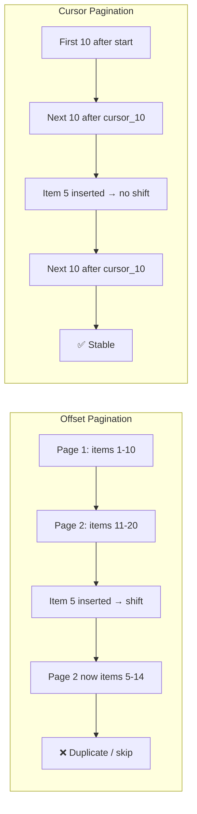
```mermaid
graph LR
  subgraph Offset Pagination
    A[Page 1: items 1-10] --> B[Page 2: items 11-20]
    B --> C[Item 5 inserted → shift]
    C --> D[Page 2 now items 5-14]
    D --> E["❌ Duplicate / skip"]
  end

  subgraph Cursor Pagination
    F[First 10 after start] --> G[Next 10 after cursor_10]
    G --> H[Item 5 inserted → no shift]
    H --> I[Next 10 after cursor_10]
    I --> J["✅ Stable"]
  end
```

### Why This Matters

Pagination is the most common GraphQL pattern after basic CRUD. The Relay Connection spec is the de facto standard — Apollo, Shopify, GitHub, and most production GraphQL APIs use it. Mastering cursor pagination, implementing `first`/`after` and `last`/`before`, and understanding federation implications separates production-grade APIs from toy implementations.

---

## Examples

### Example 1: Full Connection Resolver with Both Directions

```typescript
const resolvers = {
  Query: {
    users: async (_, args, { db }) => {
      const { first, after, last, before } = args

      if (first && after) {
        // Forward pagination
        const cursor = decodeCursor(after)
        const rows = await db.query(
          `SELECT * FROM users WHERE id > $1 ORDER BY id LIMIT $2`,
          [cursor, first + 1]
        )
        return buildConnection(rows, first)
      }

      if (last && before) {
        // Backward pagination
        const cursor = decodeCursor(before)
        const rows = await db.query(
          `SELECT * FROM users WHERE id < $1 ORDER BY id DESC LIMIT $2`,
          [cursor, last + 1]
        )
        const conn = buildConnection(rows, last)
        conn.edges.reverse()
        return conn
      }

      // Default: first 10
      const rows = await db.query(
        `SELECT * FROM users ORDER BY id LIMIT $1`, [11]
      )
      return buildConnection(rows, 10)
    }
  }
}

function buildConnection(rows, limit) {
  const hasMore = rows.length > limit
  const nodes = hasMore ? rows.slice(0, limit) : rows
  const edges = nodes.map(node => ({
    node,
    cursor: encodeCursor(node.id)
  }))
  return {
    edges,
    pageInfo: {
      hasNextPage: hasMore,
      hasPreviousPage: false,
      startCursor: edges[0]?.cursor,
      endCursor: edges[edges.length - 1]?.cursor
    }
  }
}
```

---

### Example 2: Paginated Comments with Total Count

```graphql
type Query {
  comments(postId: ID!, first: Int, after: String): CommentConnection!
}

type CommentConnection {
  edges: [CommentEdge!]!
  pageInfo: PageInfo!
  totalCount: Int!
}
```

```typescript
const resolvers = {
  Query: {
    comments: async (_, { postId, first = 10, after }, { db }) => {
      const cursor = after ? decodeCursor(after) : null
      const [rows, [{ count }]] = await Promise.all([
        db.query(
          cursor
            ? `SELECT * FROM comments WHERE post_id = $1 AND id > $2 ORDER BY id LIMIT $3`
            : `SELECT * FROM comments WHERE post_id = $1 ORDER BY id LIMIT $2`,
          cursor ? [postId, cursor, first + 1] : [postId, first + 1]
        ),
        db.query(`SELECT COUNT(*) FROM comments WHERE post_id = $1`, [postId])
      ])

      const hasNextPage = rows.length > first
      const nodes = hasNextPage ? rows.slice(0, first) : rows
      const edges = nodes.map(node => ({
        node,
        cursor: encodeCursor(node.id)
      }))

      return {
        edges,
        pageInfo: { hasNextPage, hasPreviousPage: false, startCursor: edges[0]?.cursor, endCursor: edges[edges.length - 1]?.cursor },
        totalCount: Number(count)
      }
    }
  }
}
```

---

## Key Takeaways
- Cursor pagination is stable under inserts/deletes; offset pagination is not
- Relay Connection spec: edges (node + cursor) + pageInfo (hasNextPage, hasPreviousPage)
- Forward: `first` + `after`; Backward: `last` + `before`
- Fetch `first + 1` items to detect `hasNextPage` without extra query
- ID-based cursors survive data changes; slice-based cursors do not
- Backward pagination requires DESC order + reverse
- `totalCount` adds cost — use approximate counts for large datasets
- Federation pagination needs subgraph-aware cursors and batch queries

---

## Common Misconception

**"Cursor pagination is always better than offset."**

Not always. Offset pagination is simpler, cacheable via URL, and suitable for small static datasets (dropdowns, config panels, admin pages with page numbers). Cursor pagination is superior for real-time feeds, large datasets, and any scenario where items shift. Choose based on your data mutation pattern, not dogma.

---

## Feynman Explain
Explain to a mobile developer why their chat app's pagination breaks when new messages arrive — and how cursor-based pagination fixes it. Contrast with offset-based page numbers.

---

## Reframe
Critique: The Relay Connection spec adds significant boilerplate (Connection, Edge, PageInfo types) for every paginated field. Is the standardization worth the verbosity? When would a simpler pagination pattern suffice?

---

## Drill
Take the quiz.

Run: `learn.sh quiz graphql-deep-dive 8`

## Quiz: 08-connection-pattern


## Quiz: 08-connection-pattern

(quiz parse error: 'str' object has no attribute 'get')


---

# Module 9: Client Normalized Cache

Est. study time: 2h 30m
Language: en

## Learning Objectives
- Explain normalized cache structure: flat entities keyed by `__typename` + `id`, references replacing nesting
- Configure Apollo Client InMemoryCache with typePolicies, keyFields, and eviction policies
- Implement cache persistence and redirects using apollo3-cache-persist and field read functions

---

## Core Content

### Normalized Store Shape

Client cache stores data as flat entity map, not nested response tree. Each object with `id` (or custom key) stored once, referenced by other entities.

```text
Response shape (nested):
  query.user -> { id: "1", name: "Alice", posts: [{ id: "10", title: "..." }] }

Normalized cache (flat):
  User:1    -> { id: "1", name: "Alice", posts: ["Post:10"] }
  Post:10   -> { id: "10", title: "..." }
  ROOT_QUERY -> { user: "User:1" }
```

Benefits:
- Deduplication — same entity fetched twice updates single cache entry
- Consistency — all references see latest data
- Partial updates — update User:1 once, every view reflecting it updates

> **Think**: Why does normalization matter when same User appears in multiple queries (profile page, post author, comment author)?
>
> *Answer: Without normalization, each query stores User copy. Mutating user's name requires finding + updating every copy. Normalized cache stores User:1 once; all queries reference it. Single mutation update propagates everywhere.*

---

### Apollo Client InMemoryCache

Core configuration:

```typescript
import { InMemoryCache } from "@apollo/client";

const cache = new InMemoryCache({
  typePolicies: {
    User: {
      keyFields: ["id"],
    },
    Post: {
      keyFields: ["id"],
    },
    // Composite key — when no single id field
    Review: {
      keyFields: ["productId", "userId"],
    },
  },
});
```

`keyFields` tells Apollo how to identify entities. Default uses `id` + `__typename`. Customize when entity uses composite key or non-standard id name.

```typescript
// Entity uses "slug" instead of "id"
typePolicies: {
  Product: {
    keyFields: ["slug"],
  },
}
```

> **Think**: What happens when two entities have same id but different __typename?
>
> *Answer: Cache stores them separately. Key = `__typename` + `id` composite. `User:1` and `Post:1` do not collide. Problem only when __typename missing or wrong (e.g., union without __typename).*

---

### Normalization vs Denormalization

| Aspect | Normalized | Denormalized |
|--------|-----------|-------------|
| Storage | Flat entity map | Nested response tree |
| Dedup | Automatic | Manual dedup needed |
| Update | Propagates everywhere | Must update each copy |
| Read cost | Reference resolution | Direct access |
| Complexity | Cache config required | Simple (just store response) |

Normalized wins for apps with shared entities (User, Product). Denormalized fine for isolated fetch-once data (search results, analytics).

---

### Garbage Collection

Apollo's cache GC removes entities not reachable from any root query.

Eviction tools:

```typescript
// Evict specific entity
cache.evict({ id: cache.identify({ __typename: "Post", id: "10" }) });

// Evict field from root
cache.evict({ fieldName: "temporaryData" });

// Prevent eviction — retain
cache.retain({ id: cache.identify({ __typename: "User", id: "1" }) });
```

GC triggers:
- `cache.gc()` called manually
- After `cache.evict()`
- After `cache.reset()`

Default GC uses mark-sweep: marks reachable entities from root queries, sweeps unmarked.

> **Think**: When would a legitimately useful entity become unreachable and get GC'd?
>
> *Answer: When entity only referenced by evicted cache fields, or when query returns subset of entities and user never accesses others. Example: cache fetches Product list (page 1), GC runs — page 2 products exist in cache from previous mutation but no root query references them. They get collected. Use `retain()` to protect.*

---

### Persistence: apollo3-cache-persist

Cache survives page reload via persistence layer:

```typescript
import { persistCache, LocalStorageWrapper } from "apollo3-cache-persist";

const cache = new InMemoryCache();

await persistCache({
  cache,
  storage: new LocalStorageWrapper(window.localStorage),
  // Optional: only persist specific types
  maxSize: 1048576, // 1MB limit
  debug: true,
});
```

For mobile (React Native / Capacitor):

```typescript
import { AsyncStorageWrapper } from "apollo3-cache-persist";
// Uses AsyncStorage under the hood
```

Cache hydration happens automatically on next app load. Watch for stale data — persistence cache lives until explicitly cleared or cache policy changes.

---

### Cache Redirects

Read entity data from different cache location. Useful when list query contains enough data for detail view:

```typescript
typePolicies: {
  Query: {
    fields: {
      product(_, { args, toReference }) {
        // Redirect to existing entity in cache
        return toReference({ __typename: "Product", id: args?.id });
      },
    },
  },
}
```

Without redirect, querying `product(id: "5")` fetches from network even when `Product:5` already cached from product list.

---

### Relay-Style Cache (RecordSource)

Relay cache differs from Apollo:

```text
Relay RecordSource:
  client:root -> { "user(id:\"1\")": { ... } }
  client:User:1 -> { id: "1", name: "Alice" }

Apollo:
  ROOT_QUERY -> { user: { __ref: "User:1" } }
  User:1 -> { id: "1", name: "Alice" }
```

Relay uses opaque `DataID` strings; Apollo uses `__typename + id` convention. Relay's cache is immutable — updates create new records. Apollo supports mutable `cache.modify`.

---

### Common Issues

**Missing id fields** — entity without `id` field defaults to `__typename + keyFields` but if neither `id` nor custom `keyFields` configured, Apollo falls back to array position, causing dedup failure.

```typescript
// Entity type without id field
// Must set keyFields or rely on __typename only
typePolicies: {
  AnalyticsEvent: {
    keyFields: false, // treats each as unique, no normalization
  },
}
```

**Type mismatch** — union types or interfaces may return entities with different `__typename`. Client must have typePolicies for each concrete type.

**Stale data** — cache returns old data when entity updated on server but cache not invalidated. Fix: refetch queries, use cache eviction, or subscribe to changes.

> **Think**: How do you debug "cache returned stale User name"?
>
> *Answer: Check Apollo DevTools. Is User:1 cached with old name? Check if mutation returned updated User in response. If yes, cache should auto-update. If mutation only returns success boolean, cache never learns of change — need refetch or cache.modify.*

---

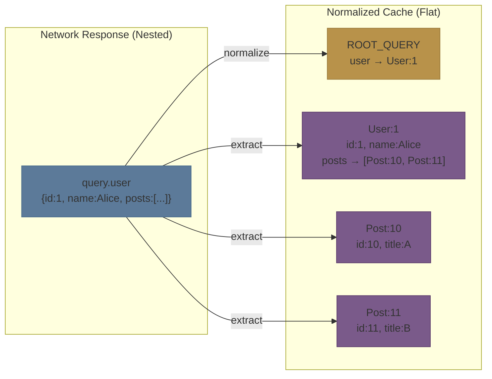
```mermaid
graph LR
  subgraph "Network Response (Nested)"
    NR["query.user<br/>{id:1, name:Alice, posts:[...]}"]
  end
  subgraph "Normalized Cache (Flat)"
    RQ["ROOT_QUERY<br/>user → User:1"]
    U1["User:1<br/>id:1, name:Alice<br/>posts → [Post:10, Post:11]"]
    P10["Post:10<br/>id:10, title:A"]
    P11["Post:11<br/>id:11, title:B"]
  end
  NR -->|"normalize"| RQ
  NR -->|"extract"| U1
  NR -->|"extract"| P10
  NR -->|"extract"| P11
  style NR fill:#5c7a99,stroke:#4a6d8c
  style RQ fill:#b8924a,stroke:#9a7a3a
  style U1 fill:#7a5a8a,stroke:#5a3a6a
  style P10 fill:#7a5a8a,stroke:#5a3a6a
  style P11 fill:#7a5a8a,stroke:#5a3a6a
```

### Why This Matters

Every production GraphQL client uses normalized cache. Understanding entity identity, reference resolution, and eviction prevents bugs: stale data, missing entities, memory leaks, incorrect optimistic updates. Cache is not magic — it is data structure you configure.

---

## Examples

### Example 1: Multi-entity mutation update

Schema: `type Mutation { createPost(input: CreatePostInput!): Post! }`

Without normalization, creating Post updates only the query that fired mutation. With normalization, Post:42 appears in any query that reads posts:

```typescript
typePolicies: {
  Post: { keyFields: ["id"] },
  User: {
    fields: {
      posts: {
        merge(existing = [], incoming) {
          // Merge new posts into existing list
          return [...existing, ...incoming];
        },
      },
    },
  },
}
```

Now creating a Post that returns author info automatically wires into User's posts list.

### Example 2: Cache redirect for product detail

```typescript
typePolicies: {
  Query: {
    fields: {
      product: {
        read(_, { args, toReference }) {
          return toReference({ __typename: "Product", id: args?.id });
        },
      },
    },
  },
}
```

Cached product list already fetched `Product:5`. Navigating to product detail page — normally would trigger network request. With redirect, reads from cache immediately. Falls back to network only if entity missing.

---

## Key Takeaways
- Normalized cache stores flat entity map keyed by `__typename + id`, uses references for relationships
- InMemoryCache `typePolicies` configures keyFields, merge functions, read functions, and field behavior
- GC uses mark-sweep: entities unreachable from root queries get evicted
- Cache persistence requires explicit library (apollo3-cache-persist) with storage backend
- Cache redirects avoid network fetch when entity already exists
- Relay uses immutable RecordSource; Apollo supports mutable cache.modify
- Missing id fields, type mismatches, and stale data are most common normalized cache bugs

---

## Common Misconception

**"Apollo cache automatically normalizes everything."**

False. Normalization requires entities to have `id` field (or custom `keyFields`). Types without id + __typename fall back to array-position keys — no deduplication, no reference tracking. Configure typePolicies for every type that needs normalization. Also, nested objects without id are stored inline, not normalized.

---

## Feynman Explain
Explain normalized cache to a React developer using Redux. Describe: flat entity map vs nested state trees, why references replace nesting, and how `createEntityAdapter` pattern parallels InMemoryCache typePolicies. Use Store, reducer, selector vocabulary.


---

## Reframe
Critique: Normalized cache adds complexity — typePolicies, keyFields, merge functions, GC config. For a small app with 3-4 types, is `fetch-policy: network-only` simpler and safer than configuring normalization? When does normalization complexity justify itself?

---

## Drill
Take the quiz. MCQs test different angles — recall, application, scenario.

Run: `learn.sh quiz graphql-deep-dive 9`

## Quiz: 09-client-normalized-cache


## Quiz: 09-client-normalized-cache

(quiz parse error: 'str' object has no attribute 'get')


---

# Module 10: Client Cache Policies

Est. study time: 2h
Language: en

## Learning Objectives
- Select appropriate fetchPolicy for each query based on freshness and latency requirements
- Configure write policies, optimistic responses, and cache.modify to update cache after mutations
- Implement field policies with read and merge functions to control cache behavior

---

## Core Content

### fetchPolicy Options

Apollo Client provides six fetch policies controlling cache vs network behavior:

| Policy | Cache check | Network request | Use case |
|--------|------------|-----------------|----------|
| `cache-first` | Yes | Only if miss | Default. Fast, stale-tolerant |
| `cache-and-network` | Yes | Always | Fresh data + instant render |
| `network-only` | No | Always | Must be fresh (prices, status) |
| `no-cache` | No | Always, no write | Ephemeral data (search, logs) |
| `cache-only` | Yes | Never | Static reference data |
| `standby` | Yes (passive) | Subscriptions/refetch | Background sync |

```typescript
const { data } = useQuery(GET_USER, {
  variables: { id: "1" },
  fetchPolicy: "cache-and-network",
  // For mutation-triggered updates:
  nextFetchPolicy: "cache-first",
});
```

`nextFetchPolicy` transitions policy after initial fetch — useful for cache-and-network → cache-first.

> **Think**: If `cache-first` serves stale data when cache is populated, why is it default?
>
> *Answer: Most apps prefer instant render over fresh data. Stale data acceptable for common UIs (profile, lists). Tradeoff: user sees stale data briefly, but avoids loading spinner. `cache-and-network` gives both instant render + eventual consistency.*

---

### When to Use Each Policy

**cache-first**: User profiles, settings pages, reference lists. Freshness not critical.

**network-only**: Payment status, auction bids, game scores. Stale data causes incorrect decisions.

**cache-and-network**: Feed views, comments, notifications. Show cached data immediately, refresh in background. Ideal for social apps.

**no-cache**: Ephemeral input forms, search suggestions, logging mutations. No benefit from caching.

**cache-only**: Country list, currency codes, static config. Never changes, never hits network.

**standby**: Used internally by Apollo for `refetchQueries` and subscriptions. Query updates when cache changes but does not trigger network.

> **Think**: What is wrong with using `network-only` for every query?
>
> *Answer: Eliminates all caching benefit. Every navigation fires network request. No offline support. More bandwidth, slower rendering. network-only is right only when data changes every second and stale data is dangerous.*

---

### Write Policies: Mutation Cache Updates

Mutation results must update cache. Three strategies:

#### 1. Automatic (default)
Mutation returns modified entity with `id`. Apollo matches cache entity by `__typename + id`, merges fields.

```typescript
// mutation returns { updateUser: { id: "1", name: "Bob" } }
// Cache User:1 automatically updated with new name
```

#### 2. refetchQueries
Fire queries after mutation succeeds. Simple but wasteful:

```typescript
const [createPost] = useMutation(CREATE_POST, {
  refetchQueries: [GET_POSTS, GET_USER_POSTS],
});
```

#### 3. cache.modify (granular)
Directly update cache entities:

```typescript
const [addTodo] = useMutation(ADD_TODO, {
  update(cache, { data }) {
    cache.modify({
      fields: {
        todos(existingTodos = []) {
          const newTodoRef = cache.writeFragment({
            data: data.addTodo,
            fragment: gql`
              fragment NewTodo on Todo { id title completed }
            `,
          });
          return [...existingTodos, newTodoRef];
        },
      },
    });
  },
});
```

> **Think**: When should you use `update` callback vs relying on automatic cache update?
>
> *Answer: Automatic update works only when mutation returns the full updated entity. Use `update` when mutation modifies list (add/remove item), when mutation response does not include full entity, or when mutation affects multiple cache fields.*

---

### Optimistic Responses

Update cache before server confirms. Instant UI feedback:

```typescript
const [addComment] = useMutation(ADD_COMMENT, {
  optimisticResponse: {
    __typename: "Mutation",
    addComment: {
      __typename: "Comment",
      id: "optimistic-" + Date.now(),
      text: commentText,
      author: { __typename: "User", id: currentUserId, name: "Me" },
    },
  },
  update(cache, { data }) {
    // Update works the same — optimistic or real data
    cache.modify({
      fields: {
        comments(existing = []) { return [...existing, data.addComment]; },
      },
    });
  },
});
```

If server rejects, Apollo rolls back optimistic update and shows actual error. Key: optimistic data must match query shape exactly.

> **Think**: What happens to optimistic entity after server responds?
>
> *Answer: Apollo replaces optimistic entity with server response. If IDs differ (optimistic: temp-id, real: db-id), cache must handle both. Use `cache.modify` to remove optimistic-ref and add real ref. Some apps use server-generated IDs pre-assigned via UUID to avoid remapping.*

---

### Cache Modification: readQuery, writeQuery

Read or write arbitrary data in cache:

```typescript
// Read current cache state
const { user } = cache.readQuery({
  query: GET_USER,
  variables: { id: "1" },
});

// Write entirely new data
cache.writeQuery({
  query: GET_USER,
  variables: { id: "1" },
  data: { user: { __typename: "User", id: "1", name: "Charlie" } },
});
```

**WARNING**: `writeQuery` replaces entire query subtree. Use `cache.modify` for targeted updates unless you want full replacement.

---

### Field Policies: read and merge

Fine-grained control per field:

```typescript
typePolicies: {
  User: {
    fields: {
      // read — transform value when reading from cache
      fullName: {
        read(_, { variables }) {
          // Computed field — derived from other fields
          return `${this.firstName} ${this.lastName}`;
        },
      },
      // merge — control array concatenation
      posts: {
        merge(existing = [], incoming) {
          // Pagination: append new page
          return [...existing, ...incoming];
        },
      },
    },
  },
}
```

Common patterns:
- **Pagination merge**: append incoming items to existing array
- **Read-only fields**: compute derived values
- **Null defaults**: return fallback when cache has no value

> **Think**: Why does default merge for lists replace existing data instead of appending?
>
> *Answer: Apollo assumes each query result is complete within its own scope. Replacing is safe — avoids duplicates. If you paginate, you need custom merge. Default merge: replace. Explicit merge: append + deduplicate.*

---

### cache-and-network Race Conditions

`cache-and-network` can produce flash of stale data when network returns after render but before user interacts.

Scenario:
1. Query runs, cache returns stale data -> render
2. Network fetch starts
3. User mutates data
4. Network returns old data -> overwrites user's mutation

Fix: use `nextFetchPolicy: "cache-first"` after initial fetch, or use optimistic responses for mutations.

---

### Refetch vs readQuery

| Aspect | refetch | readQuery |
|--------|---------|-----------|
| Network request | Yes | No |
| Returns Promise | Yes | Yes (synchronous if cached) |
| Updates cache | Yes (via network) | Only if writeQuery used |
| Use case | Force refresh | Read current snapshot |

```typescript
// Force network refresh
await client.refetchQueries({ include: [GET_USER] });

// Read current cache without network
const data = client.readQuery({ query: GET_USER });
```

> **Think**: When would you use `refetch` over `cache-and-network`?
>
> *Answer: cache-and-network fires on every query mount. refetch fires on demand (button click, pull-to-refresh). Use cache-and-network for automatic background refresh. Use refetch for explicit user-triggered refresh.*

---

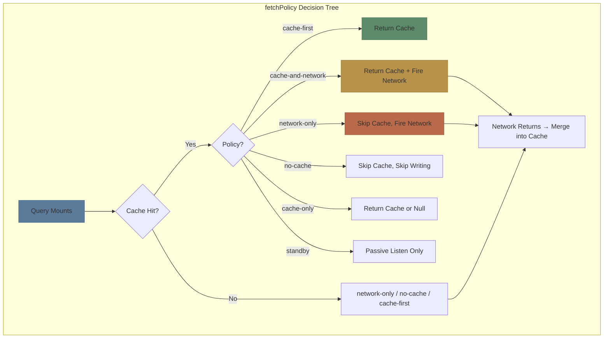
```mermaid
graph TD
  subgraph "fetchPolicy Decision Tree"
    A[Query Mounts] --> B{Cache Hit?}
    B -->|Yes| C{Policy?}
    B -->|No| D[network-only / no-cache / cache-first]
    C -->|cache-first| E[Return Cache]
    C -->|cache-and-network| F[Return Cache + Fire Network]
    C -->|network-only| G[Skip Cache, Fire Network]
    C -->|no-cache| H[Skip Cache, Skip Writing]
    C -->|cache-only| I[Return Cache or Null]
    C -->|standby| J[Passive Listen Only]
    F --> K[Network Returns → Merge into Cache]
    G --> K
    D --> K
  end
  style A fill:#5c7a99,stroke:#4a6d8c
  style E fill:#5c8a6a,stroke:#4a7a5a
  style F fill:#b8924a,stroke:#9a7a3a
  style G fill:#b86a4a,stroke:#9a5a3a
```

### Why This Matters

Cache policies are the difference between smooth UX and confusing UX. Wrong policy: loading spinners on every page, stale data showing after mutations, or flash-of-old-data. Understanding fetchPolicy, update strategies, and optimistic responses lets you control exactly when network fires and what user sees.

---

## Examples

### Example 1: Social Feed with Optimistic Like

```typescript
const [likePost] = useMutation(LIKE_POST, {
  optimisticResponse: {
    __typename: "Mutation",
    likePost: {
      __typename: "Post",
      id: postId,
      likes: post.likes + 1,
      isLiked: true,
    },
  },
  update(cache, { data }) {
    cache.modify({
      id: cache.identify({ __typename: "Post", id: postId }),
      fields: {
        likes() { return data.likePost.likes; },
        isLiked() { return data.likePost.isLiked; },
      },
    });
  },
});
```

User taps like → count increments instantly. If server fails, count rolls back.

### Example 2: Paginated Comments with Merge

```typescript
typePolicies: {
  Post: {
    fields: {
      comments: {
        keyArgs: ["sortBy"], // Cache separate lists per sort order
        merge(existing = [], incoming) {
          return [...existing, ...incoming];
        },
      },
    },
  },
}
```

Without merge: each page load replaces previous. With merge: pages append. `keyArgs` distinguishes lists by sort order.

---

## Key Takeaways
- Six fetch policies balance freshness vs speed: cache-first (default), cache-and-network, network-only, no-cache, cache-only, standby
- Mutation cache updates: automatic (entity match), refetchQueries (brute force), cache.modify (precise)
- Optimistic responses render mutation results instantly before server confirms
- Field policies (read, merge) give per-field control over cache behavior
- cache-and-network risks race conditions when network response lags behind user mutation
- refetch forces network; readQuery reads cache snapshot without network
- `nextFetchPolicy` transitions policy after initial fetch

---

## Common Misconception

**"optimisticResponse and update are mutually exclusive — one or the other."**

False. They work together. `optimisticResponse` provides fake data for instant render. `update` callback runs twice: first with optimistic data (UI update), then with real server data (cache correction). The update logic does not change — it handles both phases identically.

---

## Feynman Explain
Explain Apollo cache policies to a React developer who only knows REST + Redux. Describe: why fetch policies replace manual loading states, how optimistic updates replace Redux optimistic dispatches, and why cache.modify replaces reducer logic for specific cache slices.


---

## Reframe
Critique: Apollo's cache policy API is over-engineered. Six fetch policies, multiple update strategies, field-level merge functions — do developers really need this knobs, or does it reflect poor defaults? Compare with Relay's simpler (but less flexible) cache model: is configuration power worth cognitive overhead?

---

## Drill
Take the quiz. MCQs test different angles — recall, application, scenario.

Run: `learn.sh quiz graphql-deep-dive 10`

## Quiz: 10-client-cache-policies


## Quiz: 10-client-cache-policies

(quiz parse error: 'str' object has no attribute 'get')


---

# Module 11: Server Cache

Est. study time: 2h
Language: en

## Learning Objectives
- Design multi-layer server cache strategy for GraphQL: CDN, APQ, response cache, DataLoader
- Implement cache key composition with query + variables + user context
- Apply cache-aside, read-through, and write-through patterns with Redis

---

## Core Content

### CDN Caching: GET vs POST

GraphQL traditionally uses POST — request body never cached by CDNs. To leverage CDN caching:

- **GET queries**: Send query as URL query param `?query=...&variables=...`. CDNs cache by full URL. Works only for queries, not mutations.
- **Automatic Persisted Queries (APQ)**: Hybrid approach — send hash first, CDN caches full query on miss.

```http
# APQ flow: Step 1 — send hash
POST /graphql
Content-Type: application/json

{"query": "# hash=abc123", "extensions": {"persistedQuery": {"version": 1, "sha256Hash": "abc123"}}}

# Step 2 — on miss, server returns error, client resends with full query
# Step 3 — subsequent requests send hash only, server returns cached result
```

> **Think**: Why not use GET for all GraphQL queries? What breaks?
>
> *Answer: GET URLs have length limits (~2KB in some proxies, ~8KB in others). Complex queries with large variable objects exceed these limits. Also, GET requests are logged in full in server access logs, potentially leaking sensitive query variables. POST avoids both issues.*

---

### Cache-Control Headers

GraphQL responses should set standard HTTP cache headers for CDN/proxy cooperation:

```http
# Public query — cacheable by CDN and browsers
Cache-Control: public, max-age=300, s-maxage=600

# User-specific data — private cache only
Cache-Control: private, max-age=60

# Dynamic/deprecated data — no cache
Cache-Control: no-cache
```

Key headers:
- `s-maxage` — shared cache (CDN) TTL, overrides `max-age`
- `stale-while-revalidate` — serve stale while fetching fresh
- `stale-if-error` — serve stale when origin errors

> **Think**: How does `stale-while-revalidate` compare to `no-cache` for GraphQL queries?
>
> *Answer: `no-cache` revalidates every request, adding latency on every hit. `stale-while-revalidate` serves cached (possibly stale) data immediately while refreshing in background. Better UX for dashboards and lists where freshness is non-critical. Wrong for bank balances or real-time state where stale data is dangerous.*

---

### Automatic Persisted Queries (APQ)

APQ eliminates query string overhead in every request:

1. Client computes SHA-256 hash of query
2. Sends hash instead of full query
3. Server checks hash in cache → returns cached result
4. On cache miss, server responds with error, client resends with full query
5. Server stores query-by-hash and returns result

```text
Client → Server: {"extensions": {"persistedQuery": {"sha256Hash": "abc", "version": 1}}}
Server → Client: {"errors": [{"message": "PersistedQueryNotFound"}]}
Client → Server: {"query": "...full query...", "extensions": {"persistedQuery": {"sha256Hash": "abc", "version": 1}}}
Server → Client: {"data": {...}, "extensions": {"persistedQuery": {"sha256Hash": "abc", "version": 1}}}
// Subsequent requests: hash only
```

Benefits:
- Smaller payload (most requests drop 50-90% of bytes)
- Enables GET-based CDN caching (short URL = hash only)
- Works with any transport (HTTP, WebSocket)

---

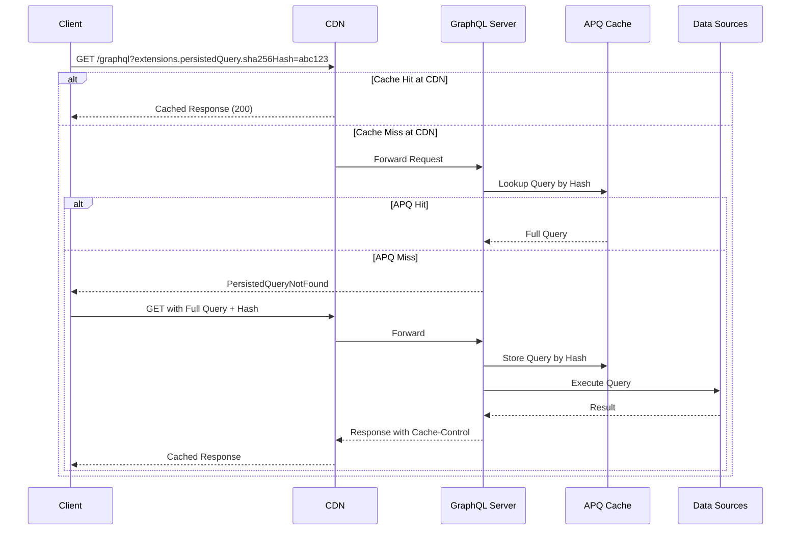
```mermaid
sequenceDiagram
    participant Client
    participant CDN
    participant GraphQL Server
    participant APQ Cache
    participant Data Sources
    
    Client->>CDN: GET /graphql?extensions.persistedQuery.sha256Hash=abc123
    alt Cache Hit at CDN
        CDN-->>Client: Cached Response (200)
    else Cache Miss at CDN
        CDN->>GraphQL Server: Forward Request
        GraphQL Server->>APQ Cache: Lookup Query by Hash
        alt APQ Hit
            APQ Cache-->>GraphQL Server: Full Query
        else APQ Miss
            GraphQL Server-->>Client: PersistedQueryNotFound
            Client->>CDN: GET with Full Query + Hash
            CDN->>GraphQL Server: Forward
            GraphQL Server->>APQ Cache: Store Query by Hash
            GraphQL Server->>Data Sources: Execute Query
            Data Sources-->>GraphQL Server: Result
            GraphQL Server-->>CDN: Response with Cache-Control
            CDN-->>Client: Cached Response
        end
    end
```

---

### Response Caching at Server Level: Redis & Memcached

Server-side response cache stores complete GraphQL responses keyed by cache key.

**Redis** (in-memory with persistence):
- Rich data structures: strings, hashes, sorted sets
- TTL, atomic operations, pub/sub
- Ideal for cache-aside with invalidation listeners

**Memcached** (pure in-memory, simpler):
- No persistence, no data structures beyond key-value
- Lower per-operation overhead (~ms faster than Redis for simple ops)
- Good for simple TTL-only caching

Choosing Redis vs Memcached for GraphQL:
- Need cache invalidation (purge keys, tag-based)? → Redis
- Need persistence across restarts? → Redis
- Need pub/sub for invalidation propagation? → Redis
- Only need simple TTL-based cache? → Memcached is fine

```python
# Cache-aside pseudocode (Python-like)
def resolve_products(_, args, context):
    cache_key = f"products:{hash_query(context.query)}:{hash_vars(args)}"
    
    # Check cache
    cached = redis.get(cache_key)
    if cached:
        return json.loads(cached)
    
    # Miss — compute and store
    result = fetch_from_db(args)
    redis.setex(cache_key, TTL, json.dumps(result))
    return result
```

> **Think**: What happens to cache hit rate when queries share the same data but differ in field selection?
>
> *Answer: Field selection differences produce different query strings → different cache keys → cache miss even though underlying data is identical. Solutions: normalize queries (strip whitespace, sort fields) before hashing, or use a normalized cache key based on data requirements (e.g., Apollo's `cache-control` directive).*

---

### Cache Key Design: Query + Variables + User

Cache key must uniquely identify when two requests can share a response:

```text
cache_key = hash(normalized_query + json(variables) + user_context_key)
```

Where:
- `normalized_query`: Sort fields alphabetically, strip whitespace. Same semantic query → same normalized form
- `variables`: Sorted JSON. `{a:1, b:2}` must produce same key as `{b:2, a:1}`
- `user_context_key`: `null` for public data, user ID for private data, role for role-based data

Caution: Variables with large lists (e.g., `ids: [1,2,3,...,1000]`) produce unique keys per request, trashing cache. Use hash of list or normalize to a CURIE-like identifier.

```python
def cache_key(query, variables, user_id=None):
    normalized = normalize_query(query)
    vars_str = json.dumps(variables, sort_keys=True)
    payload = f"{normalized}:{vars_str}"
    if user_id:
        payload += f":{user_id}"
    return hashlib.sha256(payload.encode()).hexdigest()
```

> **Think**: Should authentication tokens be part of the cache key?
>
> *Answer: No — tokens change per session but represent the same user. Use stable user ID from decoded token. Token in key means cache eviction on every login/logout. Use token → user ID mapping at request layer.*

---

### Caching Patterns: Cache-Aside, Read-Through, Write-Through

| Pattern | Read Behavior | Write Behavior | Pros | Cons |
|---------|--------------|----------------|------|------|
| **Cache-Aside** | App checks cache, loads on miss, stores result | App updates DB, invalidates or updates cache | Simple, explicit control | Stale data window, write amplification |
| **Read-Through** | Cache fetches from DB on miss transparently | App writes to DB, cache may auto-invalidate | Clean app code, consistent read path | Cache must know how to load data |
| **Write-Through** | Same as read-through | App writes to cache, cache writes to DB synchronously | Cache always fresh, no stale reads | Write latency penalty, stronger consistency |

For GraphQL servers:

```python
# Cache-Aside (most common in GraphQL)
def resolve_user(parent, args, context):
    key = f"user:{args.id}"
    cached = cache.get(key)
    if cached:
        return cached
    user = db.fetch_user(args.id)
    cache.setex(key, 300, user)
    return user

# Read-Through (less common, requires cache-aware loader)
# Cache layer knows how to call DB. App just does cache.get(key).
# Implementation: Redis with custom module, or client-side cache wrapper.

# Write-Through (for mutations that must update cache)
def resolve_updateUser(parent, args, context):
    updated = db.update_user(args.id, args.input)
    key = f"user:{args.id}"
    cache.setex(key, 300, updated)  # Write to cache synchronously
    return updated
```

> **Think**: Why is cache-aside the dominant pattern for GraphQL resolvers?
>
> *Answer: GraphQL resolvers are fine-grained and data-source-agnostic. A resolver doesn't know if the data source supports read-through. Cache-aside keeps caching logic in the resolver layer where the resolver already handles data fetching. Read-through requires the cache itself to understand data sources, coupling infrastructure to domain.*

---

### Distributed Cache Invalidation with Redis

Invalidation is the hard part. Redis provides tools:

**Explicit eviction by key:**
```python
cache.delete(f"user:{user_id}")
cache.delete(f"posts:user:{user_id}")
```

**Pattern-based eviction** (dangerous in production with many keys):
```python
for key in redis.scan_iter("user:*"):
    cache.delete(key)
```

**Tag-based invalidation** (Redis sets):
```python
# When storing, tag the cache entry
cache.setex(cache_key, TTL, result)
cache.sadd(f"tag:user:{user_id}", cache_key)

# When invalidating, retrieve all keys for tag and delete
keys = cache.smembers(f"tag:user:{user_id}")
if keys:
    cache.delete(*keys)
    cache.delete(f"tag:user:{user_id}")
```

Challenges:
- GraphQL nested data means one DB update can invalidate many cache keys
- Race conditions: request A reads stale while request B writes
- Thundering herd: many requests miss simultaneously after invalidation

> **Think**: How does GraphQL's nested nature make invalidation harder than REST?
>
> *Answer: REST has one resource per URL. Updating `/users/1` might invalidate one cache key. GraphQL — a single mutation like `updateUser` can affect `User`, `Post` (their posts), `Feed` (containing user's posts), `Notification` (containing user data) — each with its own cache key. Cross-cutting data makes invalidation an n² problem.*

---

### Cache Warming Strategies

Proactive cache population before users request data:

**Strategy 1: Scheduled warming**
```python
# Cron job: every 5 minutes, re-fetch top 100 queries
WARM_QUERIES = [
    ("query { topProducts { id name price } }", {}),
    ("query { categories { id name } }", {}),
]
for query, variables in WARM_QUERIES:
    result = execute_query(query, variables)
    cache.set(cache_key(query, variables), result, ex=300)
```

**Strategy 2: Event-driven warming**
```python
# After DB update, re-compute affected cache entries
def on_product_update(product_id):
    affected_queries = find_cached_queries_for_product(product_id)
    for query, variables in affected_queries:
        result = execute_query(query, variables)
        cache.set(cache_key(query, variables), result, ex=300)
```

**Strategy 3: Pre-warming on deploy**
- On server startup, warm critical queries before accepting traffic
- Prevents cold-start latency spike

```python
@app.on_event("startup")
def warm_cache():
    log("Warming cache...")
    for q in CRITICAL_QUERIES:
        execute_and_cache(q.query, q.variables)
```

> **Think**: When does cache warming hurt instead of help?
>
> *Answer: When warmed data is never requested — wasted compute and memory. When warming queries are too numerous, slowing startup. When warming and real requests race — real request reads stale data written seconds apart. Warm selectively: top 5-10 queries by request frequency, or queries with known high latency.*

---

### Per-Request DataLoader Cache vs Shared Response Cache

These serve different purposes and should be used together:

| | DataLoader Cache | Shared Response Cache |
|---|---|---|
| **Scope** | Single request | Across requests |
| **Lifetime** | Request lifetime (ms) | Seconds to hours |
| **Key** | Data-source key (e.g., `User:42`) | Query + variables + user |
| **Purpose** | Eliminate duplicate fetches within one query | Avoid re-executing identical queries across clients |
| **Backend** | In-memory per request | Redis / Memcached |
| **Invalidation** | Automatic (request ends) | Explicit or TTL |

```python
# DataLoader — deduplicates within one GraphQL request
loader = DataLoader(lambda keys: batch_fetch_users(keys))
user1 = loader.load(1)  # Queued
user2 = loader.load(1)  # Returns same promise, no duplicate fetch
user3 = loader.load(2)  # Batched with user1 in same DB call

# Shared cache — across requests (Redis)
cached = redis.get("query:abc123")
if cached:
    return cached  # Skips resolver + DataLoader entirely
result = execute_query(query)
redis.setex("query:abc123", 60, result)
return result
```

They compose: checks shared cache first → if miss, execute query with DataLoader deduplication → store in shared cache.

> **Think**: Can the DataLoader cache replace the shared response cache?
>
> *Answer: No. DataLoader prevents duplicate DB calls within a single request. Shared response cache prevents re-execution across requests. Two different problems. A fleet of 1000 servers each running the same query still hits the DB 1000 times without shared cache, even with perfect DataLoader usage.*

---

### Why This Matters

Server-side caching separates production GraphQL from toy GraphQL. Without it, every query hits databases, external APIs, and compute layers. Multi-layer caching (CDN → APQ → Redis → DataLoader) reduces p99 latency from 500ms to 5ms for cacheable queries. Poor cache key design or missing invalidation causes stale data bugs that erode trust. The difference between a GraphQL API that scales and one that collapses under load is caching.

---

## Examples

### Example 1: Multi-Layer Cache Setup

```python
# Middleware ordering: CDN → APQ → Redis → DataLoader

class GraphQLMiddleware:
    def process_request(self, request):
        # Layer 1: CDN handled by CloudFront/Akamai
        # Layer 2: APQ — resolve hash to query
        request.query = self.apq_cache.resolve(request)
        
        # Layer 3: Redis response cache
        cache_key = self.build_cache_key(request)
        cached = self.redis.get(cache_key)
        if cached:
            return Response(json.loads(cached), headers={"X-Cache": "HIT"})
        
        # Layer 4: Execute with DataLoader
        result = self.execute(request)
        
        # Store in Redis
        ttl = self.compute_ttl(request.operation)
        self.redis.setex(cache_key, ttl, json.dumps(result))
        
        return Response(result, headers={"X-Cache": "MISS"})
```

---

### Example 2: Tag-Based Invalidator

```python
def invalidate_for_user(user_id):
    tags = [
        f"user:{user_id}",
        f"posts:{user_id}",
    ]
    for tag in tags:
        keys = redis.smembers(f"tag:{tag}")
        if keys:
            redis.delete(*keys)

def store_with_tags(cache_key, value, tags, ttl=300):
    redis.setex(cache_key, ttl, json.dumps(value))
    for tag in tags:
        redis.sadd(f"tag:{tag}", cache_key)

# Usage in resolver
def resolve_user_profile(parent, args, context):
    user_id = context.user.id
    cache_key = f"profile:{user_id}"
    stored = store_with_tags(cache_key, profile, tags=[f"user:{user_id}"])
```

---

## Key Takeaways
- CDN caching requires GET requests or APQ — POST bodies are not cacheable by CDNs
- APQ reduces payload size by hashing queries, enabling CDN caching with short URLs
- Cache key = normalized query + sorted variables + user context
- Cache-aside is the dominant GraphQL caching pattern — simple and explicit
- Distributed invalidation is the hardest problem; use Redis tags to associate cache entries with domain entities
- DataLoader and shared response cache are complementary, not replacements

---

## Common Misconception

**"GraphQL responses are uncacheable because every query is different."**

Wrong. Most GraphQL APIs serve a small set of query shapes repeatedly — `getUser`, `getProducts`, `getFeed`. Even if variables differ, cache key parameters produce separate entries. The real question is TTL and invalidation, not cacheability. Normalize queries (strip whitespace, sort fields) to maximize cache key reuse. The 80/20 rule applies: 20% of query shapes generate 80% of traffic. Cache those.

---

## Feynman Explain

Explain server-side GraphQL caching to a backend engineer who knows Redis but not GraphQL. Cover: why POST breaks CDN caching, how APQ works, and why cache key includes query + variables + user context. Then explain why GraphQL makes invalidation harder than REST. Max 3 sentences per concept.


---

## Reframe

Critique: Adding Redis, APQ, and CDN caching is overengineering for most GraphQL APIs. A single Postgres database with proper indexing handles most workloads fine. When does each caching layer become justified? What request volume or latency requirements warrant adding each layer?

---

## Drill

Take the quiz. MCQs test caching strategy, key design, invalidation patterns.

Run: `learn.sh quiz graphql-deep-dive 11`

## Quiz: 11-server-cache


## Quiz: 11-server-cache

(quiz parse error: 'str' object has no attribute 'get')


---

# Module 12: Cache Invalidation

Est. study time: 2h
Language: en

## Learning Objectives
- Identify why GraphQL cache invalidation is fundamentally harder than REST
- Implement webhook-based, TTL-based, and pub/sub invalidation strategies
- Apply stale-while-revalidate and cache tags to balance freshness vs latency

---

## Core Content

### Why Cache Invalidation Is Hard in GraphQL

REST invalidation is straightforward: `PUT /users/1` invalidates `GET /users/1`. GraphQL breaks this 1:1 mapping.

A single `updateUser` mutation can affect:
- `{ user(id: 1) { profile { name } } }` — direct user query
- `{ posts { author { name } } }` — post listing with user data
- `{ feed { items { user { name } } } }` — feed containing user's content
- `{ search(query: "alice") { ... } }` — search results

Each query shape is a different cache key. The mutation author cannot easily enumerate all affected keys.

```python
# Hard: mutation must know which queries are cached
def resolve_updateUser(parent, args, context):
    user = db.update_user(args.id, args.input)
    # What cache keys contain this user's data?
    # "user:1"? "posts:all"? "feed:*"? "search:*"?
    # Impossible to enumerate exhaustively in a large schema
    return user
```

> **Think**: REST has `/users/1` — one URL, one cache key. GraphQL can query user data through 50 different entry points. Why can't we just invalidate by data source?
>
> *Answer: Because cache key is based on query shape + variables, not data source. `{ user(id: 1) { name } }` and `{ user(id: 1) { name email } }` are different keys. Even if both read from the same `users` table, they're separate cache entries. Invalidating by data source requires a mapping layer: "this cache entry depends on these DB rows."*

---

### Webhook-Based Invalidation

External services notify the cache layer when data changes:

**PurgeKey — Apollo's approach:**
- Schema annotates types with `@cacheControl` directive
- Server computes list of "purge keys" for each response
- When mutation occurs, send webhook with keys to purge

```python
# Schema annotation
# type User @cacheControl(maxAge: 300) { ... }
# type Post @cacheControl(maxAge: 60, inheritMaxAge: true) { ... }

# On mutation, compute purge keys
keys = ["User:1", "User:2", "Post:42"]
webhook_client.send("https://cache-purge.internal", {"keys": keys})

# Cache server receives webhook and invalidates
@app.post("/purge")
def purge_keys(body):
    for key in body["keys"]:
        cache.delete_by_tag(key)
```

**Custom webhook endpoint:**
```python
POST /graphql-cache/purge
Content-Type: application/json

{"tags": ["user:1", "post:42"]}
```

Webhook reliability challenges:
- At-least-once vs exactly-once delivery
- Webhook failure → stale data persists
- Backpressure when many keys need purging simultaneously

> **Think**: What happens if the webhook fails? How do you prevent permanent stale data?
>
> *Answer: Combine webhooks with TTL. Webhooks provide fast invalidation; TTL is the safety net. If webhook fails, TTL eventually expires the stale entry. Use retry queues with exponential backoff for webhook delivery. Health-check the purge endpoint before sending.*

---

### TTL-Based Strategies

**Fixed TTL:** Same expiry time for every cache entry.
```python
cache.setex(key, 300, result)  # 5 minutes, always
```
Simple but wasteful: data that changes every second still lives 5 minutes.

**Sliding TTL:** Reset TTL on every read. Hot entries stay cached; cold entries expire.
```python
# Reset TTL on hit (cache library handles this)
# Resurrects entries that keep getting read
# Risk: frequently-read stale data never expires
```

**Max-Age (per-type TTL):** Different TTL per schema type, via `@cacheControl`.
```graphql
type User @cacheControl(maxAge: 300) {
  id: ID!
  name: String!
}

type StockPrice @cacheControl(maxAge: 5) {
  symbol: String!
  price: Float!
}
```

| Strategy | Freshness | Complexity | Use Case |
|----------|-----------|------------|----------|
| Fixed TTL | Low | None | Static reference data |
| Sliding TTL | Medium | Low | Popular items that change rarely |
| Per-type TTL | High | Medium | Mixed workloads (profiles + stock prices) |

> **Think**: Sliding TTL keeps hot data cached forever. When is this dangerous?
>
> *Answer: When the data changes but stays hot. Example: a breaking news article's view count keeps refreshing TTL, but the article's content was updated. The stale content version never expires because it's always being read. Solution: cap sliding TTL with a fixed upper bound, or use write-through for mutable data.*

---

### Pub/Sub Invalidation

Decouple invalidation producers from consumers via message broker.

**Redis Pub/Sub:**
```python
# Publisher (mutation resolver)
def resolve_updateUser(parent, args, context):
    user = db.update_user(args.id, args.input)
    redis.publish("cache:invalidate", json.dumps({
        "type": "User",
        "id": args.id,
        "timestamp": time.now()
    }))
    return user

# Subscriber (separate process or thread)
pubsub = redis.pubsub()
pubsub.subscribe("cache:invalidate")
for message in pubsub.listen():
    payload = json.loads(message["data"])
    pattern = f"{payload['type']}:{payload['id']}:*"
    for key in redis.scan_iter(pattern):
        redis.delete(key)
```

**Postgres LISTEN/NOTIFY:**
```sql
-- In a Postgres trigger
CREATE OR REPLACE FUNCTION notify_cache_invalidation()
RETURNS trigger AS $$
BEGIN
  PERFORM pg_notify('cache_invalidation', 
    json_build_object('table', TG_TABLE_NAME, 'id', NEW.id)::text);
  RETURN NEW;
END;
$$ LANGUAGE plpgsql;

CREATE TRIGGER user_update_trig
  AFTER UPDATE ON users
  FOR EACH ROW
  EXECUTE FUNCTION notify_cache_invalidation();
```

```python
# Listener in application
import select
conn = psycopg2.connect(dsn)
conn.set_isolation_level(psycopg2.extensions.ISOLATION_LEVEL_AUTOCOMMIT)
curs = conn.cursor()
curs.execute("LISTEN cache_invalidation;")
while True:
    if select.select([conn], [], [], 5) != ([], [], []):
        conn.poll()
        for notify in conn.notifies:
            handle_invalidation(notify.payload)
        conn.notifies.clear()
```

Pub/Sub pros:
- Decoupled: mutation resolver does not need to know which cache keys exist
- Multiple subscribers can react to same event independently
- Works across server instances in a fleet

Cons:
- Eventually consistent: window between NOTIFY and cache deletion
- Redis Pub/Sub is fire-and-forget (no persistence — disconnect = missed messages)
- Postgres NOTIFY has payload size limits (~8KB)

> **Think**: Why use Redis Pub/Sub for invalidation instead of just calling cache.delete() in the resolver?
>
> *Answer: Calling cache.delete() in the resolver couples mutation logic to cache infrastructure. If the cache topology changes (new Redis cluster, additional cache layers), every resolver must be updated. Pub/Sub allows cache subscribers to decide how to invalidate independently. Also, Pub/Sub works across processes: one server handles mutation, another receives invalidation event.*

---

### Stale-While-Revalidate (SWR)

Serve stale (cached) data immediately while fetching fresh data in background.

```python
def resolve_with_swr(key, fetch_fn, stale_ttl=300, max_ttl=600):
    cached = cache.get(key)
    now = time.time()
    
    if cached:
        age = now - cached["cached_at"]
        if age < stale_ttl:
            # Fresh enough — return immediately
            return cached["data"]
        elif age < max_ttl:
            # Stale but usable — return stale, refresh async
            async_refresh(key, fetch_fn)
            return cached["data"]
        else:
            # Too stale — must wait for refresh
            return fetch_fn()
    else:
        # No cache — fetch and store
        result = fetch_fn()
        store(key, result)
        return result
```

SWR tradeoffs:
- Users always see data instantly (no loading spinner)
- Data may be stale by up to `max_ttl`
- Background refresh can cause thundering herd if many requests arrive simultaneously during refresh
- Solution: "request coalescing" — only one process refreshes, others wait

HTTP equivalent: `Cache-Control: stale-while-revalidate=300`

```http
Cache-Control: public, max-age=60, stale-while-revalidate=300
# Serve up to 60s fresh, then up to 300s stale while revalidating
```

> **Think**: Does SWR work for bank balances? What about dashboards?
>
> *Answer: Bank balances: terrible. SWR could show yesterday's balance — unacceptable. Dashboards: excellent. Showing 5-minute-old analytics is fine; showing nothing while data loads is worse. SWR prioritizes availability and latency over freshness — choose based on data criticality.*

---

### Cache Tags: Apollo CacheControl & Beyond

Apollo's `@cacheControl` directive annotates the schema to guide caching:

```graphql
directive @cacheControl(
  maxAge: Int
  scope: CACHE_SCOPE  # PRIVATE | PUBLIC
  inheritMaxAge: Boolean
) on FIELD_DEFINITION | OBJECT | INTERFACE | UNION

type User @cacheControl(maxAge: 300) {
  id: ID!
  name: String!
  posts: [Post!]! @cacheControl(inheritMaxAge: true)
}

type StockPrice @cacheControl(maxAge: 5) {
  symbol: String!
  price: Float!
}
```

Cache tags extend this by assigning arbitrary labels to response entries:

```python
# On response, server attaches cache tags
response.extensions = {
    "cacheControl": {
        "version": 1,
        "hints": [
            {"path": ["user"], "maxAge": 300, "scope": "PRIVATE"},
            {"path": ["user", "posts"], "maxAge": 300, "tags": ["user:42", "post:*"]},
        ]
    }
}

# Cache middleware uses tags to build invalidation key
response_tags = extract_tags(response)
cache.store(request.cache_key, response, tags=response_tags)
```

Custom tag implementations:
- **Field-level tags**: `tag:User:1`, `tag:Post:42`
- **Type-level tags**: `tag:type:User`, `tag:type:StockPrice`
- **Role-level tags**: `tag:role:ADMIN` (invalidate admin-only data)

```python
# Mutation resolver that computes affected tags
def resolve_updatePost(parent, args, context):
    post = db.update_post(args.id, args.input)
    # Compute affected tags
    tags = [
        f"Post:{args.id}",
        f"User:{post.author_id}",
    ]
    if post.status == "PUBLISHED":
        tags.append("Feed:published")
    # Send invalidation signal
    cache.invalidate_tags(tags)
    return post
```

> **Think**: What granularity of cache tags makes sense — per-field, per-row, per-type?
>
> *Answer: Depends on data volatility and cache entry size. Per-type (invalidate all User entries on any user change): simple but wasteful — one user edit drops all user cache. Per-row (tag:User:42): precise invalidation but more tags to manage. Per-field: too many tags, overhead negates cache benefit. Per-row per-type is the sweet spot for most GraphQL APIs.*

---

### Real-Time Invalidation via Subscriptions

GraphQL subscriptions can propagate invalidation events in real-time:

```graphql
type Subscription {
  cacheInvalidation(types: [String!]): CacheInvalidationEvent!
}

type CacheInvalidationEvent {
  type: String!
  id: ID!
  timestamp: Float!
  mutation: String!
}
```

Client subscribes:
```graphql
subscription {
  cacheInvalidation(types: ["User", "Post"]) {
    type
    id
    mutation
  }
}
```

When mutation occurs, server publishes to subscription, client evicts affected cache entries:

```python
# Server sends invalidation via subscription
def publish_invalidation(type_name, entity_id):
    context.pubsub.publish("cacheInvalidation", {
        "cacheInvalidation": {
            "type": type_name,
            "id": entity_id,
            "timestamp": time.time(),
            "mutation": "updateUser"
        }
    })
```

This is especially useful for:
- **Client-side normalized caches** (Apollo Client, URQL): client can evict specific entities
- **Real-time dashboards**: cache clears when relevant data changes
- **Multi-tab synchronization**: update all open tabs when mutation occurs

> **Think**: Why not use subscriptions exclusively for cache invalidation, removing need for server-side invalidation logic?
>
> *Answer: Subscriptions require WebSocket connections — not all clients maintain them (mobile apps, server-to-server). Also, subscription-based invalidation doesn't help the server-side cache itself (other server instances, CDN). Subscriptions complement but don't replace server-side invalidation.*

---

### Cache Warming: Pre-Compute + Populate

Proactive invalidation alternative: warm caches before users request stale data.

**Strategy: Pre-compute on data change**
```python
def after_user_update(user_id):
    # Pre-compute and cache the most common queries containing this user
    popular_queries = ANALYTICS.get_popular_queries_for_user(user_id)
    for query in popular_queries:
        result = execute_graphql(query)
        cache_key = build_cache_key(query)
        cache.setex(cache_key, TTL, result)
```

**Strategy: Compute on deploy / schedule**
```python
# Every hour, warm the top 100 queries
def warm_top_queries():
    queries = ANALYTICS.top_queries(limit=100)
    for query, variables_list in queries:
        for vars in variables_list:
            result = execute(query, variables=vars)
            store_in_cache(query, vars, result)
```

Warming vs passive caching:
| Aspect | Passive (demand-driven) | Proactive (warmer) |
|--------|------------------------|-------------------|
| First request latency | High (cache miss) | Low (pre-warmed) |
| Compute efficiency | Only what's requested | May compute unused data |
| Freshness | Depends on TTL | Can refresh on data change |
| Complexity | Low | High (needs analytics + scheduler) |

> **Think**: When is cache warming a net negative?
>
> *Answer: When warming compute cost exceeds the latency saved. If a query costs 1ms but warming it costs 100ms and it's only requested once per hour, warming adds 100ms overhead for 1ms benefit. Also, warming evicts hot data when cache is at capacity. Warm selectively: measure first-request latency, only warm queries above a latency threshold.*

---

### Invalidation Strategy Comparison


```mermaid
graph TD
    subgraph Invalidation Strategies
        TTL[TTL-Based]
        WEB[Webhook-Based]
        PUB[Pub/Sub]
        SUB[Subscription]
        WARM[Cache Warming]
        SWR[Stale-While-Revalidate]
    end
    
    subgraph Freshness
        TTL --> LOW[Low-Medium Freshness]
        WEB --> HIGH[High Freshness]
        PUB --> HIGH
        SUB --> HIGH
        WARM --> MED[Medium Freshness]
        SWR --> LOW_MED[Low-Medium Freshness]
    end
    
    subgraph Complexity
        TTL --> SIMPLE[Low]
        WEB --> MED_C[Medium-High]
        PUB --> MED_C
        SUB --> HIGH_C[High]
        WARM --> MED_C
        SWR --> LOW_C[Low-Medium]
    end
    
    subgraph When to Use
        TTL --> STATIC[Static / reference data]
        WEB --> CRITICAL[Critical data need immediate refresh]
        PUB --> DISTRIBUTED[Distributed fleet, many services]
        SUB --> CLIENT[Client-side cache sync]
        WARM --> COLD_START[Prevent cold-start latency]
        SWR --> AVAIL[Availability > freshness]
    end
```

---

### Why This Matters

Cache invalidation is the hardest problem in GraphQL caching — harder than cache key design, harder than choosing a cache backend. Get invalidation wrong and users see stale data silently; get it slightly wrong and every mutation invalidates the entire cache (cache stampede). Production GraphQL APIs combine multiple strategies: TTL as safety net, webhooks for critical path, pub/sub for decoupled invalidation, SWR for the latency-sensitive path. No single strategy suffices.

---

## Examples

### Example 1: Multi-Strategy Invalidation

```python
class CacheManager:
    def __init__(self):
        self.redis = Redis()
        self.ttl_by_type = {"User": 300, "Post": 60, "StockPrice": 5}
    
    def get(self, key, query_type):
        # Try cache first
        cached = self.redis.get(key)
        if cached:
            return self._handle_swr(key, cached, query_type)
        return None
    
    def _handle_swr(self, key, cached, query_type):
        entry = json.loads(cached)
        age = time.time() - entry["cached_at"]
        max_age = self.ttl_by_type.get(query_type, 60)
        stale_age = max_age * 2  # SWR window = 2x TTL
        
        if age < max_age:
            return entry["data"]  # Fresh
        elif age < stale_age:
            asyncio.create_task(self._refresh(key, query_type))
            return entry["data"]  # Stale, returning while refreshing
        else:
            return None  # Too stale, caller must refresh
    
    def invalidate(self, tags):
        """Called by mutation resolvers via pub/sub listener"""
        for tag in tags:
            pattern = f"tag:{tag}:*"
            for key in self.redis.scan_iter(pattern):
                self.redis.delete(key)
    
    def store(self, key, data, tags, query_type):
        max_age = self.ttl_by_type.get(query_type, 60)
        entry = {"data": data, "cached_at": time.time(), "tags": tags}
        self.redis.setex(key, max_age * 3, json.dumps(entry))
        for tag in tags:
            self.redis.sadd(f"tag:{tag}", key)
```

---

### Example 2: Postgres NOTIFY + Redis Listener

```python
# Database layer — triggers on row change
# (SQL trigger from earlier content)

# Application listener — separate thread
import threading

def cache_listener():
    conn = psycopg2.connect(os.environ["DATABASE_URL"])
    conn.set_isolation_level(ISOLATION_LEVEL_AUTOCOMMIT)
    cursor = conn.cursor()
    cursor.execute("LISTEN cache_invalidation;")
    
    while True:
        conn.poll()
        while conn.notifies:
            notification = conn.notifies.pop(0)
            payload = json.loads(notification.payload)
            # payload: {"table": "users", "id": 42}
            tag = f"{payload['table']}:{payload['id']}"
            redis_client.delete_by_tag(tag)
        
        select.select([conn], [], [], 1)

# Start in background
threading.Thread(target=cache_listener, daemon=True).start()
```

---

## Key Takeaways
- GraphQL invalidation is harder than REST due to 1:n mapping between mutations and affected cache keys
- TTL is the universal safety net — combine with other strategies, never rely on TTL alone
- Webhooks provide immediate push-based invalidation but need retry logic for reliability
- Pub/Sub decouples mutation logic from cache infrastructure; Redis Pub/Sub and Postgres LISTEN/NOTIFY are common choices
- Stale-while-revalidate prioritizes availability over freshness — ideal for latency-sensitive read-heavy APIs
- Cache tags (Apollo CacheControl or custom) associate cache entries with domain entities for targeted invalidation
- Cache warming prevents cold-start spikes but must be data-driven to avoid waste

---

## Common Misconception

**"Set a short TTL and skip invalidation logic entirely."**

Wrong. Short TTLs reduce the stale window but don't eliminate it. A 5-second TTL on user profiles means a user who updates their name waits up to 5 seconds for other users to see the change. Worse: if a cache entry takes 200ms to recompute and you have 1000 req/s, every 5 seconds all 1000 requests miss simultaneously — cache stampede. Invalidation is not optional; it's a requirement for correctness and a necessity for performance under load.

---

## Feynman Explain

Explain cache invalidation in GraphQL to a backend engineer who understands REST caching. Focus on: why GraphQL's data graph makes 1:1 key invalidation impossible, how tag-based invalidation works (without Apollo), and why TTL alone is insufficient. Max 3 sentences per concept.


---

## Reframe

Critique: "Cache invalidation is one of the two hard things in computer science" — and GraphQL makes it harder. Is it worth the complexity? When would a simpler REST API with straightforward cache invalidation be preferable to a GraphQL API requiring multi-strategy invalidation? What caching complexity threshold justifies choosing REST over GraphQL?

---

## Drill

Take the quiz. MCQs test invalidation strategies, tradeoffs, and failure modes.

Run: `learn.sh quiz graphql-deep-dive 12`

## Quiz: 12-cache-invalidation


## Quiz: 12-cache-invalidation

(quiz parse error: 'str' object has no attribute 'get')


---

# Module 13: Federation Design

Est. study time: 2.5h
Language: en

## Learning Objectives
- Understand supergraph topology and how subgraphs compose into unified schema
- Distinguish Apollo Router (Rust) vs Apollo Gateway (Node.js) tradeoffs
- Apply federation directives: @shareable, @override, @inaccessible, @tag
- Design subgraph boundaries using domain-driven design principles
- Use Rover CLI for schema composition and publishing workflow
- Recognize when federation adds unnecessary complexity

---

## Core Content

### Supergraph Topology

Federation creates single unified GraphQL endpoint ("supergraph") from multiple independently-deployed GraphQL services ("subgraphs"). Clients query supergraph; router distributes queries to appropriate subgraphs.

```text
┌──────────────┐
│   Client     │
└──────┬───────┘
       │ query
┌──────▼───────┐
│   Supergraph  │  ← Apollo Router / Gateway
│   GraphQL API │
└──┬────┬────┬──┘
   │    │    │
┌──▼─┐┌─▼──┐┌─▼──┐
│Users││Prod││Order│  ← Subgraphs (independent services)
└─────┘└────┘└────┘
```

Each subgraph owns its schema portion. Router composes schemas at startup (or deploy time) into single supergraph schema.

> **Think**: What happens when two subgraphs define the same type with different fields?
>
> *Answer: Federation resolves this via schema composition rules. Type merging requires matching field definitions unless directives like @shareable or @override explicitly handle conflicts. Composition fails if unresolvable conflicts exist — safe failure prevents deploying broken supergraph.*

---

### Apollo Router vs Apollo Gateway

| Aspect | Apollo Router | Apollo Gateway |
|--------|--------------|----------------|
| Language | Rust | Node.js / TypeScript |
| Performance | ~50x faster, sub-millisecond overhead | ~ms overhead, GC pauses |
| Deployment | Binary, Docker, edge | Node.js process |
| Configuration | YAML config file | JavaScript/TypeScript |
| Extensibility | Rhai scripting, WASM plugins | JavaScript plugins |
| Query planning | Built-in (Rust-native) | Built-in (JS-native) |
| Managed federation | Cloud + self-hosted | Cloud + self-hosted |

Router preferred for high-throughput production. Gateway sufficient for moderate traffic or teams already in Node.js ecosystem.

> **Think**: Router is 50x faster. Why would anyone choose Gateway?
>
> *Answer: Ecosystem lock-in. Teams already invested in Node.js middleware (auth, logging, metrics) can reuse existing code as Gateway plugins. Gateway's JavaScript plugin model is more accessible than Router's Rhai/WASM. For teams under 1000 req/s, Gateway performance penalty is negligible.*

---

### Schema Composition

Composition merges subgraph schemas by:

1. **Type merging**: same-named types combined, fields unioned
2. **Directive resolution**: federation directives (@key, @shareable, etc.) processed
3. **Conflict detection**: same field with different types → composition fails
4. **Value type promotion**: types referenced by multiple subgraphs without @key become value types
5. **Entity alignment**: types with @key become entities, cross-subgraph references resolved

```graphql
# Subgraph A: Users
type User @key(fields: "id") {
  id: ID!
  name: String!
  email: String! @shareable
}

# Subgraph B: Reviews
type User @key(fields: "id") {
  id: ID!
  reviews: [Review!]!
}
```

Composition result:
```graphql
type User @key(fields: "id") {
  id: ID!
  name: String!
  email: String! @shareable
  reviews: [Review!]!
}
```

Conflict resolution rules:
- Same field, same type → merge (ok)
- Same field, different type → composition error
- Field in one subgraph, absent in another → merged (field added)
- @shareable field on both → allowed (router calls one subgraph)
- @override → specified subgraph wins

> **Think**: What if subgraph A defines `email: String!` and subgraph B defines `email: Int!` — can composition succeed?
>
> *Answer: No. Composition fails because `String!` ≠ `Int!`. Federation does not do type coercion. The conflict must be resolved by renaming one field or aligning types. This is a safety guarantee: no runtime type mismatch surprises.*

---

### Federation Directives

**@shareable** — field can be resolved by multiple subgraphs. Router picks one at query time.
```graphql
type Product @key(fields: "id") {
  id: ID!
  name: String! @shareable  # Can exist in multiple subgraphs
  price: Float!              # Unique to this subgraph
}
```

**@override** — field overrides another subgraph's version. Source subgraph "wins".
```graphql
type Product @key(fields: "id") {
  id: ID!
  name: String! @override(from: "inventory")  # This subgraph's name wins over inventory's
}
```

**@inaccessible** — field exists in schema but hidden from clients. Used for internal fields.
```graphql
type User @key(fields: "id") {
  id: ID!
  internalId: String! @inaccessible  # Not exposed to clients
}
```

**@tag** — annotate schema for filtering, routing, or access control.
```graphql
type Query {
  internalMetrics: Metrics @tag(name: "internal")
}
```

| Directive | Purpose | Applies to |
|-----------|---------|------------|
| @shareable | Field served by multiple subgraphs | FIELD_DEFINITION |
| @override | One subgraph takes precedence | FIELD_DEFINITION |
| @inaccessible | Hide from supergraph schema | FIELD_DEFINITION | OBJECT |
| @tag | Metadata annotation | FIELD_DEFINITION | OBJECT | SCHEMA |

> **Think**: When would you use @override instead of removing the field from all but one subgraph?
>
> *Answer: Migration. Team A owns `Product.name` in the `products` subgraph. Team B needs `Product.name` in the `search` subgraph temporarily. During migration, @override(from: "search") makes search's version authoritative. After migration, remove the field from products. @override enables gradual migration without breaking schema.*
> `),`

---

### Subgraph Boundaries: DDD for GraphQL

Design subgraphs around bounded contexts — domain boundaries from Domain-Driven Design. Each subgraph owns one domain concept.

**E-commerce example:**

| Subgraph | Bounded Context | Owns |
|----------|----------------|------|
| Users | Identity & Access | User, Auth, Roles |
| Products | Catalog | Product, Category, Inventory |
| Orders | Sales & Fulfillment | Order, Payment, Shipment |
| Reviews | Social Proof | Review, Rating |
| Recommendations | Personalization | Recommendation, ViewHistory |

Boundary rules:
- Subgraph owns its entities (CRUD)
- Foreign entities referenced by @key only
- Subgraph query root: only domain-specific queries
- No cross-subgraph direct DB access — always through GraphQL

> **Think**: Should `Order` own `Product.price` at time of purchase, or reference live price?
>
> *Answer: Order should own a snapshot (e.g., `OrderItem.priceAtPurchase`). Reference live price changes after order placed. Snapshot ensures order total never changes retroactively. Historical accuracy beats real-time freshness for orders.*

---

### When NOT to Federate

Federation costs:
- **Operational complexity**: deploy N subgraphs instead of 1
- **Query planning overhead**: router must coordinate cross-subgraph calls
- **Latency**: multi-hop resolution (subgraph A → subgraph B → subgraph C)
- **Debugging**: distributed tracing across subgraphs required
- **Schema governance**: breaking changes coordinated across teams

Don't federate when:
- Single service (under 10 types, one team)
- Query volume under 100 req/s (monolith simpler)
- Data locality isn't an issue (all data in same DB)
- Team lacks DevOps capacity for multi-service deployment
- Latency requirements sub-5ms end-to-end (router adds overhead)

> **Think**: Company with 5 engineers and 15 GraphQL types wants to "do microservices right." Should they federate?
>
> *Answer: No. 5 engineers on 15 types is one monolith. Federation adds deployment pipelines, schema coordination, distributed tracing — each is a force multiplier on small teams. Start monolith, extract subgraphs when team scales or domain boundaries become clear.*

---

### Rover CLI Workflow

```bash
# Install Rover (once)
curl -sSL https://rover.apollo.dev/net/latest | sh

# Add subgraph schema
rover subgraph add my-supergraph@current \
  --name accounts \
  --schema ./schema/accounts.graphql \
  --routing-url http://accounts/graphql

# Validate schema against supergraph (breaking change detection)
rover subgraph check my-supergraph@current \
  --name accounts \
  --schema ./schema/accounts.graphql

# Publish updated schema
rover subgraph publish my-supergraph@current \
  --name accounts \
  --schema ./schema/accounts.graphql

# Compose supergraph schema locally (validate before publish)
rover supergraph compose \
  --config ./supergraph.yaml \
  --output ./composed-schema.graphql
```

`supergraph.yaml`:
```yaml
federation_version: 2
subgraphs:
  accounts:
    routing_url: http://accounts/graphql
    schema:
      file: ./schemas/accounts.graphql
  products:
    routing_url: http://products/graphql
    schema:
      file: ./schemas/products.graphql
  orders:
    routing_url: http://orders/graphql
    schema:
      file: ./schemas/orders.graphql
```

> **Think**: Why check before publish? What if check fails?
>
> *Answer: `subgraph check` validates backward compatibility — ensures new schema doesn't break existing queries. If it fails, the change would break production queries. Fix schema before publishing. CI pipelines should fail on check failure, blocking deployment of breaking changes.*

---

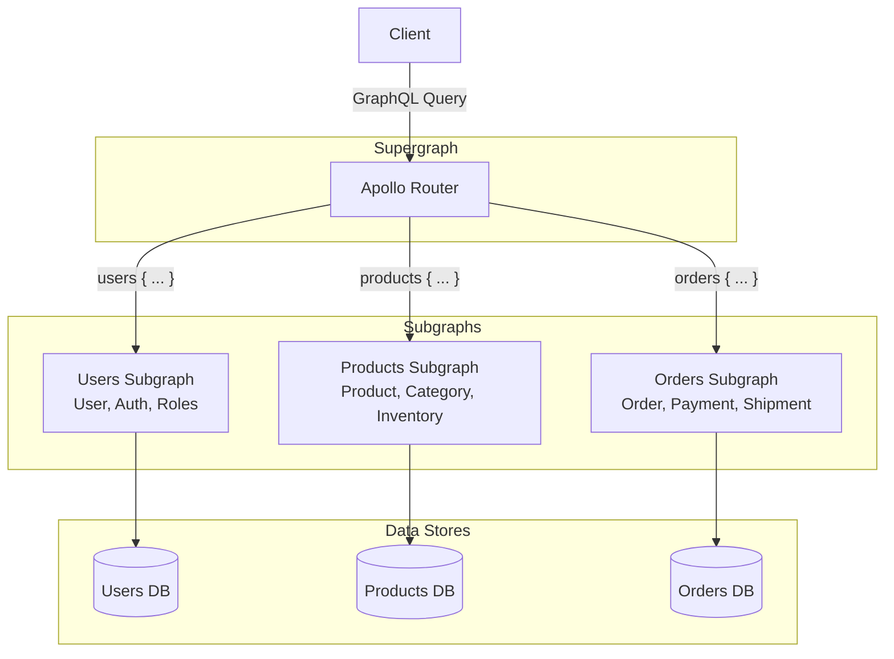
```mermaid
graph TB
    subgraph Supergraph
        R[Apollo Router]
    end

    subgraph Subgraphs
        U[Users Subgraph<br/>User, Auth, Roles]
        P[Products Subgraph<br/>Product, Category, Inventory]
        O[Orders Subgraph<br/>Order, Payment, Shipment]
    end

    subgraph Data Stores
        UDB[(Users DB)]
        PDB[(Products DB)]
        ODB[(Orders DB)]
    end

    C[Client] -->|GraphQL Query| R
    R -->|"users { ... }"| U
    R -->|"products { ... }"| P
    R -->|"orders { ... }"| O
    U --> UDB
    P --> PDB
    O --> ODB
```

> **Think**: Client sends one query requesting user, products, and orders. How many HTTP requests does router make to subgraphs?
>
> *Answer: Depends on query plan. If query requests fields from all three subgraphs, router makes 3 parallel HTTP requests. If query only requests user fields, router makes 1 request to Users subgraph. Router optimizes by batching parallel subgraph calls and avoiding sequential waits when possible.*

---

### Why This Matters

Federation solves organizational scaling: multiple teams own parts of schema without coordination bottleneck. Single schema, autonomous teams, independent deployments. But federation introduces real costs: query planning overhead, operational complexity, debugging difficulty. Decision to federate is organizational, not technical — design subgraph boundaries around team boundaries, not data model.

---

## Examples

### Example 1: E-Commerce Subgraph Split

**Monolith schema:**
```graphql
type Query {
  user(id: ID!): User
  products(category: String): [Product!]!
  order(id: ID!): Order
}
type User { id: ID! name: String! email: String! orders: [Order!]! }
type Product { id: ID! name: String! price: Float! }
type Order { id: ID! user: User! items: [OrderItem!]! total: Float! }
```

**After split into 3 subgraphs:**

`accounts/subgraph.graphql`:
```graphql
type Query { user(id: ID!): User }
type User @key(fields: "id") {
  id: ID! name: String! email: String!
}
```

`products/subgraph.graphql`:
```graphql
type Query { products(category: String): [Product!]! }
type Product @key(fields: "id") @shareable {
  id: ID! name: String! price: Float!
}
```

`orders/subgraph.graphql`:
```graphql
type Query { order(id: ID!): Order }
type User @key(fields: "id") { id: ID! orders: [Order!]! }
type Order @key(fields: "id") {
  id: ID! user: User! items: [OrderItem!]! total: Float!
}
type OrderItem { product: Product! quantity: Int! }
type Product @key(fields: "id") { id: ID! }
```

---

### Example 2: Migration from Monolith to Federation

1. Start: single monolith GraphQL service
2. Extract subgraph: move `User` type to new `accounts` service, keep @key reference
3. Run router in front: Gateway/Router sends User queries to accounts, everything else to monolith
4. Repeat: extract `products`, then `orders`
5. Monolith becomes a subgraph or is retired

```text
Phase 1: [Client] → [Monolith]
Phase 2: [Client] → [Router] → [Monolith + Accounts Subgraph]
Phase 3: [Client] → [Router] → [Accounts + Products + Orders + Monolith remnants]
Phase 4: [Client] → [Router] → [Accounts + Products + Orders]
```

---

## Key Takeaways
- Supergraph = single endpoint; subgraphs = independent GraphQL services; router composes them
- Apollo Router (Rust) for high-throughput; Apollo Gateway (Node.js) for JavaScript ecosystem
- Schema composition merges types, resolves directives, detects conflicts — safe failure on conflict
- @shareable for multi-subgraph fields; @override for migration; @inaccessible for internal fields
- Design subgraph boundaries around DDD bounded contexts, not database tables
- Federation not default — start monolith, extract when team/organization requires separation
- Rover CLI manages subgraph lifecycle: add → check → publish → compose

---

## Common Misconception

**"Federation means microservices — we should federate because microservices are better."**

Wrong direction. Microservices are an organizational pattern; federation is a GraphQL pattern. You federate when teams need independent schema ownership, not because microservices are trendy. A federated monolith (one codebase, one team, but N subgraph schemas) adds complexity without benefit. Conversely, you can have microservices without federation (BFF pattern, REST between services). Federation serves organizational autonomy, not architecture aesthetics.

---

## Feynman Explain

Explain GraphQL federation to a senior backend engineer who knows REST microservices. Focus on: how supergraph differs from API gateway, why subgraphs "own" their domain types, how @key references work across services without shared database access. Max 3 sentences per concept.


---

## Reframe

Critique: "Federation solves the n+1 schema problem (n teams, 1 schema) but introduces the n+1 query problem (n subgraphs, 1 query)." Is the organizational decoupling worth the query planning overhead and operational complexity? What size organization justifies the tradeoff — 2 teams? 5? 10? When does federation create more problems than it solves?

---

## Drill

Take the quiz. MCQs test federation design principles, directives, and when to federate.

Run: `learn.sh quiz graphql-deep-dive 13`

## Quiz: 13-federation-design


## Quiz: 13-federation-design

(quiz parse error: 'str' object has no attribute 'get')


---

# Module 14: Federation Entity Composition

Est. study time: 2.5h
Language: en

## Learning Objectives
- Understand entities and @key as primary keys spanning subgraphs
- Use @external, @requires, @provides for cross-subgraph field dependencies
- Implement __resolveReference entity resolvers
- Distinguish value types from entity types
- Analyze entity resolution flow across subgraph chain

---

## Core Content

### Entities and @key

Entity = type whose identity spans multiple subgraphs. `@key` defines primary key fields that uniquely identify entity across subgraphs.

```graphql
# Accounts subgraph — defines User entity
type User @key(fields: "id") {
  id: ID!
  name: String!
  email: String!
}

# Reviews subgraph — extends User entity
type User @key(fields: "id") {
  id: ID!
  reviews: [Review!]!
}
```

Both subgraphs declare `User` as entity via `@key(fields: "id")`. Composition merges into single `User` type with all fields.

> **Think**: Can an entity have multiple @key directives?
>
> *Answer: Yes. Federation 2 supports multiple @key directives on same type for different lookup strategies. Example: `type User @key(fields: "id") @key(fields: "email")` can be resolved by either id or email. Router chooses based on query context.*

---

### @external Field

Field defined in another subgraph. Subgraph knows field exists but does not resolve it.

```graphql
# Payments subgraph — needs User.email but Accounts resolves it
type User @key(fields: "id") {
  id: ID! @external
  email: String! @external  # Defined by Accounts, but Payments needs it
  payments: [Payment!]!
}
```

@external tells composition: "this field exists somewhere else, I'm just referencing it."

> **Think**: What happens if you forget @external on a field that another subgraph defines?
>
> *Answer: Composition fails with duplicate field error. Federation enforces single-ownership unless @shareable. @external explicitly waives ownership. Without it, composition sees two subgraphs claiming ownership of same field — conflict.*

---

### @requires Field

Entity resolver needs data from another subgraph before resolving. @requires declares dependency.

```graphql
# Shipping subgraph
type Product @key(fields: "sku") {
  sku: ID! @external
  weight: Float! @external
  shippingCost: Float! @requires(fields: "weight")
}
```

Router must fetch `weight` from product-owning subgraph before shipping subgraph can compute `shippingCost`.

> **Think**: Does @requires always trigger a subgraph call?
>
> *Answer: Only if the required fields aren't already in the query context. If client already requested `weight` (fetched from Products subgraph), router passes it to Shipping. If not, router fetches weight first, then calls Shipping subgraph. @requires creates sequential dependency — avoid in latency-sensitive paths.*

---

### @provides Field

Field that a subgraph can resolve without calling another subgraph, even though it's declared as @external.

```graphql
# Reviews subgraph — can resolve Product.name from local data
type Product @key(fields: "upc") {
  upc: String! @external
  name: String! @provides(fields: "name")  # Resolvable without Products subgraph
  reviews: [Review!]
}

extend type Query {
  topRatedProducts: [Product!]! @provides(fields: "name")
}
```

@provides optimizes: router skips subgraph call for provided fields.

> **Think**: When would a subgraph "provide" a field it doesn't own?
>
> *Answer: When subgraph has local copy or can compute the field. Example: Reviews subgraph joins Product.name at write-time in its own DB. No need to call Products subgraph during query. @provides is performance optimization — trade storage/consistency for latency.*

---

### Entity Resolvers: __resolveReference

Each subgraph that extends an entity must implement `__resolveReference` — tells router how to fetch entity by @key.

```python
# Python example (resolver pattern same across languages)
def resolve_user_reference(reference, context):
    # reference = {"__typename": "User", "id": "42"}
    user_id = reference["id"]
    user = db.users.find_by_id(user_id)
    return user
```

```javascript
// Apollo Server entity resolver
const resolvers = {
  User: {
    __resolveReference(ref) {
      return db.users.findByPk(ref.id);
    }
  }
};
```

Router flow:
1. Client queries `{ user(id: "42") { name reviews { rating } } }`
2. Router determines: User.name from Accounts, User.reviews from Reviews
3. Router calls Accounts with `query { user(id: "42") { name __typename id } }`
4. Accounts returns User entity with `id: "42"`
5. Router calls Reviews: `query { _entities(representations: [{__typename: "User", id: "42"}]) { ... on User { reviews { rating } } } }`
6. Reviews' `__resolveReference` looks up user's reviews

> **Think**: Why does router include `__typename` in step 3?
>
> *Answer: Router needs `__typename` to build the entity representation object `{__typename: "User", id: "42"}` sent to other subgraphs. Without type name, destination subgraph doesn't know which entity type's __resolveReference to call.*

---

### Reference Resolution Flow

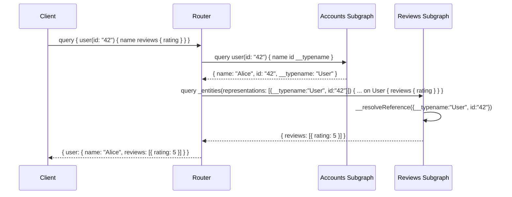
```mermaid
sequenceDiagram
    participant C as Client
    participant R as Router
    participant A as Accounts Subgraph
    participant Rev as Reviews Subgraph

    C->>R: query { user(id: "42") { name reviews { rating } } }
    R->>A: query user(id: "42") { name id __typename }
    A-->>R: { name: "Alice", id: "42", __typename: "User" }
    R->>Rev: query _entities(representations: [{__typename:"User", id:"42"}]) { ... on User { reviews { rating } } }
    Rev->>Rev: __resolveReference({__typename:"User", id:"42"})
    Rev-->>R: { reviews: [{ rating: 5 }] }
    R-->>C: { user: { name: "Alice", reviews: [{ rating: 5 }] } }
```

Steps:
1. Router parses query, builds plan
2. Resolve root fields from owning subgraph (Accounts)
3. Extract entity representations (type + key fields)
4. Call dependent subgraphs (Reviews) with `_entities` query
5. Each subgraph's `__resolveReference` fetches additional data
6. Router merges results into single response

> **Think**: What happens if Reviews subgraph is down during this query?
>
> *Answer: Router returns partial data if configured for partial results: `user.name` from Accounts succeeds, `user.reviews` returns null or error. Client sees partial response. Router can be configured to fail entire query on any subgraph failure (strict mode).*

---

### Value Types vs Entity Types

| Aspect | Value Type | Entity Type |
|--------|-----------|-------------|
| Has @key | No | Yes |
| Identity | No independent existence | Globally identifiable |
| Owned by | One subgraph | Multiple subgraphs |
| Example | Address, Money, Rating | User, Product, Order |
| Subgraph scope | Single subgraph | Cross-subgraph |

```graphql
# Value type — only in Accounts subgraph
type Address {
  street: String!
  city: String!
  zip: String!
}

# Entity type — shared across subgraphs
type User @key(fields: "id") {
  id: ID!
  address: Address!  # Value type embedded in entity
}
```

Value types never appear in `_entities` queries. They're resolved inline by owning subgraph.

> **Think**: Can two subgraphs define the same value type name with different fields?
>
> *Answer: Yes, but composition treats them as separate types internally. If fields match, router merges them. If they differ, router generates distinct names or composition fails depending on conflict. Best practice: value types are single-subgraph-only. If type needs cross-subgraph, make it entity with @key.*

---

### Why This Matters

Entity composition is federation's core mechanism. Without entities, subgraphs would be isolated silos — no cross-subgraph queries possible. @key, @external, @requires, @provides form the language for expressing cross-subgraph data relationships. Understanding entity resolution flow is essential for debugging performance: every __resolveReference call is a network round-trip between router and subgraph.

---

## Examples

### Example 1: User Entity Across 3 Subgraphs

**Accounts subgraph:**
```graphql
type User @key(fields: "id") {
  id: ID!
  name: String!
  email: String!
}
```

**Reviews subgraph:**
```graphql
type User @key(fields: "id") {
  id: ID! @external
  reviews: [Review!]!
}
```

**Payments subgraph:**
```graphql
type User @key(fields: "id"){
  id: ID! @external
  email: String! @external
  @requires(fields: "email")
  paymentMethods: [PaymentMethod!]!
}
```

Client query: `{ user(id: "42") { name reviews { rating } paymentMethods { last4 } } }`

Router plan:
1. Accounts: resolve `user(id: 42)` → get `name`, `id`, `__typename`
2. Reviews: `_entities` with `{__typename: "User", id: "42"}` → `reviews`
3. Payments: `_entities` with `{__typename: "User", id: "42", email: "alice@..."}` → `paymentMethods`

---

### Example 2: @requires Chain

```graphql
# Products subgraph
type Product @key(fields: "sku") {
  sku: ID!
  weight: Float!
  dimensions: Dimensions!
}

type Dimensions { length: Float! width: Float! height: Float! }

# Shipping subgraph
type Product @key(fields: "sku") {
  sku: ID! @external
  weight: Float! @external
  dimensions: Dimensions! @external
  shippingVolume: Float! @requires(fields: "weight dimensions { length width height }")
}
```

Query `{ product(sku: "XYZ") { weight shippingVolume } }`:
1. Router calls Products: `product(sku: "XYZ") { weight dimensions { length width height } sku __typename }`
2. Router calls Shipping: `_entities({__typename: "Product", sku: "XYZ", weight: 2.5, dimensions: {length: 10, width: 5, height: 3}}) { shippingVolume }`
3. Shipping computes `shippingVolume = length * width * height` without calling Products again (router provided nesting)

---

## Key Takeaways
- @key defines entity identity across subgraphs; entities enable cross-subgraph type sharing
- @external declares field owned elsewhere; @requires declares field dependency chain
- @provides optimizes by declaring locally-resolvable external fields
- __resolveReference resolves entity by key fields — every extending subgraph must implement it
- Router builds query plan: resolve root subgraph first, then entity references to other subgraphs
- @requires creates sequential subgraph calls — avoid in hot paths
- Value types are single-subgraph; entity types are cross-subgraph

---

## Common Misconception

**"Entity types are like foreign keys in a relational database."**

Superficially similar but architecturally different. Foreign keys in SQL enable joins at query time across tables. @key enables entity resolution across network boundaries — each subgraph is a separate service with its own database. There is no shared database, no cross-subgraph JOIN, no direct table access. The router performs the "join" by orchestrating subgraph calls, but each subgraph resolves its portion independently. @key is a service-boundary primitive, not a data-modeling primitive.

---

## Feynman Explain

Explain entities, @key, and __resolveReference to a backend engineer who knows REST microservices and inter-service communication patterns. Focus on: how __resolveReference is analogous to a "GET /users/:id" endpoint but for GraphQL type resolution, and why entity resolution requires two-phase: root fetch + reference resolution. Max 3 sentences per concept.


---

## Reframe

Critique: "Entity composition turns one GraphQL query into N+1 subgraph requests (1 root query + N entity resolution calls)." Is the convenience of cross-subgraph querying worth the network overhead? When should entity composition be avoided in favor of client-side orchestration (client makes N queries)? What query patterns trigger dangerously deep resolve chains?

---

## Drill

Take the quiz. MCQs test entity resolution flow, @key variants, @external/@requires/@provides usage.

Run: `learn.sh quiz graphql-deep-dive 14`

## Quiz: 14-federation-entity-composition


## Quiz: 14-federation-entity-composition

(quiz parse error: 'str' object has no attribute 'get')


---

# Module 15: Federation Cross-Cutting

Est. study time: 2.5h
Language: en

## Learning Objectives
- Implement auth in federated graph using @authenticated, @requiresScopes, JWT propagation
- Handle partial subgraph failure and error propagation to clients
- Apply schema governance with change validation and breaking change detection
- Use strangler fig pattern for gradual monolith-to-federation migration
- Optimize query planning and subgraph call batching for performance
- Test federated graph with contract tests and integration tests

---

## Core Content

### Authentication in Federated Graph

Federation provides cross-cutting auth directives at supergraph level:

```graphql
extend type Query {
  adminDashboard: Dashboard! @authenticated
}

type Mutation {
  deleteUser(id: ID!): Boolean! @authenticated @requiresScopes(scopes: ["admin"])
}

type User @key(fields: "id") {
  id: ID!
  ssn: String! @inaccessible  # Hidden from supergraph entirely
  email: String!              # Accessible to authenticated users only via router policy
}
```

**JWT flow across subgraphs:**

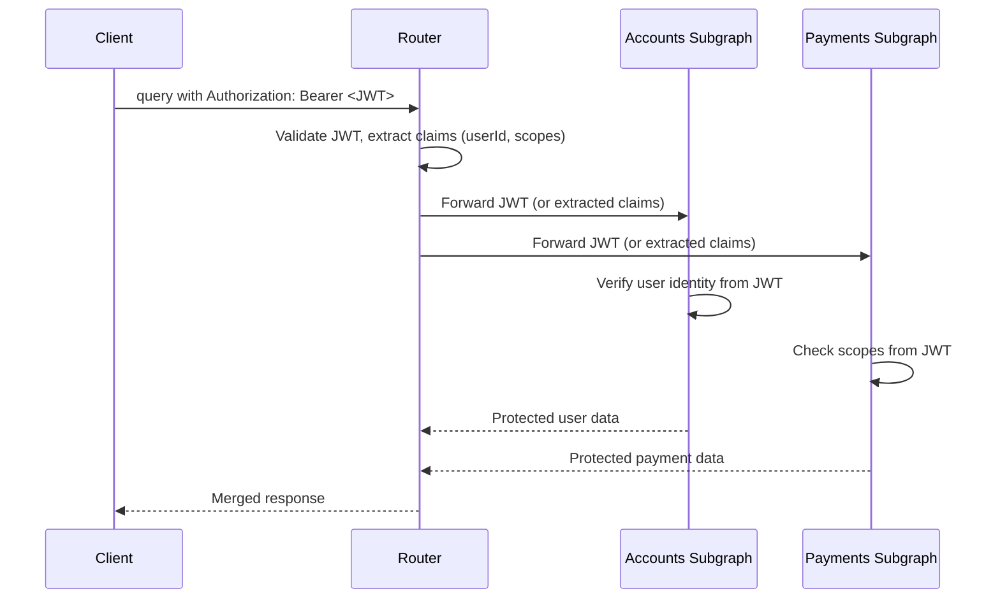
```mermaid
sequenceDiagram
    participant C as Client
    participant R as Router
    participant A as Accounts Subgraph
    participant P as Payments Subgraph

    C->>R: query with Authorization: Bearer <JWT>
    R->>R: Validate JWT, extract claims (userId, scopes)
    R->>A: Forward JWT (or extracted claims)
    R->>P: Forward JWT (or extracted claims)
    A->>A: Verify user identity from JWT
    P->>P: Check scopes from JWT
    A-->>R: Protected user data
    P-->>R: Protected payment data
    R-->>C: Merged response
```

Router validates JWT once. Can forward raw JWT to subgraphs or inject extracted claims into subgraph context (e.g., `X-User-ID`, `X-Scopes` headers).

> **Think**: Router validates JWT. Why should subgraphs also validate?
>
> *Answer: Defense in depth. Subgraphs might be accessed directly (non-federated path). Router validation prevents unauthorized requests at gateway level; subgraph validation catches internal misuse. Also, router may be misconfigured — trust no single layer.*

---

**@authenticated** — requires valid JWT (any authenticated user).
**@requiresScopes** — requires specific OAuth2 scopes.

```graphql
type Mutation @authenticated {
  # All mutations require auth
  createPost(input: CreatePostInput!): Post!
  deletePost(id: ID!): Boolean!
}

type Query {
  publicFeed: [Post!]!
  adminStats: Stats! @requiresScopes(scopes: ["admin"])
}
```

> **Think**: @requiresScopes("admin") — does router check scopes or subgraph?
>
> *Answer: Router checks scopes before forwarding to subgraph. If client lacks scopes, router rejects without calling subgraph. Better latency (fail fast) and security (subgraph never touched by unauthorized request). Subgraph still validates as defense layer.*

---

### Error Handling: Partial Subgraph Failure

Subgraphs fail independently. Router must decide: fail all or return partial data?

```json
// Partial success response
{
  "data": {
    "user": {
      "name": "Alice",
      "reviews": null
    }
  },
  "errors": [
    {
      "message": "Reviews subgraph returned an error",
      "path": ["user", "reviews"],
      "extensions": {
        "code": "SUBGRAPH_ERROR",
        "service": "reviews"
      }
    }
  ]
}
```

**Router error modes:**

| Mode | Behavior | Use case |
|------|----------|----------|
| `partial` | Return successful subgraph data, null for failed | Dashboard where partial data acceptable |
| `strict` | Fail entire request if any subgraph fails | Transactional queries where partial data misleading |
| `custom` | Router Rhai/WASM plugin custom logic | Complex error handling per type |

Subgraph error propagation. Subgraphs return errors in standard GraphQL error format. Router includes them in response with subgraph identifier.

> **Think**: Bank transfer query reads from Accounts (balance) and Payments (transfer status). Which error mode?
>
> *Answer: Strict mode. Showing account balance but failing to show transfer status is misleading — user might think transfer didn't happen. Partial would be dangerous. For read-only dashboards, partial is fine.*

---

### Schema Governance

Breaking change detection prevents schema modifications that break existing clients.

```bash
# CI pipeline step
rover subgraph check my-graph@current \
  --name accounts \
  --schema ./accounts/schema.graphql
```

**Breaking changes detected:**
- Removing a field or type
- Making a non-null field nullable (clients expect String!, get null → crash)
- Removing a value from enum
- Changing field type
- Adding required argument to existing field
- Removing @key from entity

**Safe changes:**
- Adding new type or field
- Adding optional argument
- Making nullable field non-null (if always non-null at runtime)
- Adding new enum value
- Adding @shareable to existing field

```yaml
# .graphqlrc.yml — schema governance config
schema:
  - ./subgraphs/*/schema.graphql
extensions:
  apollo:
    graph: my-graph
    variant: current
    validation:
      rules:
        - no-breaking-changes
        - no-inaccessible-type-count-increase
```

> **Think**: Why is removing an enum value breaking but adding one is safe?
>
> *Answer: Client code may switch on enum values. Removing a value means existing client code references a value that no longer exists → runtime error. Adding a new value: existing client code doesn't reference it → no breakage. Enum stability is critical for GraphQL schemas.*

---

### Gradual Adoption: Strangler Fig Pattern

Migrate monolith to federation without rewriting everything:

```text
Phase 1: Monolith
[Client] → [Monolith GraphQL]

Phase 2: Coexistence
[Client] → [Router] → [Monolith (as subgraph)]

Phase 3: Extract first subgraph
[Client] → [Router] → [Monolith + Accounts Subgraph]
                        Router: User queries → Accounts
                        Everything else → Monolith

Phase 4: Extract more
[Client] → [Router] → [Accounts + Products + Orders + Monolith rest]

Phase 5: Full migration
[Client] → [Router] → [Accounts + Products + Orders + Reviews]
                        (Monolith gone)
```

Key principle: router delegates simple queries to new subgraphs, complex queries to monolith. Gradually shift boundaries.

```graphql
# Phase 2: Router config routes User queries to Monolith
# Phase 3: Change Router config — User queries to Accounts subgraph
# No client changes needed
```

> **Think**: During phase 3, how do you ensure data consistency between monolith and new Accounts subgraph?
>
> *Answer: Dual-write during migration. Writes go to both monolith and Accounts. Read from Accounts. After verification period, stop writing to monolith's user data. Rollback: switch Router back to monolith for User queries. No data loss.*

---

### Performance: Query Planning Overhead

Every federated query requires query planning — router must decide which subgraphs to call and in what order.

**Query planning cost:**
- Simple query (1 subgraph): ~100μs planning
- Cross-subgraph query (3 subgraphs): ~500μs planning
- Complex query with @requires chains: ~2ms planning

**Optimization techniques:**

1. **Cached query plans**: Same query → same plan. Cache by query shape.
```yaml
# Router config
limits:
  query_plan_cache_size: 1000  # Cache 1000 plans
```

2. **Subgraph call batching**: Router batches entity resolution.
```text
Instead of N individual _entities calls for N users:
_entities(representations: [User:1, User:2, User:3]) { ... on User { name } }
```

3. **@provides**: Reduce subgraph hops by annotating locally-resolvable fields.

4. **Persisted queries**: Bypass query planning entirely for known queries.

> **Think**: 2ms query planning for a 100ms query — is it worth optimizing?
>
> *Answer: No — 2ms is 2% overhead. Optimize when query planning >10% of total latency. For high-throughput APIs (10k+ req/s), every microsecond matters. For typical APIs, focus on subgraph latency first — query planning usually isn't bottleneck.*

---

### Testing Federated Graph

**Subgraph contract tests**: each subgraph independently tested with contract (expected supergraph behavior).

```python
# Contract test for Accounts subgraph
def test_user_contract():
    """Accounts must satisfy User entity contract"""
    schema = load_schema("accounts/schema.graphql")
    
    # Assert @key exists
    assert has_directive(schema, "User", "key")
    
    # Assert required fields
    user_type = schema.get_type("User")
    assert "id" in user_type.fields
    assert "name" in user_type.fields
    
    # Assert __resolveReference works
    result = execute_query("""
        query { _entities(representations: [{__typename: "User", id: "1"}]) 
                { ... on User { name } } }
    """)
    assert result.data["_entities"][0]["name"] is not None
```

**Integration tests**: spin up router + all subgraphs (or mocks).

```python
def test_cross_subgraph_query():
    """User with reviews — spans 2 subgraphs"""
    result = router.execute("""
        query { user(id: "1") { name reviews { rating } } }
    """)
    assert result.data["user"]["name"] == "Alice"
    assert len(result.data["user"]["reviews"]) > 0
```

**Contract testing tools:**
- Apollo Studio: schema checks + operation checks
- GraphQL-Inspector: schema diff and breaking change detection
- Custom: subgraph boundary validation scripts

> **Think**: What's the minimum viable federated graph test suite?
>
> *Answer: (1) Each subgraph must have contract tests for entity types it extends. (2) One integration test per cross-subgraph query. (3) Schema check in CI (rover subgraph check). This catches: missing @key, wrong __resolveReference, breaking changes, and major cross-subgraph failures.*

---

### Workflow: Isolated Dev vs Supergraph-First

**Isolated subgraph dev:** Each subgraph team develops independently using mock supergraph.

```text
Dev A: works on Accounts subgraph with local supergraph compose
Dev B: works on Reviews subgraph with local supergraph compose
CI: integration test with all actual subgraphs
```
Pros: teams don't block each other. Cons: integration surprises.

**Supergraph-first:** All teams share a dev supergraph instance.

```text
All devs: push schema → shared dev supergraph → test against real subgraphs
```
Pros: catches integration issues early. Cons: breaking changes affect everyone.

**Recommendation:** Hybrid. Isolated dev for local iteration. Supergraph-first for CI/CD. Staging supergraph mirrors production.

> **Think**: 10 teams each running local supergraph compose — how many Rufus instances?
>
> *Answer: 10 (one per team) but that's fine. Supergraph compose is lightweight (ms). CI runs 1 integration supergraph. The issue is schema drift between dev environments — teams may deploy schemas that look compatible locally but conflict in CI. Solution: contract tests that validate against published supergraph version.*

---

### Why This Matters

Federation's cross-cutting concerns determine whether it's viable in production. Auth, error handling, governance, migration, performance, testing — each is a potential failure point. Teams often succeed at federation design (Module 13) and entity composition (Module 14) but fail at cross-cutting. A perfectly composed supergraph is useless if auth leaks data across subgraphs, or migration breaks existing queries, or performance degrades under load.

---

## Examples

### Example 1: Auth Propagation Policy

```yaml
# Router YAML config
authentication:
  jwt:
    jwks_url: https://auth.example.com/.well-known/jwks.json
    claims:
      - key: sub
        source: subgraph
        header: X-Auth-User-Id
    require_auth: true

authorization:
  requires_authentication: true
  scopes:
    header: X-Auth-Scopes
    required: false

headers:
  all_rules:
    - action: forward
      name: Authorization
    - action: insert
      name: X-Auth-User-Id
      value_from: jwt.sub
    - action: insert
      name: X-Auth-Scopes
      value_from: jwt.scopes
```

Each subgraph receives `X-Auth-User-Id` and `X-Auth-Scopes` headers. Subgraphs trust these headers (router-to-subgraph channel is secured).

---

### Example 2: Migration Strangler Fig — Actual Configs

**Phase 2 (Monolith as subgraph):**
```yaml
# supergraph.yaml
subgraphs:
  monolith:
    routing_url: http://monolith/graphql
    schema:
      file: ./schemas/monolith.graphql
```

**Phase 3 (Extract Accounts):**
```yaml
subgraphs:
  accounts:
    routing_url: http://accounts/graphql
    schema:
      file: ./schemas/accounts.graphql
  monolith:
    routing_url: http://monolith/graphql
    schema:
      file: ./schemas/monolith.graphql
```

Router checks query — if User fields, route to `accounts`. If other fields, route to `monolith`. No monolith code changes needed.

---

## Key Takeaways
- @authenticated and @requiresScopes enforce auth at router level; subgraphs validate as defense layer
- Partial subgraph failure configurable: partial mode for dashboards, strict mode for transactional queries
- Schema governance with rover subgraph check catches breaking changes before deploy
- Strangler fig pattern migrates monolith to federation without rewrite — dual-write for data consistency
- Query planning overhead < 10% of latency in most cases; cache plans and use @provides for optimization
- Test each subgraph independently (contract tests) + integration tests for cross-subgraph queries
- Hybrid workflow: isolated local dev, supergraph-first CI/CD, staging mirrors production

---

## Common Misconception

**"Federation handles auth — I don't need auth in subgraphs."**

Wrong. Router-level auth is convenience, not security boundary. Subgraphs must independently validate auth for defense in depth. Router might be bypassed (direct subgraph access for debugging), misconfigured (wrong JWT validation), or compromised (attacker controls router). Each subgraph should treat incoming requests as untrusted and verify claims. JWT validation in every subgraph is cheap; a data breach from missing subgraph auth is expensive.

---

## Feynman Explain

Explain federated auth, error propagation, and strangler fig migration to a backend engineer who knows monolithic GraphQL. Focus on: why JWT must be validated at both router and subgraph, how partial error mode differs from REST API error handling, and why strangler fig lets you migrate without "the big rewrite." Max 3 sentences per concept.


---

## Reframe

Critique: "Federation cross-cutting concerns (auth, error handling, governance) add so much complexity that a simpler architecture would be more reliable." Is federation's cross-cutting complexity justified? When does the governance overhead of schema checks, contract tests, and auth propagation outweigh the benefit of team autonomy? Could a well-structured monolith with strict code ownership rules achieve the same organizational decoupling with less operational complexity?

---

## Drill

Take the quiz. MCQs test auth, error handling, governance, migration, performance, testing, and workflow tradeoffs.

Run: `learn.sh quiz graphql-deep-dive 15`

## Quiz: 15-federation-cross-cutting


## Quiz: 15-federation-cross-cutting

(quiz parse error: 'str' object has no attribute 'get')


---

# Module 16: REST vs GraphQL vs RPC: Data Fetching

Est. study time: 2h
Language: en

## Learning Objectives
- Compare over-fetching, under-fetching, and contract rigidity across REST, GraphQL, and RPC
- Evaluate data-fetching tradeoffs using a concrete dashboard scenario
- Choose appropriate API style based on data shape, batching needs, and versioning strategy

---

## Core Content

### Over-Fetching

Over-fetching occurs when server returns more data than client needs.

- **REST**: Returns entire resource representation. Client receives all fields even when it needs one. `/users/1` returns `{id, name, email, avatar, createdAt, updatedAt, role, status, ...}` — dashboard only needs `name` and `avatar`.
- **GraphQL**: Client selects exact fields. Query `user(id:1) { name avatar }` returns exactly those two fields.
- **RPC**: Sends exactly what function signature specifies. `getUserName(id) → string`. Minimal by design, but rigid — adding new field requires changing procedure contract.

> **Think**: Why does over-fetching matter beyond bandwidth? Consider CPU, memory, DB query cost.
>
> *Answer: Over-fetching wastes server CPU/memory serializing unused data, DB reads fetching unused columns, and client memory parsing/discarding fields. In microservice architectures, over-fetching compounds across service calls — each hop carries dead weight.*

---

### Under-Fetching / Waterfall

Under-fetching occurs when one client operation requires multiple server round trips.

- **REST**: N resources = N requests. Dashboard needs user + orders + products: 3 sequential GETs (or 1 + 2 parallel if IDs known). Each request = HTTP overhead (DNS, TLS, headers, latency).
- **GraphQL**: One request, one response. Server resolves all fields in parallel via resolver tree. Client sends one query, server walks type system.
- **RPC**: Depends on server composition. Can require sequential calls if procedures are granular. Often needs BFF (Backend for Frontend) or aggregation layer.

```text
REST waterfall:
GET /users/1          ──┐
GET /users/1/orders   ◄─┘
GET /orders/42/items  ◄─┘

GraphQL single round-trip:
POST /graphql         ──┐
  user(id:1) {          │
    orders { items }    │
  }                     │
{ "data": { ... } }   ◄─┘
```

> **Think**: Does under-fetching matter more for mobile or desktop apps? Why?
>
> *Answer: Mobile. Higher latency (cellular), bursty connectivity, battery drain from radio wake-ups. Each additional HTTP round trip costs 100-500ms on 3G/4G. GraphQL's single-round-trip model is disproportionately beneficial on mobile.*

---

### Contract Rigidity

How each API style handles schema evolution:

- **REST**: Versioning via URL (`/v2/users`), header (`Accept: application/vnd.api.v2+json`), or query param (`?v=2`). Backward-incompatible changes require new endpoint. Old endpoints persist — codebase grows.
- **GraphQL**: Add new fields/types without breaking. Deprecate old fields via `@deprecated`. Clients migrate at own pace. No version numbers — the schema is always the current contract.
- **RPC** (gRPC): Proto versioning. `package v1;` vs `package v2;`. Services run side-by-side. Field numbers must never be reused (proto3 `reserved` keyword). Breaking changes = new package.

> **Think**: GraphQL claims "no versioning." Is this truly versionless or hidden versioning?
>
> *Answer: Hidden versioning. Every client pins a query. The schema evolves, but old queries still work because new fields are additive. This is backward-compatible evolution, not versionlessness. A breaking change (removing field) still needs migration. The difference: clients opt-in to new fields rather than being forced to upgrade endpoints.*

---

### Data Shape: Who Defines It?

| Aspect | REST | GraphQL | RPC |
|--------|------|---------|-----|
| Shape owner | Server (resource representation) | Client (field selection) | Function signature |
| Flexibility | Low — change needs new endpoint | High — client shapes response per query | Very low — shape tied to fn contract |
| Predictability | High — same URL = same shape | Medium — shape varies by query | High — fn always returns same type |
| Self-documenting | Swagger/OpenAPI | Introspection + SDL | Proto files / IDL |

---

### Batching

- **REST**: Batch endpoints (`POST /batch`, `GET /users?id=1,2,3`). Ad-hoc, no standard. HTTP pipelining limited.
- **GraphQL**: Query batching via alias or `__typename` discrimination. `@defer` (draft) for streaming. Persisted queries reduce overhead.
- **RPC** (gRPC): Streaming (server-stream, client-stream, bidirectional). HTTP/2 multiplexing — multiple calls over single connection. No batching needed per se; streams handle it.

> **Think**: Is batching always beneficial? When is it harmful?
>
> *Answer: Batching helps when latency dominates (many small requests) but hurts when: (1) one slow item holds entire batch response, (2) error handling complex (partial success), (3) cache utilization drops (batched URL less cacheable than individual URLs).*

---

### Versioning Strategies

| Strategy | REST | GraphQL | gRPC |
|----------|------|---------|------|
| URL version | `/v2/users` | N/A | N/A |
| Header version | `Accept: vnd.api.v2` | N/A | N/A |
| Field deprecation | N/A | `@deprecated(reason:)` | N/A |
| Proto package | N/A | N/A | `package v2;` |
| Side-by-side | Multiple endpoints | One schema, evolve | Multiple services |
| Client migration | Forced (old endpoint removed) | At client pace (opt-in) | Coordinated (package rename) |

---

### Real-World Scenario: Dashboard

**Context**: Build admin dashboard showing user profile, recent orders, and product recommendations.

**REST approach**:
```text
1. GET /users/42             → user data (over-fetch: email, role, timestamps unused)
2. GET /users/42/orders?limit=5  → orders
3. For each order, GET /orders/{id}/items  → line items (N+1 waterfall)
4. GET /products/recommended?user=42  → recommendations
Total: 4+ requests, ~800ms-2s
Payload: ~12KB received, ~4KB needed (67% over-fetch)
```

**GraphQL approach**:
```graphql
query Dashboard($userId: ID!) {
  user(id: $userId) {
    name
    avatar
    orders(limit: 5) {
      id
      status
      total
      items { product { name } quantity }
    }
    recommendations {
      id
      name
      price
    }
  }
}
```
```text
Total: 1 request, ~150-300ms
Payload: ~3.5KB (exact fields)
```

**RPC approach**:
```text
rpc GetUser(id) → User
rpc GetOrders(userId, limit) → Orders
rpc GetOrderItems(orderId) → Items
rpc GetRecommendations(userId) → Products
```
```text
Total: 4 RPC calls (can be parallelized if IDs known upfront)
Requires BFF layer to aggregate calls
Payload: minimal per call, but header overhead per call
```

> **Think**: Could the REST team reduce to 2 requests by embedding orders in user response? What's the tradeoff?
>
> *Answer: Yes — embed `orders` in `GET /users/42?include=orders`. Tradeoff: (1) every user response now carries orders payload even when not needed (over-fetch), (2) caching granularity coarsens (user + orders cached as one blob, invalidate together), (3) API surface grows for every relation inclusion. This is how JSON:API works, but it's still server-defined inclusion, not client-selected fields.*

---

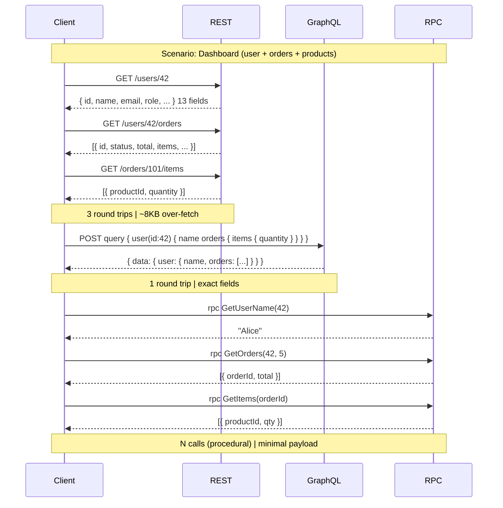
```mermaid
sequenceDiagram
    participant Client
    participant REST
    participant GraphQL
    participant RPC
    
    Note over Client,RPC: Scenario: Dashboard (user + orders + products)
    
    Client->>REST: GET /users/42
    REST-->>Client: { id, name, email, role, ... }  13 fields
    Client->>REST: GET /users/42/orders
    REST-->>Client: [{ id, status, total, items, ... }]
    Client->>REST: GET /orders/101/items
    REST-->>Client: [{ productId, quantity }]
    Note over Client,REST: 3 round trips | ~8KB over-fetch
    
    Client->>GraphQL: POST query { user(id:42) { name orders { items { quantity } } } }
    GraphQL-->>Client: { data: { user: { name, orders: [...] } } }
    Note over Client,GraphQL: 1 round trip | exact fields
    
    Client->>RPC: rpc GetUserName(42)
    RPC-->>Client: "Alice"
    Client->>RPC: rpc GetOrders(42, 5)
    RPC-->>Client: [{ orderId, total }]
    Client->>RPC: rpc GetItems(orderId)
    RPC-->>Client: [{ productId, qty }]
    Note over Client,RPC: N calls (procedural) | minimal payload
```

---

### Why This Matters

Choosing API style is not academic — it directly affects page load time, server costs, developer productivity, and mobile battery life. A bad choice compounds: teams invest years building on a data-fetching model that fights their use cases. Understanding tradeoffs equips you to make intentional architectural decisions rather than cargo-culting trends.

---

## Examples

### Example 1: Social Feed Migration

**Scenario**: Mobile team switches from REST to GraphQL for a social feed. Each feed load shows posts, author avatars, like counts, and comments.

**REST**: 1 feed endpoint + N author endpoints + N comment endpoints = O(N) requests. 60th-percentile load time: 3.2s on 4G.

**GraphQL**: One query joins all. 60th-percentile load time: 0.8s. 75% reduction in load time. Server cost per request halves (no repeated auth checks on each resource endpoint).

**Tradeoff**: GraphQL server now has more complex resolver logic. Query analysis needed to prevent abusive queries. Schema design requires more up-front thought.

---

### Example 2: Internal Microservice Communication

**Scenario**: Two backend services communicate — Order Service needs product details from Catalog Service.

**RPC** (gRPC): Service A calls `GetProduct(id)` — returns exactly what needed, strongly typed, low latency via HTTP/2. Bidirectional streaming for bulk sync.

**GraphQL**: Overkill for service-to-service. Adds query parsing overhead, schema negotiation, no streaming benefits.

**REST**: Works but adds serialization overhead per call. Waterfall if Service A needs product + inventory + pricing.

**Verdict**: gRPC best for internal service mesh. GraphQL for client-facing. REST for simple CRUD with low coupling.

---

## Key Takeaways
- Over-fetching wastes bandwidth, CPU, and memory — worst in REST, eliminated in GraphQL and RPC
- Under-fetching causes waterfall requests — GraphQL solves this with single round trip
- REST versioning accumulates endpoints; GraphQL avoids versions via additive evolution; gRPC uses proto packages
- Data shape is server-defined in REST, client-driven in GraphQL, function-defined in RPC
- Batching helps latency but hurts cache granularity and partial-failure handling
- Dashboard scenarios demonstrate 2-4x reduction in requests and payload with GraphQL vs REST
- No single best API style — context determines the right choice (mobile → GraphQL, internal → gRPC, simple CRUD → REST)

## Common Misconception

**"GraphQL is always faster than REST."**

False. GraphQL reduces requests but increases server-side complexity per request. For simple CRUD (one resource, few fields), REST can outperform GraphQL due to lower overhead (no query parsing, no resolver tree walks, direct HTTP caching). GraphQL's advantage is not raw speed — it's precision and reduced waterfall. Measured by time-to-first-byte for complex UIs, GraphQL wins. For a single `GET /users/1`, REST is faster.

---

## Feynman Explain

Explain the difference between over-fetching and under-fetching to a junior developer who has only used REST. Use the dashboard scenario: user profile, orders, and products. Show how REST creates both problems, GraphQL solves both, and RPC solves only over-fetching (not waterfall). Use 2 sentences per concept.


---

## Reframe

Critique: "GraphQL is just a marketing term for letting clients write their own SQL." Defenders say GraphQL prevents N+1 and over-fetching. Critics say it shifts complexity from network to server. Which API style would you pick for a public API with thousands of unknown clients consuming diverse data shapes? Why?

---

## Drill

Take the quiz. MCQs test recall, comparison, and scenario-based decision-making.

Run: `learn.sh quiz graphql-deep-dive 16`

## Quiz: 16-rest-vs-graphql-vs-rpc-data-fetching


## Quiz: 16-rest-vs-graphql-vs-rpc-data-fetching

(quiz parse error: 'str' object has no attribute 'get')


---

# Module 17: REST vs GraphQL vs RPC: Error & Caching

Est. study time: 2h
Language: en

## Learning Objectives
- Compare error models: HTTP status codes vs errors[] payload vs gRPC status codes
- Evaluate caching semantics and invalidation strategies across REST, GraphQL, and gRPC
- Analyze authentication models and ecosystem maturity for each API style

---

## Core Content

### Error Models

How each style communicates failures:

**REST**: HTTP status codes carry meaning.
```text
200 OK          — success
201 Created     — resource created
400 Bad Request — malformed input
401 Unauthorized — missing/invalid auth
403 Forbidden   — authenticated but no permission
404 Not Found   — resource doesn't exist
409 Conflict    — version conflict or duplicate
429 Too Many Requests — rate limited
500 Internal Server Error — server fault
```

Problem: Status codes are coarse. A 400 could mean missing field, wrong type, validation failure, or semantic error. Body carries details but client must parse non-standard error shapes.

> **Think**: What happens when a REST endpoint partially succeeds? Example: batch create users, first succeeds, second fails.
>
> *Answer: REST has no standard partial-success model. Options: return 200 with per-item status in body (misleading), return 207 Multi-Status (WebDAV, rarely supported), or return 409 and fail the entire batch. None are clean.*

**GraphQL**: Always returns 200 HTTP. Errors live in `errors[]` array.
```json
{
  "data": {
    "user": null,
    "orders": [{ "id": "1", "total": 29.99 }]
  },
  "errors": [
    {
      "message": "Database connection timeout",
      "path": ["user"],
      "extensions": {
        "code": "DB_TIMEOUT",
        "retryAfter": 5
      }
    }
  ]
}
```

Key insight: Partial success is the default. Some fields resolve, others error. `data` contains everything that succeeded; `errors` explain failures. Client decides how to render partial data.

**gRPC**: Uses status codes (gRPC-specific, distinct from HTTP).
```text
OK (0)            — success
InvalidArgument (3)  — bad input
NotFound (5)      — resource missing
PermissionDenied (7) — auth failure
Unavailable (14)  — service down
DeadlineExceeded (4) — timeout
```

Status codes are strongly typed, well-documented, and supported by automatic retry/backoff in client libraries. Streaming adds per-message errors via `onError` callback.

> **Think**: Why does GraphQL return HTTP 200 even on errors? Is this good or bad for monitoring?
>
> *Answer: Good for GraphQL semantics (partial success is normal), bad for operational monitoring. Load balancers, CDNs, and alerting systems treat 5xx as failures. GraphQL requires monitoring errors[] content, not HTTP status. This is a known operational pain point — teams must add middleware to track error rates from response body, not status codes.*

---

### Partial Success

| Scenario | REST | GraphQL | gRPC |
|----------|------|---------|------|
| Batch create, one fails | No standard model | Some succeed, error for failed | Stream per-item response with error for failed |
| Resolver calls external API, times out | Entire request fails | Single field null + error | Single request fails |
| Auth fails mid-query | N/A (auth checked per-endpoint) | Auth-checked resolver returns null for unauthorized | Interceptor fails with PermissionDenied |

---

### Caching Semantics

**REST**: GET requests are cacheable by design.
- HTTP caching: `Cache-Control`, `ETag`, `Last-Modified` headers
- Browsers cache GET responses automatically
- CDNs cache by URL — `GET /users/42` caches as key `/users/42`
- Server can invalidate via `Cache-Tag` headers or URL purging

**GraphQL**: POST requests (default) are not cacheable.
- Most GraphQL implementations POST (queries can be large, GET has URL length limits)
- HTTP cache sees POST — does not cache
- Solutions: persisted queries via GET, automatic persisted queries (APQ), Apollo cache-hydration, or CDN-level query whitelisting
- Challenge: same URL (same mutation) can have different meaning — caching is semantic, not URL-based

**gRPC**: Not cacheable at protocol level.
- HTTP/2 POST with binary payload — CDNs don't parse
- No standard response caching
- Solutions: client-side caching, dedicated cache service (e.g., Redis between services)

> **Think**: Can you make GraphQL queries cacheable via GET? What's the tradeoff?
>
> *Answer: Yes — use persisted queries (query stored server-side, send hash via GET /graphql?hash=abc123). Tradeoff: loses ad-hoc query flexibility, requires build-time registration. Alternative: automatic persisted queries (APQ) send hash first, query on miss. Tradeoff: extra round trip on first request per client.*

---

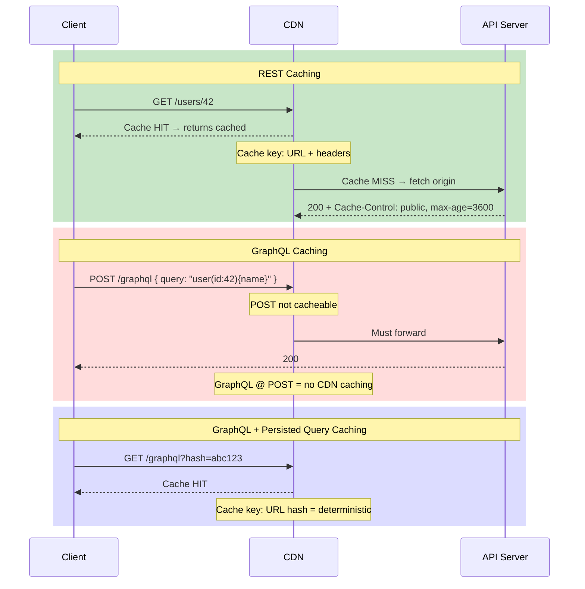
```mermaid
sequenceDiagram
    participant Client
    participant CDN
    participant API as API Server
    
    rect rgb(200, 230, 200)
    Note over Client,API: REST Caching
    Client->>CDN: GET /users/42
    CDN-->>Client: Cache HIT → returns cached
    Note over CDN: Cache key: URL + headers
    CDN->>API: Cache MISS → fetch origin
    API-->>CDN: 200 + Cache-Control: public, max-age=3600
    end
    
    rect rgb(255, 220, 220)
    Note over Client,API: GraphQL Caching
    Client->>CDN: POST /graphql { query: "user(id:42){name}" }
    Note over CDN: POST not cacheable
    CDN->>API: Must forward
    API-->>Client: 200
    Note over CDN: GraphQL @ POST = no CDN caching
    end
    
    rect rgb(220, 220, 255)
    Note over Client,API: GraphQL + Persisted Query Caching
    Client->>CDN: GET /graphql?hash=abc123
    CDN-->>Client: Cache HIT
    Note over CDN: Cache key: URL hash = deterministic
    end
```

---

### Cache Invalidation

| Strategy | REST | GraphQL | gRPC |
|----------|------|---------|------|
| Mechanism | URL-based purging | Complex — many queries return same data | Not commonly cached |
| Granularity | Per-resource URL | Per-query (queries with different fields for same entity) | N/A |
| Real-time | Webhooks, cache tags | Subscriptions + cache update | N/A |
| Complexity | Low | High — needs normalized cache (Apollo, Relay) | Low (no caching) |

> **Think**: Why is cache invalidation harder for GraphQL? What normalized caching solution addresses it?
>
> *Answer: In REST, `PATCH /users/42` directly maps to cache key `/users/42`. In GraphQL, a user update affects every query that includes User fields — `users { name }`, `user(id:42) { name email }`, `search(term:"alice") { ... user { name } }`. Normalized caches (Apollo Client, Relay) split query results into entity store by `__typename` + `id`. Invalidating entity auto-refreshes all queries that reference it.*

---

### Auth Models

| Aspect | REST | GraphQL | gRPC |
|--------|------|---------|------|
| Token transport | `Authorization: Bearer` header | Context-based (resolver reads auth context) | Interceptor attaches metadata |
| Scope granularity | Per-endpoint | Per-field | Per-RPC |
| Common pattern | JWT in header, validated in middleware | JWT decoded, user injected into GraphQL context | JWT in metadata, validated in interceptor |
| Middleware | Middleware checks per route | Auth directive on schema fields | Interceptor chain |

---

### Ecosystem Maturity

| Tool | REST | GraphQL | gRPC |
|------|------|---------|------|
| Documentation | Swagger/OpenAPI + ReDoc | GraphiQL + Apollo Sandbox | protoc + protoc-gen-doc |
| Testing | Postman, Insomnia, curl | Apollo Studio, Altair, Hoppscotch | grpcurl, grpc_cli |
| Codegen | OpenAPI Generator, Fern | GraphQL Codegen | protoc + language-specific plugin |
| Standards | OpenAPI 3.x, JSON:API, HAL | GraphQL over HTTP spec | gRPC spec + protobuf |
| Monitoring | Standard HTTP metrics (status, latency) | Custom metrics (query depth, cost, resolver time) | Standard gRPC metrics per RPC |

---

### Real-World Comparison Table

| Criterion | REST | GraphQL | gRPC |
|-----------|------|---------|------|
| Error granularity | Status code + body | errors[] with path/extensions | gRPC status code + details |
| Partial success | Poor | Native | Stream-based |
| CDN cacheability | Excellent (GET) | Poor (POST default) | None |
| Cache invalidation | Simple URL-based | Complex (normalized) | N/A |
| Auth complexity | Low (header middleware) | Medium (context plumbing) | Medium (interceptors) |
| Tooling maturity | Very high | High | Medium |
| Learning curve | Low | Medium | High (proto IDL) |

---

### Why This Matters

Error handling and caching determine operational reliability. REST's simple status codes become insufficient for complex operations. GraphQL's 200-for-errors pattern requires tooling changes. Caching strategy directly impacts latency, cost, and scalability — choosing an API style without understanding its cache model leads to surprise bills and slow pages.

---

## Examples

### Example 1: Batch Payment Processing

**Scenario**: Process 100 payment transactions. Three fail due to insufficient funds.

**REST**: `POST /payments/batch` → 200 with array of `{id, status}`. Some `"completed"`, some `"failed"`. Client must scan array. No standard error protocol.

**GraphQL**: Mutation creates payments, returns per-payment status. Failed payments come back as null entries with corresponding errors[]. Client renders green checkmarks for 97, red X for 3, sees error messages.

**gRPC**: Bidirectional stream. Server sends `PaymentResponse` messages. Each has status + optional error. Client stream handler processes each as it arrives — no waiting for entire batch.

---

### Example 2: Public API for Third-Party Developers

**Scenario**: Expose product catalog to external developers. Need caching, docs, and clear errors.

**REST**: Natural fit. GET endpoints cacheable at CDN. Swagger generates docs. Standard HTTP errors familiar to every developer. Rate limiting via 429. Cache invalidation via webhook.

**GraphQL**: Works but needs persisted queries for caching. Errors need clear extensions codes. Introspection enables powerful developer tooling (GraphiQL). More flexible but steeper ramp for third-party devs.

**gRPC**: Overkill. External developers need to set up proto toolchain, understand streaming. Not cacheable — every request hits origin. Best reserved for internal or B2B with high throughput.

**Verdict**: REST for public API. GraphQL for owned clients (web + mobile). gRPC for internal mesh.

---

## Key Takeaways
- REST uses HTTP status codes (coarse), GraphQL uses errors[] (granular, allows partial success), gRPC uses typed status codes
- Partial success is REST's weakness, GraphQL's default, gRPC's stream-based strength
- REST GET is CDN-cacheable; GraphQL POST is not (use persisted queries); gRPC is not cacheable at protocol level
- Cache invalidation is simplest in REST (URL-based), hardest in GraphQL (many queries → one entity)
- Auth complexity: REST < GraphQL < gRPC (interceptors add abstraction)
- Tooling maturity: REST (highest) > GraphQL > gRPC (lowest for general API use)
- For public APIs: REST for cacheability + simplicity; for owned clients: GraphQL for flexibility; for internal: gRPC for performance

## Common Misconception

**"GraphQL's 200-for-all-responses is a design flaw."**

It's intentional. GraphQL treats partial success as the common case — some resolvers succeed, some fail. Returning 200 + errors[] reflects this. The flaw is operational (monitoring can't rely on HTTP status), mitigated by response-time tracking middleware and structured error extensions.

---

## Feynman Explain

Explain to a DevOps engineer why GraphQL monitoring is harder than REST monitoring. Cover: (1) HTTP status always 200, (2) errors live in response body, (3) a query with 90% success and 10% failure looks like a 200 to the load balancer, (4) remediation requires middleware or resolver-level metrics. Use 3 sentences.


---

## Reframe

Critique: "REST's caching is simpler and more battle-tested than GraphQL's complex normalized cache invalidation." Under what conditions does GraphQL's caching disadvantage become irrelevant? Consider: real-time data, authenticated responses, server-rendered apps.

---

## Drill

Take the quiz. MCQs test recall, comparison, and scenario-based error/caching decisions.

Run: `learn.sh quiz graphql-deep-dive 17`

## Quiz: 17-rest-vs-graphql-vs-rpc-error-caching


## Quiz: 17-rest-vs-graphql-vs-rpc-error-caching

(quiz parse error: 'str' object has no attribute 'get')


---

# Module 18: REST vs GraphQL vs RPC: Migration & TCO

Est. study time: 2h
Language: en

## Learning Objectives
- Design REST-to-GraphQL migration strategies using wrap, strangler fig, and gateway patterns
- Evaluate polyglot API architectures for different organizational contexts
- Analyze total cost of ownership across API styles using concrete scenarios

---

## Core Content

### REST to GraphQL Migration Strategies

Three main approaches, ordered by risk:

**1. Wrap REST Endpoints**

Quickest path. GraphQL resolvers call existing REST endpoints. No server-side changes.
```graphql
type Query {
  user(id: ID!): User
}

# Resolver:
# async function user(parent, { id }, context) {
#   const response = await fetch(`https://api.example.com/v2/users/${id}`);
#   return response.json();
# }
```

Pros: Zero backend refactor, deploy as sidecar. Cons: No performance gain (still N REST calls), inherits REST over-fetching, adds latency (GraphQL parsing + REST call).

**2. Strangler Fig Pattern**

Gradually replace REST endpoints with native GraphQL resolvers. Both interfaces coexist.
```text
Phase 1: GraphQL wraps REST  →  graphql.example.com
Phase 2: Migrate user service → native GraphQL resolver
Phase 3: Migrate order service → native GraphQL resolver
Phase 4: Deprecate REST endpoints
```

Each service migration independently. Traffic shifts gradually. Old REST clients unaffected until phase 4.

> **Think**: What is the riskiest phase of strangler fig migration?
>
> *Answer: Phase 4 — removing REST endpoints. If any client still depends on REST (cron jobs, partner integrations, forgotten internal tools), removal causes breakage. Mitigation: monitor REST traffic for 3-6 months before deprecation, log all consumers.*

**3. GraphQL as Gateway / Federation**

GraphQL sits in front of multiple backend services (REST, gRPC, databases). Federation stitches schemas:
```graphql
# Subgraph A (Users Service - gRPC backend)
type User @key(fields: "id") {
  id: ID!
  name: String!
}

# Subgraph B (Orders Service - REST backend)
type Order @key(fields: "id") {
  id: ID!
  userId: ID!
  total: Float!
}

# Supergraph extends Order with User data
extend type Order @key(fields: "id") {
  user: User @requires(fields: "userId")
}
```

Pros: Independent service ownership, incremental adoption. Cons: Federation complexity, router overhead, entity resolution costs.

---

### Polyglot API Architectures

Common patterns combining API styles:

**Pattern 1: REST front-end + GraphQL BFF**
```text
Mobile App → GraphQL BFF → REST Services
```
GraphQL BFF sits between mobile and REST backend. Mobile gets GraphQL benefits. Backend team keeps REST unchanged.

**Pattern 2: GraphQL front-end + gRPC backend**
```text
Web/Mobile → GraphQL Gateway → gRPC Services
```
GraphQL gateway translates client queries into gRPC calls. Backend services use high-performance gRPC for internal mesh.

**Pattern 3: REST public + GraphQL internal**
```text
Third-party devs → REST (stable, cacheable, simple)
Internal teams → GraphQL (flexible, exploratory)
```

**Pattern 4: All three layered**
```text
Internet → REST (public API) → GraphQL (aggregation) → gRPC (services) → DB
```

> **Think**: Is polyglot API always better than a single style?
>
> *Answer: No. Polyglot adds operational complexity — more infrastructure to maintain, more expertise required, more surface area for bugs. Best for: (1) migrating incrementally, (2) different consumers with different needs, (3) gradual evolution from legacy REST to modern GraphQL/gRPC. Bad for: small teams, simple domains, or early-stage products.*

---

### Team Skill Requirements

| Skill | REST | GraphQL | gRPC |
|-------|------|---------|------|
| Core knowledge | Every developer | Schema design + resolver patterns | Protobuf IDL + stream handling |
| Learning curve | None (ubiquitous) | 2-4 weeks | 4-8 weeks |
| Common mistakes | Poor resource modeling | N+1, over-fetching resolvers, missing cost analysis | Breaking proto changes, wrong stream type |
| Senior hiring pool | Large | Medium | Small |

---

### Tooling Investment

| Component | REST | GraphQL | gRPC |
|-----------|------|---------|------|
| Schema registry | OpenAPI spec in git or external | Apollo Studio / Hive / WunderGraph | protobuf in git + buf.build |
| Codegen | OpenAPI Generator | GraphQL Codegen | protoc plugins |
| Testing | Postman, Supertest | Apollo Studio Explorer, custom query tests | grpcurl, integration tests |
| Federation | N/A | Apollo Federation / Cosmo / WunderGraph | N/A |
| Monitoring | Standard | Custom (query depth, cost, resolver timing) | Standard per-RPC |
| Cost per tool | $0-100/mo (open source) | $0-500/mo (Apollo Studio, GraphQL Hive) | $0-200/mo (buf.build) |

---

### Operational Cost

| Factor | REST | GraphQL | gRPC |
|--------|------|---------|------|
| Request parsing | Minimal (path + headers) | Full query AST parsing | Protobuf deserialization |
| Query planning | None | Resolver tree walk + batching | None |
| Cost analysis | None needed | Required (depth, field weights, rate limiting) | None needed |
| Response size | Fixed (resource rep) | Variable (depends on query) | Fixed (proto fields) |
| Cache infrastructure | CDN (standard) | CDN + normalized client cache + persisted queries | Client cache + service mesh |
| Complexity ceiling | Simple CRUD | Schema federation, cost analysis, persisted query | Proto compatibility, stream coordination |

---

### Performance Comparison

| Metric | REST | GraphQL | gRPC |
|--------|------|---------|------|
| Time to first byte (simple query) | ~5ms | ~15-30ms (query parse + plan) | ~3-5ms |
| Request size (complex query) | Large (full reps) | Exact fields | Small (binary proto) |
| Parsing overhead (server) | Minimal | 2-10ms per query (AST) | 0.5-2ms (protobuf) |
| Throughput (ops/sec, simple) | High | Medium (query overhead) | Highest |
| Throughput (ops/sec, complex) | Low (N requests) | High (1 request) | Medium (N RPCs) |

> **Think**: When does GraphQL's query parsing overhead outweigh its round-trip savings?
>
> *Answer: When queries are simple (1-2 fields from one entity) and clients make few calls. Example: `GET /users/42` vs GraphQL query `{ user(id:42) { name } }`. REST is ~10ms in, ~10ms out (DNS + TLS + server processing). GraphQL adds 5-10ms parsing + resolver tree walk. For this case REST wins. GraphQL pays off when complexity > 3 relations or multiple entities per view.*

---

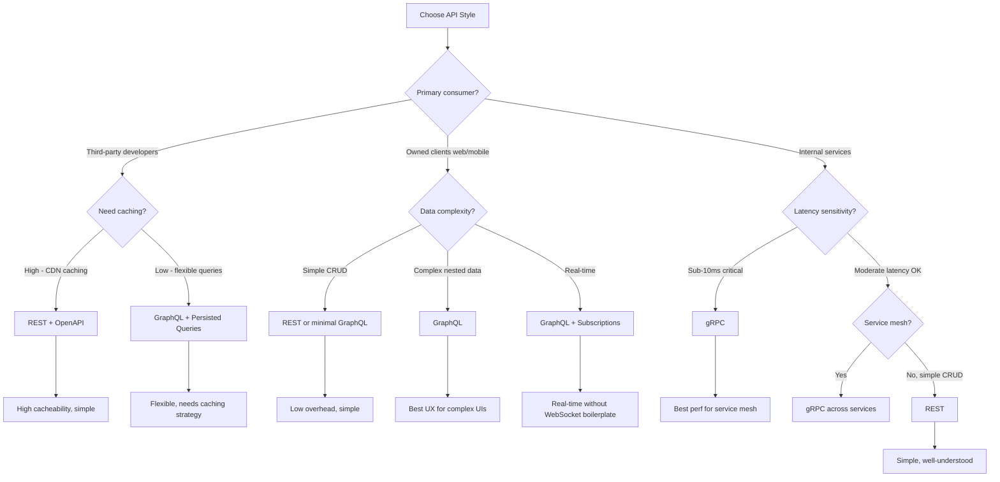
```mermaid
graph TD
    Start[Choose API Style] --> Question1{Primary consumer?}
    Question1 -->|Third-party developers| Q2{Need caching?}
    Question1 -->|Owned clients web/mobile| Q3{Data complexity?}
    Question1 -->|Internal services| Q4{Latency sensitivity?}
    
    Q2 -->|High - CDN caching| REST_Public[REST + OpenAPI]
    Q2 -->|Low - flexible queries| GraphQL_Public[GraphQL + Persisted Queries]
    
    Q3 -->|Simple CRUD| REST_Owned[REST or minimal GraphQL]
    Q3 -->|Complex nested data| GraphQL_Owned[GraphQL]
    Q3 -->|Real-time| GraphQL_Subs[GraphQL + Subscriptions]
    
    Q4 -->|Sub-10ms critical| gRPC_Internal[gRPC]
    Q4 -->|Moderate latency OK| Q5{Service mesh?}
    Q5 -->|Yes| gRPC_Mesh[gRPC across services]
    Q5 -->|No, simple CRUD| REST_Internal[REST]
    
    REST_Public --> Conclusion1[High cacheability, simple]
    GraphQL_Public --> Conclusion2[Flexible, needs caching strategy]
    REST_Owned --> Conclusion3[Low overhead, simple]
    GraphQL_Owned --> Conclusion4[Best UX for complex UIs]
    GraphQL_Subs --> Conclusion5[Real-time without WebSocket boilerplate]
    gRPC_Internal --> Conclusion6[Best perf for service mesh]
    REST_Internal --> Conclusion7[Simple, well-understood]
```

---

### When to Choose Which: Decision Matrix

| Use Case | Best API | Why |
|----------|----------|-----|
| Public API, third-party consumers | REST | Cacheable, simple, universal tooling |
| Mobile app with complex screens | GraphQL | Single round trip, exact fields, helps battery |
| Internal service mesh (50+ services) | gRPC | High throughput, streaming, auto-codegen |
| Real-time dashboard | GraphQL subs or gRPC streaming | Subscriptions for FE, streaming for BE |
| Admin panel (CRUD) | REST or minimal GraphQL | Simple, low overhead |
| B2B API with SLAs | REST | Cacheable, monitoring mature |
| Microservice with BFF | GraphQL + gRPC | GraphQL at edge, gRPC internally |
| Legacy system integration | REST (wrap) → GraphQL (strangler) | Incremental migration |

---

### Total Cost of Ownership: Three Scenarios

**Scenario A: Startup MVP (3 engineers)**
- REST: Quick to build, widely understood, no schema design overhead. Estimated 2 weeks dev time, $0 tooling.
- GraphQL: 3-4 weeks dev time (schema design, resolvers, N+1 fixes), $0-50/mo tooling (Apollo Studio free tier).
- gRPC: 4-6 weeks dev time (proto files, stream handling, codegen setup), $0 tooling.
- Verdict: REST for speed. Migrate to GraphQL when data complexity grows.

**Scenario B: Mid-stage product (20 engineers, mobile + web)**
- Current: REST (hundreds of endpoints, 5 services). Mobile app slow (waterfall). Team spends 30% of sprint on API changes.
- Migrate to GraphQL: 8 weeks to graft GraphQL gateway. 16 weeks to strangler-native resolvers. Tooling: $200/mo (Apollo Studio team). Ongoing: $100/mo gateway infrastructure.
- ROI: Mobile load time 4x faster. API change velocity increases (add field, no endpoint). Developer productivity: 1 API change instead of 3 endpoint updates.
- Verdict: GraphQL migration pays for itself in 6 months.

**Scenario C: Enterprise (100+ engineers, 50 microservices)**
- REST + gRPC hybrid. Public APIs REST (CDN-cached, $50k/mo CDN bill). Internal mesh gRPC (50 services, 1M req/s).
- GraphQL federation layer between FE teams and gRPC backend. 2 federation subgraphs, Apollo Router with custom cost analysis.
- Tooling: Apollo Studio Enterprise ($10k/yr), federation gateway ($2k/mo infra). Team: 3 SREs manage gateway.
- Verdict: Polyglot justified by scale. Cost of single style would exceed tooling cost.

> **Think**: Why does TCO change with scale? What cost shifts?
>
> *Answer: At small scale, developer time dominates TCO — simple REST wins. At medium scale, API change velocity and mobile performance dominate — GraphQL's schema evolution wins. At large scale, infrastructure and throughput dominate — gRPC's efficiency and polyglot optimization pay off.*

---

### Why This Matters

Choosing API architecture is a 3-5 year commitment. Migration costs grow with size — early decisions compound. Understanding TCO prevents over-investing in trendy tech for simple needs or under-investing in flexibility for complex ones. Good API strategy aligns with team size, consumer types, and growth trajectory.

---

## Examples

### Example 1: Fintech App Migration

**Context**: 30-person team, mobile-first fintech app. REST API with 200+ endpoints. Mobile team complains about slow onboarding (5-7 sequential requests for account setup).

**Migration**: Month 1-2: GraphQL gateway wrapping REST. Mobile adopts GraphQL immediately — onboarding drops from 7 requests to 2. Month 3-6: Strangler fig — rewrite critical resolvers (accounts, transactions) as native GraphQL. Month 7-9: Deprecate slowest REST endpoints. Month 10+: Add federation as services split into microservices.

**Results**: 60% reduction in mobile API latency. 40% reduction in endpoint maintenance (100 REST endpoints deprecated). Team grows GraphQL expertise across 3 squads.

---

### Example 2: E-commerce Public API

**Context**: Retail company exposes product catalog to 500+ third-party developers.

**Decision**: REST. Rationale: (1) CDN caching — product data changes hourly, 500ms cache saves 50% origin traffic. (2) Developer familiarity — partners use curl/Postman, not GraphQL IDEs. (3) Simpler SLAs — standard HTTP monitoring, status codes, retries.

**Tradeoff**: GraphQL would give partners more flexible queries. But CDN caching is worth more than flexibility here — every 100ms of latency costs 1% conversion on partner sites.

**Verdict**: REST for public catalog. Internal admin uses GraphQL.

---

## Key Takeaways
- Three migration strategies: wrap (fast, no gain), strangler fig (gradual, popular), federation gateway (incremental but complex)
- Polyglot architectures suit different consumers (REST for public, GraphQL for owned clients, gRPC for internal)
- Team skill varies: REST is universal, GraphQL needs schema design expertise, gRPC needs protobuf fluency
- Tooling costs: REST cheapest, GraphQL moderate (federation tools), gRPC moderate (buf.build, protoc plugins)
- Performance: gRPC wins throughput, REST wins simple queries, GraphQL wins complex data fetches
- TCO shifts with scale: startup → REST for speed, mid → GraphQL for velocity, enterprise → polyglot for optimization
- Decision matrix: match API style to consumer type, data complexity, and latency requirements
- No perfect API — every choice is a bet on future scaling direction

## Common Misconception

**"Migrating to GraphQL means rewriting all your services."**

False. The wrap strategy proves you can get GraphQL benefits without rewriting anything. The strangler fig lets you replace services one at a time. Many production GraphQL deployments run 50% wrapped, 50% native for years. Migration is a gradual process, not a flag day.

---

## Feynman Explain

Explain the strangler fig migration pattern to a senior engineer skeptical of GraphQL. Cover: (1) GraphQL gateway wraps REST endpoints as first step, (2) individual services migrate independently, (3) both interfaces coexist, (4) REST gets deprecated only when traffic reaches zero. Use 2 sentences per concept.


---

## Reframe

Critique: "GraphQL adds an unnecessary layer of abstraction that most teams don't need. REST is simpler, cheaper, and works for 80% of use cases." Counter argue using the mid-stage product scenario (20 engineers, mobile app, 5 services). Where does REST's simplicity become operational debt? At what team size does GraphQL's investment pay off?

---

## Drill

Take the quiz. MCQs test scenario-based decision-making, migration strategy selection, and TCO analysis.

Run: `learn.sh quiz graphql-deep-dive 18`

## Quiz: 18-rest-vs-graphql-vs-rpc-migration


## Quiz: 18-rest-vs-graphql-vs-rpc-migration

(quiz parse error: 'str' object has no attribute 'get')


---

# Module 19: Observability

Est. study time: 2.5h
Language: en

## Learning Objectives
- Implement distributed tracing across GraphQL resolver chains using OpenTelemetry
- Configure Apollo Studio for schema reporting, operation metrics, and error tracking
- Design structured logging with correlation IDs and field-level latency tracking

---

## Core Content

### Tracing: Apollo Studio

Apollo Studio provides managed observability for GraphQL. It ingests traces from running gateways/routers and surfaces:

- **Schema reports** — automatic schema registration on deploy, change history, field usage stats
- **Operation metrics** — request rate, latency histograms, error percentage per operation
- **Error tracking** — categorized by error code, operation, field path
- **Performance insights** — slow fields, N+1 detection, cache efficiency

```graphql
# Apollo Router emits traces automatically when configured:
# -- apollo-router -s supergraph.graphql --config router.yaml
# router.yaml enables Studio reporting:
#
# telemetry:
#   apollo:
#     endpoint: "https://studio.apollographql.com"
#     api_key: "${APOLLO_KEY}"
#     graph_ref: "my-graph@current"
#     field_level_instrumentation: true
```

Every GraphQL operation becomes a trace. Each resolver call within that operation becomes a child span.

> **Think**: Apollo Studio reports every field and every error to the cloud. What privacy or compliance concerns might this raise?
>
> *Answer: PII in query variables, field arguments, or error messages leaks to external service. Solutions: redact variables via `@redact` directive, configure sampling to 1-10% in production, or use Apollo Studio's on-premise variant for regulated industries.*

---

### OpenTelemetry: Spans per Resolver

OpenTelemetry (OTel) is the vendor-neutral observability framework. In GraphQL, each resolver becomes a span:

```text
Operation "GET /graphql" ──────────────────────────────────────
  ├─ root span: "POST /graphql" (HTTP request)
  │   ├─ graphql.query.parse
  │   ├─ graphql.query.validate
  │   ├─ graphql.query.execute
  │   │   ├─ resolver: Query.user (1.2ms)
  │   │   │   ├─ resolver: User.name (0.1ms)
  │   │   │   ├─ resolver: User.posts (8.3ms)
  │   │   │   │   ├─ resolver: Post.title (0.1ms)
  │   │   │   │   ├─ resolver: Post.body (0.1ms)
  │   │   │   │   └─ resolver: Post.comments (3.1ms)
  │   │   │   └─ resolver: User.email (0.1ms)
  │   │   └─ graphql.query.execute.total (14.7ms)
```

```typescript
// OTel span wrapping for resolvers:
import { trace } from '@opentelemetry/api';

const tracer = trace.getTracer('graphql-resolvers');

const resolvers = {
  Query: {
    user: async (_, { id }, context) => {
      return tracer.startActiveSpan('resolver: Query.user', async (span) => {
        span.setAttribute('graphql.field', 'Query.user');
        span.setAttribute('graphql.argument.id', id);
        try {
          const user = await context.db.users.findUnique({ where: { id } });
          span.setAttribute('db.user_id', user?.id);
          return user;
        } finally {
          span.end();
        }
      });
    },
  },
};
```

Parent-child relationships follow resolver nesting automatically when spans are created inside resolvers called by the parent resolver.

> **Think**: How does async resolver resolution affect span parent-child relationships?
>
> *Answer: If child resolvers await promises created after the parent span ends, the parent-child relationship breaks. Solutions: (1) keep parent span alive until all children complete via Promise.all, (2) use OTel context propagation to link spans even across async boundaries.*

---

### Structured Logging in Resolvers

Plain `console.log` is unacceptable in production. Structured logging emits JSON with consistent keys:

```typescript
import { createLogger } from './logger';

const logger = createLogger({ service: 'graphql', version: '1.0.0' });

const resolvers = {
  Query: {
    search: async (_, { query, limit }, context) => {
      const correlationId = context.headers['x-correlation-id'] ?? crypto.randomUUID();
      logger.info('search initiated', {
        correlationId,
        query,
        limit,
        userId: context.user?.id,
      });

      try {
        const results = await searchService.search(query, limit);
        logger.info('search completed', {
          correlationId,
          resultCount: results.length,
          latencyMs: results.latency,
        });
        return results;
      } catch (err) {
        logger.error('search failed', {
          correlationId,
          error: err.message,
          stack: err.stack,
        });
        throw err;
      }
    },
  },
};
```

**Correlation IDs**: generate at request ingress, pass through all resolvers, include in log output and error responses. Enables joining logs across microservices.

> **Think**: Should correlation IDs be exposed to the GraphQL client?
>
> *Answer: Yes — return correlation ID in response extensions (`extensions: { correlationId: "abc-123" }`). Client includes it in support tickets. Server-side, log it everywhere. Never expose internal correlation IDs that reveal topology.*

---

### Metrics: Request Rate, Latency, Field-Level

Metrics supplement traces. Three tiers:

| Metric | What | How |
|--------|------|-----|
| Request rate | Operations/second | Prometheus counter, label by operationName |
| Error rate | Failed operations / total | Counter with `error: true` label |
| Latency | p50/p95/p99 in ms | Histogram, label by operationName |
| Field latency | Per-resolver duration | Histogram, label by typeName.fieldName |

```typescript
// Prometheus metrics in resolvers:
import { Counter, Histogram } from './metrics';

const requestCounter = new Counter('graphql_requests_total', ['operation', 'status']);
const latencyHistogram = new Histogram('graphql_resolver_duration_ms', ['type', 'field']);

const resolvers = {
  Query: {
    products: async (_, args, context) => {
      const timer = latencyHistogram.startTimer({ type: 'Query', field: 'products' });
      try {
        const result = await productsService.findAll(args);
        requestCounter.inc({ operation: 'products', status: 'success' });
        return result;
      } catch (err) {
        requestCounter.inc({ operation: 'products', status: 'error' });
        throw err;
      } finally {
        timer.end();
      }
    },
  },
};
```

Prometheus scrapes these endpoints. Grafana dashboards visualize operation health per deploy version.

> **Think**: Why measure field-level latency instead of just operation-level?
>
> *Answer: Field-level isolates which resolver is slow. A 5s operation could be one slow resolver or many moderately slow resolvers. Field-level latency pinpoints the bottleneck without digging through traces.*

---

### Error Tracking: Categorizing Errors

Not all GraphQL errors are equal. Categorize by source:

| Category | Source | Examples | Action |
|----------|--------|----------|--------|
| Client error | Invalid input, bad query | Validation errors, missing fields | Log + return error. Don't alert. |
| Server error | Internal failure | DB timeout, 3rd party outage | Alert. Investigate. |
| Auth error | Permission denied | Unauthenticated, role mismatch | Log. Alert if frequent (attack?). |
| System error | Infrastructure | OOM, network partition | Alert immediately. Pager. |

```typescript
function categorizeError(error: GraphQLError): ErrorCategory {
  if (error.originalError instanceof ValidationError) return 'CLIENT';
  if (error.originalError instanceof AuthenticationError) return 'AUTH';
  if (error.originalError instanceof DatabaseError) return 'SERVER';
  if (error.originalError?.message?.includes('ETIMEDOUT')) return 'SERVER';
  return 'SYSTEM';
}

const formatError: FormatErrorFn = (formattedError, error) => {
  const category = categorizeError(error);
  return {
    ...formattedError,
    extensions: {
      ...formattedError.extensions,
      category,
      errorCode: error.originalError?.code ?? 'UNKNOWN',
      // Never expose stack traces in production:
      ...(process.env.NODE_ENV === 'development' && { stack: error.originalError?.stack }),
    },
  };
};
```

> **Think**: What's the risk of returning stack traces in GraphQL error extensions?
>
> *Answer: Stack traces leak code paths, library versions, file paths, internal IPs. Attackers use this to identify vulnerable dependencies. Always strip stacks in production. Use error IDs that reference an internal log store.*

---

### Tracing Every Resolver vs Sampling

Tracing every resolver is expensive. Three strategies:

| Strategy | Overhead | Visibility | Best for |
|----------|----------|------------|----------|
| **Head-based** (1%) | Low | Always-on, probabilistic | High-traffic prod |
| **Tail-based** (>5% + conditions) | Moderate | Captures slow/error traces regardless of rate | Systems needing p99 visibility |
| **Dynamic** (100% for problematic operations) | Variable | Full visibility on demand | Debugging environment |

```yaml
# Dynamic sampling: trace all operations with error rate > 5%
telemetry:
  apollo:
    sampling:
      # Always sample errors:
      error_percentage: 100
      # Sample 1% of successful operations:
      regular_percentage: 1
      # Trace operations matching regex:
      match: ".*(admin|dashboard).*"
```

Head-based is standard. Tail-based requires buffer — traces stored temporarily then decision made based on result status.

> **Think**: Why would you need 100% tracing for some operations?
>
> *Answer: Infrequently called but critical operations (e.g., billing, account deletion) need full trace coverage even at low traffic. Sampling would miss their rare failures. Set per-operation sampling rules via operation name match.*

---

### Custom Extensions for Performance Data

Attach performance metadata to the response `extensions` field:

```typescript
const server = new ApolloServer({
  typeDefs,
  resolvers,
  plugins: [
    {
      async requestDidStart() {
        const startTime = Date.now();
        const resolverTimings = new Map();

        return {
          async executionDidStart() {
            return {
              willResolveField({ info }) {
                const fieldPath = `${info.parentType.name}.${info.fieldName}`;
                const start = Date.now();
                return () => {
                  const duration = Date.now() - start;
                  resolverTimings.set(fieldPath, (resolverTimings.get(fieldPath) ?? 0) + duration);
                };
              },
            };
          },
          async willSendResponse({ response }) {
            response.extensions = {
              ...response.extensions,
              performance: {
                totalMs: Date.now() - startTime,
                resolvers: Object.fromEntries(resolverTimings),
              },
            };
          },
        };
      },
    },
  ],
});
```

Response:

```json
{
  "data": { ... },
  "extensions": {
    "performance": {
      "totalMs": 14.2,
      "resolvers": {
        "Query.user": 1.1,
        "User.posts": 8.2,
        "Post.comments": 3.0
      }
    }
  }
}
```

---

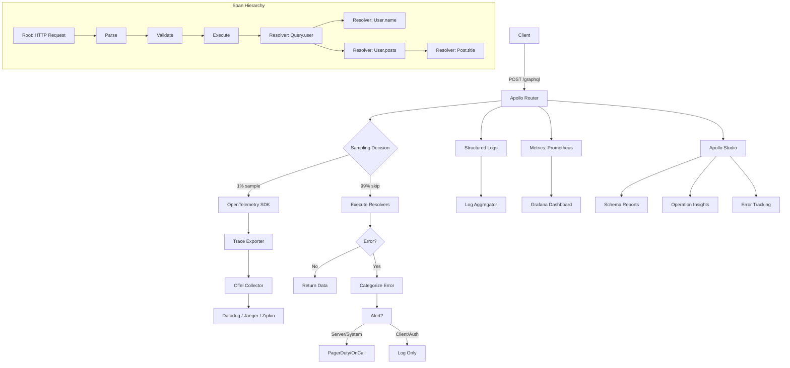
```mermaid
graph TD
  Client -->|"POST /graphql"| B[Apollo Router]
  B --> C{Sampling Decision}
  C -->|"1% sample"| D[OpenTelemetry SDK]
  C -->|"99% skip"| E[Execute Resolvers]
  D --> F[Trace Exporter]
  F --> G[OTel Collector]
  G --> H[Datadog / Jaeger / Zipkin]
  B --> I[Structured Logs]
  I --> J[Log Aggregator]
  B --> K[Metrics: Prometheus]
  K --> L[Grafana Dashboard]
  B --> M[Apollo Studio]
  M --> N[Schema Reports]
  M --> O[Operation Insights]
  M --> P[Error Tracking]
  E --> Q{Error?}
  Q -->|No| R[Return Data]
  Q -->|Yes| S[Categorize Error]
  S --> T[Alert?]
  T -->|Server/System| U[PagerDuty/OnCall]
  T -->|Client/Auth| V[Log Only]
  subgraph "Span Hierarchy"
    W[Root: HTTP Request]
    X[Parse]
    Y[Validate]
    Z[Execute]
    W --> X --> Y --> Z
    Z --> Z1["Resolver: Query.user"]
    Z1 --> Z2["Resolver: User.name"]
    Z1 --> Z3["Resolver: User.posts"]
    Z3 --> Z4["Resolver: Post.title"]
  end
```

### Why This Matters

Without observability, GraphQL is a black box. REST gives you URL-level metrics out of the box. GraphQL collapses all endpoints into one, making field-level visibility mandatory. Tracing, logging, and metrics are not optional for production GraphQL — they are survival tools. Apollo Studio and OpenTelemetry turn a monolith endpoint into a debuggable, measurable system.

---

## Examples

### Example 1: OTel Instrumentation with Parent-Child Span Tracking

```typescript
import { trace, context, Span } from '@opentelemetry/api';
import { db } from './db';

const tracer = trace.getTracer('graphql');

const resolvers = {
  User: {
    posts: async (parent, args, context) => {
      return tracer.startActiveSpan('resolver: User.posts', (span) => {
        span.setAttribute('user_id', parent.id);
        span.setAttribute('args.limit', args.limit ?? 'unlimited');

        return context.db.posts.findMany({
          where: { authorId: parent.id },
          take: args.limit,
        }).then((posts) => {
          span.setAttribute('result_count', posts.length);
          span.end();
          return posts;
        }).catch((err) => {
          span.recordException(err);
          span.setStatus({ code: SpanStatusCode.ERROR, message: err.message });
          span.end();
          throw err;
        });
      });
    },
  },
};
```

Without manual span wrapping, OTel can't distinguish resolver boundaries. With wrapping, each resolver is a named, attributed, measurable span.

### Example 2: Error Taxonomy in formatError

```typescript
const formatError: FormatErrorFn = (formattedError, error) => {
  const original = error.originalError;
  const code = original?.extensions?.code ?? 'UNKNOWN';

  const category =
    original instanceof UserInputError ? 'CLIENT' :
    original instanceof ForbiddenError ? 'AUTH' :
    original instanceof AuthenticationError ? 'AUTH' :
    original instanceof ApolloError ? 'SERVER' :
    'SYSTEM';

  const severity =
    category === 'CLIENT' ? 'low' :
    category === 'AUTH' ? 'medium' :
    'high';

  return {
    ...formattedError,
    extensions: {
      code,
      category,
      severity,
      correlationId: formattedError.extensions?.correlationId,
      timestamp: new Date().toISOString(),
    },
  };
};
```

---

## Key Takeaways

- Apollo Studio provides schema reporting, operation metrics, and field-level performance insights out of the box
- OpenTelemetry spans per resolver create a parent-child hierarchy that mirrors resolver nesting
- Structured logging with correlation IDs enables joining logs across microservice boundaries
- Field-level latency metrics pinpoint slow resolvers faster than operation-level metrics
- Sample traces (1% head-based for prod) to reduce cost; keep 100% for errors and critical operations
- Categorize errors (client, server, auth, system) for appropriate alert routing

---

## Common Misconception

**"Tracing every resolver is the only way to get accurate performance data."**

Wrong. Head-based sampling at 1% with error amplification works for 99% of use cases. Full tracing at scale generates terabytes per day and slows the gateway. Use field-level metrics (histograms, not traces) for continuous monitoring. Use traces for deep-dive debugging. Metrics give you the "what"; traces give you the "why." Run both, not either-or.

---

## Feynman Explain

Explain GraphQL observability to a DevOps engineer who manages REST APIs. Cover: why field-level metrics replace URL-level metrics, how OpenTelemetry spans mirror resolver nesting, and what sampling strategy you'd use for a 10k QPS GraphQL gateway. Use 3 sentences max per concept.


---

## Reframe

Critique: "Adding OpenTelemetry spans, structured logging, Apollo Studio, and Prometheus metrics to every resolver is too much overhead for a small team." Is observability a premature optimization for early-stage GraphQL APIs, or a foundational requirement? Where's the pragmatic middle ground?

---

## Drill

Take the quiz. MCQs test different angles — recall, application, scenario.

Run: `learn.sh quiz graphql-deep-dive 19`

## Quiz: 19-observability


## Quiz: 19-observability

(quiz parse error: 'str' object has no attribute 'get')


---

# Module 20: Security

Est. study time: 2.5h
Language: en

## Learning Objectives
- Implement depth limiting, query cost analysis, and persisted queries to prevent malicious operations
- Design field-level authorization using @auth directives with RBAC and ABAC patterns
- Defend against common GraphQL attacks: introspection leaks, batching attacks, deep recursion, alias abuse

---

## Core Content

### Depth Limiting: Preventing Deeply Nested Queries

Deeply nested queries can cause exponential resolver calls, exhausting server resources:

```graphql
# Malicious: 10 levels deep
query deep {
  user { posts { comments { author { posts { comments { author { posts { comments { author { name } } } } } } } } } }
}
```

**graphql-depth-limit** validates max depth during query parsing:

```typescript
import depthLimit from 'graphql-depth-limit';

const server = new ApolloServer({
  typeDefs,
  resolvers,
  validationRules: [depthLimit(7)], // Reject queries deeper than 7 levels
});
```

> **Think**: What depth limit is appropriate for a typical social media API?
>
> *Answer: 5-7 levels. Real queries rarely exceed 4. Set higher for admin/internal tools (10-12) with separate gateway configuration. Monitor rejected queries for attack patterns.*

---

### Authorization at Field Level: @auth Directive, RBAC, ABAC

Field-level authorization ensures users see only permitted data:

```graphql
directive @auth(
  requires: Role!,
  scope: String,
  condition: String
) on OBJECT | FIELD_DEFINITION

enum Role {
  ADMIN
  MODERATOR
  USER
  GUEST
}

type Query {
  adminDashboard: Dashboard @auth(requires: ADMIN)
  userProfile(id: ID!): User @auth(requires: USER, condition: "owner")
  publicFeed: [Post!]!
}

type User {
  id: ID!
  name: String!
  email: String @auth(requires: ADMIN) # Only admins see email
  paymentMethods: [PaymentMethod!]! @auth(requires: ADMIN) 
}
```

**RBAC** (Role-Based Access Control): role determined at auth time, enforced per field:

```typescript
const directiveTransformer = (schema) => {
  const authDirective = schema.getDirective('auth');
  // Wrap each field resolver with role check:
  for (const type of Object.values(schema.getTypeMap())) {
    for (const field of Object.values(type.getFields || {})) {
      const auth = authDirective && field.astNode?.directives?.find(
        d => d.name.value === 'auth'
      );
      if (!auth) continue;
      
      const requiredRole = auth.arguments.find(a => a.name.value === 'requires').value.value;
      const originalResolver = field.resolve || defaultResolver;
      
      field.resolve = async (source, args, context, info) => {
        if (!context.user) throw new AuthenticationError('Not authenticated');
        if (!roleHierarchy[context.user.role] >= roleHierarchy[requiredRole]) {
          throw new ForbiddenError('Insufficient permissions');
        }
        return originalResolver(source, args, context, info);
      };
    }
  }
};
```

**ABAC** (Attribute-Based Access Control): richer — checks resource attributes, not just user role:

```typescript
// ABAC: user can edit post only if they are the author AND post is not locked
type Mutation {
  updatePost(id: ID!, input: UpdatePostInput!): Post!
    @auth(condition: "isAuthor && post.status != LOCKED")
}

// Resolver checks:
async function updatePost(_, { id, input }, context) {
  const post = await db.post.findUnique({ where: { id } });
  
  // Enforce ABAC condition resolved in middleware:
  if (post.authorId !== context.user.id) {
    throw new ForbiddenError('Not the author');
  }
  if (post.status === 'LOCKED') {
    throw new ForbiddenError('Post is locked');
  }
  
  return db.post.update({ where: { id }, data: input });
}
```

> **Think**: When is ABAC overkill compared to RBAC?
>
> *Answer: RBAC suffices for most CRUD apps (admin, user, guest). ABAC adds complexity: policy evaluation engine, attribute propagation, condition DSL. Use ABAC when access depends on resource state (document status, time of day, geolocation, relationship depth).*

---

### Persisted Queries Allowlist

Only pre-approved queries execute in production. Prevents arbitrary query injection:

```typescript
// Server-side allowlist (operation safelist):
const ALLOWED_OPERATIONS = new Set([
  'GetUserProfile',
  'CreatePost',
  'SearchPosts',
  'ListFeed',
]);

const server = new ApolloServer({
  typeDefs,
  resolvers,
  plugins: [
    {
      async requestDidStart({ request }) {
        if (!ALLOWED_OPERATIONS.has(request.operationName)) {
          throw new GraphQLError('Operation not allowed', {
            extensions: { code: 'FORBIDDEN_OPERATION' },
          });
        }
      },
    },
  ],
});
```

**APQ** (Automatic Persisted Queries): client sends hash first, server caches query on first miss:

```text
1. Client sends: { hash: "abc123" }
2. Server: "Not found" → NotRegistered error
3. Client sends: { hash: "abc123", query: "query GetUser { ... }" }
4. Server caches: hash → query
5. Subsequent requests: { hash: "abc123" } — no query body needed
```

Benefits: smaller payloads, no arbitrary queries, DDOS mitigation against large query attacks.

> **Think**: Persisted queries prevent arbitrary queries but break developer tooling like GraphiQL. How do you balance?
>
> *Answer: Use environment-based enforcement. Dev/staging: allow all queries. Production: enforce persisted queries + allowlist. Or maintain a "developer" API key that bypasses allowlist for debugging.*

---

### Introspection: Disabling in Production

Introspection exposes entire schema. Attackers use it for reconnaissance:

```graphql
# Malicious introspection query:
query {
  __schema {
    types {
      name
      fields {
        name
        type { name kind }
      }
    }
  }
}
```

```typescript
const server = new ApolloServer({
  typeDefs,
  resolvers,
  introspection: process.env.NODE_ENV !== 'production',
});
```

Selective introspection — allow only for authenticated clients:

```typescript
const server = new ApolloServer({
  introspection: (req) => {
    // Only allow introspection for internal API keys
    return req.headers['x-api-key'] === process.env.INTERNAL_API_KEY;
  },
});
```

> **Think**: Is disabling introspection security-by-obscurity?
>
> *Answer: Partially. Schema is still discoverable via error messages and client bundle inspection. But introspection is the easiest attack vector. Disabling it raises the bar. Combine with API key authentication for developer tooling access.*

---

### CSRF Protection

GraphQL endpoints are susceptible to CSRF because browsers send cookies automatically:

```typescript
// Express middleware: reject requests without Content-Type: application/json
app.use('/graphql', (req, res, next) => {
  if (req.method === 'POST' && req.headers['content-type'] !== 'application/json') {
    return res.status(400).json({ error: 'CSRF protection: use application/json content-type' });
  }
  next();
});
```

Additional protections:
- Set `SameSite: Strict` or `SameSite: Lax` on cookies
- Require custom header (`x-requested-by: graphql`)
- Validate Origin/Referer headers
- Disable query batching if not needed (batching bypasses simple CSRF checks)

> **Think**: Why does query batching increase CSRF risk?
>
> *Answer: Batching allows sending multiple mutations in one request. A CSRF attack can fire one request that executes "logout", "transferFunds", "changeEmail" in sequence. Without batching, an attacker needs three requests, increasing detection probability.*

---

### Rate Limiting: Cost-Based vs Query-Count

Simple query-count rate limiting is inadequate for GraphQL. One request can do the work of a hundred:

| Strategy | Mechanism | GraphQL-aware? |
|----------|-----------|----------------|
| **Query-count** | N requests / window | No — treats cheap and expensive equally |
| **Cost-based** | Sum field costs / window | Yes — e.g., 1000 cost units per minute |
| **Depth-based** | Reject depth > N | Partial — stops deep nesting but not wide queries |
| **Alias-aware** | De-duplicate aliased fields | Yes — prevents alias-count attacks |

Cost-based example:

```typescript
// Assign cost to fields:
const costMap = {
  'Query.search': 5,
  'User.paymentMethods': 10,  // Expensive field
  'Post.comments': 3,
  default: 1,
};

function computeCost(document, operationName) {
  let cost = 0;
  visit(document, {
    Field(node) {
      cost += costMap[`${node.name.value}`] ?? costMap.default;
    },
  });
  return cost;
}
```

Rate limit middleware:

```typescript
const rateLimiter = new RateLimiter({
  windowMs: 60 * 1000,
  max: 1000, // Cost units per minute
  keyGenerator: (req) => req.headers['x-api-key'],
});

app.use('/graphql', async (req, res, next) => {
  const cost = computeCost(gql`${req.body.query}`, req.body.operationName);
  try {
    await rateLimiter.consume(req, cost);
    next();
  } catch {
    res.status(429).json({ error: 'Rate limit exceeded', cost });
  }
});
```

> **Think**: How do you assign costs fairly across all resolvers?
>
> *Answer: Start with flat default (1), then annotate expensive fields: DB scans = 5, external API calls = 10, file uploads = 50. Calibrate using traces — fields with high p99 latency or high data volume get higher costs.*

---

### Query Whitelisting: Operation Safelist

Strictest security: server knows exactly which queries clients may send:

```typescript
// Operation safelist (hash-to-query mapping):
const SAFELIST: Record<string, string> = {
  'a1b2c3d4': `
    query GetUserProfile($id: ID!) {
      user(id: $id) { id name email }
    }
  `,
  'e5f6g7h8': `
    mutation CreatePost($input: CreatePostInput!) {
      createPost(input: $input) { id title }
    }
  `,
};

const server = new ApolloServer({
  plugins: [
    {
      async requestDidStart({ request }) {
        // Look up query by hash:
        if (request.extensions?.persistedQuery) {
          const hash = request.extensions.persistedQuery.sha256Hash;
          if (!SAFELIST[hash]) {
            throw new GraphQLError('Unknown operation hash', {
              extensions: { code: 'PERSISTED_QUERY_NOT_FOUND' },
            });
          }
        } else {
          // Fail if non-registered query sent:
          throw new GraphQLError('Non-persisted queries not allowed', {
            extensions: { code: 'PERSISTED_ONLY' },
          });
        }
      },
    },
  ],
});
```

> **Think**: What happens when the frontend ships a new query?
>
> *Answer: Deployment coordination — frontend registers new hash, then deploys. Or use a two-phase rollout: allowlist phase 1 (old + new hashes accepted), then phase 2 (remove old). CI validates all queries at build time.*

---

### Input Validation: Max Length, Pattern Matching, Sanitization

GraphQL type system catches type errors, not semantic/format errors. Add per-field validation:

```graphql
input CreateUserInput {
  username: String! @constraint(minLength: 3, maxLength: 20, pattern: "^[a-zA-Z0-9_]+$")
  email: String! @constraint(format: "email")
  bio: String @constraint(maxLength: 500)
  age: Int @constraint(min: 13, max: 120)
}
```

```typescript
// Validation middleware:
function validateInput(input: Record<string, any>, schema: GraphQLInputType): void {
  for (const [fieldName, value] of Object.entries(input)) {
    const field = (schema as GraphQLInputObjectType).getFields()[fieldName];
    const constraints = field.astNode?.directives?.find(d => d.name.value === 'constraint');
    if (!constraints) continue;

    for (const arg of constraints.arguments || []) {
      switch (arg.name.value) {
        case 'maxLength':
          if (typeof value === 'string' && value.length > arg.value.value) {
            throw new UserInputError(`Field ${fieldName} exceeds max length ${arg.value.value}`);
          }
          break;
        case 'pattern':
          const regex = new RegExp(arg.value.value);
          if (typeof value === 'string' && !regex.test(value)) {
            throw new UserInputError(`Field ${fieldName} does not match pattern`);
          }
          break;
        case 'min':
          if (typeof value === 'number' && value < arg.value.value) {
            throw new UserInputError(`Field ${fieldName} below minimum ${arg.value.value}`);
          }
          break;
      }
    }
  }
}
```

> **Think**: Should validation happen in resolvers or a centralized directive?
>
> *Answer: Directive is DRYer — one validation engine reused across all inputs. Resolver validation is scattered and easily forgotten. Centralized validation produces consistent error shapes and is auditable.*

---

### Common GraphQL Security Attacks

| Attack | Mechanism | Defense |
|--------|-----------|---------|
| **Introspection leak** | `__schema` query exposes full schema | Disable introspection in prod, or auth-gate it |
| **Batching attack** | Many concurrent requests bypass rate limit | Cost-based rate limiting, connection pooling limits |
| **Deep recursion** | Deeply nested query → exponential resolver calls | Depth limiting (graphql-depth-limit) |
| **Alias abuse** | 1000 aliases of same field → request amplification | Alias limit, cost-per-request doesn't rise with aliases |
| **Over-fetching** | Request huge lists | Pagination enforcement (max first/last) |
| **Field duplication** | Same field requested 20x in aliases | De-duplicate cost computation |

```graphql
# Alias abuse example:
query {
  a1: user(id: 1) { name }
  a2: user(id: 2) { name }
  # ... up to 1000 aliases
  a1000: user(id: 1000) { name }
}
```

Aliases should be limited and cost should be computed per unique resolver call, not per field appearance.

---

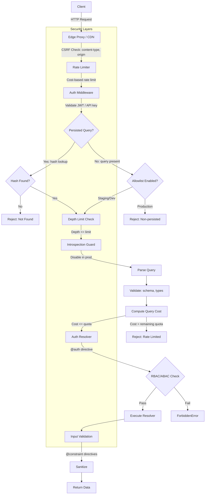
```mermaid
graph TD
  Client -->|HTTP Request| A[Edge Proxy / CDN]
  A -->|CSRF Check: content-type, origin| B[Rate Limiter]
  B -->|Cost-based rate limit| C[Auth Middleware]
  C -->|Validate JWT / API key| D{Persisted Query?}
  D -->|Yes: hash lookup| E{Hash Found?}
  E -->|No| F[Reject: Not Found]
  E -->|Yes| G[Depth Limit Check]
  D -->|No: query present| H{Allowlist Enabled?}
  H -->|Production| I[Reject: Non-persisted]
  H -->|Staging/Dev| G
  G -->|"Depth <= limit"| J[Introspection Guard]
  J -->|Disable in prod| K[Parse Query]
  K --> L[Validate: schema, types]
  L --> M[Compute Query Cost]
  M -->|"Cost > remaining quota"| N[Reject: Rate Limited]
  M -->|"Cost <= quota"| O[Auth Resolver]
  O -->|"@auth directive"| P{RBAC/ABAC Check}
  P -->|Pass| Q[Execute Resolver]
  P -->|Fail| R[ForbiddenError]
  Q --> S[Input Validation]
  S -->|"@constraint directives"| T[Sanitize]
  T --> U[Return Data]
  
  subgraph "Security Layers"
    A
    B
    C
    D
    G
    J
    O
    S
  end
```

### Why This Matters

GraphQL exposes a single endpoint with dynamic queries — its power is also its vulnerability. In REST, the API surface is explicit (each endpoint is a contract). In GraphQL, any query shape is possible, meaning attackers have infinite surface to probe. Security must be layered: transport (CSRF), query (depth, persisted), field (auth), input (validation), and resource (rate limiting). A single gap compromises the whole system.

---

## Examples

### Example 1: Complete Security Plugin for Apollo Server

```typescript
import depthLimit from 'graphql-depth-limit';
import { ApolloServerPlugin } from '@apollo/server';

const securityPlugin: ApolloServerPlugin = {
  async requestDidStart({ request }) {
    // 1. Allowlist check
    const ALLOWED = new Set(['GetProfile', 'CreatePost']);
    if (request.operationName && !ALLOWED.has(request.operationName)) {
      throw new GraphQLError('Operation not in allowlist');
    }

    // 2. Introspection guard
    if (process.env.NODE_ENV === 'production' && request.query?.includes('__schema')) {
      throw new GraphQLError('Introspection disabled in production');
    }

    // 3. Alias limit
    const aliasCount = (request.query?.match(/\w+\s*:/g) || []).length;
    if (aliasCount > 50) {
      throw new GraphQLError('Too many aliases');
    }
  },
};
```

### Example 2: RBAC with Role-Based Field Visibility

```typescript
enum Role { ADMIN, MODERATOR, USER, GUEST }

const roleHierarchy: Record<Role, number> = {
  ADMIN: 3,
  MODERATOR: 2,
  USER: 1,
  GUEST: 0,
};

function createAuthMiddleware(schema: GraphQLSchema): void {
  const types = schema.getTypeMap();
  
  for (const type of Object.values(types)) {
    if (!type.getFields) continue;
    
    for (const field of Object.values(type.getFields())) {
      const authDirective = field.astNode?.directives?.find(d => d.name.value === 'auth');
      if (!authDirective) continue;
      
      const roleArg = authDirective.arguments?.find(a => a.name.value === 'requires');
      const requiredRole = roleArg?.value as Role;
      const originalResolve = field.resolve ?? defaultFieldResolver;
      
      field.resolve = async (parent, args, context, info) => {
        if (!context.user) throw new AuthenticationError('Login required');
        if (roleHierarchy[context.user.role] < roleHierarchy[requiredRole]) {
          throw new ForbiddenError(`Role ${context.user.role} insufficient for ${info.fieldName}`);
        }
        return originalResolve(parent, args, context, info);
      };
    }
  }
}
```

---

## Key Takeaways

- Depth limiting prevents recursive query attacks; set 7 levels as production default
- Persisted queries + allowlist block arbitrary query execution
- Field-level authorization via @auth directive prevents data leaks even within authorized operations
- Cost-based rate limiting is superior to query-count for GraphQL because operations vary dramatically in cost
- Input validation via constraint directives catches format errors at the schema layer
- Introspection should be disabled or auth-gated in production
- CSRF protection requires content-type checks, SameSite cookies, and Origin validation
- Defend against aliases abuse by limiting alias count and de-duplicating cost

---

## Common Misconception

**"GraphQL needs only one security measure — validating the query against the schema."**

Wrong. Schema validation prevents malformed queries but does nothing for cost, depth, auth, or CSRF. A valid query can still be an attack: deeply nested, expensive to compute, requesting unauthorized fields via introspection, or fired cross-origin with cookies. Security is a stack, not a single check. Depth limiting + rate limiting + field auth + persisted queries + CSRF protection = defense in depth.

---

## Feynman Explain

Explain GraphQL security to a backend engineer who maintains a REST API. Cover: why the single-endpoint model changes the threat surface, how depth limiting parallels pagination enforcement in REST, and why CSRF risk is higher with query batching. Use 3 sentences max per concept.


---

## Reframe

Critique: "Persisted queries and operation allowlists are too restrictive — they slow down iteration and break developer tooling." Is the security gain worth the friction? What about a middle ground where internal API keys bypass the allowlist but external clients are restricted?

---

## Drill

Take the quiz. MCQs test different angles — recall, application, scenario.

Run: `learn.sh quiz graphql-deep-dive 20`

## Quiz: 20-security


## Quiz: 20-security

(quiz parse error: 'str' object has no attribute 'get')
