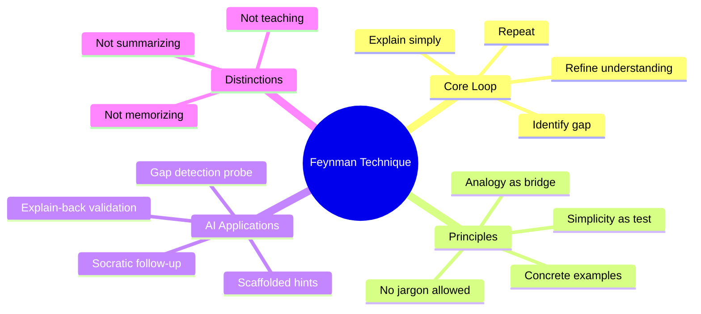
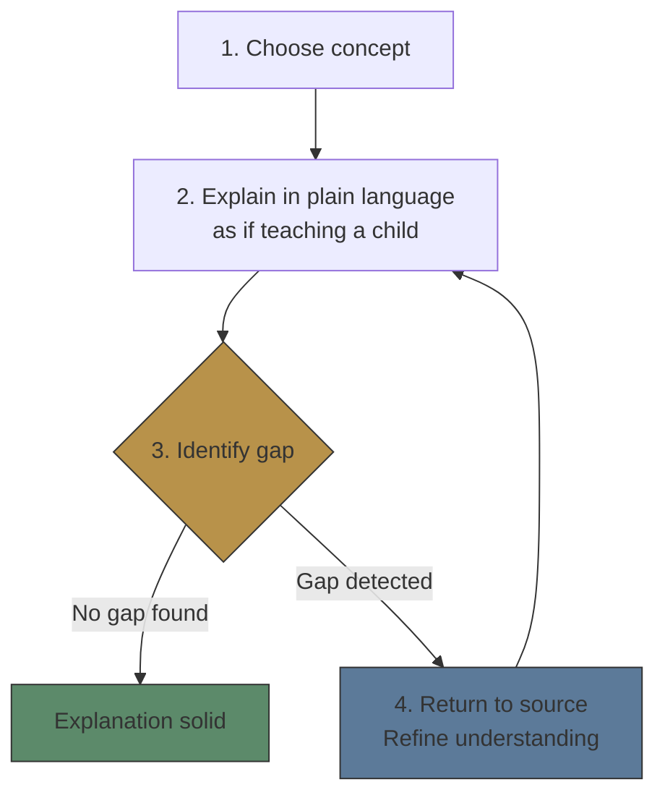
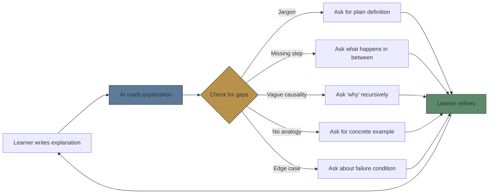

# Module 01: Feynman Technique

Est. study time: 1.5h
Language: en
Description: The 4-step explanation loop that reveals gaps in understanding — and how to implement it in AI learning tools.

## Knowledge Map

---

## Learning Objectives
- Execute the 4-step Feynman loop: explain → detect gap → refine → repeat
- Distinguish Feynman technique from teaching, summarizing, and retrieval practice
- Design gap-detection questions that probe superficial understanding
- Identify when a learner's explanation has hidden gaps despite surface fluency

---

## Real-World Example

A developer has been using React for 2 years. They've built 10 apps. You ask them: "How does React's reconciliation algorithm work?" They give a high-level answer: "It compares virtual DOM to real DOM and updates differences."

They sound confident. The answer seems correct. But when you ask "How does it decide which nodes to re-render?" or "What makes the diff O(n) instead of O(n³)?" — they hesitate.

They had an **illusion of understanding**. They could use React fluently, but they couldn't explain its mechanism simply. The Feynman Technique exposes this gap.

> **Think**: Why does fluency of use not equal depth of understanding?
>
> *Answer: Procedural knowledge (how to use) and declarative knowledge (how it works) are stored in different memory systems. Fluent use creates a false sense of explanatory understanding.*

---

## Core Content

### The Four-Step Loop

The Feynman Technique is not about teaching — it's about **gap detection**. It has four steps:

**Step 1 — Choose**: Pick a concept you claim to understand.

**Step 2 — Explain**: Write or speak the explanation in simplest possible language. No jargon. No technical shorthand. As if teaching a child who doesn't have your background. Force yourself to use analogies, concrete examples, and plain words.

**Step 3 — Detect gap**: As you explain, notice where it gets vague, where you rely on jargon as a crutch, where the causal chain breaks. Common gap signals:
- You use a technical term without defining it in plain language
- You skip a step with "it just works that way"
- You can't give a concrete analogy
- You can't predict what would happen under different conditions

**Step 4 — Refine**: Return to source material. Close the specific gap. Then re-explain from Step 2.

> **Think**: Why does explaining to a child work better than explaining to a peer for gap detection?
>
> *Answer: Peers share your jargon and assumptions — they fill in your gaps unconsciously. A child has none of that. You can't skip steps. Any vagueness becomes immediately visible.*

> **Cloze**: "The Feynman Technique's core purpose is {gap detection}. It is distinct from teaching or summarizing because its goal is to {reveal what you don't know}."
>
> *Answer: gap detection, reveal what you don't know*

---

### Gap Signals: How to Spot Superficial Understanding

The hardest skill in the Feynman Technique is recognizing gaps when they appear. Gaps are not silent — they have detectable signals:

| Signal | What it looks like | What to do |
|--------|-------------------|------------|
| **Jargon bridge** | "It works via dependency injection" — but can't explain what DI means in plain words | Define every technical term explicitly |
| **Black box** | "Then the framework handles it" — but can't say how | Trace the mechanism step by step |
| **Missing causality** | "X causes Y" — but can't explain why | Ask "why" 3 times |
| **No analogy** | Can't explain concept to a non-technical friend | Force a concrete analogy from everyday life |
| **Edge-case blind** | Can explain normal case but not what happens when something goes wrong | Walk through failure modes |

> **Think**: Which of these gap signals is hardest for AI to detect? Which is easiest?
>
> *Answer: Hardest — missing causality (AI needs world knowledge to spot that a causal link is insufficient). Easiest — jargon bridge (AI can detect technical terms and demand definitions).*

> **Predict**: A learner explains "DNS resolves domain names to IP addresses" without mentioning caching, recursion, or TTL. Does this explanation have a gap?
>
> *Answer: Yes. The explanation is surface-level. A child would ask "how does it find the IP?" The learner skipped the entire resolution mechanism. The gap is the **process** between query and answer.*

---

### Feynman in AI Learning Tools

The Feynman Technique maps naturally to AI-driven learning because gap detection is what LLMs do well — they can probe, challenge, and detect vagueness:

Key design patterns for AI Feynman interactions:

1. **Free-form input**: Let learner write or speak explanation freely. Don't constrain with forms.
2. **Pattern matching over correctness**: AI should check for gap signals (jargon, black boxes, missing causality) rather than factual accuracy alone.
3. **Scaffolded probing**: Start with generic gap detection. If learner struggles, ask increasingly specific questions.
4. **Refine loop tracking**: Track how many refine cycles before explanation holds. Many cycles = weak initial understanding = good diagnostic signal.

> **Think**: Why is free-form explanation better than multiple-choice for gap detection?
>
> *Answer: Multiple-choice constrains what the learner can reveal. Gaps are often in the structure of reasoning — the missing links between things they DO know. Free-form exposes reasoning structure.*

> **Cloze**: "In AI-driven Feynman interactions, the AI should prioritize {pattern matching} for gap signals over strict {factual accuracy} checking."
>
> *Answer: pattern matching, factual accuracy*

> **Spot the Mistake**: "The Feynman Technique works best when you explain to someone who already knows the topic — they can correct your mistakes."
>
> What's wrong?
>
> *Answer: This contradicts the core principle. Explaining to someone knowledgeable invites them to fill your gaps unconsciously (they understand your jargon, they assume what you meant). The technique works because the imagined audience has NO background — forcing you to make every step explicit.*

---

### Application: Designing Feynman Probes for Your Tool

If building a learning tool, the Feynman interaction must be designed as a **probe protocol**, not a chat:

| Phase | AI Action | User Action | Signal Collected |
|-------|-----------|-------------|-----------------|
| **Explain** | Read explanation, identify gap signals | Write/speak explanation in plain language | Raw explanation text |
| **Probe** | Ask targeted question about weakest signal | Respond to probe | Gap density (how many probes needed) |
| **Refine** | Accept revised explanation or probe deeper | Revise explanation based on probe | Cycles count, depth improvement |
| **Verify** | Ask application question (edge case, comparison) | Apply concept to new scenario | Transfer ability |

The **cycles count** is a powerful metric. If a learner needs 5+ cycles to explain a simple concept, they have significant gaps. If 1-2 cycles, their understanding is solid.

> **Predict**: A learner writes a 3-line explanation of how a database index works. The AI probes once about B-tree structure. The learner writes a 2-line refinement. The AI probes again about leaf nodes. What pattern does this reveal?
>
> *Answer: The learner has shallow, sequential knowledge — they know terms but not the mechanism. Each probe reveals a new gap at the next level of detail. This suggests "black box" gap signal: they know what an index does but not how it works internally.*

---

### Why This Matters

The Feynman Technique is the most direct path from "I've heard of this" to "I understand this". Without it, learners mistake familiarity for understanding. For tool builders, implementing Feynman probes creates the highest-value interaction in any learning system — it is the only technique that reliably detects and closes explanatory gaps.

---

## Key Takeaways
- Feynman Technique is a 4-step gap detection loop, not a teaching method
- Gap signals: jargon bridged, black box, missing causality, no analogy, edge-case blind
- AI is well-suited for gap pattern matching in free-form explanations
- Cycles count is a measurable proxy for understanding depth
- Free-form explanation reveals reasoning structure that MCQs cannot capture

---

## Common Misconception

**Misconception**: "The Feynman Technique is about simplifying for others — it's a communication skill."

**Why wrong**: Simplification is the *test*, not the goal. The goal is gap detection for yourself. If you can't simplify, the gap is yours, not your audience's.

---

## Spot the Mistake

A product manager tells their team: "We'll use the Feynman Technique in our sprint retrospective. Everyone will explain what they worked on in simple terms for 5 minutes."

What's wrong?

*Answer: This is just "explain your work simply" — missing the gap detection loop. Without the AI or listener probing for gaps and the explainer returning to refine, there is no Feynman Technique. It's just summarizing.*

---

## Feynman Explain
(Teach the Feynman Technique to a child. Use simplest words. No jargon. Give concrete example from daily life.)

---

## Reframe
(Pause. Judge the Feynman Technique: is gap detection always valuable? When would it be counterproductive? What about concepts where "how it works" is less important than "how to use"? Write your evaluation.)

---

## Drill
Take the quiz. MCQs test different angles — recall, application, scenario.

Run: `learn.sh quiz learning-methods-deep 01-feynman-technique`
