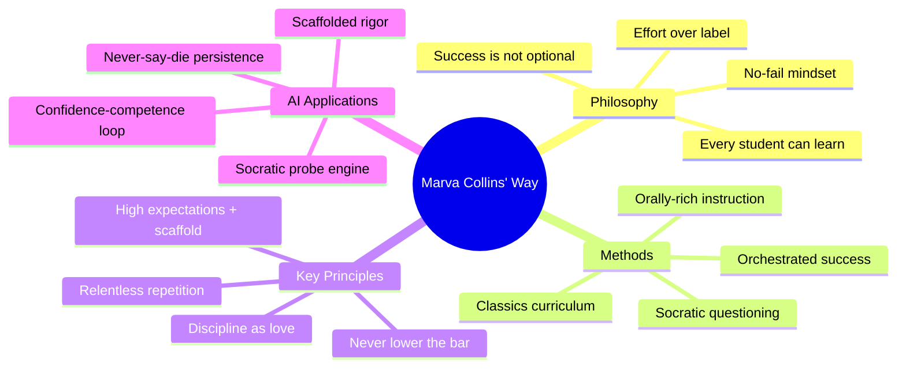
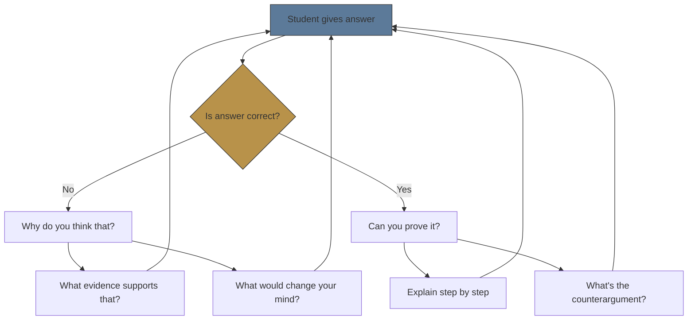

# Module 02: Marva Collins' Way

Est. study time: 1.5h
Language: en
Description: The Socratic no-fail pedagogy that combines rigorous expectations with relentless support — and how to embed it in AI learning systems.

## Knowledge Map



---

## Learning Objectives
- Explain Marva Collins' no-fail philosophy and its contrast with fixed-mindset tracking
- Apply Socratic questioning patterns that challenge without demoralizing
- Design orchestrated success cycles that build competence and confidence simultaneously
- Implement AI probe protocols that maintain rigor while providing cognitive scaffolding

---

## Real-World Example

An AI tutoring system has a "hint" feature. When a student answers incorrectly, the system shows the correct answer and moves on. The student progresses but scores poorly on retention tests a week later.

The system valued **progress through material** over **struggling with understanding**. It rewarded passive exposure, not active mastery. The student learned that "getting it wrong means getting the answer" — so they stopped trying before thinking.

Marva Collins would have done the opposite: sat with the student, asked "why do you think that's the answer?", worked through the reasoning step by step, and refused to let them give up. "You don't have to fail. You just have to try."

> **Think**: What's wrong with "showing the answer" as a response to wrong answers in learning tools?
>
> *Answer: It trains the student to wait for the answer rather than persist in thinking. It removes the productive struggle that consolidates learning.*

---

## Core Content

### The No-Fail Philosophy

Marva Collins taught at a Chicago public school where students were labelled "learning disabled", "at-risk", "unteachable". She rejected every label:

**Every student can learn. Failure is not a category — it's a temporary state that must be overcome.**

This is not feel-good positivity. It is a rigorous stance:

| Traditional approach | Collins' approach |
|---------------------|-------------------|
| Student fails test → move on | Student fails → work harder, different method |
| Lower expectations for struggling students | Same high expectations, more scaffolding |
| "This student is not good at reading" | "This student has not learned to read yet" |
| Praise for effort alone | Praise for *achievement after effort* |
| Wrong answer → correct answer given | Wrong answer → Socratic probe until student self-corrects |

> **Think**: Why is "effort praise" without achievement problematic?
>
> *Answer: It teaches students that trying is enough, removing motivation to actually succeed. Collins praised effort only when it led to mastery. The goal is competence, not trying.*

> **Cloze**: "Marva Collins' core philosophy: failure is not a {category} — it is a {temporary state} that must be overcome through persistence and scaffolding."
>
> *Answer: category, temporary state*

---

### Socratic Questioning Rigor

Collins did not lecture. She questioned. Her classroom was a rapid-fire Socratic dialogue where every student was expected to participate, think aloud, and defend reasoning.

Key questioning patterns:



Patterns:
1. **Challenge incorrect answers**: "Why do you think that?" — forces reasoning, not guessing.
2. **Verify correct answers**: "Can you prove it?" — correct answers may be lucky guesses.
3. **Force evidence**: "What evidence supports that?" — from opinion to evidence-based reasoning.
4. **Test boundaries**: "What would change your mind?" — checks understanding of the concept's limits.

> **Think**: Why does "Can you prove it?" — asked even after correct answers — strengthen learning?
>
> *Answer: It prevents the illusion of understanding. A student who answers correctly but cannot prove it has a hidden gap. Correct answers require reasoning, not guessing.*

> **Cloze**: "Collins' Socratic method never stops at a correct answer. She follows with {Can you prove it?} to verify depth over luck."
>
> *Answer: Can you prove it?*

---

### Orchestrated Success Cycles

Collins deliberately designed success cycles: set up tasks just above current ability, provide scaffolding to succeed, then increase challenge:

```text
Present challenge (hard but achievable)
        ↓
Student struggles (expected, productive)
        ↓
Socratic scaffolding (questions, not answers)
        ↓
Student achieves (with support)
        ↓
Attribute success to effort ("You worked hard and got it")
        ↓
Raise challenge level
        ↓
Repeat
```

This is NOT "just hard work". It is **engineered success** — the teacher actively constructs situations where the student succeeds through effort, then explicitly attributes success to effort rather than talent.

> **Think**: Why does attributing success to effort (vs talent) matter for long-term persistence?
>
> *Answer: Effort attribution → student believes they can improve through work → growth mindset. Talent attribution → ability is fixed → gives up when challenged.*

> **Predict**: A student who was told "you're so smart for solving that" encounters a harder problem and fails. What happens next?
>
> *Answer: They may avoid hard problems to protect the "smart" label. Effort-attributed students don't face this identity threat — they simply work harder.*

---

### Discipline as Love

Collins viewed discipline as an act of caring. Her classroom had strict rules enforced with relentless consistency:
- No excuses for incomplete work
- No "I can't" statements allowed
- Disrespect met with immediate correction
- Perfection expected in fundamentals (grammar, math facts)

But the discipline was always paired with belief: "I'm correcting you because I know you can do better. If I didn't care, I'd let you fail."

For AI learning systems, this has a direct application:

| Principle | AI Implementation |
|-----------|------------------|
| No quitting | Never offer "skip this question" as default. Require attempt. |
| No "I can't" | When user says "I don't know" → probe: "What DO you know about it? Start there." |
| Immediate correction | Wrong answer gets immediate, targeted Socratic probe, not explanation dump. |
| High standards | Never accept vague answers. Require precision. |
| Attribute to effort | Feedback: "You persisted through 4 tries and got it. That's how mastery happens." |

> **Think**: Would an AI that never lets you skip or quit feel oppressive? How would you design it to feel supportive?
>
> *Answer: Key is the framing. The AI should communicate: "I'm pushing because I know you can do this." Compare: "You must complete this" (authoritarian) vs "Let me help you through this — I know you can get it" (supportive rigor). Same behavior, different framing.*

> **Spot the Mistake**: "Marva Collins' method lowers expectations for struggling students so they can experience success."
>
> What's wrong?
>
> *Answer: Collins never lowered expectations. She kept expectations high and raised scaffolding.*

---

### Application: Designing AI Socratic Probes

For tool builders, Collins' method translates to a **persistent Socratic probe engine**. Key design:

1. **Probe on wrong answer, not correct one**: When answer is wrong, never reveal correct answer. Ask "why do you think that?" This forces retrieval of reasoning.
2. **Verify correct answers too**: After correct answer, ask "can you prove it?" or "how does that follow?" to confirm depth.
3. **Escalate scaffolding** not difficulty: If student still fails after probe, scaffold more (break problem into steps, ask about prerequisites). Never lower the bar.
4. **Never-say-die loop**: Track attempts. After 5 wrong attempts, don't give answer — instead break concept into sub-questions. Require success on each sub-question before returning to main question.
5. **Effort attribution in feedback**: After success, attribute to strategy: "You tried 3 approaches and the third worked because you checked your assumptions."

| Student State | Traditional AI | Collins AI |
|--------------|----------------|------------|
| Wrong answer | Show correct answer | "Why do you think that? Walk me through your reasoning." |
| Repeated wrong | Give simpler question | Break into parts, require sub-mastery |
| Says "I don't know" | Show hint | "What DO you know? Start there." |
| Answers correctly | "Correct!" Move on | "Correct. Can you prove it? What's the counterexample?" |

> **Predict**: Which approach leads to higher retention scores after 1 week? After 1 month?
>
> *Answer: Collins approach should show higher retention at both intervals because the learner actively processed reasoning (generation effect + desirable difficulty). The traditional approach creates passive exposure — no durable learning.*

---

### Why This Matters

Marva Collins showed that "unteachable" students learn when given rigorous expectations + relentless support. For AI tools, her method is a blueprint: the system must refuse to let the learner fail passively while providing the scaffolding to succeed actively. This is the opposite of most AI tutors that optimize satisfaction over depth.

---

## Key Takeaways
- No-fail philosophy: every student can learn, failure is temporary, not categorical
- Socratic questioning: challenge wrong AND correct answers to verify depth
- Orchestrated success: engineer situations where effort leads to achievement
- Discipline as love: structure and persistence express care, not punishment
- AI implementation: replace answer-reveal with persistent Socratic probes

---

## Common Misconception

**Misconception**: "Marva Collins was about tough love — strict discipline and no coddling."

**Why wrong**: The discipline is real but paired with *unwavering belief* in the student. Students didn't feel punished — they felt respected enough to have high standards demanded. The "love" is the belief that someone cares enough not to let you fail.

---

## Spot the Mistake

A learning app team decides to implement Collins' method. They add a feature: when a student answers incorrectly 3 times, the app auto-skipped to the next question to avoid frustration.

What's wrong?

*Answer: Auto-skipping after 3 wrong answers teaches that 3 attempts = give up. Collins would escalate scaffolding — break the question into sub-questions, probe why earlier attempts failed, and require success before proceeding.*

---

## Feynman Explain
(Teach Marva Collins' method to a child. Explain the no-fail philosophy and why she never let students give up. Use an analogy from something a child knows — like learning to ride a bike.)


---

## Reframe
(Pause. Judge Marva Collins' method: is there a risk of over-persistence? When would it be better to let a student move on from a concept they're stuck on? What's the tradeoff between depth and coverage? Write your evaluation.)

---

## Drill
Take the quiz. MCQs test different angles — recall, application, scenario.

Run: `learn.sh quiz learning-methods-deep 02-marva-collins-way`
