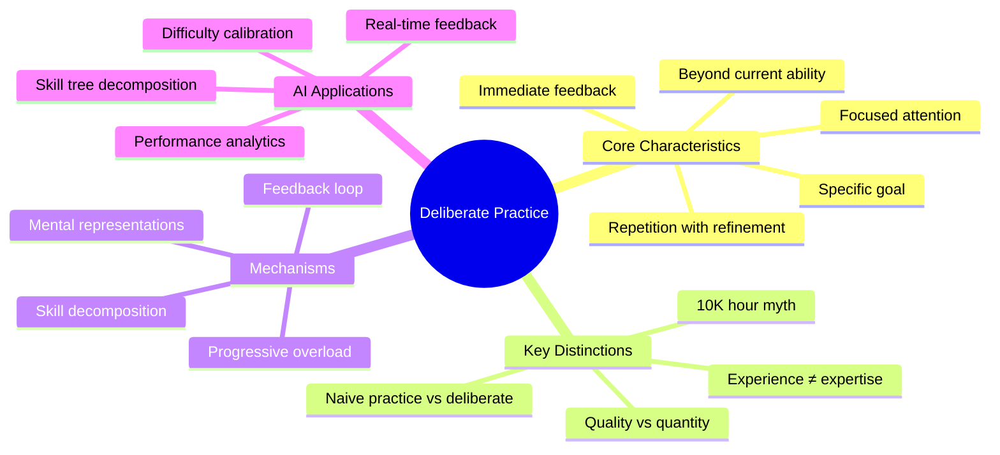
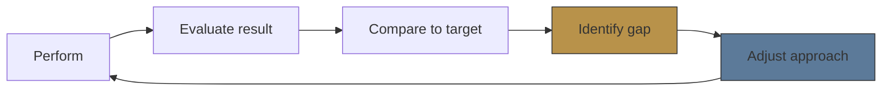
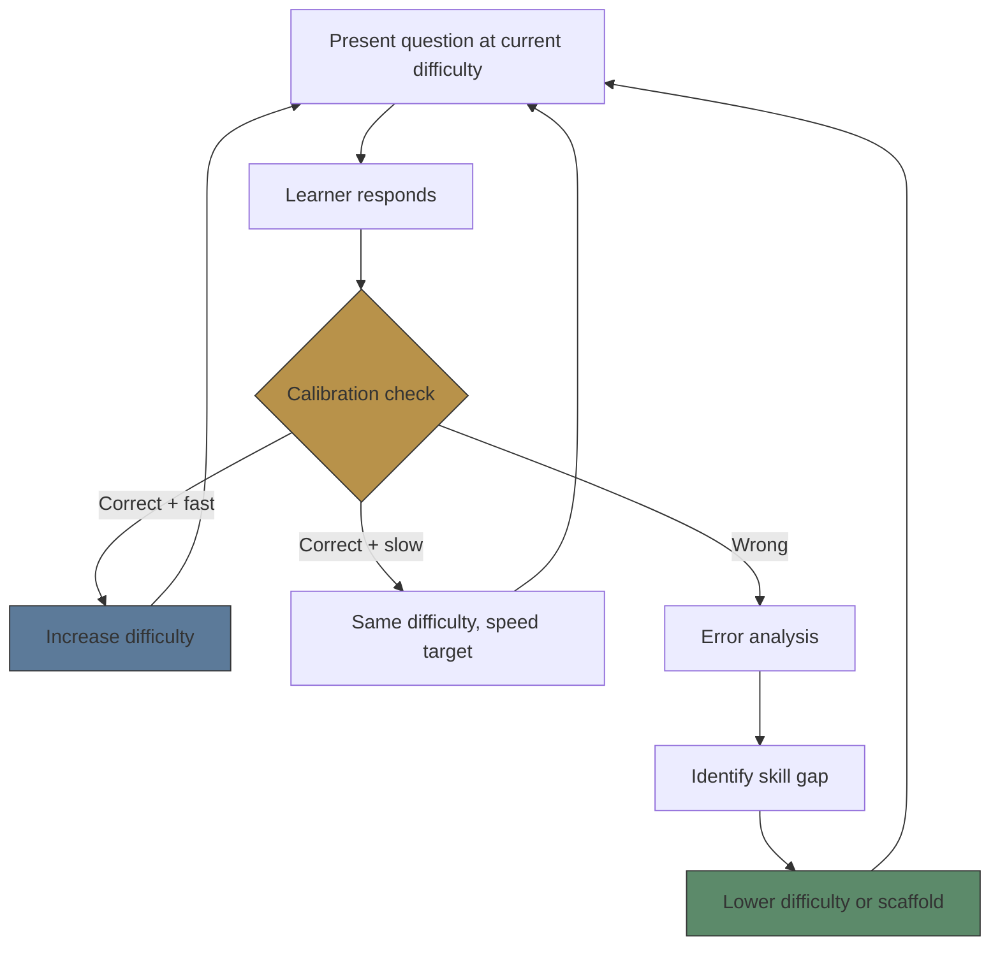

# Module 03: Deliberate Practice

Est. study time: 2h
Language: en
Description: Ericsson's framework for skill improvement — specific goals, immediate feedback, optimal difficulty, mental representations — and its implementation in adaptive learning tools.

## Knowledge Map

---

## Learning Objectives
- Distinguish deliberate practice from naive practice, experience, and flow
- Explain the role of mental representations as internal feedback mechanisms
- Design immediate feedback loops for different skill types (procedural vs declarative)
- Implement difficulty calibration that keeps learners at the edge of ability

---

## Real-World Example

A piano student practices 2 hours daily for 5 years. She plays pieces start-to-finish, repeats them until comfortable, and focuses on the parts she already plays well. She's a competent player but plateaus at intermediate repertoire.

Another student practices 45 minutes daily for 2 years. She isolates the hardest 4 bars of each piece, repeats them slowly with a metronome, records herself and compares to a master recording, and works on specific technical weaknesses. She advances past the first student within a year.

The first student did **naive practice** — repetition without refinement. The second did **deliberate practice** — targeted work with feedback.

> **Think**: Why does the first student plateau despite more total practice time?
>
> *Answer: She practiced what she already knew (comfort bias) without targeting weaknesses or getting feedback. Hours alone don't drive improvement — purposeful refinement does.*

---

## Core Content

### Naive vs Deliberate Practice

Ericsson's key insight: experience alone does not produce expertise. A doctor with 20 years of experience may not be more skilled than one with 5 — if they practiced the same way for 20 years.

| Dimension | Naive Practice | Deliberate Practice |
|-----------|---------------|-------------------|
| Goal | "Get through it" | Specific, measurable improvement |
| Focus | Automatic, low-effort | Full attention required |
| Repetition | Whole task repeated | Isolate and drill specific components |
| Feedback | None or delayed | Immediate, specific, corrective |
| Difficulty | Comfortable | Just beyond current ability |
| Energy | Low mental effort | Exhausting, unsustainable >4h/day |
| Enjoyment | Easy, relaxing | Strenuous, often not fun |

> **Think**: Why is "fun" not a reliable signal of learning effectiveness?
>
> *Answer: Learning requires cognitive effort. The struggle signal (mental effort, confusion, error detection) correlates more with learning than enjoyment. Deliberate practice should feel difficult.*

> **Cloze**: "Naive practice repeats what you already know. Deliberate practice targets {specific weaknesses} with {immediate feedback}."
>
> *Answer: specific weaknesses, immediate feedback*

---

### The 10,000-Hour Myth

Gladwell popularized "10,000 hours to expertise" from Ericsson's violin study. The nuance lost:

1. **Quality > quantity**: Deliberate practice hours, not total hours, predict skill. Many violinists had 10,000+ total hours but mostly naive practice — they stayed average.
2. **Domain matters**: Chess and music show strong deliberate practice correlation. Other domains (medical diagnosis, management) show weaker correlation — pattern recognition and deliberate practice interact differently.
3. **Starting age**: Earlier start = more cumulative hours, but deliberate practice becomes critical only after basic competence.
4. **Individual differences**: Working memory, processing speed, and prior knowledge moderate deliberate practice effectiveness.

The real finding: **deliberate practice is necessary but not sufficient** for expertise. It is the most effective known method for improvement, but not a guarantee.

> **Think**: What would the "10,000-hour rule" predict about a musician who did 5,000 hours of deliberate practice vs one who did 10,000 hours of naive practice?
>
> *Answer: It incorrectly predicts the naive practitioner would be better. In reality, the deliberate practice group would outperform despite fewer total hours.*

> **Cloze**: "The 10,000-hour rule oversimplifies Ericsson's finding. The key variable is {deliberate practice hours}, not total hours of any type."
>
> *Answer: deliberate practice hours*

---

### Mental Representations

Ericsson identified **mental representations** as the mechanism behind expert performance. Experts don't just respond faster — they see the structure differently:

| Skill Level | Mental Representation |
|------------|---------------------|
| Novice | Sees isolated pieces, needs explicit rules |
| Competent | Recognizes patterns, uses heuristics |
| Expert | Sees deep structure, predicts outcomes, self-corrects |

A chess master sees the board in chunks, not individual pieces. A surgeon sees the anatomical structure, not "cut here". Deliberate practice builds these representations by:
1. Explicit instruction on what to attend to
2. Repeated exposure to structured variation
3. Immediate feedback that corrects pattern recognition

> **Predict**: Two medical students see the same 50 X-rays. One improves diagnostic accuracy rapidly, the other doesn't. What's different?
>
> *Answer: The improver likely had feedback on each X-ray — they were told what they missed and why. The non-improver just looked at 50 X-rays without corrective feedback. Same exposure, different learning rate.*

---

### Feedback Loop Design

The deliberate practice feedback loop:

Feedback must be:
- **Immediate**: Delayed feedback weakens the association between action and outcome
- **Specific**: "You missed the binding site" not "that's wrong"
- **Corrective**: Tell what to do differently, not just what was wrong
- **Comparative**: Show difference between current and target performance

For AI learning tools:

| Feedback Type | Traditional | Deliberate Practice |
|--------------|-------------|-------------------|
| Wrong answer | "Incorrect" + correct answer | "You assumed X, but Y is true because Z. Try this approach." |
| Slow response | None (wait for answer) | "You took 30s on this. Target is 15s. Focus on recognizing the pattern faster." |
| Close but wrong | "Incorrect" | "Your reasoning is right up to step 3. Step 4 requires using Q, not R. Why?" |
| Correct | "Correct!" | "Correct in 12s. Your accuracy is 92% on this skill. Practice maintenance: aim for 95% at 8s." |

> **Think**: Why is "Correct!" — with no feedback — potentially harmful for deliberate practice?
>
> *Answer: It reinforces the idea that getting the right answer is the goal. The goal should be efficient, accurate, transferable skill. Speed, consistency, and accuracy matter.*

> **Spot the Mistake**: "Deliberate practice means doing the same drill until you get it right every time."
>
> What's wrong?
>
> *Answer: Doing the same drill without variation or increasing difficulty creates naive practice. Deliberate practice requires increasing challenge, targeting specific components, and using feedback to refine — not just repeating until comfortable.*

---

### Application: Automated Difficulty Calibration

For tool builders, deliberate practice requires keeping difficulty at the edge of current ability. This demands automated calibration:

Calibration rules:
1. **Correct + fast (under target time)** → difficulty +1, note speed to maintain
2. **Correct + slow (over target time)** → same difficulty, set speed target for next attempt
3. **Wrong → error pattern analysis** → scaffold at prerequisite level

Target: ~80% success rate on first attempt. Lower = frustration. Higher = boredom (no challenge).

> **Predict**: A student consistently gets 95% on a skill. According to deliberate practice principles, what should the system do?
>
> *Answer: Increase difficulty. 95% success indicates the task is no longer at the edge of ability. The student needs harder variations or more complex applications. Maintaining 95% is comfortable but not growth-promoting.*

---

### Why This Matters

Deliberate practice is the most evidence-supported model for skill acquisition. Without it, learners plateau. For tool builders, implementing deliberate practice means replacing "answer checking" with **performance engineering** — tracking accuracy, speed, consistency, and error patterns to calibrate difficulty and provide actionable feedback.

---

## Key Takeaways
- Deliberate practice = specific goal + immediate feedback + difficulty at edge of ability
- Naive practice = repetition without refinement (most common, lowest yield)
- Mental representations are the mechanism: building internal models through structured variation + feedback
- Feedback must be immediate, specific, corrective, and comparative
- Target ~80% success rate for optimal difficulty calibration

---

## Common Misconception

**Misconception**: "Deliberate practice means practicing more."

**Why wrong**: Quantity without quality is naive practice. A learner who does 1 hour/day of deliberate practice (targeted, feedback-driven, at-edge) will improve faster than one who does 4 hours/day of fluent repetition.

---

## Spot the Mistake

A coding platform tracks "practice time" as its key metric. It rewards users who spend more hours on the platform. Users who solve problems quickly get less credit than slow solvers.

What's wrong?

*Answer: Time spent is the wrong metric. Deliberate practice values intensity, specificity, and efficiency — not time-on-task. A user who solves a problem in 2 minutes with 100% accuracy should increase difficulty, not spend more time on easy problems.*

---

## Feynman Explain
(Teach deliberate practice to a child. Explain why practicing piano scales slowly with a metronome is better than playing songs you already know. Use an analogy from learning a sport or video game.)

---

## Reframe
(Pause. Judge deliberate practice: is it equally effective for all skill domains? What about creativity, problem-solving, or domains where feedback is inherently delayed? When does deliberate practice become counterproductive? Write your evaluation.)

---

## Drill
Take the quiz.

Run: `learn.sh quiz learning-methods-deep 03-deliberate-practice`
