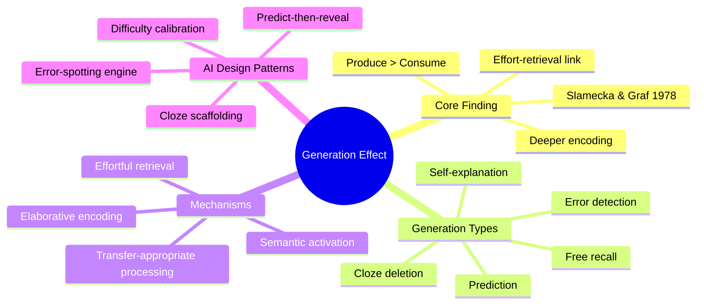
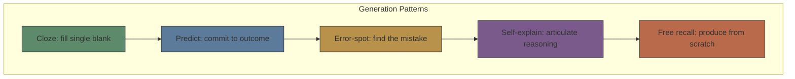
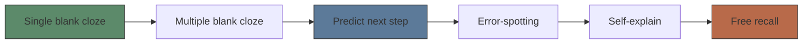

# Module 04: Generation Effect

Est. study time: 2h
Language: en
Description: Why producing information beats consuming it — Slamecka & Graf effect, cloze/predict/error design patterns, and AI generation calibration.

## Knowledge Map



---

## Learning Objectives
- Explain the generation effect and its distinction from passive reading
- Design cloze/predict/error-spotting generation tasks with appropriate difficulty
- Apply transfer-appropriate processing to match generation type to assessment type
- Calibrate generation difficulty: small gaps for beginners, large gaps for advanced

---

## Real-World Example

Two students study the same list of word pairs (e.g., "ocean - tide"). Student A reads the pair 10 times. Student B reads the pair once, then sees "ocean - ?" and must generate "tide". Student B remembers 50% more pairs on a test 24 hours later.

This is the **generation effect**: producing information during study improves later retrieval compared to passively reading the same information — even when total exposure time is equal.

> **Think**: Why does generating a word you already saw beat reading it again?
>
> *Answer: Generation requires effortful retrieval — activating the memory trace strengthens it. Reading strengthens recognition memory only. Effortful retrieval builds recall ability, which is what tests require.*

---

## Core Content

### The Generation Effect: Robust but Bounded

Slamecka and Graf (1978) demonstrated the effect in controlled experiments. It has replicated hundreds of times but has boundaries:

| Factor | Effect on Generation |
|--------|-------------------|
| Effort level | More effort = stronger effect (up to a point) |
| Prior knowledge | Effect stronger with relevant knowledge |
| Generation success | Failed generation still helps more than reading |
| Test type | Free recall > cued recall > recognition |
| Delay | Effect persists or grows over time |
| Confidence | Learners underestimate how much generation helps |

Critical nuance: **successful generation** produces the strongest benefit. But even **failed generation** (trying, getting it wrong, then seeing the answer) beats passive reading — the attempt itself activates relevant knowledge structures.

> **Think**: If failed generation still helps, does that mean all MCQs are useful even when guessed wrong?
>
> *Answer: Yes — but only if the learner attempts to reason before seeing the answer. Random guessing without reasoning does not activate relevant knowledge. The key is genuine attempt, not just clicking an option.*

> **Cloze**: "The generation effect says that producing information during study improves later {retrieval} more than passive reading — even when {total exposure time} is equal."
>
> *Answer: retrieval, total exposure time*

---

### Generation Types for AI Learning Tools

Five generation patterns, ordered from least to most difficult:



| Type | Effort | Generation | Best for | AI Implementation |
|------|--------|-----------|----------|-------------------|
| **Cloze** | Low | Fill {blank} | Terminology, key concepts | Always show {blank} before answer |
| **Predict** | Medium | Commit to outcome before reveal | Causal chains, procedures | Present scenario, lock in prediction |
| **Error-spot** | Medium-High | Find and fix mistake | Diagnostic skill, common misconceptions | Present plausible wrong solution |
| **Self-explain** | High | Articulate reasoning | Deep understanding, transfer | Free-form text input, no hints |
| **Free recall** | Highest | Produce full answer | Retrieval practice, synthesis | Open-ended prompt, no scaffolding |

> **Cloze**: "The five generation patterns in order of difficulty are: {Cloze}, Predict, Error-spot, Self-explain, and Free recall."
>
> *Answer: Cloze*

> **Think**: Why is self-explanation harder than error-spotting, even though both require deep understanding?
>
> *Answer: Error-spotting provides the wrong answer — the learner must detect and correct it, which provides structure. Self-explanation provides nothing — the learner must generate the entire reasoning chain with no scaffolding.*

---

### Transfer-Appropriate Processing

The generation effect is amplified when **generation type matches test type**:

- Cloze generation → better at fill-in-blank tests than recall
- Free recall generation → better at essay tests than fill-in-blank
- Self-explanation → better at transfer questions than recognition

This is **transfer-appropriate processing** (Morris, Bransford & Franks, 1977): memory performance depends on the overlap between encoding operations and retrieval operations.

For tool design: match generation tasks to the type of retrieval the learner needs in real use.

| Real-world need | Generation type to use in training |
|----------------|-----------------------------------|
| Recall a procedure from memory | Free recall or predict-next-step |
| Recognize correct option | Error-spotting (identify wrong among right) |
| Apply concept to new scenario | Self-explain with variation |
| Remember terminology | Cloze or cued recall |
| Make diagnostic decisions | Predict + error-spot combined |

> **Predict**: A medical training tool teaches diagnosis. Students fill in the blank: "A patient with chest pain and ST-elevation has {STEMI}." Is this generation type matched to the real task?
>
> *Answer: No. Real diagnosis requires recognizing the pattern from symptoms, not filling in a label given the pattern. A better generation task: give symptom list and ask "what's the diagnosis?" (free recall) or "which of these diagnoses is correct?" (error-spot with distractors).*

---

### Difficulty Calibration for Generation Tasks

Generation effect strength depends on gap size — the distance between what's given and what must be generated:

| Gap size | Example | Cognitive load | Effect strength |
|---------|---------|---------------|-----------------|
| Tiny | "The capital of France is {Paris}" | Very low | Weak |
| Small | "The European capital known for the Eiffel Tower is {Paris}" | Low | Good |
| Medium | "The capital city built for the 1889 World's Fair is {Paris}" | Medium | Strong |
| Large | "Which city, redesigned by Haussmann, became a symbol of 19th C modernity?" | High | Strongest |
| Too large | (No relevant cues) | Frustration | Counterproductive |

Calibration rule: **provide enough context that generation is likely (~80%) but not trivial.** If the learner can guess without thinking, the gap is too small. If they can't generate with 2-3 attempts, the gap is too large.

For AI tools, adjustable gap size based on learner performance:

```text
Performance ↓ → Gap size ↓ (more context)
Performance ↑ → Gap size ↑ (less context)
```

> **Think**: How would you implement dynamic gap sizing for cloze questions?
>
> *Answer: Track success rate per skill. If <70%, increase context (give first letter, partial word, or more surrounding text). If >90%, decrease context (remove cues, blank more of the phrase). Target ~80% generation success.*

> **Spot the Mistake**: "The generation effect works best with the largest possible gap — the learner who struggles most to generate will remember most."
>
> What's wrong?
>
> *Answer: There's a U-shaped relationship. Moderate struggle strengthens memory. Too much struggle (failed generation without enough context) leads to frustration and weak encoding because the learner couldn't activate the right knowledge. Optimal gap size produces ~80% success.*

---

### Application: Cloze as a Generation Engine

Cloze deletions are the most practical generation tool for automated learning systems. Key design parameters:

1. **Semantic importance**: Blank key concepts, not trivial words. The blank must require understanding, not pattern-matching.
2. **Context sufficiency**: The surrounding text must contain enough cues for generation. If a learner can't fill the blank after 2 attempts, add more context.
3. **Multiple blank types**: Single blank (easiest), phrase blank (harder), multiple blanks in one sentence (hardest).
4. **Scaffolding chain**: Start with single blank, progress to multiple blanks, then to predict, then to free recall.



Each step increases generation demand. Move to next step when learner achieves >80% success at current step.

> **Predict**: A learner consistently scores 95% on single-blank cloze questions for a skill. Should the system stay at cloze or advance?
>
> *Answer: Advance. 95% success on cloze means generation demand is too low. Move to multiple-blank cloze or predict. The learner has plateaued in retrieval strength at this generation level.*

---

### Why This Matters

The generation effect is the core mechanism behind retrieval practice, testing effect, error-driven learning, and self-explanation. For tool builders, generation tasks are the highest-ROI interaction pattern — more learner effort but proportionally more durable learning. The skill is calibrating difficulty to keep the learner at the productive edge.

---

## Key Takeaways
- Generation effect: producing > reading, even when failed generation attempt
- Five patterns: cloze → predict → error-spot → self-explain → free recall
- Transfer-appropriate processing: match generation type to real-world retrieval need
- Gap size calibration: target ~80% success, dynamic adjustment based on performance
- Cloze is the most practical entry point; scaffold toward free recall

---

## Common Misconception

**Misconception**: "Generation is just testing — the generation effect and the testing effect are the same thing."

**Why wrong**: Testing is one type of generation (free recall). But generation includes cloze, prediction, error-spotting, and self-explanation — any task where the learner produces rather than consumes. The testing effect is a subset of the broader generation effect.

---

## Spot the Mistake

A learning platform creates cloze questions by blanking random words: "The {quick} brown fox {jumps} over the {lazy} dog."

What's wrong?

*Answer: Random blanking removes generation's benefit. The learner can fill the blank without understanding the concept. Good cloze blanks require *semantic understanding* — the blank should test a key concept, not a predictable word.*

---

## Feynman Explain
(Teach generation effect to a child. Explain why filling blank beats reading. Use video game analogy — solve puzzle yourself vs watch.)

---

## Reframe
(Pause. Judge: is passive reading ever more efficient? Novices with zero prior knowledge? Write evaluation.)

---

## Drill
Take quiz.

Run: `learn.sh quiz learning-methods-deep 04-generation-effect`
