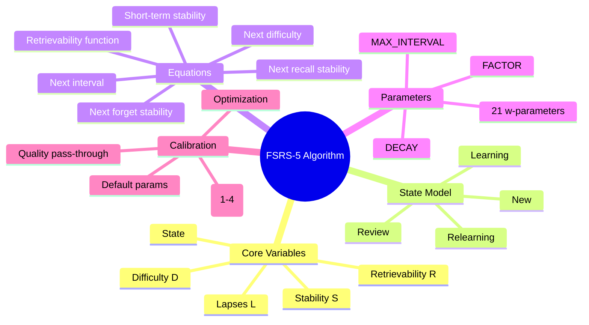
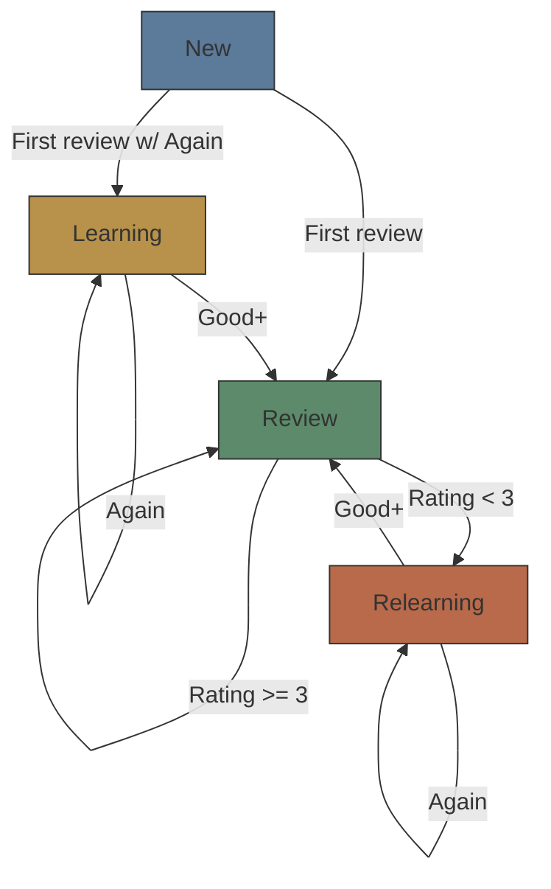

# Module 05: FSRS-5 Algorithm Internals

Est. study time: 1.5h
Language: en
Description: The FSRS-5 spaced repetition algorithm: state model, stability/difficulty/retrievability equations, w-parameters, and implementation details from the py-fsrs reference.

## Knowledge Map



---

## Learning Objectives
- Explain FSRS-5's four core variables: stability, difficulty, retrievability, lapses
- Trace the state machine: New → Review → Relearning
- Walk through the w-parameter groups and their role in stability/difficulty equations
- Predict how a card's parameters change given a quality rating
- Compare FSRS-5 to SM-2: what's gained by the additional parameters

---

## Real-World Example

An SM-2 flashcard app uses 3 variables: ease factor, interval, repetitions. After 3 years, a user has 15,000 cards. Some are reviewed every 6 months despite perfect recall. Others are "leeched" — stuck at 1-day intervals because the ease factor dropped too fast.

The problem: SM-2 has only one dynamic parameter (ease factor) to capture both item difficulty AND memory strength — it conflates them. An easy item the user struggles with temporarily wrecks the ease factor permanently.

FSRS-5 separates the two: **stability** tracks memory strength, **difficulty** tracks item inherent difficulty. They evolve independently → more precise scheduling, fewer leeches, better retention.

> **Think**: Why does conflating stability and difficulty in one parameter cause problems?
>
> *Answer: If you forget a card once, SM-2's ease factor drops permanently. FSRS-5 separates them: forgetting doesn't change difficulty much — it just reduces stability (which recovers with successful recalls). No permanent punishment for one lapse.*

---

## Core Content

### The Four Core Variables

FSRS-5 tracks four variables per card:

| Variable | Symbol | Range | Meaning | SM-2 equivalent |
|----------|--------|-------|---------|-----------------|
| Stability | S | [0.001, ∞) | Memory strength — time before retrievability hits 90% | Interval (proxy) |
| Difficulty | D | [1, 10] | Inherent difficulty — how hard to remember | Ease factor (conflated) |
| Retrievability | R | (0, 1] | Probability of recall now | None (not tracked) |
| Lapses | L | [0, ∞) | Times forgotten | Repetitions reset count |

**Stability** is the predicted interval at which R ≈ 0.9. If S = 30, then in 30 days retrievability should be ~90%.

**Difficulty** is a stable property. It changes slowly. An easy math fact (D ≈ 1) and a complex medical term (D ≈ 8) differ hugely. But forgetting once doesn't make it D = 10 permanently — the adjustment is damped.

**Retrievability** is computed each review: R = f(elapsed_days, S). Not stored — calculated. **Lapses** count total forgetting events; used to detect leeches (cards forgotten many times).

> **Think**: If Stability = 30 and elapsed_days = 15, what can you infer about retrievability?
>
> *Answer: Since S is the interval for ~90% recall, at elapsed_days = 15 (half of S), R should be > 0.9 — probably ~0.95, depending on DECAY.*

> **Cloze**: "FSRS-5 separates two concepts that SM-2 conflates: {Stability} tracks memory strength, {Difficulty} tracks item inherent difficulty."
>
> *Answer: Stability, Difficulty*

---

### State Machine



| State | Meaning | Transitions |
|-------|---------|------------|
| **New** | Never reviewed | First review → Review (if Good+) or Learning (if Again) |
| **Learning** | Within 24h of first review | Repeated Again keeps Learning; Good+ moves to Review |
| **Review** | Normal long-term schedule | Good+ stays Review; Again moves to Relearning |
| **Relearning** | Recovering forgotten card | Again stays Relearning; Good+ returns to Review |

In the implementation (`sm2.py`), Learning vs Review is handled by `elapsed_days < 1` (short-term vs long-term formula). A card in state `Review` recalled < 1 day after last review uses the short-term stability formula.

> **Think**: Why have a separate Relearning state instead of just resetting to New?
>
> *Answer: Relearning preserves some stability from previous learning — you don't start from zero. The forget stability formula computes a residual stability higher than initial: previously-learned material is easier to re-learn.*

> **Cloze**: "After a forgotten card returns to the Review state, its stability is {higher than initial} because relearning preserves residual memory."
>
> *Answer: higher than initial*

---

### The 21 W-Parameters

FSRS-5 uses 21 parameters that control all equation behavior. Defaults come from large-scale optimization across thousands of learners:

| Index | Default | Role |
|-------|---------|------|
| w[0]-w[3] | 0.212, 1.293, 2.307, 10.93 | Initial stability per rating (Again-Hard-Good-Easy) |
| w[4] | 4.93 | Initial difficulty (D₀ mean reversion target) |
| w[5] | 0.833 | Difficulty rating exponent |
| w[6] | 3.019 | Difficulty change rate |
| w[7] | 0.001 | Mean reversion strength |
| w[8] | 1.872 | Recall stability exponent base |
| w[9] | 0.167 | Stability diminishing returns |
| w[10] | 0.796 | Retrievability bonus sensitivity |
| w[11] | 1.484 | Forget stability base |
| w[12] | 0.061 | Forget difficulty exponent |
| w[13] | 0.263 | Forget stability exponent |
| w[14] | 1.648 | Forget retrievability sensitivity |
| w[15] | 0.601 | Hard rating penalty |
| w[16] | 1.873 | Easy rating bonus |
| w[17] | 0.543 | Short-term gain |
| w[18] | 0.091 | Short-term offset |
| w[19] | 0.066 | Short-term exponent |
| w[20] | 0.154 | DECAY (forgetting curve) |

> **Note on parameter values**: Defaults are derived from py-fsrs optimization (Jarrett Ye / open-spaced-rep project) and shift across algorithm versions. The values above approximate a recent FSRS-5 default snapshot for illustration — always cross-check against the current `py-fsrs` reference (`fsrs_rs`/`py-fsrs` repos) before tuning in production. The role each parameter plays is stable; the exact numeric defaults drift.

Optimized via MLE on review logs. User-agnostic defaults — fit per user for best results.

> **Terminology note — two rating scales in this course**:
>
> - **FSRS-5 review rating** (1-4): Again, Hard, Good, Easy. Drives the `py-fsrs` core math. Used throughout this module.
> - **Anki quality scale** (1-5): Same underlying signal, but the legacy 1-5 quality (1=Again, 2=Hard/almost, 3=correct-with-effort, 4=correct-easy, 5=perfect) is what Anki-style review UIs surface to the user.
>
> Module 09's feedback table reuses the 1-5 quality scale to align with the learner-facing UX. When you see "quality 4" there, it is the Anki 1-5 scale, not a fourth FSRS review rating. The mapping is lossless (rating 3=Good ≈ quality 3-4; rating 1=Again ≈ quality 1-2).

> **Think**: Which parameter most affects how fast a card's stability grows with successful reviews?
>
> *Answer: w[9] (stability inverse exponent) — controls how much existing stability dampens the increase. Low w[9] → faster growth. High w[9] → smaller growth for already-stable cards.*

> **Cloze**: "FSRS-5 has {21} w-parameters, optimized via maximum likelihood estimation on user review logs."
>
> *Answer: 21*

---

### Key Equations

#### Retrievability

```text
R(t) = (1 + FACTOR * t / S)^DECAY

where:
  DECAY = -w[20]  (= -0.154)
  FACTOR = 0.9^(1/DECAY) - 1
  t = elapsed_days since last review
```

Power-law forgetting fits data better than exponential. At t = S: R = 0.9 by definition.

> **Predict**: If S = 30 and t = 60 (double the stability), what happens to R?
>
> *Answer: R drops well below 0.9 — expect ~0.7-0.8 depending on DECAY. Doubling the interval roughly halves retrievability — reviewing on time matters.*

#### Next Recall Stability (rating ≥ 3)

```text
S' = S * (1 + delta)

delta = exp(w[8]) * (11 - D) * S^(-w[9]) * (exp((1-R)*w[10]) - 1) * hard_penalty * easy_bonus
```

Key factors:
- **(11 - D)** — easier cards (low D) get bigger increases
- **S^(-w[9])** — stable cards get smaller increases (diminishing returns)
- **(exp((1-R)*w[10]) - 1)** — harder retrievals (low R) give bigger boosts (desirable difficulty)
- **Rating**: Hard penalizes via w[15] < 1; Easy boosts via w[16] > 1

> **Think**: The equation gives bigger stability increases when R is lower (harder recall). Is this good?
>
> *Answer: Yes — the desirable difficulty effect: a card that was harder to retrieve strengthens memory more. The algorithm rewards productive struggle. Self-limiting: if R is too low, stability becomes so unstable that forgetting may occur.*

#### Next Forget Stability (rating < 3)

```text
S_long = w[11] * D^(-w[12]) * ((S+1)^w[13] - 1) * exp((1-R)*w[14])
S_short = S / exp(w[17] * w[18])
S' = min(S_long, S_short)
```

Key insight: **forgetting doesn't reset stability to zero**. Residual S' is lower than before but higher than initial — captures "relearning benefit". `min(S_long, S_short)` prevents overestimation.

> **Cloze**: "After forgetting, FSRS-5's residual stability is {higher than initial} because previously-learned material is easier to re-learn."
>
> *Answer: higher than initial*

---

### Next Difficulty

```text
delta_D = -w[6] * (rating - 3)    # negative for rating > 3 (easier), positive for rating < 3 (harder)
damped = D + (10 - D) * delta_D / 9
D' = mean_reversion(D₀, damped)
```

Two design choices:
1. **Linear damping**: Harder items (D close to 10) change less per rating
2. **Mean reversion**: Difficulty drifts toward w[4] over time

> **Spot the Mistake**: "If a card has difficulty 8 and the user rates it Again, the difficulty increases to 9 or 10."
>
> What's wrong?
>
> *Answer: The linear damping prevents extreme difficulty close to 10 from changing much: (10-8)/9 = 0.22, so delta is multiplied by 0.22. Plus mean reversion pulls it back toward w[4]. A single Again barely changes difficulty.*

---

### Next Interval

```text
interval = (S / FACTOR) * (0.9^(1/DECAY) - 1)
clamped to [1, MAX_INTERVAL]  (MAX_INTERVAL = 36500 days ≈ 100 years)
```

Inverse of retrievability function: given target R = 0.9, compute days until R reaches 0.9.

---

### Why This Matters

Understanding FSRS-5 internals lets you:
- Tune parameters for your users
- Predict due cards and optimize sessions
- Detect leeches (many lapses + stability not growing)
- Build custom scheduling on top of core algorithm

---

## Key Takeaways
- FSRS-5 core variables: stability (S), difficulty (D), retrievability (R), lapses (L)
- Stability & difficulty independent — forgetting doesn't permanently harm difficulty
- 21 w-parameters; defaults from large-scale optimization
- Retrievability at t=S is always ~0.9
- Harder recall (lower R) gives bigger stability increase per success
- Forget stability preserves residual memory — relearning faster than new learning
- Difficulty has damping + mean reversion to prevent permanent damage

---

## Common Misconception

**Misconception**: "FSRS-5 is just SM-2 with more parameters — same logic, better tuned."

**Why wrong**: FSRS-5 changes model structure. It separates stability from difficulty, computes retrievability, models short-term vs long-term memory, and uses power-law forgetting instead of exponential.

---

## Spot the Mistake

"A card with stability 100 and difficulty 5 is reviewed after 50 days with Good. New stability = 100 * (1 + exp(w[8]) * (11-5) * 100^(-w[9]) * ...). Since 100^(-w[9]) is small (w[9] ≈ 0.167), the stability increase will be minimal."

What's wrong?

> *Answer: 100^(-0.167) = exp(-0.167 × ln(100)) = exp(-0.769) = 0.463 — not minimal. A 0.463 factor on the delta is significant. Stability growth for high-S cards is smaller as percentage, but absolute increase can still be large.*

---

## Feynman Explain
(Teach FSRS-5 to a child. Why show some cards daily, others monthly? Analogy: friend's birthday vs password reset.)

---

## Reframe
(Pause. Judge: failure modes? What doesn't FSRS-5 capture? Spacing too aggressive? Uniform review assumption? Write evaluation.)

---

## Drill
Take quiz.

Run: `learn.sh quiz learning-methods-deep 05-fsrs-5-algorithm`
