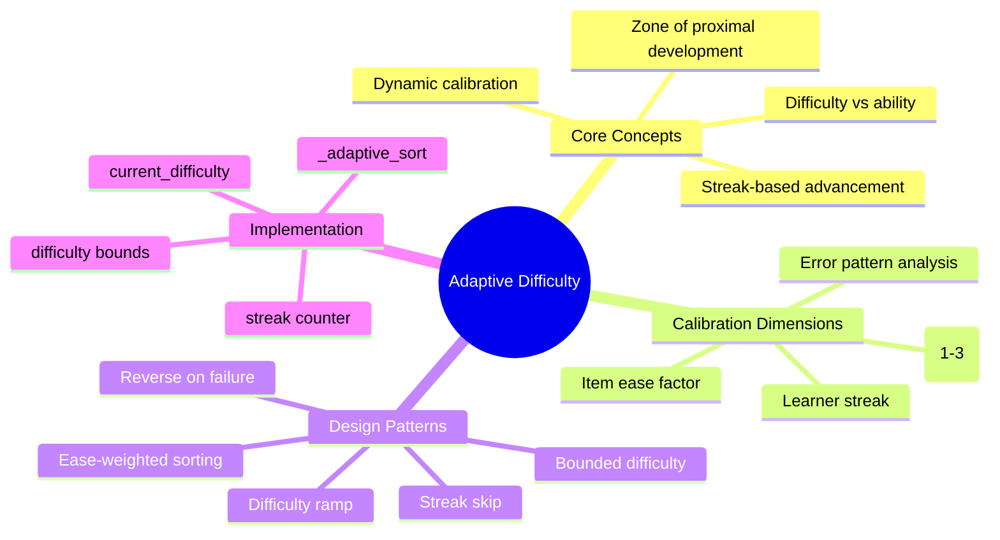
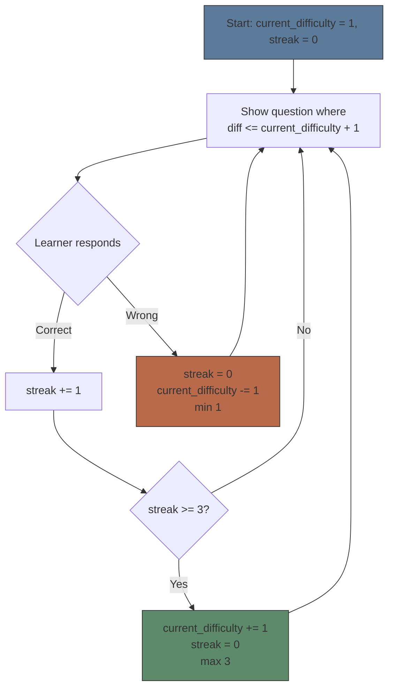

# Module 06: Adaptive Difficulty Systems

Est. study time: 2h
Language: en
Description: Design patterns for difficulty calibration in learning tools — ease weighting, difficulty ramps, streak detection, and the adaptive quiz engine.

## Knowledge Map



---

## Learning Objectives
- Explain the difference between item difficulty (static property) and learner ability (dynamic state)
- Implement streak-based difficulty ramp with reverse-on-failure
- Design ease-weighted question sorting for adaptive quiz engines
- Calibrate difficulty bounds: lower bounds, upper bounds, and advancement thresholds

---

## Real-World Example

A learning app presents questions in random order. A student who just mastered a hard concept gets an easy question next — boring. Then a hard question they're not ready for — frustrating. The student quits because the difficulty feels random, not tuned.

The problem: no adaptation. The app treated all questions as equally relevant regardless of the learner's current state.

An adaptive system would:
1. Start with medium-difficulty questions
2. After 3 correct → increase difficulty
3. After wrong → decrease difficulty
4. Always keep success rate near ~80% (deliberate practice zone)

---

## Core Content

### Two Dimensions: Item Difficulty vs Learner Ability

Adaptive systems track two things:

| Dimension | Property | Changes? | Measured by |
|-----------|----------|----------|-------------|
| **Item difficulty** | Property of the question | Static (set in quiz.yaml) | difficulty field (1-3) |
| **Learner ability** | State of the learner | Dynamic (per session) | streak, ease factor, current_difficulty |

Item difficulty classifies questions:
- **1 (Recall)**: Direct terminology — "What is the capital of France?"
- **2 (Comprehension)**: Apply concept to familiar scenario — "Which would happen if rates rise?"
- **3 (Application)**: Multi-step reasoning, transfer to novel scenario — "Design a feedback loop for this system"

Learner ability is tracked per session via:
- `streak`: count of consecutive correct answers
- `current_difficulty`: the highest difficulty level the learner is currently being shown
- `easeFactor` (from FSRS-5): historical performance on specific cards

> **Think**: Why separate item difficulty from learner ability instead of having one combined score?
>
> *Answer: Item difficulty is a fixed property — which questions to show at each level. Learner ability is the current state — which level to show now.*

> **Cloze**: "Item {difficulty} is a static property of the question. Learner {ability} is dynamic state that changes per session."
>
> *Answer: difficulty, ability*

---

### Ease-Weighted Sorting

Before the difficulty ramp applies, questions should be prioritized by the learner's historical performance. The `_adaptive_sort` function in learn.py does this:

```python
def priority(q):
    card = find_card(cards, q.id)
    if card:
        ef = card.get('easeFactor', 2.5)
        reps = card.get('repetitions', 0)
        return (ef, reps, q.difficulty)
    return (2.5, 0, q.difficulty)

questions = sorted(questions, key=priority)
```

Sort order: lowest ease factor → fewest repetitions → lowest difficulty.

This means:
- Cards the learner struggled with (low ease factor) appear first
- Cards never reviewed appear next
- Within same weakness, easier questions come first

> **Predict**: A learner has 3 cards: Q1 (ease=1.5, reps=5, diff=2), Q2 (ease=2.5, reps=0, diff=1), Q3 (ease=2.5, reps=3, diff=3). Which order does adaptive sorting produce?
>
> *Answer: Q1 first (ease=1.5 — weakest), then Q2 (ease=2.5, reps=0 — unreviewed), then Q3 (ease=2.5, reps=3 — more practiced). Within same ease factor, fewer reps wins.*

> **Cloze**: "Ease-weighted sorting prioritizes {weak cards} — those with lowest easeFactor and fewest repetitions."
>
> *Answer: weak cards*

---

### Streak-Based Difficulty Ramp

The core adaptation logic:



Rules from the learn.py implementation:

```python
# Skip questions too far above current level
if q_diff > current_difficulty + 1:
    continue

# After 3 correct streak
streak += 1
if streak >= 3 and current_difficulty < 3:
    current_difficulty += 1
    streak = 0

# After wrong answer
streak = 0
if current_difficulty > 1:
    current_difficulty -= 1
```

Key design decisions:
1. **3 correct → advance**: Three consecutive correct answers trigger advancement — stable performance before increasing difficulty.
2. **Wrong → drop**: Single wrong answer drops difficulty by 1 — immediate response to struggle.
3. **Skip window = current_difficulty + 1**: Learner sees questions at or one above current level — challenge while maintaining achievability.
4. **Bounds [1, 3]**: Difficulty ranges 1 (easiest) to 3 (hardest).

> **Think**: Why use a streak threshold of 3 instead of 1 (immediate advance) or 5 (conservative)?
>
> *Answer: 1 would advance too fast — lucky guesses advance difficulty prematurely. 5 might be too conservative for a quiz session. 3 balances reliability of performance measurement with session pace.*

> **Spot the Mistake**: "The adaptive system shows questions at current_difficulty + 2 when the learner is on a roll."
>
> What's wrong?
>
> *Answer: The skip condition `q_diff > current_difficulty + 1` means questions more than 1 level above current are always skipped. The +1 window is fixed — it doesn't widen based on streak. Only advancing current_difficulty unlocks harder questions.*

---

### Reverse on Failure: Why Immediate Drop Helps

When a learner gets a question wrong at difficulty 3, the system drops to difficulty 2. This is a **reverse on failure** pattern:

| Pattern | Behavior | Effect |
|---------|----------|--------|
| **Reverse on failure** | Wrong → drop difficulty | Prevents frustration spiral, rebuilds confidence |
| **Persist at level** | Wrong → stay at same level | May cause repeated failure, learned helplessness |
| **Reverse + scaffold** | Wrong → drop + provide easier variant of same concept | Best: different question about same concept at lower difficulty |

The reverse-on-failure pattern is supported by Marva Collins' orchestrated success cycles: after failure, set up an achievable challenge, rebuild success, then attempt harder again.

> **Think**: Under what condition would reverse-on-failure be counterproductive?
>
> *Answer: If the current difficulty 3 question was a fair test (learner should know it) and the wrong answer was due to carelessness, dropping difficulty wastes time on material below ability. A "two wrongs before drop" rule could filter noise.*

---

### Difficulty Bounds

All adaptive systems need bounds:

| Bound | Value | Purpose |
|-------|-------|---------|
| Minimum difficulty | 1 | Never go below easiest questions |
| Maximum difficulty | 3 | Cap based on available question pool |
| Skip window | current + 1 | Challenge never exceeds current ability + 1 step |
| Streak threshold | 3 | Require consistent performance before advance |

These bounds are design parameters — they should be tuned per application:

```python
# Configurable bounds
MIN_DIFFICULTY = 1
MAX_DIFFICULTY = 3
STREAK_THRESHOLD = 3
SKIP_WINDOW = 1  # levels above current
```

For tools with more questions, expand range: (1-5), increase streak threshold (5 for longer sessions), widen skip window (2 for faster progression).

> **Predict**: What happens if STREAK_THRESHOLD = 1 and SKIP_WINDOW = 3?
>
> *Answer: The learner advances after every correct answer and can jump 3 difficulty levels at once. This would create wild difficulty swings — likely frustrating. Most learners would hit questions well above their level before they're ready.*

---

### Implementation: Full Adaptive Quiz Loop

```python
def run_adaptive_quiz(questions, cards):
    questions = adaptive_sort(questions, cards)  # weak first
    streak = 0
    current_difficulty = 1

    for q in questions:
        # Skip if too hard for current level
        if q.difficulty > current_difficulty + 1:
            continue

        # Show question, get response
        is_correct = ask_question(q)

        if is_correct:
            streak += 1
            if streak >= 3 and current_difficulty < 3:
                current_difficulty += 1
                streak = 0
        else:
            streak = 0
            if current_difficulty > 1:
                current_difficulty -= 1

        # Update FSRS-5 card
        update_card(q, quality=4 if is_correct else 1)
```

---

### Why This Matters

Adaptive difficulty is the bridge between content (static question bank) and learning (dynamic state tracking). Without it, learners experience either boredom (too easy) or frustration (too hard). With it, the system maintains the ~80% success rate that deliberate practice research identifies as optimal. For tool builders, the adaptive quiz engine is the highest-ROI feature after the content itself.

---

## Key Takeaways
- Two dimensions: item difficulty (static, 1-3) vs learner ability (dynamic, tracked per session)
- Ease-weighted sorting: weakest cards first based on historical FSRS-5 performance
- Streak-based ramp: 3 consecutive correct → advance 1 level; wrong → drop 1 level
- Skip window: show questions at or one level above current ability
- All bounds are design parameters — tune for your application and user base

---

## Common Misconception

**Misconception**: "Adaptive difficulty means the system adjusts question content, not just difficulty level."

**Why wrong**: Content adaptation (changing the question itself) is a different class of system. The adaptive quiz engine adjusts *which existing question* to show based on difficulty metadata. True content adaptation requires an LLM — covered in Module 07.

---

## Spot the Mistake

"A developer sets STREAK_THRESHOLD = 0 so the system advances immediately after any correct answer and drops immediately after any wrong answer."

What's wrong?

*Answer: Streak = 0 means advance on every correct answer and drop on every wrong answer. The learner would oscillate constantly — advance after easy question, immediately drop on the harder one, never stabilizing at any level. A minimum streak of 2-3 filters noise.*

---

## Feynman Explain
(Teach adaptive difficulty to a child. Explain why video games get harder as you get better but learning apps should also work that way. Use an analogy from platformer games — the first level has fewer enemies.)


---

## Reframe
(Pause. Judge adaptive difficulty: is the 3-streak rule optimal for all domains? What about domains where deep understanding requires sustained difficulty without dropping? How would you design for knowledge work vs skill acquisition? Write your evaluation.)

---

## Drill
Take the quiz.

Run: `learn.sh quiz learning-methods-deep 06-adaptive-difficulty-systems`
