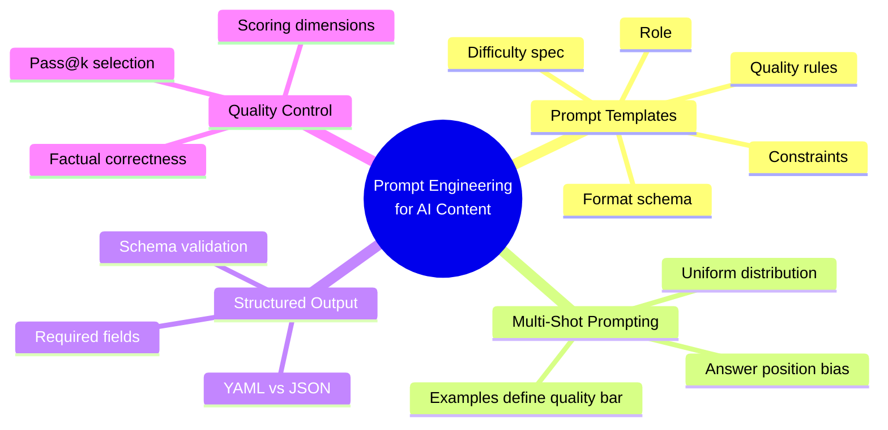
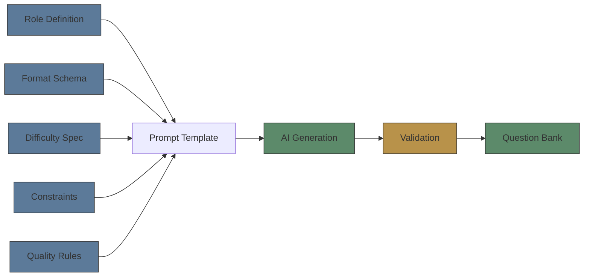

# Module 07: Prompt Engineering for AI Learning Content

Est. study time: 1h
Language: en
Description: Design patterns for prompting AI to generate learning content — prompt templates, multi-shot examples, structured output schemas, and quality scoring.

## Knowledge Map



---

## Learning Objectives
- Design prompt templates that encode role, format, difficulty, constraints, and quality rules
- Apply multi-shot prompting with curated examples that calibrate output quality
- Enforce structured output schemas with validation before accepting content
- Implement Pass@k candidate generation with quality scoring

---

## Real-World Example

A learning platform needs 500 MCQs for a new programming course. Hiring humans costs $5,000 and takes 3 weeks. An AI generates 500 in 10 minutes for $2. But half the questions have factual errors, and the format is inconsistent — some have explanations, some don't, and the answer letters are sometimes lowercase.

The problem: raw AI generation produces quantity but not consistent quality without engineering.

Prompt engineering solves this:
1. **Template**: Structured prompts with role, difficulty scaffolding, and output schema
2. **Examples**: Multi-shot examples that set the format and difficulty bar
3. **Schema**: YAML output the pipeline can parse and validate automatically
4. **Selection**: Generate k candidates, score them, keep the best

> **Think**: Why would a human-generated question bank still exist alongside AI-generated ones rather than being fully replaced?
>
> *Answer: AI excels at volume but struggles with edge cases, trick questions requiring precise wording, and deep domain nuance. Human-authored questions serve as calibration anchors — known-quality references that validate AI output quality.*

---

## Core Content

### Prompt Templates

The foundation of AI content generation is the prompt template. For educational content, the prompt must encode:

1. **Role** — "You are an expert educator creating MCQs for {topic}"
2. **Format** — Structured output schema (YAML, JSON)
3. **Difficulty** — Level definitions, example questions at each level
4. **Constraints** — Answer distribution, distractor rules, topic coverage
5. **Quality** — Factual accuracy, clarity, no ambiguity



> **Cloze**: "The prompt template must encode five things: {role}, format, difficulty, {constraints}, and quality rules."
>
> *Answer: role, constraints*

> **Think**: Why is the role definition important in educational prompt engineering?
>
> *Answer: Role primes the model's behavior. "You are an expert educator" activates teaching knowledge, clarity standards, and pedagogical awareness that a generic assistant role wouldn't trigger. The role shapes the model's latent distribution.*

---

### Multi-Shot Prompting with Examples

Zero-shot generation often produces inconsistent quality. Multi-shot prompting with examples calibrates output:

```yaml
# Multi-shot prompt structure
system_prompt: "You are an expert educator creating MCQs."
examples:
  - topic: "Newton's First Law"
    difficulty: 1
    question: "What property of an object causes it to resist changes in motion?"
    options: {A: mass, B: weight, C: velocity, D: acceleration}
    answer: A
  - topic: "Newton's First Law"
    difficulty: 2
    question: "A ball rolling on grass slows down. Which force is primarily responsible?"
    options: {A: gravity, B: friction, C: air resistance, D: inertia}
    answer: B
generate:
  topic: "{topic}"
  difficulty: "{level}"
  count: "{n}"
```

Key principle: **the examples define the quality bar**. Low-quality examples → low-quality output. Curate examples as carefully as the generated content.

> **Predict**: If the multi-shot examples all have answer = A, what pattern will the generated questions show?
>
> *Answer: The AI will disproportionately generate questions with answer A. The model learns the distribution from examples — including spurious patterns like answer position. Multi-shot examples must have uniform answer distribution.*

> **Cloze**: "Multi-shot examples define the {quality bar}. Low-quality examples produce {low-quality} output."
>
> *Answer: quality bar, low-quality*

---

### Structured Output Schemas

AI output must be parseable. Structured schemas enforce consistency:

```python
import yaml

MCQ_TEMPLATE = """
question: "{question}"
options:
  A: "{option_a}"
  B: "{option_b}"
  C: "{option_c}"
  D: "{option_d}"
answer: "{correct_letter}"
explanation: "{explanation}"
difficulty: {diff_int}
tags: [{tags}]
"""

# Prompt the model to output this structure
prompt = f"""Generate an MCQ about {topic} at difficulty {level}.
Output in this exact YAML format:
{MCQ_TEMPLATE}

Rules:
- Answer letter must be one of A/B/C/D
- Distractors must be plausible to someone who partially understands
- Explanation must reference the correct concept
- Difficulty: 1=recall, 2=comprehension, 3=application
"""

# Parse output
response = call_llm(prompt)
question = yaml.safe_load(response)
```

Always validate schema before accepting content:

```python
def validate_mcq(q):
    required = ['question', 'options', 'answer', 'explanation', 'difficulty']
    for field in required:
        if field not in q:
            raise ValueError(f"Missing field: {field}")
    if q['answer'] not in ['A', 'B', 'C', 'D']:
        raise ValueError(f"Invalid answer: {q['answer']}")
    if q['difficulty'] not in [1, 2, 3]:
        raise ValueError(f"Invalid difficulty: {q['difficulty']}")
    return True
```

> **Think**: Why parse YAML instead of requesting JSON for structured output?
>
> *Answer: Both work. YAML is more readable for humans reviewing generated content and handles long text blocks well. JSON is more robust for machine parsing. Choose based on whether humans or machines will read the raw output more often.*

---

### Quality Control: The Pass@k Approach

AI-generated content must be validated. Pass@k is the concept: generate k candidates, keep the best:

```python
def generate_with_quality(topic, level, k=3):
    candidates = [generate_one(topic, level) for _ in range(k)]
    scored = [(score_quality(q), q) for q in candidates]
    scored.sort(reverse=True, key=lambda x: x[0])
    return scored[0][1]  # best candidate
```

Quality scoring dimensions:

| Dimension | Checks | Score weight |
|-----------|--------|-------------|
| **Factual correctness** | Does answer match verified sources? | 40% |
| **Distractor plausibility** | Would partial learner choose distractor? | 25% |
| **Clarity** | No ambiguous wording, double negatives | 15% |
| **Difficulty match** | Actual difficulty matches target? | 10% |
| **Answer distribution** | Not same letter repeatedly | 10% |

```python
def score_quality(q):
    score = 0
    # Factual check (simplified)
    if verify_fact(q['question'], q['answer']):
        score += 40
    # Distractor plausibility: each distractor should be chosen by some students
    plausible = sum(1 for d in distractors(q) if is_plausible(d, q['topic']))
    score += (plausible / 3) * 25
    # Clarity: no known ambiguity patterns
    if not has_ambiguity(q['question']):
        score += 15
    # Difficulty match
    if estimate_difficulty(q) == q['difficulty']:
        score += 10
    # Answer distribution (compared to recent questions)
    if answer_position_ok(q['answer'], recent_answers):
        score += 10
    return score
```

> **Predict**: What happens if k=1 (no candidate selection)?
>
> *Answer: Quality becomes unpredictable. Single generation may have factual errors, weak distractors, or ambiguity. Pass@k with scoring filters the bottom ~30-50% of generations. Higher k costs more tokens but improves quality up to diminishing returns around k=5.*

> **Spot the Mistake**: "Pass@k means generating k questions and returning the k-th one."
>
> *Answer: Pass@k generates k candidates, scores them all, and returns the best. The name refers to "take k passes, keep the best" — not returning the k-th item.*

---

### Why This Matters

Prompt engineering is the input side of the content pipeline — it determines whether the AI produces usable questions or noise. A well-designed prompt template with curated examples, strict schema validation, and Pass@k selection turns an LLM into a reliable content generator. Everything downstream — distractor quality, difficulty calibration, diversity — builds on the foundation of a solid prompt.

---

## Key Takeaways
- Prompt templates encode role, format, difficulty, constraints, quality rules — five dimensions for reliable output
- Multi-shot examples define the quality bar; curate them as carefully as the generated content
- Structured output schemas make AI output parseable and validateable
- Pass@k generation with quality scoring filters bottom candidates — k=3-5 optimal
- Schema validation catches missing fields and invalid values before content enters the bank

---

## Common Misconception

**Misconception**: "AI-generated content doesn't need validation because the model is highly accurate."

**Why wrong**: Accuracy varies by domain. In specialized fields, factual error rates of 5-15% are common. Format inconsistencies are frequent without schema enforcement. Always validate — automated checks catch ~80% of issues, human review catches edge cases.

---

## Spot the Mistake

"A prompt engineer generates questions by writing only: 'Make me 10 MCQs about chemistry.' No role, no schema, no examples."

What's wrong?

*Answer: The prompt lacks all five template dimensions. The model will invent its own format (inconsistent), set its own difficulty (usually easy), and produce unparseable output. Adding a role, structured output schema, and quality examples would produce reliable, parseable questions.*

---

## Feynman Explain
(Explain to a teaching colleague how to get reliable MCQs from an AI. Include: why examples matter more than instructions, why you should check the output, and why you want the AI to output a strict format.)


---

## Reframe
(Pause. Judge: does prompt engineering shift the skill burden from writing questions to writing prompts? Is that a good trade? Who is responsible when a generated question has a subtle error — the engineer or the model? Write your evaluation.)

---

## Drill
Run: `learn.sh quiz learning-methods-deep 07-prompt-engineering-for-learning`
