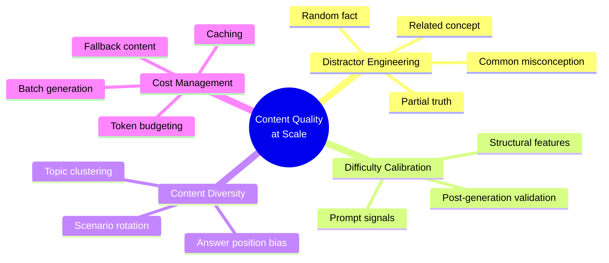
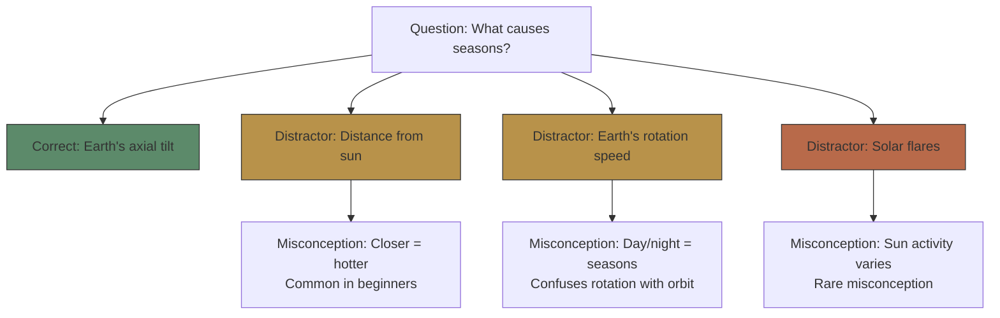

# Module 08: Content Quality at Scale

Est. study time: 1h
Language: en
Description: Scaling AI content generation beyond the prompt — distractor engineering, difficulty calibration, content diversity, and cost management for question banks.

## Knowledge Map



---

## Learning Objectives
- Engineer distractors ranked by quality: misconception > partial truth > related concept > random fact
- Calibrate difficulty via prompt signals and post-generation validation
- Enforce content diversity: topic distribution, scenario rotation, answer position
- Manage token costs with batch generation, caching, and fallback content

---

## Real-World Example

A learning platform generates 500 MCQs with a solid prompt template. The output is now parseable — but quality problems surface at scale. Most distractors are obviously wrong ("random facts" learners eliminate instantly). Questions labeled difficulty 3 turn out to be simple recall. Topics cluster around a few well-known concepts while advanced subtopics get zero questions. And the API bill is rising.

The problem: a good prompt gets you quantity; **engineering** gets you quality.

Content quality engineering solves this:
1. **Distractor quality**: replace random facts with common misconceptions learners actually hold
2. **Difficulty validation**: check whether a labeled-difficulty-3 question can be answered by memorization
3. **Diversity enforcement**: explicit topic distribution and scenario rotation
4. **Cost control**: batch, cache, and fall back to static content

> **Think**: Why do obviously-wrong distractors ("random facts") fail to discriminate understanding?
>
> *Answer: A learner who doesn't know the answer can still eliminate absurd options. Good distractors are plausible to partial learners — they test whether the learner can distinguish the correct concept from a near-miss misconception.*

---

## Core Content

### Distractor Engineering

The most challenging part of MCQ generation is creating plausible distractors. A good distractor:
1. Is wrong (objectively incorrect)
2. Looks right to someone with partial understanding
3. Tests a specific misconception



Distractor types ranked by quality:

| Type | Example | Quality | Why |
|------|---------|---------|-----|
| **Common misconception** | "Distance from sun" for seasons | High | Tests real understanding gap |
| **Partial truth** | "Earth's rotation" for seasons | Medium | Close but wrong mechanism |
| **Related concept** | "Solar flares" for seasons | Low | Plausible only to uninformed |
| **Random fact** | "Moon's gravity" for seasons | Very low | Easy to eliminate |

Prompt engineering for distractors:

```text
Generate 3 distractors for this question.
Each distractor must:
1. Be factually incorrect
2. Represent a real misconception about {topic}
3. Be chosen by at least 20% of students who partially understand
4. NOT be: obviously wrong, joke options, "all of the above"
```

> **Cloze**: "A high-quality distractor tests a specific {misconception}. A low-quality distractor is {easy to eliminate}."
>
> *Answer: misconception, easy to eliminate*

> **Predict**: If a distractor prompt says only "generate 3 wrong answers," what kind of distractors will the AI produce?
>
> *Answer: Random facts and obviously wrong options. The AI defaults to the easiest wrong answers unless instructed to target specific misconceptions held by partial learners.*

---

### Difficulty Calibration

AI generation must produce questions at specified difficulty levels:

| Difficulty | Prompt Signal | Structural Feature | Validation |
|------------|---------------|-------------------|------------|
| 1 (Recall) | "Test direct knowledge of terminology" | Single fact, one step | Could learner answer without understanding? |
| 2 (Comprehension) | "Apply concept to familiar scenario" | Two steps, scenario-based | Does it require applying a rule? |
| 3 (Application) | "Require multi-step reasoning or transfer" | Case study, novel scenario | Could it be answered by memorization alone? |

```python
def enforce_difficulty(prompt, level):
    instructions = {
        1: "Test recall of a specific term or fact. Answer is directly stated in learning materials.",
        2: "Test application of a concept to a familiar scenario. Requires understanding, not just memory.",
        3: "Test multi-step reasoning or transfer to novel scenario. Not directly covered in materials."
    }
    return prompt + f"\nDifficulty: {level}. {instructions[level]}"
```

Post-generation validation:

```python
def check_difficulty(q, target_level):
    # Estimate actual difficulty via heuristics
    words_in_question = len(q['question'].split())
    has_scenario = any(kw in q['question'] for kw in ['if', 'when', 'suppose', 'case'])
    steps_needed = count_reasoning_steps(q)

    if target_level == 1 and steps_needed > 1:
        return False  # Too hard
    if target_level == 3 and not has_scenario:
        return False  # Too easy — no scenario
    return True
```

> **Think**: Why can't we just ask the AI "generate a difficulty 3 question" and trust the output?
>
> *Answer: AI may output a labeled-difficulty-3 question that is actually difficulty 1 (label bias). The concept definitions provide a calibration anchor. Without validation, difficulty labeling becomes unreliable.*

---

### Content Diversity at Scale

When generating many questions, diversity degrades:

| Problem | Cause | Solution |
|---------|-------|----------|
| Topic clustering | AI favors recent/widely known subtopics | Explicit topic distribution in prompt |
| Scenario repetition | First generated scenario anchors subsequent | Scenario bank with rotation |
| Vocabulary uniformity | AI defaults to same phrasing | Paraphrasing instructions, style variation |
| Answer position bias | Random seed may cluster same letter | Constraint: "last 5 answers had {A,B,C,D,A}" |

```python
def generate_diverse_batch(topics, questions_per_topic, target_distribution):
    # topics: {"basics": 5, "intermediate": 5, "advanced": 5}
    # target_distribution: {"A": 0.25, "B": 0.25, "C": 0.25, "D": 0.25}
    answer_tracker = []
    questions = []

    for topic, count in topics.items():
        for i in range(count):
            q = generate_one(topic)
            # Enforce answer distribution
            expected_letter = pick_next(answer_tracker, target_distribution)
            q = rotate_answers(q, expected_letter)
            answer_tracker.append(expected_letter)
            questions.append(q)
    return questions
```

> **Predict**: If you generate 100 questions on "photosynthesis" without diversity constraints, what pattern emerges?
>
> *Answer: ~70% focus on 3-4 well-known subtopics (light reaction, Calvin cycle, chlorophyll). Rare subtopics like C4 pathway, CAM photosynthesis, photorespiration get 0 questions. The distribution follows training data frequency, not pedagogical importance.*

---

### Cost Management

AI content generation costs matter at scale:

| Scale | Questions | Tokens | Cost (DeepSeek-V3 input pricing, ~$0.27/M tokens) |
|-------|-----------|--------|--------------------------|
| Single module | ~10 | ~5K | ~$0.001 |
| Full course | ~160 | ~80K | ~$0.02 |
| Enterprise catalog | ~10K | ~5M | ~$1.35 |

Cost optimization strategies:

```python
# 1. Batch generation (cheaper per token)
def batch_generate(topics_prompt_batch):
    """Send multiple generation requests in one call"""
    combined_prompt = "\n---\n".join(topics_prompt_batch)
    return call_llm(combined_prompt)

# 2. Cache similar content
question_cache = {}
def generate_cached(topic, difficulty):
    cache_key = f"{topic}:{difficulty}"
    if cache_key in question_cache:
        return random.choice(question_cache[cache_key])
    generated = generate_many(topic, difficulty, n=10)
    question_cache[cache_key] = generated
    return random.choice(generated)

# 3. Fallback to static content for low-value questions
def get_question(topic, difficulty):
    if difficulty == 1 and topic in STATIC_BANK:
        return random.choice(STATIC_BANK[topic])
    return generate_with_quality(topic, difficulty)
```

> **Cloze**: "Batch generation is cheaper per {token} than individual calls. Content {caching} reduces redundant generation."
>
> *Answer: token, caching*

---

### Why This Matters

Prompt engineering produces the content; quality engineering makes it usable at scale. Distractors that test real misconceptions, difficulty labels that survive validation, topic diversity that covers the syllabus, and costs that stay predictable — these are what separate a demo from a production learning pipeline. For tool builders, this module is the factory floor: it determines whether your content pipeline produces quality results or noise.

---

## Key Takeaways
- Distractor quality ranking: common misconception > partial truth > related concept > random fact
- Distractors must be plausible to partial learners — they test discrimination, not elimination
- Difficulty calibration needs post-generation validation — AI labeling alone is unreliable
- Content diversity requires explicit topic distribution enforcement and scenario rotation
- Batch generation, caching, and fallback strategies reduce costs at scale
- Answer position bias is fixed by rotating answers against a target distribution

---

## Common Misconception

**Misconception**: "Generating more questions automatically gives a better question bank."

**Why wrong**: Volume without quality control multiplies the problem — 500 questions with weak distractors, mislabeled difficulty, and clustered topics are worse than 100 well-engineered ones. Quality engineering (validation, diversity, calibration) must scale alongside generation.

---

## Spot the Mistake

"A content engineer generates 50 questions by prompting 'Generate 50 MCQs about chemistry at varying difficulty.' The output has 35 questions at difficulty 1, 10 at difficulty 2, and 5 at difficulty 3."

What's wrong?

*Answer: Without explicit difficulty distribution enforcement, AI defaults to easier questions. The prompt should specify exact counts per difficulty level (e.g., "Generate 17 at difficulty 1, 17 at difficulty 2, 16 at difficulty 3").*

---

## Feynman Explain
(Explain to a teaching colleague the difference between "generate questions" and "generate good questions." Use the seasons example: why "distance from sun" is a great distractor and "moon's gravity" is a waste.)


---

## Reframe
(Pause. Judge: does quality engineering automate the craft of teaching? If distractors are chosen by algorithm, does that homogenize how students are tested? Where does the human educator still add irreducible value? Write your evaluation.)

---

## Drill
Run: `learn.sh quiz learning-methods-deep 08-content-quality-at-scale`
