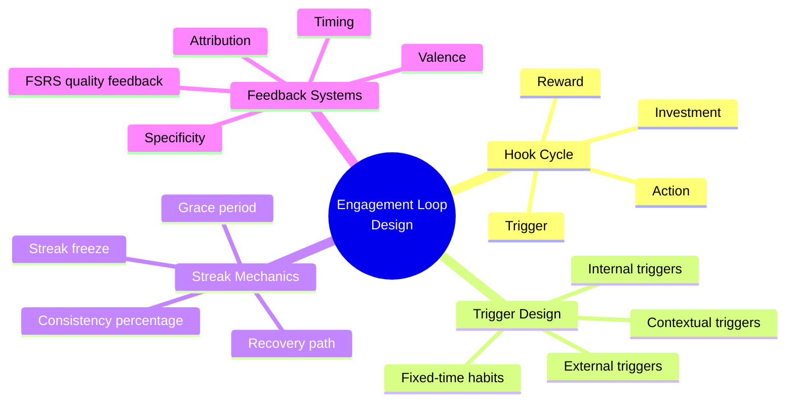
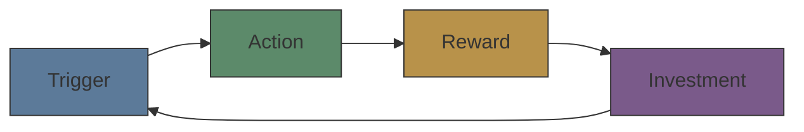

# Module 09: Engagement Loop Design

Est. study time: 1h
Language: en
Description: Designing the core engagement cycle of a learning tool — Hook cycle, trigger design, streak mechanics, and feedback systems that build persistence.

## Knowledge Map



---

## Learning Objectives
- Design engagement loops using the Hook cycle (trigger → action → reward → investment)
- Move users from external triggers to internal triggers and habits
- Implement streak mechanics with freeze, recovery, and consistency metrics
- Architect feedback systems that build growth mindset and support persistence

---

## Real-World Example

A learner installs a flashcard app, studies daily for 2 weeks, then misses one day. The next day they see: "Streak broken. Start over." They feel shame, guilt, and don't reopen the app for 3 months. The app lost a user because its engagement architecture punished, not supported.

A well-designed persistence system would:
1. Offer streak freeze (covers one missed day)
2. Show a recovery path ("Streak frozen! Back at it tomorrow.")
3. Reframe: "You studied 14 of last 15 days — that's 93% consistency"
4. Prioritize returning on the most-missed behavior, not the most recent

> **Think**: Why does showing "Streak broken — start over" cause learners to quit rather than restart?
>
> *Answer: Streak loss triggers shame and all-or-nothing thinking. "I already ruined it, so why continue?" The zero signals failure, not partial progress. Better: track consistency percentage, not consecutiveness.*

---

## Core Content

### The Hook Cycle

User engagement follows a cycle:



| Phase | Learning tool | Gaming analogy |
|-------|---------------|----------------|
| **Trigger** | Notification: "3 cards due" | Daily quest notification |
| **Action** | Open app, answer 3 cards | Log in, accept quest |
| **Reward** | Correct → FSRS quality feedback, streak increment | XP, loot |
| **Investment** | FSRS-5 updates stability/difficulty — future cards better calibrated | Character level up |

The critical insight: **investment** makes the next trigger more effective. Each study session improves the FSRS-5 model, making future sessions more efficient. The learner's investment (time, mental effort) improves the tool — this creates a switching cost that retains users.

> **Cloze**: "The four phases of an engagement loop are: {trigger}, action, reward, and {investment}."
>
> *Answer: trigger, investment*

> **Think**: In the Hook cycle, why is investment the phase that most learning tools neglect?
>
> *Answer: Investment is invisible — the algorithm update happens in the background. Tools should make investment visible: "You answered 50 cards today. Your FSRS model is now 5% more accurate." Visibility creates ownership.*

---

### Trigger Design

Triggers can be external or internal:

| Type | Source | Example | Strength |
|------|--------|---------|----------|
| **External** | Notification, email, calendar | "You have 5 cards due" | Pulls user in |
| **Internal** | Boredom, anxiety, habit | "I should review before bed" | Self-sustaining |
| **Contextual** | Time, location, preceding action | "After coffee → open app" | Automatic |

Goal for tool builders: move from external to internal triggers.

```python
# External trigger (notification) → internal trigger (habit)
def design_trigger_journey():
    # Week 1-2: Push notifications at same time daily
    # Week 3-4: Notification optional — user opens at same time automatically
    # Week 5+: Notification off — habit formed
    # Pattern: fixed time + same context (same chair, same drink)
    pass
```

> **Predict**: What happens if a learning app sends notifications at random times each day?
>
> *Answer: The learner never forms a time-based habit. Each notification requires decision-making ("should I study now?"), which depletes willpower. Fixed-time triggers automate the decision — no deliberation needed.*

---

### Streak Mechanics

Streaks are powerful but dangerous. Well-designed:

| Feature | Purpose | Implementation |
|---------|---------|----------------|
| **Streak freeze** | Cover accidental miss | 1 freeze per 7 days of consecutive study |
| **Recovery path** | Rebuild after break | "Day 1 of new streak" after miss |
| **Consistency %** | Reframe failure | "15 of last 20 days (75%)" |
| **Grace period** | Time zone forgiveness | 24h window, not midnight-to-midnight |

```python
class StreakManager:
    def __init__(self, history):
        self.history = history  # list of (date, cards_reviewed)
        self.freezes = 0

    def current_streak(self):
        """Count consecutive days with >= 1 card reviewed"""
        streak = 0
        for i in range(len(self.history) - 1, -1, -1):
            date, count = self.history[i]
            if count >= 1:
                streak += 1
            else:
                # Try freeze
                if self.freezes > 0:
                    self.freezes -= 1
                    streak += 1
                else:
                    break
        return streak

    def consistency(self, days=30):
        """Percentage of days with study activity"""
        recent = self.history[-days:]
        study_days = sum(1 for _, c in recent if c >= 1)
        return study_days / len(recent)
```

Streak design principles:
1. **External motivation works short-term** — streaks boost initial habit formation
2. **Internal motivation must replace it** — by ~day 21, the streak should matter less than the felt benefit
3. **Failure recovery matters more than streak length** — how you handle the first miss determines long-term retention
4. **Streak + freeze > streak alone** — freeze reduces shame of breaking streak

> **Cloze**: "Streak mechanics should include {freeze}s and recovery paths. Consistency {percentage} reframes failure as partial progress."
>
> *Answer: freeze, percentage*

---

### Feedback Systems

Feedback drives persistence. Four dimensions:

| Dimension | Spectrum | Learning Example |
|-----------|----------|------------------|
| **Timing** | Immediate ↔ Delayed | Immediate: correct/incorrect. Delayed: weekly mastery report |
| **Valence** | Positive ↔ Corrective | Positive: "Great progress!" Corrective: "Review these 3 concepts" |
| **Specificity** | Generic ↔ Specific | Generic: "Good job." Specific: "You confused correlation with causation in question 4." |
| **Attribution** | Effort ↔ Ability | Effort: "Your consistent practice is paying off." Ability: "You're smart at this." |

Marva Collins' feedback principles applied:
- **Specific > generic**: "You avoided the comma splice trap in paragraph 2" not "Good writing"
- **Effort > ability**: "Your daily practice shows" not "You're naturally talented"
- **Corrective as care**: "This error means you're ready to learn the next level" — reframe mistake as growth signal

```python
def marva_feedback(is_correct, question, streak, effort_indicator):
    if is_correct:
        if streak >= 3:
            return f"Three in a row! Your {effort_indicator} is building mastery."
        return f"Correct. {effort_indicator} at work."
    else:
        return f"Not quite. This gap means we found where to focus next."
```

FSRS-5 feedback quality (used in review sessions):

| Quality | Meaning | Feedback |
|---------|---------|----------|
| 5 | Perfect recall | "Effortless. Consider increasing interval." |
| 4 | Correct after hesitation | "Recalled. Stands at current interval." |
| 3 | Correct with difficulty | "Recalled but effortful. Needs more review." |
| 2 | Incorrect — easy to recall once reminded | "Almost there. Focus on retrieval cues." |
| 1 | Complete blackout | "Not yet encoded. Go back to source." |

> **Think**: Why does effort-attribution feedback ("your practice is working") outperform ability-attribution ("you're talented")?
>
> *Answer: Effort attribution is controllable — the learner can decide to practice more. Ability attribution is fixed — failure implies "I'm not talented enough," which discourages persistence. Effort attribution builds a growth mindset.*

---

### Why This Matters

Engagement loops are the engine of a learning tool. The best content and algorithms are useless if learners don't return. The Hook cycle structures the return visit; trigger design moves users from external nudges to self-sustaining habits; streak mechanics protect the habit from the first miss; feedback systems build the growth mindset that keeps learners going. These four systems determine whether a flashcard app becomes a daily habit or an abandoned install.

---

## Key Takeaways
- Hook cycle: trigger → action → reward → investment. Investment makes triggers more effective over time
- Move from external triggers (notifications) to internal triggers (habit, context cues)
- Streak mechanics need freeze, recovery path, consistency %, and grace period
- Feedback: specific > generic, effort-attribution > ability-attribution, corrective as care
- Consistency percentage beats streak length for reframing a miss as partial progress

---

## Common Misconception

**Misconception**: "Gamification (points, badges, leaderboards) is the best way to drive learning persistence."

**Why wrong**: External rewards can undermine intrinsic motivation (overjustification effect). Streaks, feedback, and progress visualization are more sustainable because they connect to the learner's own progress, not artificial rewards. The best "gamification" is showing the learner they're improving.

---

## Spot the Mistake

"A learning app designer says: 'If a user misses a day, reset their streak to zero. This motivates them to not miss days.'"

What's wrong?

*Answer: Zero is demotivating, not motivating. Once the streak is zero, the user has nothing to lose — missing more days has no cost. Better: track consistency percentage (15/20 days = 75%), offer streak freeze, and provide a recovery path that starts a new streak without shame.*

---

## Feynman Explain
(Explain to a product manager why the Hook cycle keeps users returning, why streak-freeze is not "cheating" but good design, and why "you're smart" is worse feedback than "your practice is working.")


---

## Reframe
(Pause. Judge: is the engagement loop manipulating users into doing something they don't want to do? Where is the line between helpful habit design and dark patterns? Does internalized motivation ever become compulsive? Write your evaluation.)

---

## Drill
Run: `learn.sh quiz learning-methods-deep 09-engagement-loop-design`
