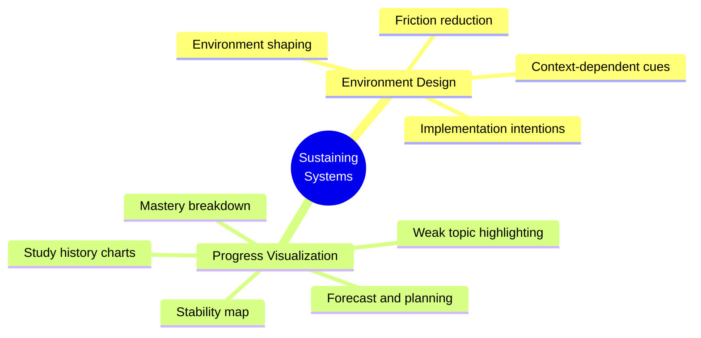
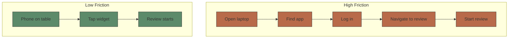

# Module 10: Sustaining Systems Design

Est. study time: 1h
Language: en
Description: The supporting systems that sustain a learning habit — friction-reduced environment design, implementation intentions, and progress visualization that reinforces persistence.

## Knowledge Map



---

## Learning Objectives
- Apply environment design principles: friction removal, context cues, implementation intentions
- Design progress visualizations that support persistence: mastery, weak topics, forecast, stability
- Understand how environment and visualization interact with the engagement loop

---

## Real-World Example

A learner wants to study daily. They commit to "study more." But every session takes 3 minutes to get started: open laptop, find the app, log in, navigate to review. On busy days, that friction wins. Meanwhile, the app's dashboard shows a tiny "streak: 4 days" number — no sense of what's been learned or what's due next.

The problem: motivation without a supportive environment and clear feedback loses to friction.

Sustaining systems fix this:
1. **Friction reduction**: one tap from the phone widget starts a review session
2. **Implementation intentions**: "At 7:30 AM in my kitchen, I will review my 5 due cards" automates the start decision
3. **Progress visualization**: mastery breakdown and forecast make the next step obvious

> **Think**: Why does reducing setup friction matter more than adding motivation?
>
> *Answer: Motivation is episodic — it fades. Friction is constant — every session pays it. Removing steps between intention and action converts "I should study" into "I'm studying" reliably. Environment design beats willpower because it works even on low-motivation days.*

---

## Core Content

### Environment Design

Learning persistence depends heavily on environment, not just motivation:



Design patterns for friction reduction:

```python
# 1. Reduce steps to study
# Bad: Open app → Dashboard → Select topic → Select review type → Start
# Good: Widget → Tap → Review starts

# 2. Context-dependent cues
if time_now == "morning":
    suggest_topic = "hardest due cards"  # fresh morning brain
elif time_now == "evening":
    suggest_topic = "light review"  # tired evening brain

# 3. Implementation intentions
# "I will study [topic] at [time] in [location]"
def prompt_implementation_intention(user):
    return f"Plan: At {user.preferred_time} in {user.preferred_location}, I will review {next_topic(user)}"
```

Implementation intentions are a specific type of plan:

```text
Goal: "I will study more."
Implementation intention: "At 7:30 AM in my kitchen, I will open the app and review my 5 due cards."

Key: Specific time + specific context + specific action.
```

> **Cloze**: "Implementation intentions follow the format: at {time} in {context}, I will {action}."
>
> *Answer: time, context, action*

> **Predict**: A learner has the goal "I will study more this week." What's missing, and what happens?
>
> *Answer: The goal lacks time, context, and action. "Study more" triggers no automatic behavior — every day requires a fresh decision that can be postponed. An implementation intention ("At 7:30 AM in my kitchen, I will review 5 due cards") fires without deliberation.*

---

### Progress Visualization

What learners see about their progress shapes persistence:

| Visualization | What it shows | Psychological effect |
|---------------|--------------|---------------------|
| **Mastery breakdown** | % complete per topic | Satisfaction, focus on what's left |
| **Weak topic highlight** | Lowest retention topics | Points to next work |
| **Study history** | Cards reviewed per day | Sense of consistency |
| **Forecast** | Cards due: now/week/month | Prepares for upcoming load |
| **Stability map** | Per-card FSRS stability | Shows long-term retention |

```python
def progress_dashboard(cards):
    return {
        "mastery": {
            "strong": count_strong(cards),     # stability > 100 days
            "learning": count_learning(cards),  # stability 21-100 days
            "weak": count_weak(cards),          # stability < 21 days
            "new": count_new(cards)
        },
        "consistency": f"{streak_days}d streak, {consistency_pct}%",
        "forecast": {
            "today": due_today(cards),
            "this_week": due_this_week(cards),
            "overdue": overdue(cards)
        }
    }
```

Design principles:
1. **Show progress toward mastery, not just streak length**
2. **Make the next step obvious** — highlight what to study next
3. **Celebrate milestones** — first 100 cards, first week of consistency
4. **Visualize the SRS benefit**: "Your FSRS stability has grown 3x since last month"

> **Predict**: A dashboard shows "Days studied: 45/60 (75%)" vs "Current streak: 3 days." Which drives more persistence for a learner who just missed 2 days?
>
> *Answer: The 75% consistency metric. The "3-day streak" makes the learner feel like they're just starting. The 75% shows they've been consistent overall — a miss is a minor blip, not a reset.*

---

### Why This Matters

Engagement loops bring learners in; sustaining systems keep them coming back. Environment design removes the friction that defeats motivation on hard days. Progress visualization gives learners evidence they're improving — the strongest intrinsic motivator. Together they make the habit robust to real life: missed days, low energy, competing priorities. A learning tool without sustaining systems collects dust; with them, it becomes a daily habit.

---

## Key Takeaways
- Friction reduction: minimize steps between intention and action; widgets and one-tap starts
- Context-dependent cues match content difficulty to time of day and energy
- Implementation intentions: at {time} in {context}, I will {action} — automates the start decision
- Progress visualization: mastery breakdown, weak topic highlight, forecast, stability map
- Consistency percentage beats streak length for reframing a miss as partial progress
- Visualizing SRS benefit ("stability grew 3x") turns the algorithm into motivation

---

## Common Misconception

**Misconception**: "Persistence is a motivation problem — more inspirational quotes and reminders will fix it."

**Why wrong**: Motivation is unreliable and episodic. The strongest levers are environmental: fewer steps to study, fixed time-and-place cues, and visible progress. A learner with a supportive environment studies on days when motivation is zero; a motivated learner in a high-friction environment still quits.

---

## Spot the Mistake

"A learning app designer says: 'Our dashboard shows the current streak number prominently. Users love seeing how many days they've studied in a row.'"

What's wrong?

*Answer: Streak-only visualization hides the progress that matters and punishes misses. A learner who studied 45/60 days sees "3 days" and feels like a beginner. Mastery breakdown, weak-topic highlighting, and consistency percentage are more motivating and more actionable.*

---

## Feynman Explain
(Explain to a friend why the environment you study in matters more than how motivated you feel, and why "At 7:30 AM in my kitchen I'll review 5 cards" works better than "I'll study more." Use a vending machine vs a full kitchen as the friction analogy.)


---

## Reframe
(Pause. Judge: is progress visualization honest? If the dashboard inflates perceived progress (e.g., stability estimates), does that deceive learners? Where is the line between motivational framing and manipulation? Write your evaluation.)

---

## Drill
Run: `learn.sh quiz learning-methods-deep 10-sustaining-systems-design`
